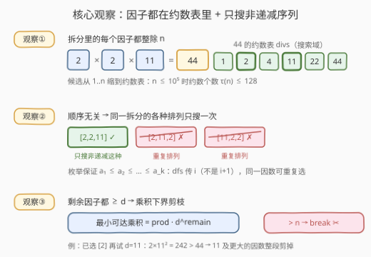
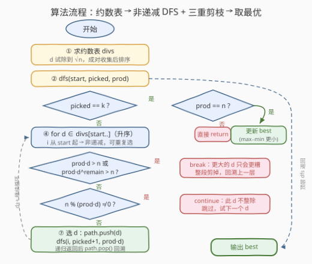
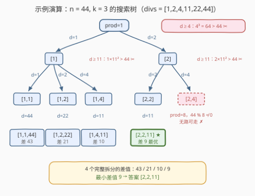

# K 因数分解

- **题目名称**：K 因数分解
- **链接**：[3669. Balanced K-Factor Decomposition](https://leetcode.cn/problems/balanced-k-factor-decomposition/)
- **难度**：中等
- **标签**：数学、回溯、数论

## 1. 题目概述

给你两个整数 `n` 和 `k`。将数字 `n` **恰好**分割成 `k` 个正整数，使得这些整数的**乘积**等于 `n`。返回**任一**分割方案，使得这些数字中**最大值和最小值之间的差值最小化**。结果可以以任意顺序返回。

**示例 1**：

```text
输入：n = 100, k = 2
输出：[10,10]
解释：分割方案 [10, 10] 的结果是 10 * 10 = 100，且最大值与最小值的差值为 0，这是最小可能值。
```

**示例 2**：

```text
输入：n = 44, k = 3
输出：[2,2,11]
解释：
  分割方案 [1, 1, 44] 的差值为 43
  分割方案 [1, 2, 22] 的差值为 21
  分割方案 [1, 4, 11] 的差值为 10
  分割方案 [2, 2, 11] 的差值为 9
因此，[2, 2, 11] 是最优分割方案，其差值最小，为 9。
```

**约束条件**：

- $4 \le n \le 10^5$
- $2 \le k \le 5$
- `k` 严格小于 `n` 的正因数的总数。

> 💡 **审题关键**：① **恰好 k 个**正整数、乘积**恰好等于 n**——个数与乘积都是硬约束；② 因子可以是 1、也可以重复（`[1,1,44]`、`[2,2,11]` 都是合法拆分）；③ 返回**任一**最优方案，差值并列时返回哪个都算对，且**顺序任意**——这直接暗示「按非递减序枚举，每个无序拆分只搜一次」；④ $k \le 5$、$n \le 10^5$，规模极小，回溯是第一直觉；⑤ 约束「k 严格小于因数总数」保证拆分方式不唯一、问题有区分度，其实 `[1, …, 1, n]` 恒为可行拆分，答案必存在。

---

## 2. 解题思路

### 2.1 暴力思路：全元组枚举 / 质因数均衡分桶

最直白的暴力是枚举所有 $k$ 元组 $(a_1, a_2, \ldots, a_k)$，每个 $a_i \in [1, n]$，逐一检查乘积——上界 $O(n^k)$，$n = 10^5$、$k = 5$ 时是 $10^{25}$ 量级，天文数字。

另一种直觉是**「把质因数尽量均匀地分给 k 个桶」**：把 $n$ 质因数分解，把一个个质因子轮流塞进当前乘积最小的桶。反例立刻出现：

```text
n = 72 = 2³ × 3²，k = 3（质因子 2, 2, 2, 3, 3）
直觉分桶：{2,3} {2,3} {2}  →  [6, 6, 2]，差值 4
最优拆分：[3, 4, 6]，差值 3   （4 = 2²，桶可以跨质数重组！）
```

「均衡分配质因子」没有最优子结构：因子不一定是单个质因子，还可以是质因子的**组合**（如 $4 = 2^2$），局部均衡不等于全局均衡，贪心分桶无法保证最优。

> ⚠️ 瓶颈有二：① 候选值域太大（在 $1..n$ 里乱选）；② 同一拆分的各种排列被当成不同方案反复搜。突破口：**先把搜索域坍缩到约数表，再固定非递减顺序只搜每个无序拆分一次**——这正是回溯 + 剪枝的舞台。

### 2.2 核心观察：约数表上的非递减回溯



**观察一：拆分里的每个因子都整除 n，搜索域 = 约数表。** 若 $a_1 \cdot a_2 \cdots a_k = n$，则 $n = a_i \times (\text{其余因子之积})$，故 $a_i \mid n$。于是所有因子只能从 `n` 的约数表 `divs` 里挑——候选从 $n$ 个缩到 $\tau(n)$ 个，而 $n \le 10^5$ 时 $\tau(n) \le 128$（最大值在 $n = 83160$）。

**观察二：顺序无关 ⇒ 只搜非递减序列。** 目标 $\max - \min$ 只依赖因子的**多重集合**，与排列顺序无关；而每个多重集合恰有一个非递减排列 $a_1 \le a_2 \le \cdots \le a_k$。因此只在非递减空间搜索：同一拆分的 $k!$ 个排列被压缩成 **1** 条搜索路径。实现上，递归时把**当前下标 `i` 原样传下去**（而不是 `i + 1`），下一层从 `divs[i..]` 里选——既保持了非递减，又允许重复选同一个因数（`[10,10]` 这类答案必须靠它）。

**观察三：非递减反过来喂给剪枝——乘积下界。** 站在某状态：已选 `picked` 个、乘积 `prod`、还需选 $\text{remain} = k - \text{picked}$ 个，且它们全都 $\ge$ 当前试的 $d$。于是这条子树能达到的**最小总乘积**是 $\text{prod} \cdot d^{\text{remain}}$——一旦超过 $n$，整棵子树无解；而 `divs` 升序意味着更大的 $d$ 只会更大，直接 `break`。再加上「$\text{prod} \cdot d > n$ → `break`」与「$n \bmod (\text{prod} \cdot d) \ne 0$ → `continue`」，共三重剪枝。

> 💡 一句话：本题 = 「求约数表」（数论基本功）+ 「可重复选的组合型回溯」（77 组合的模板）+ 「乘积下界剪枝」。三个观察环环相扣：因子 ⊆ 约数表 → 顺序无关只搜非递减 → 非递减又反哺 $d^{\text{remain}}$ 下界剪枝。

### 2.3 算法流程图



**逻辑执行步骤**：

| 步骤 | 操作 | 说明 |
|------|------|------|
| ① 求约数表 | `d` 从 1 试除到 $\sqrt{n}$ | 命中即成对收集 `d` 与 `n/d`，排序备用 |
| ② DFS 入口 | `dfs(0, 0, 1)` | `start = 0, picked = 0, prod = 1` |
| ③ 终止判定 | `picked == k` ? | 是 → 检查 `prod == n`，用 $\max - \min$ 更新 `best` 后返回 |
| ④ 循环选 d | `for i in [start, …)` | `divs` 升序 → 天然非递减、可重复选 |
| ⑤ 超界剪枝 | $\text{prod} \cdot d > n$ 或 $\text{prod} \cdot d^{\text{remain}} > n$ | `break`：升序保证后面更大，整段剪掉 |
| ⑥ 整除剪枝 | $n \bmod (\text{prod} \cdot d) \ne 0$ | `continue`：整除性不随 `d` 单调，只能跳过 |
| ⑦ 递归回溯 | `push d` → `dfs(i, …)` → `pop` | 传 `i` 不传 `i + 1` |

> ⚠️ 步骤⑦「传 `i` 不传 `i + 1`」一箭双雕：既保证非递减（下一层从同一位置起选），又允许因数重复。若误传 `i + 1`，`[10,10]`、`[2,2,11]` 这类含重复因数的答案会整棵漏掉。

### 2.4 示例演算（示例 2：n = 44, k = 3）

44 的约数表为 `[1, 2, 4, 11, 22, 44]`，搜索树如下（节点标注已选路径）：



- **根层**只试了 $d = 1, 2$：$d = 4$ 时 $1 \times 4^3 = 64 > 44$，`break`，4、11、22、44 整段剪掉；
- **[1] 之后**只到 $d = 4$：$1 \times 11^2 > 44$，`break`；
- **[2, 4]** 是死路：$\text{prod} = 8$，$44 \bmod 8 \ne 0$，任何后续因子都无法把乘积补成 44；
- 到达 `picked == 3` 且 `prod == 44` 的叶子共 4 个：

| 候选拆分 | 乘积 | 差值 |
|----------|------|------|
| [1, 1, 44] | 44 | 43 |
| [1, 2, 22] | 44 | 21 |
| [1, 4, 11] | 44 | 10 |
| **[2, 2, 11]** | **44** | **9** ← 最优 ✅ |

输出 `[2,2,11]`，与示例一致。

---

## 3. 参考代码

### C++

```cpp
class Solution {
public:
    vector<int> minDifference(int n, int k) {
        vector<int> divs;
        for (int d = 1; (long long)d * d <= n; ++d) {
            if (n % d == 0) {
                divs.push_back(d);
                if (d != n / d) divs.push_back(n / d);
            }
        }
        sort(divs.begin(), divs.end());

        vector<int> best, path;
        int bestDiff = INT_MAX;

        function<void(int, int, long long)> dfs = [&](int start, int picked, long long prod) {
            if (picked == k) {
                if (prod == n && path.back() - path.front() < bestDiff) {
                    bestDiff = path.back() - path.front();
                    best = path;
                }
                return;
            }
            int remain = k - picked;
            for (int i = start; i < (int)divs.size(); ++i) {
                long long d = divs[i];
                if (prod * d > n) break;
                if (n % (prod * d) != 0) continue;
                long long low = prod * d;
                bool feasible = true;
                for (int t = 1; t < remain; ++t) {
                    low *= d;
                    if (low > n) { feasible = false; break; }
                }
                if (!feasible) break;
                path.push_back((int)d);
                dfs(i, picked + 1, prod * d);
                path.pop_back();
            }
        };

        dfs(0, 0, 1);
        return best;
    }
};
```

> 💡 **写法要点**：
> - `long long` 承接 `prod`：$\text{prod} \cdot d$ 最大 $10^{10}$，`int` 会溢出；$d^{\text{remain}}$ 采用**逐步相乘、即时判超**的写法，避免 $d^5$ 达 $10^{25}$ 级的中间溢出。
> - `best` 初始为空、`bestDiff` 初始 `INT_MAX`：`[1, …, 1, n]` 恒可行，DFS 结束时 `best` 必非空，无需无解分支。
> - `path` 天然非递减，`path.back() - path.front()` 就是 $\max - \min$，不必再遍历求最值。
> - 两个 `break` 一个 `continue`：超界随 `d` 单调 → `break`；整除性不单调 → 只能 `continue`。

### Python

```python
class Solution:
    def minDifference(self, n: int, k: int) -> List[int]:
        divs = []
        d = 1
        while d * d <= n:
            if n % d == 0:
                divs.append(d)
                if d != n // d:
                    divs.append(n // d)
            d += 1
        divs.sort()

        best = None
        best_diff = float('inf')
        path = []

        def dfs(start, picked, prod):
            nonlocal best, best_diff
            if picked == k:
                if prod == n and path[-1] - path[0] < best_diff:
                    best_diff = path[-1] - path[0]
                    best = path[:]
                return
            remain = k - picked
            for i in range(start, len(divs)):
                d = divs[i]
                if prod * d > n:
                    break
                if n % (prod * d):
                    continue
                if prod * d ** remain > n:
                    break
                path.append(d)
                dfs(i, picked + 1, prod * d)
                path.pop()

        dfs(0, 0, 1)
        return best
```

> 💡 **写法要点**：
> - 存 `best` 时用 `path[:]` 拷贝快照——直接引用 `path` 会被后续回溯 `pop` 改空。
> - Python 大整数无溢出之忧，`d ** remain` 直接算；C++ 版必须防溢出，这是两版代码的主要差异。
> - `path[-1] - path[0]` 即 $\max - \min$，依赖 `path` 非递减这一不变量。

---

## 4. 复杂度分析

| 维度 | 复杂度 | 说明 |
|------|--------|------|
| **时间复杂度** | $O(\sqrt{n} + \tau(n) \cdot S)$ | 求约数表 $O(\sqrt{n})$；$S$ 为三重剪枝后的搜索树节点数，每个节点的循环至多扫 $\tau(n) \le 128$ 个约数 |
| **空间复杂度** | $O(\tau(n) + k)$ | 约数表 $O(\tau(n))$ + 递归深度与 `path` 至多 $k \le 5$ |

> - $S$ 的实际规模极小：非递减约束 + 乘积下界剪枝后，实测 $n \le 10^5$、$k \le 5$ **全部 314,772 组输入**的最坏搜索树约 **1.8 万节点**（$n = 90720, k = 5$），C++ 全量跑完仅 1.25 s，单次求解平均微秒级。
> - 粗略理解：第 1 层 $d \le n^{1/k} \le 10$，第 2 层 $\text{prod} \cdot d^2 \le n$，……逐层收紧，整棵树远小于 $\tau(n)^k$ 的朴素上界。

---

## 5. 扩展：末因子锁定与大规模变体

**微优化——锁定末因子。** 当 $\text{remain} = 1$ 时，末因子被方程**唯一确定**为 $n / \text{prod}$：只需检查它是约数且 $\ge$ 上一个因数即可直接成叶，省掉最后一层对更小约数的无效枚举（如示例中 `[1,1]` 之后还要白试 1、2、4、11、22 才轮到 44）。本题规模用不上，但思路在同类题里常见。

**大规模变体——质因数分解 + 指数分配。** 若 $n$ 大到试除 $\sqrt{n}$ 都吃力（如 $10^{12}$ 需试除到 $10^6$，尚可但已偏慢），或 $k$ 更大导致约数表搜索变宽，应换框架：把 $n = \prod p_i^{e_i}$ 的每个质数指数 $e_i$ **划分**进 $k$ 个桶（单个质数的划法数是组合数 $\binom{e_i + k - 1}{k - 1}$），桶内乘积即为因子——在这个结构化的指数向量空间上做记忆化搜索或 DP 求 $\max - \min$ 最小。[1808. 好因子的最大数目](https://leetcode.cn/problems/maximize-number-of-nice-divisors/) 正是「指数分配求最值」的原型练习。

---

## 6. 面试要点

**Q1：为什么拆分中的每个因子必定是 n 的约数？**

> 因为 $n = a_i \times (\text{其余因子之积})$，$a_i$ 整除 $n$ 显然成立。搜索域因此从 $1..n$ 直接坍缩到约数表——$n \le 10^5$ 时至多 128 个候选，这是全题最关键的一步降维。

**Q2：只搜非递减序列，为什么不会漏掉最优解？**

> 目标 $\max - \min$ 只依赖因子的多重集合，与排列顺序无关；而每个多重集合恰有一个非递减排列。非递减空间与原空间的最优值一一对应，且把同一拆分的 $k!$ 个排列压缩成 1 条路径——既是正确性保证，也是效率来源。

**Q3：三重剪枝中哪些用 break、哪些用 continue？依据分别是什么？**

> `divs` 升序时，$\text{prod} \cdot d > n$ 与 $\text{prod} \cdot d^{\text{remain}} > n$ 都随 $d$ 单调递增，一旦成立后面全成立，用 `break` 整段剪；整除性 $n \bmod (\text{prod} \cdot d) = 0$ 关于 $d$ **不单调**，只能 `continue` 跳过当前值。后者（$d^{\text{remain}}$）是「剩余因子都 $\ge d$」推出的乘积下界——非递减性既是去重手段又是剪枝依据。

**Q4：需要处理「无解」吗？为什么？**

> 不需要。任何 $n$、$k \ge 2$ 都有平凡拆分 $[1, 1, \ldots, 1, n]$（$k-1$ 个 1 与 $n$ 本身），DFS 必然至少命中一个可行叶，`best` 恒非空。题目约束「k 严格小于因数总数」只是保证拆分方式不唯一、问题有区分度，并不影响可行性。

**Q5：若把 n 放大到 10¹²、k 放大到 10，这套做法还撑得住吗？**

> 约数表需试除到 $10^6$，尚可接受；但 $\tau(n)$ 与搜索树都会明显变宽（高合成数的 $\tau$ 可达数千）。此时应转向「质因数分解 + 指数分配」框架：把每个质数的指数划进 $k$ 个桶，在指数向量空间做 DP——状态数与 $\tau(n)$ 同阶但结构化更强，即第 5 节讨论的方向。

> 💡 **一句话总结**：3669 = 约数表（数论基本功）+ 可重复组合的回溯（77 组合模板）+ 乘积下界剪枝。看到「乘积恰为 n 的拆分」，第一反应就应是「因子必为约数 + 非递减枚举」。

---

## 7. 同类练习题

- [77. 组合](https://leetcode.cn/problems/combinations/)：非递减索引枚举组合的原型，本题搜索树就是「可重复选的组合」
- [625. 最小因式分解](https://leetcode.cn/problems/minimum-factorization/)：同为「乘积恰为 n」的因数分解，因子限定为 2~9 的数字
- [343. 整数拆分](https://leetcode.cn/problems/integer-break/)：把 n 拆成若干数之和使乘积最大，与本题互为对偶（拆和 vs 拆积）
- [1808. 好因子的最大数目](https://leetcode.cn/problems/maximize-number-of-nice-divisors/)：质因数指数重组求最值，第 5 节大规模思路的原型
- [2578. 最小和分割](https://leetcode.cn/problems/split-with-minimum-sum/)：拆数位使两数之和最小，同为「拆分求均衡」的取向
