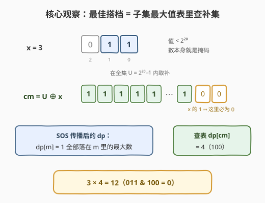
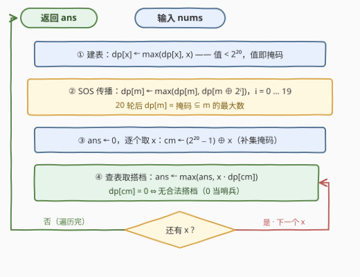

# LeetCode 没有公共位的整数最大乘积 题解

## 1. 题目概述

- **标题 / 题号**：没有公共位的整数最大乘积（#3670，medium）
- **链接**：https://leetcode.cn/problems/maximum-product-of-two-integers-with-no-common-bits/
- **难度**：中等
- **标签**：位运算、数组、动态规划

**题意**：给你一个整数数组 `nums`。请你找到两个**不同**的下标 `i` 和 `j`，使得 `nums[i] * nums[j]` 的**乘积最大化**，并且 `nums[i]` 与 `nums[j]` 的二进制表示中**没有任何公共的置位**（set bit，代数上即 `nums[i] & nums[j] == 0`）。

返回这样一对数的最大可能乘积；如果不存在这样的数对，则返回 0。

**示例 1**：

```text
输入：nums = [1,2,3,4,5,6,7]
输出：12
解释：最佳数对为 3 (011) 和 4 (100)。它们没有公共置位，且 3 * 4 = 12。
```

**示例 2**：

```text
输入：nums = [5,6,4]
输出：0
解释：每一对数字都有至少一个公共置位，因此答案是 0。
```

**示例 3**：

```text
输入：nums = [64,8,32]
输出：2048
解释：64 (1000000)、8 (1000)、32 (100000) 各占一个互不相同的位，任意两两无公共位，
因此答案是两个最大元素的乘积：64 * 32 = 2048。
```

**约束**：

- $2 \le \text{nums.length} \le 10^5$
- $1 \le \text{nums[i]} \le 10^6$

> 💡 **审题关键**：① 「无公共置位」的代数表述就是 $x \,\&\, y = 0$——一个数对的合法性只由两个数的**二进制位集合**决定，与数值大小无关；② $10^6 < 2^{20} = 1048576$，所有数都落在 20 位掩码空间内，且**数值本身就是自己的掩码**（无需任何下标映射）；③ 乘积上界 $10^6 \times 10^6 = 10^{12}$ 远超 32 位 int，C++ 必须用 `long long`；④ $n$ 到 $10^5$，$O(n^2)$ 两两枚举要做约 $5 \times 10^9$ 次判定，不可行，必须换视角。

## 2. 解题思路

### 2.1 暴力思路：两两枚举数对

枚举所有下标对 $(i, j)$，用 `nums[i] & nums[j] == 0` 判合法性，合法则用乘积刷新答案。单次判定 $O(1)$，但数对有 $\binom{10^5}{2} \approx 5 \times 10^9$ 个——超时。

一个常见的「优化幻觉」是先降序排序、再用当前最优乘积剪枝：剪枝的前提是「大数配大数才可能更优」，但**位相容性与数值大小完全脱钩**——示例 1 中最大的 7 因为占满低 3 位而与谁都冲突，最大的合法对（3 与 4）里甚至没有前二大元素。剪枝在最坏情形下仍是 $O(n^2)$。

> ⚠️ 暴力的根源性浪费在于：它把「找一个与 $x$ 位相容的最大数」这个问题重复回答了 $n$ 遍，每遍都从零扫全数组。而「与 $x$ 位相容的数集合」完全由 $x$ 的**位集合**决定——这提示我们把答案按掩码预计算进一张表，让每次查询变成 $O(1)$。

### 2.2 核心观察：子集最大值表 + 补集一次查表



**观察一：值即掩码。** $1 \le \text{nums[i]} \le 10^6 < 2^{20}$，把每个数直接当作 20 位掩码使用——数值本身就是合法下标，`dp` 表无需任何离散化。

**观察二：「与 x 无公共位」=「掩码落在 x 的补集里」。** 记全集 $U = 2^{20} - 1$（20 个 1），则

$$y \,\&\, x = 0 \iff \text{mask}(y) \subseteq (U \oplus x)$$

与 $x$ 位相容的数，恰好是**掩码为 $x$ 补集的子集**的那些数。

**观察三：对固定 x，最优搭档就是与其相容的数中最大者。** 所有元素 $\ge 1 > 0$，乘积 $x \cdot y$ 随 $y$ 严格递增，所以对每个 $x$ 只需知道「掩码 $\subseteq U \oplus x$ 的最大数」。若能把这些答案全部预处理进一张表 `dp`，最后只需一趟扫描收工。

**这张表怎么建？——SOS DP（子集最大值版，即高维前缀和的 max 版）：**

1. **初始化**：`dp[m]` = 掩码**恰好等于** `m` 的最大数（无则置 0）；
2. **逐位传播**：对每个位 $i$、每个含第 $i$ 位的掩码 $m$，执行 `dp[m] = max(dp[m], dp[m ⊕ 2^i])`——从「去掉第 $i$ 位」的直接子集把值拉上来；
3. 20 轮后，`dp[m]` = 掩码**是 $m$ 的子集**的最大数。

最终答案：

$$\text{ans} = \max_{x \in \text{nums}} \; x \cdot \text{dp}[U \oplus x]$$

**两个必须说清的正确性细节：**

- **为什么不会把 x 配给自己？** 查到的搭档 $y = \text{dp}[U \oplus x]$ 满足 $\text{mask}(y) \subseteq U \oplus x$，与 $x$ 的掩码（即 $x$ 本身）不相交。若 $y = x$，则 $x$ 与自身不相交，只能 $x = 0$，与 $x \ge 1$ 矛盾。因此 $y$ 与 $x$ 必是**不同的值**，自然来自不同下标——「不同下标」约束自动满足，连去重都不用做。
- **为什么全局最优不会被漏掉？** 设最优对为 $(a, b)$：枚举到 $a$ 时，$b$ 的掩码 $\subseteq U \oplus a$，故 $\text{dp}[U \oplus a] \ge b$，算法候选 $\ge a \cdot b$；反过来，算法产生的每个候选都是真实存在的合法对（如上一条所证）。两个方向夹住，答案精确。

> 💡 一句话：本题 = 「值即掩码」的视角切换 + SOS 子集最大值预处理 + 补集一次查表。$5 \times 10^9$ 次的两两判定，被 $2^{20} \times 20 \approx 2 \times 10^7$ 次的批量预处理取代。

### 2.3 算法流程图



**逻辑执行步骤**：

| 步骤 | 操作 | 说明 |
|------|------|------|
| ① 建表 | `dp[x] = max(dp[x], x)` | 值即掩码，直接以值为下标；`dp` 初始全 0 |
| ② SOS 传播 | 逐位 $i = 0 \ldots 19$：对含第 $i$ 位的 $m$ 执行 `dp[m] = max(dp[m], dp[m ⊕ 2^i])` | 20 轮后 `dp[m]` 收敛为「掩码 ⊆ m 的最大数」 |
| ③ 取补 | `cm = (2^20 − 1) ⊕ x` | $x$ 的 1 位在 cm 中变 0，其余位全 1 |
| ④ 查表 | `ans = max(ans, x * dp[cm])` | `dp[cm] = 0` 即无搭档，0 天然是哨兵 |

> ⚠️ 两处易错：① SOS 的传播方向——是**从「去掉第 $i$ 位」的子集往 $m$ 拉**（`dp[m] ← dp[m ⊕ 2^i]`），写成往超集推（`m | 2^i`）语义就变成了「掩码包含 m」，结果全错；② 乘积必须用 64 位承接，$10^6 \times 10^6 = 10^{12}$ 早已超出 `int`。

### 2.4 示例演算（示例 1：nums = [1,2,3,4,5,6,7]）

值域 $\le 7 < 2^3$，用 3 位小宇宙演示（实际代码是 20 位，道理相同），$U = 111_2 = 7$。

**建表**：$1 \ldots 7$ 全部出现，`dp[m] = m`。

**SOS 传播**（3 轮，每轮处理一位）：

| 轮次（位 $i$） | 传播示例 | 效果 |
|------|------|------|
| $i = 0$ | `dp[011] ← max(dp[011], dp[010])` | 差在第 0 位的子集并入 |
| $i = 1$ | `dp[011] ← max(dp[011], dp[001])` | 差在第 1 位的子集并入 |
| $i = 2$ | `dp[111] ← max(dp[111], dp[011])` | 差在第 2 位的子集并入 |

由于 $1 \ldots 7$ 齐全，传播后依然是 `dp[m] = m`（$m$ 的最大子集就是 $m$ 自己）。

**补集查表**：

| $x$ | 二进制 | $cm = 7 \oplus x$ | $\text{dp}[cm]$ | 候选乘积 |
|-----|--------|-------------------|------------------|----------|
| 1 | 001 | 110 | 6 | 6 |
| 2 | 010 | 101 | 5 | 10 |
| **3** | **011** | **100** | **4** | **12** ★ |
| **4** | **100** | **011** | **3** | **12** ★ |
| 5 | 101 | 010 | 2 | 10 |
| 6 | 110 | 001 | 1 | 6 |
| 7 | 111 | 000 | 0 | 0（无搭档） |

**答案 = 12**，与示例一致。注意 $x = 7$（111）占满低 3 位、补集为空集，`dp[000] = 0` 如实报告「无搭档」——哨兵 0 正是为此服务。

## 3. 参考代码

### C++

```cpp
class Solution {
public:
    long long maxProduct(vector<int>& nums) {
        const int B = 20, FULL = 1 << B;          // 10^6 < 2^20
        vector<int> dp(FULL, 0);
        for (int x : nums) dp[x] = max(dp[x], x); // 值即掩码，直接建表

        // SOS：20 轮后 dp[m] = 掩码是 m 子集的最大数
        for (int i = 0; i < B; ++i)
            for (int m = 0; m < FULL; ++m)
                if (m >> i & 1)
                    dp[m] = max(dp[m], dp[m ^ (1 << i)]);

        long long ans = 0;
        for (int x : nums) {
            long long partner = dp[(FULL - 1) ^ x];   // 补集查表
            ans = max(ans, (long long)x * partner);   // 10^12 须 64 位
        }
        return ans;
    }
};
```

> 💡 **写法要点**：
> - 两层循环的顺序可以交换：`i` 在外是标准写法；把 `m` 升序放外、`i` 放内同样正确——任何真子集 $s \subset m$ 必属于某个「去掉一位」邻居 $m \oplus 2^i$ 的子集族，升序保证邻居的完整值已就位（两种写法均已对拍验证）。
> - `dp[(FULL - 1) ^ x]` 查到的搭档与 $x$ 值必然不同（见 2.2），无需任何去重。
> - 内存：`int` 型 $2^{20}$ 表 = 4 MB，安全；函数签名本身就是 `long long`，别顺手写成 `int`。

### Python

```python
class Solution:
    def maxProduct(self, nums: List[int]) -> int:
        B, FULL = 20, 1 << 20
        dp = [0] * FULL
        for x in nums:
            if x > dp[x]:
                dp[x] = x                      # 值即掩码，直接建表

        # SOS 传播：第 i 轮 = 每 2^(i+1) 一块，高半块逐格吸收低半块
        for i in range(B):
            bit = 1 << i
            step = bit << 1
            for base in range(0, FULL, step):
                dp[base + bit: base + step] = list(
                    map(max, dp[base + bit: base + step], dp[base: base + bit])
                )

        ans = 0
        for x in nums:
            ans = max(ans, x * dp[(FULL - 1) ^ x])   # 补集查表
        return ans
```

> 💡 **写法要点**：
> - 纯解释器双循环 $2^{20} \times 20 \approx 2 \times 10^7$ 步约需 10 秒，有超时风险；SOS 第 $i$ 轮的结构是「每 $2^{i+1}$ 个元素的块中，高半块逐格吸收低半块」，把内层交给切片 + `map(max, ...)` 下沉到 C 层后，实测整体约 3 秒。
> - （可选加速）`B = max(nums).bit_length()` 自适应位数，值域小时表按指数级缩小；用 numpy 把 `dp` reshape 成 `(FULL // step, step)` 矩阵做列向 `np.maximum`，还能再快一个量级。
> - 乘积上界 $10^{12}$，Python 大整数天然无溢出。

## 4. 复杂度分析

| 维度 | 复杂度 | 说明 |
|------|--------|------|
| **时间复杂度** | $O(2^B \cdot B + n)$，$B = 20$ | 建表 $O(n)$ + SOS 传播 $2^{20} \times 20 \approx 2.1 \times 10^7$ + 终扫 $O(n)$ |
| **空间复杂度** | $O(2^B)$ | `dp` 表 $2^{20}$ 个 int：C++ 4 MB；Python 列表约 8 MB+ |

> - 对比暴力 $O(n^2)$（约 $5 \times 10^9$ 次判定）：预处理把「每个掩码的答案」一次算齐，本质是**用值域大小的空间换两两配对的时间**。
> - 若值域升到 $10^9$（30 位），$2^{30}$ 的表需要数 GB 内存——SOS 套路成立的前提是**值域位宽足够小**。

## 5. 扩展：SOS DP（高维前缀和）的一般框架

**换一个聚合函数就是换一道题。** 本题的 `dp` 是「子集最大值」；把 `max` 换成 `+` 就是经典的 **Zeta 变换**（子集和）：$f[m] = \sum_{s \subseteq m} g[s]$，再配合逐位容斥（Möbius 反演）还能从 $f$ 反解出 $g$。计数类的 [982 题](https://leetcode.cn/problems/triples-with-bitwise-and-equal-to-zero/)（统计 $a \,\&\, b \,\&\, c = 0$ 的三元组）正是「子集计数 + 补集查询」的同骨架应用——本题把它的计数换成取最大值而已。

**超集方向的对偶版本。** 把传播改成往超集推（`dp[m] = max(dp[m], dp[m | 2^i])`）得到的是「掩码**包含** $m$ 的最大数」——当约束是「$y$ 至少覆盖 $m$ 的所有位」（技能覆盖类问题）时用它。方向拉反是初学 SOS 最常见的 bug：先想清楚要「子集语义」还是「超集语义」，再决定写 `m ^ 2^i` 还是 `m | 2^i`。

**为什么逐位传播就完备？** 按位归纳：处理完位 $0..i$ 后，`dp[m]` 已合并所有「仅在第 $0..i$ 位上与 $m$ 不同」的子集；$B$ 轮后覆盖全部 $2^{\text{popcount}(m)}$ 个子集。这一结构与多维前缀和完全同构——「子集」就是「每一维都 $\le$」的多维偏序，SOS 就是它的高维前缀和，`max` 与 `+` 一样满足结合律、可逐维合并。

## 6. 面试要点

**Q1：为什么对每个 x 只查「最大搭档」就能保证全局最优？**

> 所有元素 $\ge 1$，对固定 $x$，乘积 $x \cdot y$ 随 $y$ 严格递增，所以 $x$ 的最优配法就是取相容数中的最大者。设全局最优对为 $(a, b)$：枚举到 $a$ 时 $\text{dp}[U \oplus a] \ge b$（$b$ 的掩码是 $U \oplus a$ 的子集），故算法候选 $\ge a \cdot b$；而每个候选都对应真实合法对、不会过大。两向夹逼，答案精确。

**Q2：怎么保证查到的搭档不是 x 自己（不同下标约束）？**

> 搭档 $y$ 的掩码 $\subseteq U \oplus x$，与 $x$ 不相交；若 $y = x$ 则 $x$ 与自身不相交，只能 $x = 0$，与 $x \ge 1$ 矛盾。因此 $y \ne x$ 恒成立，二者必来自不同下标。顺带地，「值域 $\ge 1$」还让 0 成为干净的「无搭档」哨兵。

**Q3：SOS DP 的正确性怎么证？为什么 20 轮就够？**

> 按位归纳：处理完位 $i$ 后 `dp[m]` 已含所有「仅在第 $0..i$ 位上与 $m$ 不同」的子集的最大值；任何真子集至少在一位上少 1，$B = 20$ 轮后全部并入。等价视角：子集关系是「每维 $\le$」的 20 维偏序，SOS 就是它的高维前缀和。

**Q4：复杂度、位宽和溢出怎么评估？**

> 时间 $O(2^{20} \cdot 20 + n) \approx 2.2 \times 10^7$；空间 $2^{20}$ 个 int，C++ 4 MB。位宽：$2^{19} = 524288 \le 10^6 < 2^{20} = 1048576$，19 位装不下、20 位刚好。溢出：乘积上界 $10^{12}$ 超 `int` 上限约 $2.1 \times 10^9$，C++ 必须 `long long`，Python 大整数无虞。

**Q5：什么时候 SOS 套路会失效？**

> 前提是**掩码空间可控**（$2^B$ 的内存与 $2^B \cdot B$ 的时间都可接受）。值域到 $10^9$（30 位）时 $2^{30}$ 表内存爆炸，须退回排序 + 数据结构 / Trie 一类做法，或利用题目的特殊结构。判断次序：先问「约束是否只依赖位集合」，再问「位宽是否够小」，两问皆肯定才上 SOS。

> 💡 **一句话总结**：3670 = 「值即掩码」视角 + SOS 子集最大值预处理 + 补集 $O(1)$ 查表。带走的三个细节：传播方向是从「去掉一位」的子集往里拉、哨兵 0 依赖值域 $\ge 1$、乘积 $10^{12}$ 的 64 位陷阱。

## 同类练习题

| # | 题目 | 与本题的关联 |
|---|------|-------------|
| 982 | [按位与为零的三元组](https://leetcode.cn/problems/triples-with-bitwise-and-equal-to-zero/) | SOS 的计数版——子集和（Zeta 变换）+ 补集查询统计 `a & b & c = 0`，与本题同一骨架、只换聚合函数 |
| 898 | [子数组按位或操作](https://leetcode.cn/problems/bitwise-ors-of-subarrays/) | OR 单调扩张 + 子集封闭性带来「不同值至多 $O(\log)$ 个」的观察，位集合视角的另一经典 |
| 2044 | [统计按位或能得到最大值的子集数目](https://leetcode.cn/problems/count-number-of-maximum-bitwise-or-subsets/) | 子集枚举求最大 OR，位运算题的枚举形态，与 SOS 的预处理形态互为对照 |
| 1125 | [最小的必要团队](https://leetcode.cn/problems/smallest-sufficient-team/) | 技能压成位掩码当 DP 状态，「掩码空间可控时按位集合思考」的代表应用 |
