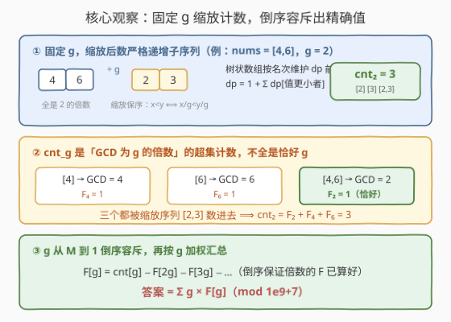
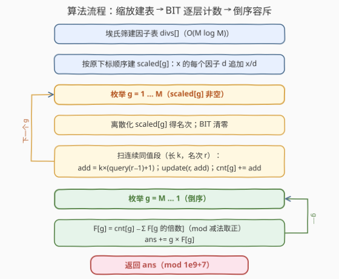

# 子序列美丽值求和

- **题目名称**：子序列美丽值求和
- **链接**：[3671. 子序列美丽值求和](https://leetcode.cn/problems/sum-of-beautiful-subsequences/)
- **难度**：困难
- **标签**：树状数组、数组、数学、数论

## 1. 题目概述

给你一个长度为 $n$ 的整数数组 `nums`。

对于每个**正整数 $g$**，定义 $g$ 的**美丽值**为 $g$ 与 `nums` 中符合要求的子序列数量的乘积，子序列需要**严格递增**且**最大公约数（GCD）恰好为 $g$**。

请返回所有正整数 $g$ 的美丽值之和。由于答案可能非常大，返回结果对 $10^9 + 7$ 取模后的值。

子序列是一个**非空**数组，可以通过从另一个数组中删除某些元素（或不删除任何元素）并保持剩余元素顺序不变得到。

**示例 1**：

```text
输入：nums = [1,2,3]
输出：10
解释：7 个严格递增子序列中，GCD=1 的有 5 个（[1],[2],[3],[1,2],[1,3],[2,3],[1,2,3] 里除 [2],[3] 外都算），
     GCD=2 的有 1 个（[2]），GCD=3 的有 1 个（[3]）。
     美丽值总和 = 1×5 + 2×1 + 3×1 = 10。
```

**示例 2**：

```text
输入：nums = [4,6]
输出：12
解释：[4] 的 GCD=4，[6] 的 GCD=6，[4,6] 的 GCD=2。
     美丽值总和 = 4×1 + 6×1 + 2×1 = 12。
```

**约束条件**：

- $1 \le n = \text{nums.length} \le 10^4$
- $1 \le \text{nums}[i] \le 7 \times 10^4$

> 💡 **审题关键**：① **单个元素也算严格递增子序列**，其 GCD 就是它本身（示例 1 中 `[2]` 计入 $g=2$）——别漏；② "GCD **恰好**为 $g$" 是精确计数，直接数"g 的倍数"只能得到**超集**，必须容斥；③ 值域 $7\times10^4$ 很小，且 $\sum_x d(x)$（因子个数之和）有上界——这是按 $g$ 逐层枚举在复杂度上成立的根基。

---

## 2. 解题思路

### 2.1 暴力思路

最直觉的暴力是枚举全部 $2^n - 1$ 个非空子序列，逐个验证"严格递增"并累计 GCD：$n = 10^4$ 时天文数字，完全不可行。

退一步：答案形如 $\sum_g g \cdot F[g]$，其中 $F[g]$ 是 GCD 恰为 $g$ 的递增子序列个数。能否对每个 $g$ **单独**计算 $F[g]$？关键障碍有二：

- **怎么只数"GCD 是 $g$ 的倍数"的子序列**——GCD 是全局性质，逐序列验证无从下手；
- **怎么高效数"严格递增子序列的个数"**——子序列计数天然有 $O(2^n)$ 种组合。

下面两个观察分别拆掉这两座山。

### 2.2 核心观察：固定 g 缩放 + BIT 计数 + 倒序容斥



**观察一（整除传递 ⇒ 缩放保序）**：若子序列的 GCD 恰为 $g$，则其**每个元素都是 $g$ 的倍数**。反过来，把 `nums` 中所有 $g$ 的倍数抽出来（保持原顺序）再**统一除以 $g$**，就得到缩放序列 $b_g$。由于全体元素都是 $g$ 的倍数，$x < y \iff x/g < y/g$——**严格递增性在缩放前后完全等价**。于是：

> 数"元素全是 $g$ 的倍数的严格递增子序列" = 数 $b_g$ 的严格递增子序列。

**观察二（BIT 计数递增子序列）**：经典 DP：$dp[i] = 1 + \sum_{j<i,\ b[j] < b[i]} dp[j]$（以 $i$ 结尾的递增子序列个数），答案为 $\sum dp[i]$。用**树状数组按值域（离散化名次）维护 $dp$ 的前缀和**，单次转移 $O(\log c_g)$，其中 $c_g = |b_g|$。注意查询的是**名次 $r-1$** 的前缀——严格递增要求前驱值**严格更小**，相等值不能接续。

**观察三（超集计数 + 倒序容斥）**：按观察一数出的 $cnt_g$，其实包含了 GCD 为 $g, 2g, 3g, \dots$ 的**全部**子序列（它们元素都是 $g$ 的倍数），即：

$$cnt_g = \sum_{k:\, g \mid k} F[k]$$

要得到"恰好 $g$"，把 $g$ **从大到小**处理，倍数的 $F$ 已经算好：

$$\boxed{\;F[g] = cnt_g - \sum_{j \ge 2} F[j \cdot g]\;}\qquad \text{答案} = \sum_g g \cdot F[g] \pmod{10^9+7}$$

以示例 2 验证：$cnt_1 = 3,\ cnt_2 = 3,\ cnt_3 = 1,\ cnt_4 = 1,\ cnt_6 = 1$。倒序：$F_6 = 1$，$F_4 = 1$，$F_3 = 1 - F_6 = 0$，$F_2 = 3 - F_4 - F_6 = 1$，$F_1 = 3 - F_2 - F_4 - F_6 = 0$。答案 $= 6 + 4 + 2 = 12$ ✓。

### 2.3 算法流程



**逻辑执行步骤**：

| 步骤 | 操作 | 说明 |
|------|------|------|
| ① 建因子表 | 埃氏筛：$d = 1..M$，在 $d$ 的每个倍数处追加 $d$ | $M = \max(\text{nums})$，$O(M \log M)$ |
| ② 建缩放表 | 顺序扫 `nums`，把 $x/d$ 追加到 `scaled[d]` | 依赖每个 $x$ 的因子表，天然保持原下标顺序 |
| ③ 逐层计数 | 对每个非空 `scaled[g]`：离散化取名次，BIT 清零，扫描统计 $cnt[g]$ | $dp$ = 1 + 前缀和(名次 < 当前) |
| ④ 倒序容斥 | $g = M \dots 1$：$F[g] = cnt[g] - \sum F[\text{倍数}]$，$ans \mathrel{+}= g \cdot F[g]$ | 减法在模意义下**先减后取正** |
| ⑤ 返回 | $ans \bmod (10^9+7)$ | |

> ⚠️ **三个易错点**：① BIT 查询名次 $r-1$ 而非 $r$——"严格"递增，相等值不能作为前驱；② 容斥的减法结果可能为负，模意义下要 `+ MOD` 取正（Python 的 `%` 天然非负，C++ 需手动处理）；③ "scaled[g] 为空"直接跳过，别为每个 $g$ 白建 BIT。

**一个关键常数优化（连续同值段批处理）**：缩放序列中**连续相等**的一段（长 $k$、名次 $r$），每个元素的 $dp$ 都是 $1 + \text{query}(r-1)$，且段内更新都落在名次 $r$ 上、**不影响** $\text{query}(r-1)$——所以整段可一次算完：$add = k \times (\text{query}(r-1) + 1)$。这让"大量重复元素"的最坏用例（如 $10^4$ 个 $55440$，120 个因子）从每层 $O(c_g \log c_g)$ 降为每段 $O(\log c_g)$，实测整体 0.35s 内跑完。

### 2.4 示例演算：nums = [4, 6]

**第一步：因子表与缩放序列**（$M = 6$）

| $g$ | 缩放序列 $b_g$（原下标顺序） | 严格递增子序列 | $cnt_g$ |
|-----|------|------|------|
| 1 | [4, 6] | [4] [6] [4,6] | 3 |
| 2 | [2, 3] | [2] [3] [2,3] | 3 |
| 3 | [2] | [2] | 1 |
| 4 | [1] | [1] | 1 |
| 6 | [1] | [1] | 1 |

**第二步：BIT 计数细节**（以 $g=2$ 为例，$b = [2,3]$）：名次 $2 \to 1$、$3 \to 2$。扫 `2`：query(0)=0，add=1；扫 `3`：query(1)=1，add=1×(1+1)=2。$cnt_2 = 1 + 2 = 3$ ✓。

**第三步：倒序容斥与汇总**

| $g$ | $F[g]$ 计算 | $F[g]$ | 贡献 $g \cdot F[g]$ |
|-----|------|------|------|
| 6 | $cnt_6 = 1$ | 1 | 6 |
| 5 | $cnt_5 = 0$ | 0 | 0 |
| 4 | $cnt_4 = 1$ | 1 | 4 |
| 3 | $cnt_3 - F_6 = 1 - 1$ | 0 | 0 |
| 2 | $cnt_2 - F_4 - F_6 = 3 - 1 - 1$ | 1 | 2 |
| 1 | $cnt_1 - F_2 - F_4 - F_6 = 3 - 1 - 1 - 1$ | 0 | 0 |

答案 $= 6 + 4 + 2 = \boxed{12}$ ✓

---

## 3. 参考代码

### C++

```cpp
class Solution {
public:
    int totalBeauty(vector<int>& nums) {
        const long long MOD = 1'000'000'007;
        int M = *max_element(nums.begin(), nums.end());

        // ① 埃氏筛建因子表：divs[x] = x 的所有因子
        vector<vector<int>> divs(M + 1);
        for (int d = 1; d <= M; d++)
            for (int m = d; m <= M; m += d)
                divs[m].push_back(d);

        // ② 按原下标顺序构造每个 g 的缩放序列
        vector<vector<int>> scaled(M + 1);
        for (int x : nums)
            for (int d : divs[x])
                scaled[d].push_back(x / d);

        // ③ 对每个 g：BIT 统计缩放序列的严格递增子序列个数 cnt[g]
        vector<long long> cnt(M + 1, 0);
        vector<int> vals;
        for (int g = 1; g <= M; g++) {
            const vector<int>& b = scaled[g];
            if (b.empty()) continue;
            vals.assign(b.begin(), b.end());          // 离散化
            sort(vals.begin(), vals.end());
            vals.erase(unique(vals.begin(), vals.end()), vals.end());
            int m = vals.size();
            vector<long long> bit(m + 1, 0);
            auto update = [&](int i, long long v) {
                for (; i <= m; i += i & (-i)) bit[i] = (bit[i] + v) % MOD;
            };
            auto query = [&](int i) {                 // 名次 1..i 的 dp 之和
                long long s = 0;
                for (; i > 0; i -= i & (-i)) s += bit[i];
                return s % MOD;
            };
            long long total = 0;
            for (int i = 0, len = b.size(); i < len; ) {
                int j = i;
                while (j < len && b[j] == b[i]) j++;  // 连续同值段 [i, j)
                int r = lower_bound(vals.begin(), vals.end(), b[i]) - vals.begin() + 1;
                long long add = (long long)(j - i) * (query(r - 1) + 1) % MOD;
                update(r, add);
                total = (total + add) % MOD;
                i = j;
            }
            cnt[g] = total;
        }

        // ④ 倒序容斥 + 加权求和
        long long ans = 0;
        vector<long long> F(M + 1, 0);
        for (int g = M; g >= 1; g--) {
            long long f = cnt[g];
            for (int k = 2 * g; k <= M; k += g) f -= F[k];
            f %= MOD;
            if (f < 0) f += MOD;                      // 模减法取正
            F[g] = f;
            ans = (ans + (long long)g * f) % MOD;
        }
        return (int)ans;
    }
};
```

### Python

```python
class Solution:
    def totalBeauty(self, nums: List[int]) -> int:
        MOD = 10 ** 9 + 7
        M = max(nums)

        # ① 埃氏筛建因子表：divs[x] = x 的所有因子
        divs = [[] for _ in range(M + 1)]
        for d in range(1, M + 1):
            for m in range(d, M + 1, d):
                divs[m].append(d)

        # ② 按原下标顺序构造每个 g 的缩放序列
        scaled = [[] for _ in range(M + 1)]
        for x in nums:
            for d in divs[x]:
                scaled[d].append(x // d)

        # ③ 对每个 g：BIT 统计缩放序列的严格递增子序列个数 cnt[g]
        cnt = [0] * (M + 1)
        for g in range(1, M + 1):
            b = scaled[g]
            if not b:
                continue
            vals = sorted(set(b))                    # 离散化
            m = len(vals)
            rank = {v: i + 1 for i, v in enumerate(vals)}
            bit = [0] * (m + 1)
            i, total = 0, 0
            while i < len(b):                        # 连续同值段整批处理
                j = i
                while j < len(b) and b[j] == b[i]:
                    j += 1
                r = rank[b[i]]
                s, k = 0, r - 1
                while k:                             # query：名次 < r 的 dp 和
                    s += bit[k]
                    k -= k & (-k)
                add = (j - i) * (s % MOD + 1) % MOD
                k = r
                while k <= m:                        # update：名次 r 处累加
                    bit[k] = (bit[k] + add) % MOD
                    k += k & (-k)
                total = (total + add) % MOD
                i = j
            cnt[g] = total

        # ④ 倒序容斥 + 加权求和
        F = [0] * (M + 1)
        ans = 0
        for g in range(M, 0, -1):
            f = cnt[g]
            for k in range(2 * g, M + 1, g):
                f -= F[k]
            F[g] = f % MOD                           # Python % 天然非负
            ans = (ans + g * F[g]) % MOD
        return ans
```

---

## 4. 复杂度分析

记 $M = \max(\text{nums}) \le 7 \times 10^4$，$D$ 为值域内最大因子个数（$7\times10^4$ 内 $D = 120$，如 $55440 = 2^4 \cdot 3^2 \cdot 5 \cdot 7 \cdot 11$）。

| 维度 | 复杂度 | 说明 |
|------|--------|------|
| **时间复杂度** | $O(M \log M + nD \log n)$ | 因子表 $O(M\log M)$；所有缩放序列总长 $\sum_g c_g = \sum_x d(x) \le nD \approx 1.2 \times 10^6$，每层计数 $O(c_g \log c_g)$；容斥 $O(M \log M)$ |
| **空间复杂度** | $O(M \log M + nD)$ | 因子表约 $M \ln M \approx 8 \times 10^5$ 项；缩放列表总长 $\le nD$ |

> 实测：$n = 10^4$ 全取 $55440$（因子最密的值）约 $1.2\times10^6$ 个序列条目，C++ 40ms、Python 0.35s 通过。若不做 2.3 的同值段批处理，重复元素极端用例会退化数倍。

---

## 5. 扩展：与莫比乌斯反演的等价性

倒序容斥 $F[g] = cnt_g - \sum_{j \ge 2} F[jg]$ 逐步展开后，正好是**莫比乌斯反演**的形式：

$$F[g] = \sum_{d \ge 1} \mu(d) \cdot cnt[g \cdot d]$$

两种写法完全等价（$\mu$ 只在 square-free 数上非零）。倒序减法的优点是**不用预处理 $\mu$**、代码更短，且 $cnt$ 本来就得逐层算——没有额外开销。同理，"恰好 $g$"型问题的一般套路就是：**能数"至少/倍数"就先数超集，再倒序减或莫比乌斯反演出精确值**（同款套路见 1819 题）。

另一处可挖的优化：若值域更大（如 $10^9$），就不能开 $M$ 大小的桶，需先对 `nums` 排重、只对**出现过的值**做因子分解（试除到 $\sqrt{x}$ 或质因子分解），框架不变。

---

## 6. 面试要点

**Q1：为什么"抽出 g 的倍数再除以 g"是等价变换？**

> GCD 恰为 $g$ 的子序列，其元素必然全是 $g$ 的倍数（$g \mid \gcd \mid$ 每个元素）；而 $g$ 的倍数之间 $x < y \iff x/g < y/g$，缩放严格保序、等值保持等值。所以"原数组中元素全为 $g$ 的倍数的严格递增子序列"与"缩放序列的严格递增子序列"一一对应。

**Q2：cnt_g 为什么是超集？怎么得到"恰好"？**

> 缩放只保证"元素全是 $g$ 的倍数"，其 GCD 可能是 $g$ 的任一倍数，故 $cnt_g = \sum_{g \mid k} F[k]$。将 $g$ 从 $M$ 到 $1$ 倒序处理，此时 $2g, 3g, \dots$ 的 $F$ 均已知，做减法即可——这是狄利克雷卷积意义下的标准反演。

**Q3：数严格递增子序列为什么要 BIT 查 r−1 而不是 r？**

> $dp[i]$ 的转移只允许前驱值**严格小于**当前值；查名次 $r$（含相等）会把等值元素接上去，破坏"严格"。离散化后按值建 BIT，$dp$ 转移与求和都是 $O(\log c_g)$。

**Q4：总复杂度为什么不是 O(M·n)？**

> 缩放序列总长是 $\sum_g c_g = \sum_x d(x)$——每个元素只进它自己因子的桶。值域 $7\times10^4$ 内单元素因子数至多 120（55440），故总长 $\le 1.2\times10^6$，是调和级数量级而非乘积级。这是"按值域枚举 g"类问题（如 1819）成立的共同前提。

**Q5：实现上有哪些坑？**

> ① 单元素子序列也算，别把 $dp$ 的 "+1" 漏掉；② 模减法取正：C++ 减完可能为负要 `+MOD`（Python `%` 天然非负）；③ 空的 `scaled[g]` 直接跳过；④ 大量重复值时用"连续同值段批处理"，否则最坏用例会超时；⑤ `divs` 因子表用埃氏筛建，别对每个元素试除（重复值多时浪费）。

> 💡 **一句话总结**：3671 = 整除传递性（缩放保序）+ 树状数组数递增子序列 + 倒序容斥出"恰好"。三个组件分别对应标签里的数论、树状数组与数学。

---

## 7. 同类练习题

- [1819. 序列中不同最大公约数的数目](https://leetcode.cn/problems/number-of-different-subsequences-gcds/)：同款"枚举 g + 扫 g 的倍数"框架，只是问 GCD 种类而非精确计数，入手本题前的最佳热身
- [2183. 统计可以被 K 整除的下标对数目](https://leetcode.cn/problems/count-array-pairs-divisible-by-k/)：按 gcd/因子做键聚合计数，"恰好 vs 倍数"的数论直觉训练
- [673. 最长递增子序列的个数](https://leetcode.cn/problems/number-of-longest-increasing-subsequence/)：递增子序列计数的树状数组/线段树 DP 基本功
- [315. 计算右侧小于当前元素的个数](https://leetcode.cn/problems/count-of-smaller-numbers-after-self/)：离散化 + BIT 维护前缀和的经典入门
- [300. 最长递增子序列](https://leetcode.cn/problems/longest-increasing-subsequence/)：一切"递增子序列 + 按值维护"套路的源头
