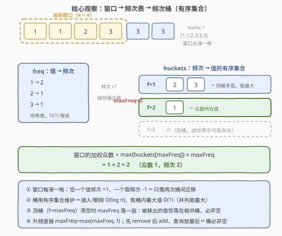
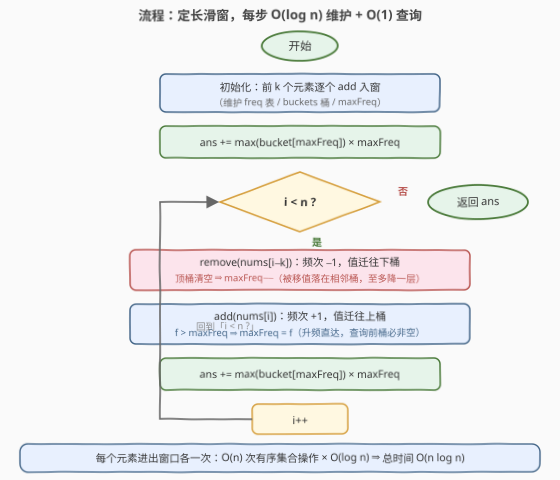

# 子数组中加权众数的总和

- **题目名称**：子数组中加权众数的总和
- **链接**：[3672. 子数组中加权众数的总和](https://leetcode.cn/problems/sum-of-weighted-modes-in-subarrays/)
- **难度**：中等
- **标签**：数组、哈希表、计数、有序集合、滑动窗口

## 1. 题目概述

> ⚠️ 本题为 LeetCode 付费题（Plus 会员专享），题意描述根据官方示例用例与 hints 重建，可能与官方题面有出入。

**题意**：给定整数数组 $nums$ 与整数 $k$。对每个**长度恰为 $k$** 的连续子数组（窗口），其**众数**是窗口内出现次数最多的值；若有多个值并列最多，取其中**最大**的值。该窗口的**加权众数** = 众数值 $\times$ 它在窗口内的出现次数。返回全部 $n-k+1$ 个窗口的加权众数之和（接口 `modeWeight(nums, k)`，返回类型为 64 位整数 `long`）。

官方 hints 原文（题意重建依据）：

1. Use a sliding window.（使用滑动窗口）
2. Maintain the max frequency of the current window of length $k$ using a data structure.（用数据结构维护长度为 $k$ 窗口的最大频次）
3. Maintain another data structure for values that have a given frequency.（再维护一个数据结构，存放「具有某一给定频次的所有值」）

**示例 1**：

```text
输入：nums = [1,2,2,3], k = 3
输出：8
解释：窗口 [1,2,2]：众数 2（频次 2）→ 加权众数 2×2 = 4；
      窗口 [2,2,3]：众数 2（频次 2）→ 加权众数 2×2 = 4；总计 8。
```

**示例 2**：

```text
输入：nums = [1,2,1,2], k = 2
输出：6
解释：三个窗口 [1,2]、[2,1]、[1,2] 中 1 与 2 各出现 1 次，并列取最大值 2，
      每个窗口加权众数 2×1 = 2，总计 6。
```

**示例 3**：

```text
输入：nums = [4,3,4,3], k = 3
输出：14
解释：窗口 [4,3,4]：众数 4（频次 2）→ 8；窗口 [3,4,3]：众数 3（频次 2）→ 6；总计 14。
```

**约束条件**（官方约束未公开，按返回类型 `long` 与同类题推测）：

- $1 \le k \le n \le 10^5$
- $1 \le nums[i] \le 10^5$

> 💡 **审题关键**：① 窗口是**定长** $k$ 的滑动窗口，共 $n-k+1$ 个，不多不少；②「加权」= 众数值 $\times$ 出现次数，不是只加众数值本身——单项贡献最大 $10^5 \times 10^5 = 10^{10}$，这也是返回类型为 `long` 的原因；③ 并列时取**最大**值（本篇按「有序集合」标签与示例 2 重建的口径；若官方口径为取最小，参考代码只需把「取桶内最大」改成「取桶内最小」一处，见第 5 节）。

---

## 2. 解题思路

### 2.1 暴力思路：每个窗口重新数一遍

对每个窗口用哈希表重新统计频次 $O(k)$，再取最大频次与并列最大值——总计 $O(nk)$；$n = 10^5$、$k = n/2$ 时约 $5 \times 10^9$ 次操作，必然超时。

> 💡 暴力的浪费在于**重复劳动**：相邻两个窗口共享 $k-1$ 个元素，只有「滑出一个、滑入一个」两个元素的频次发生变化，却把整个窗口从头重数。要让每步代价与「变化的两个元素」同阶，而不是与窗口长度同阶。

### 2.2 核心观察：频次桶 + 有序集合



**观察一（增量维护两张表）**：窗口右滑一格，恰一个值频次 $+1$、一个值频次 $-1$，其余值频次全部不变。维护：

- `freq[v]`：值 $v$ 的当前频次（哈希表，$O(1)$ 增减）；
- `buckets[f]`：**频次恰为 $f$ 的值的有序集合**。$v$ 的频次从 $f$ 变为 $f'$ 时，把 $v$ 从 `buckets[f]` 挪到 `buckets[f']`——每个值任意时刻恰在一个桶里，这正是官方 hint 3 说的「values that have a given frequency」。

**观察二（maxFreq 的廉价维护）**：所有频次变化都是 $\pm 1$，因此最大频次不需要任何查询：

- **升频**时 `maxFreq = max(maxFreq, f)`，一步直达；
- **降频**时仅当**顶桶**（`buckets[maxFreq]`）被搬空才需要下调，且**至多降一层**——顶桶清空的唯一方式是其中的某个值被移走，该值恰好落到 `buckets[maxFreq-1]` 里，相邻下层桶必然非空。

**观察三（为什么必须有序集合）**：答案查询是「顶桶内的**最大值** $\times$ maxFreq」（并列取最大）。普通哈希集合取最大要扫全桶 $O(k)$；有序集合（C++ `std::set`、Python `SortedList`）插入/删除 $O(\log n)$，取最大 $O(1)$（`*rbegin()` / `[-1]`）——这也是本题挂「Ordered Set」标签的原因。

**窗口答案**一行：`*buckets[maxFreq].rbegin() * maxFreq`。

### 2.3 算法流程图



**文字版步骤**：

| 步骤 | 操作 | 说明 |
|------|------|------|
| ① 初始化 | 前 $k$ 个元素逐个 `add` 入窗 | 维护 `freq` / `buckets` / `maxFreq` |
| ② 首次查询 | `ans += max(顶桶) × maxFreq` | 顶桶必非空 |
| ③ 判定 | $i < n$ ? | 否 → 返回 `ans` |
| ④ 滑窗 | `remove(nums[i-k])` 再 `add(nums[i])` | **先删后加**，顺序见 6.Q2 |
| ⑤ 查询累加 | 同 ② | $O(1)$ |
| ⑥ 循环 | `i++` 回到 ③ | 每元素进出窗口各一次 |

### 2.4 示例演算：nums = [1,1,2,3,3,3], k = 3

这组数据同时覆盖 maxFreq 的**下降、并列取大、上升**三种情形：

| 窗口 | freq 表 | buckets | maxFreq | 众数（并列取最大） | 加权众数 |
|------|---------|---------|---------|------|------|
| [1,1,2] | 1→2, 2→1 | f=1:{2}，f=2:{1} | 2 | 1 | 1×2 = 2 |
| [1,2,3] | 1→1, 2→1, 3→1 | f=1:{1,2,3} | 1 | **3** | 3×1 = 3 |
| [2,3,3] | 2→1, 3→2 | f=1:{2}，f=2:{3} | 2 | 3 | 3×2 = 6 |
| [3,3,3] | 3→3 | f=3:{3} | 3 | 3 | 3×3 = 9 |

答案 $= 2+3+6+9 = 20$。

- **第 1→2 个窗口**（maxFreq 下降）：滑出 1 后 `f=2` 的桶清空，maxFreq 落到 1——被移出的 1 恰好落在 `f=1` 桶里，印证「至多降一层」；
- **第 2 个窗口**（三值并列）：1、2、3 各出现 1 次，取最大值 3——有序集合 `rbegin()` 一发入魂；
- **第 3、4 个窗口**（升频）：3 的频次 1→2→3，每次 `maxFreq` 直接抬升，无需查找。

---

## 3. 参考代码

### C++

```cpp
class Solution {
public:
    long long modeWeight(vector<int>& nums, int k) {
        int n = nums.size();
        unordered_map<int, int> freq;          // 值 → 当前频次
        vector<set<int>> buckets(n + 1);       // buckets[f]：频次恰为 f 的值集合（有序）
        int maxFreq = 0;
        long long ans = 0;

        auto add = [&](int x) {
            int f = ++freq[x];                 // 频次 +1，值迁往上桶
            buckets[f].insert(x);
            if (f > 1) buckets[f - 1].erase(x);
            maxFreq = max(maxFreq, f);         // 升频一步直达
        };
        auto removeOne = [&](int x) {
            int f = --freq[x];                 // 频次 −1，值迁往下桶
            buckets[f + 1].erase(x);
            if (f > 0) buckets[f].insert(x);
            while (maxFreq > 0 && buckets[maxFreq].empty())
                maxFreq--;                     // 顶桶清空才降，且至多降一层
        };

        for (int i = 0; i < k; ++i) add(nums[i]);
        ans += 1LL * *buckets[maxFreq].rbegin() * maxFreq;

        for (int i = k; i < n; ++i) {
            removeOne(nums[i - k]);            // 先删后加
            add(nums[i]);
            ans += 1LL * *buckets[maxFreq].rbegin() * maxFreq;
        }
        return ans;
    }
};
```

> 💡 **写法要点**：
> - **`buckets` 开成 `vector<set<int>>(n+1)`**：频次 $\le k \le n$，下标直接寻址免去哈希；空桶就是一个空 `set`，判空即 `empty()`。
> - **`while` 是防御式写法**：由 2.2 的证明它至多跑一轮，写成 `if` 亦正确；保留 `while` 是为了不依赖读者记住该证明。
> - **`1LL *` 前缀**：众数值与频次都是 `int`，直接相乘会先按 32 位溢出再赋给 `long long`，必须先提升类型。

### Python

```python
from sortedcontainers import SortedList

class Solution:
    def modeWeight(self, nums: List[int], k: int) -> int:
        n = len(nums)
        freq = defaultdict(int)                 # 值 → 当前频次
        buckets = defaultdict(SortedList)       # buckets[f]：频次恰为 f 的值集合（有序）
        max_freq = 0
        ans = 0

        def add(x):
            nonlocal max_freq
            f = freq[x] + 1                     # 频次 +1，值迁往上桶
            freq[x] = f
            buckets[f].add(x)
            if f > 1:
                buckets[f - 1].remove(x)
            if f > max_freq:                    # 升频一步直达
                max_freq = f

        def remove_one(x):
            nonlocal max_freq
            f = freq[x] - 1                     # 频次 −1，值迁往下桶
            freq[x] = f
            buckets[f + 1].remove(x)
            if f > 0:
                buckets[f].add(x)
            while max_freq > 0 and not buckets[max_freq]:
                max_freq -= 1                   # 顶桶清空才降，且至多降一层

        for i in range(k):
            add(nums[i])
        ans += buckets[max_freq][-1] * max_freq

        for i in range(k, n):
            remove_one(nums[i - k])             # 先删后加
            add(nums[i])
            ans += buckets[max_freq][-1] * max_freq
        return ans
```

> 💡 **写法要点**：
> - LeetCode 的 Python 环境自带 `sortedcontainers`，`SortedList` 取最大 `[-1]` 是 $O(1)$，插入/删除 $O(\log n)$，不必手写平衡树。
> - `buckets` 用 `defaultdict(SortedList)`：`not buckets[max_freq]` 在键不存在时自动建空表并返回真值，`while` 天然安全。
> - 两个闭包用 `nonlocal max_freq` 读写外层变量，避免把状态传来传去。

---

## 4. 复杂度分析

| 维度 | 复杂度 | 说明 |
|------|--------|------|
| **时间复杂度** | $O(n \log n)$ | 每个元素进出窗口各一次；每次频次变化引发 1 次有序集合删除 + 1 次插入，各 $O(\log n)$；每窗查询取桶内最大 $O(1)$，共 $n-k+1$ 次 |
| **空间复杂度** | $O(n)$ | `freq` 哈希表与全部桶内元素总数都不超过「不同值个数」——每个值任意时刻恰在一个桶里；桶数组本身 $O(n)$ 个空 `set` 头 |

> - $O(n)$ 次窗口更新是下界（每个元素至少被处理一次），本题的优化空间只在每次更新的 $O(\log n)$：若值域较小，桶内最大值可用位图 $O(1)$ 维护（值域 $10^5$ 的位图仅约 12.5KB，见第 5 节）。
> - 滑动窗口框架本身没有额外开销：没有排序、没有堆的懒删除垃圾。

---

## 5. 扩展：口径一换，结构只动一行

本题的骨架是「**频次哈希表 + 频次桶**」两层结构，题型变体只改「桶的消费方式」：

- **并列取最小**：`*rbegin()` → `*begin()`、`SortedList[-1]` → `[0]`，其余一字不动（2404 题就是这个口径）。
- **所有并列众数都计入**（如 3005 题的口径）：每个桶再维护「元素和」与「元素个数」，答案从顶桶取 $\sum$，连有序集合都不需要——普通哈希表够用。
- **桶内最大值想做到 $O(1)$**：值域 $\le 10^5$ 时给每个桶配一张位图，`__builtin_clzll` / `_Find_first` 直接取最大/最小出现位（3636 题莫队解法用的正是这一招）；或每桶一个懒删除堆，均摊 $O(\log n)$。
- **变长窗口版**（如「至多 $k$ 种重复元素的最长子数组」，2958 题）：双指针收缩 + 同一张 `freq` 表，桶结构只在需要实时 maxFreq 时才登场。

---

## 6. 面试要点

**Q1：maxFreq 为什么「至多降一层」，不需要多层下降？**

> 所有频次变化都是 $\pm 1$。顶桶 `buckets[M]` 清空的唯一方式是里面的值被移走：该值频次从 $M$ 变为 $M-1$，恰好落入 `buckets[M-1]` 使其非空；其余值的频次 $\le M$ 且未曾变化。所以下调一层后必然停在非空桶上，`while` 循环体至多执行一轮。

**Q2：`remove` 和 `add` 的顺序有讲究吗？**

> 有：**先删后加，查询放最后**。`remove` 可能让 maxFreq 短暂下降（$k=1$ 时甚至降为 0），而 `add` 保证顶桶非空——新值的频次 $f \ge 1$，若 $f > \text{maxFreq}$ 则 maxFreq 抬到 $f$ 且新值就在顶桶。于是查询处 `buckets[maxFreq]` 永远非空，全程无需特判空桶。若反过来先加后删，加的时候 maxFreq 可能被抬高、删完又可能要降两层论证才踏实，正确性讨论反而绕。

**Q3：哪里会溢出？为什么必须 `long long`？**

> 单窗口贡献 $= \text{众数值} \times \text{频次} \le 10^5 \times 10^5 = 10^{10}$，已超 32 位 `int` 上限（约 $2.1 \times 10^9$）；总和上界约 $10^{10} \times 10^5 = 10^{15}$，`long long` 稳稳放下。C++ 里 `int * int` 先按 32 位相乘再赋值，`1LL *` 前缀不可省。

**Q4：不用有序集合行不行？**

> 行，但要付别的代价：① 值域小（$\le 10^5$）时每桶一张位图，插入/删除/取最大全 $O(1)$，总时间 $O(n)$——渐近最优；② 每桶一个懒删除堆，均摊 $O(\log n)$，与有序集合同级但常数更小；③ 硬扫全桶 $O(k)$ 则退化为 $O(nk)$，不可接受。有序集合是「不依赖值域假设」下的最通用写法，这也是官方标签给出 Ordered Set 的原因。

**Q5：和 424「替换后的最长重复字符」、76「最小覆盖子串」这类经典滑窗是什么关系？**

> 同属「窗口信息增量维护」家族，但消费方式不同：424/76 是**变长窗口 + 求一个全局极值**（最长/最短），窗口统计量只服务于收缩判定；本题是**定长窗口 + 逐窗求和**，每个窗口都要独立回答一次「最大频次 + 顶桶最大值」。识别出「逐窗都要答案」这一点，就能确定必须维护可查询的两层结构，而不是只在结束时读一次结果。

---

## 7. 同类练习题

- [3005. 最大频率元素计数](https://leetcode.cn/problems/count-elements-with-maximum-frequency/)：「所有达到最大频次的元素」这一口径的纯计数版，体会桶消费方式的差别
- [2958. 最多 K 个重复元素的最长子数组](https://leetcode.cn/problems/length-of-longest-subarray-with-at-most-k-frequency/)：同一张频次表驱动的变长滑窗（双指针收缩）
- [2671. 频率跟踪器](https://leetcode.cn/problems/frequency-tracker/)：「频次的频次」两层结构的最小实现，本题 `maxFreq` 维护的骨架题
- [2404. 出现最频繁的偶数元素](https://leetcode.cn/problems/most-frequent-even-element/)：众数并列取**小**的经典判例，与本题取大互为镜像
- [3092. 最高频率的 ID](https://leetcode.cn/problems/most-frequent-ids/)：频次桶 + 懒删除堆实时维护最大频次，本题的近亲（时间维度上的逐点查询）
