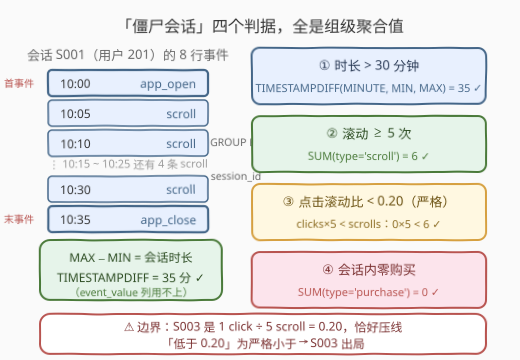
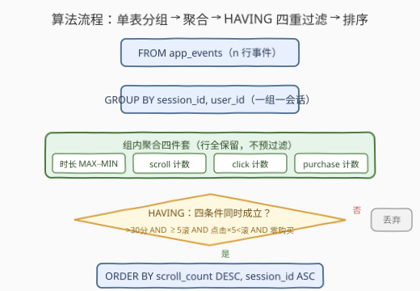

# 查找僵尸会话

- **题目名称**：查找僵尸会话
- **链接**：[3673. 查找僵尸会话](https://leetcode.cn/problems/find-zombie-sessions/)
- **难度**：困难
- **标签**：数据库、SQL、`GROUP BY`、聚合函数、`HAVING`、条件聚合、`TIMESTAMPDIFF`、pandas

## 1. 题目概述

**表结构**：

```text
表：app_events
+------------------+----------+
| Column Name      | Type     |
+------------------+----------+
| event_id         | int      |  ← 主键
| user_id          | int      |
| event_timestamp  | datetime |
| event_type       | varchar  |  ← app_open / click / scroll / purchase / app_close
| session_id       | varchar  |
| event_value      | int      |
+------------------+----------+
```

- `event_id` 是这张表的唯一主键。
- `session_id` 将事件按**同一用户的会话**分组。
- `event_value` 的含义：`purchase` 行存美元金额，`scroll` 行存滚动像素数，其它事件为 `NULL`。

一个会话是**僵尸会话**（用户看似活跃、但行为模式异常），当且仅当**同时**满足以下四个条件：

1. **会话时长超过 30 分钟**（严格大于）；
2. **滚动事件至少 5 次**；
3. **点击滚动比率低于 0.20**（clicks ÷ scrolls，严格小于）；
4. **会话期间没有任何购买**。

返回 `session_id`、`user_id`、`session_duration_minutes`、`scroll_count`，按 **`scroll_count` 降序**、再按 **`session_id` 升序**排序。

**示例**（4 个会话逐个判定）：

```text
S001（用户 201）：10:00 ~ 10:35 = 35 分钟；6 scroll、0 click（比率 0/6 = 0）；0 购买 → ✓ 僵尸
S002（用户 202）：11:00 ~ 11:20 = 20 分钟 ✗；且有 1 次 purchase ✗ → ✗
S003（用户 203）：12:00 ~ 13:00 = 60 分钟；5 scroll、1 click（比率 1/5 = 0.20 恰压线）→ ✗
S004（用户 204）：14:00 ~ 14:12 = 12 分钟 ✗；仅 2 次 scroll ✗ → ✗

输出：
+------------+---------+--------------------------+--------------+
| session_id | user_id | session_duration_minutes | scroll_count |
+------------+---------+--------------------------+--------------+
| S001       | 201     | 35                       | 6            |
+------------+---------+--------------------------+--------------+
```

**约束条件**（依题面推断）：

- `event_type` 只有五种取值：`app_open`、`click`、`scroll`、`purchase`、`app_close`；
- 同一 `session_id` 的所有事件属于同一用户；
- 时间戳在会话内递增（`event_id` 顺序与时间顺序一致）。

> 💡 **审题关键**：①「会话时长」的口径是会话内事件时间戳的 **`MAX − MIN`**——示例里恰好等于 `app_open → app_close` 的跨度，但判定不应依赖 open/close 行是否齐全；② 比率是 **clicks ÷ scrolls**，且「低于 0.20」是**严格小于**——S003 恰为 $1/5 = 0.20$ 被淘汰；③ 排序是 `scroll_count` **降序** + `session_id` **升序**的双键序；④ `event_value`（金额/像素）是烟雾弹——四个判据全是**计数与时间差**，与数值无关。

---

## 2. 解题思路

### 2.1 暴力思路：应用层逐会话扫描

把整张表读进内存，按 `session_id` 开桶，逐行维护时间戳极值与三类事件计数，最后逐桶判定四条件：

```text
for row in app_events:
    b = bucket[row.session_id]
    b.user = row.user_id
    b.min_ts = min(b.min_ts, row.event_timestamp)
    b.max_ts = max(b.max_ts, row.event_timestamp)
    if   row.event_type == 'scroll':   b.scrolls += 1
    elif row.event_type == 'click':    b.clicks += 1
    elif row.event_type == 'purchase': b.purchases += 1
zombie = [s for s, b in bucket.items()
          if minutes(b.max_ts - b.min_ts) > 30 and b.scrolls >= 5
          and b.clicks * 5 < b.scrolls and b.purchases == 0]
```

逻辑正确，但聚合、过滤、排序全搬到了应用层。SQL 的 `GROUP BY + HAVING` 正是为「按组统计、按统计值筛组」而生——一条查询把扫描、聚合、过滤、排序全部下推给引擎。

### 2.2 核心观察：四个判据全是组级聚合，一次 `GROUP BY` 全拿下



四个条件逐个翻译成聚合表达式：

| 题意要求 | SQL 聚合表达 | S001 实测 |
|----------|--------------|-----------|
| 时长 > 30 分钟 | `TIMESTAMPDIFF(MINUTE, MIN(event_timestamp), MAX(event_timestamp)) > 30` | 35 ✓ |
| 滚动 ≥ 5 次 | `SUM(event_type = 'scroll') >= 5` | 6 ✓ |
| 点击滚动比 < 0.20 | `SUM(event_type = 'click') * 5 < SUM(event_type = 'scroll')` | 0×5 < 6 ✓ |
| 零购买 | `SUM(event_type = 'purchase') = 0` | 0 ✓ |

三个关键技巧：

- **布尔条件求和当计数**：MySQL 中 `event_type = 'scroll'` 返回 `1`/`0`，`SUM(...)` 即条件计数；跨库稳妥写法是 `SUM(CASE WHEN ... THEN 1 ELSE 0 END)`。
- **比率不等式改写成整数形式**：$\frac{\text{clicks}}{\text{scrolls}} < 0.2$ 两边同乘正数 $\text{scrolls} \times 5$，得等价的 **clicks × 5 < scrolls**——既绕开 `scrolls = 0` 的除零，又规避整数除陷阱，还让严格边界（S003 的 1/5）在整数运算下零误差。
- **时长用极值差**：`MAX`/`MIN` 各取一次再做 `TIMESTAMPDIFF`。不写 `app_close − app_open` 的原因：判定不应假设 open/close 行必然存在，极值差是口径不变的稳妥表达。

### 2.3 算法流程



| 步骤 | 子句 | 作用 |
|------|------|------|
| ① | `FROM app_events` | 逐行流入，**不做任何预过滤** |
| ② | `GROUP BY session_id, user_id` | 一个会话一组 |
| ③ | 聚合 | 每组算出时长极值差、scroll / click / purchase 三类计数 |
| ④ | `HAVING` | 四条件 `AND`：> 30 分、≥ 5 滚、点击比 < 0.2、零购买 |
| ⑤ | `ORDER BY` | `scroll_count DESC, session_id ASC` 输出 |

> ⚠️ 四条件都依赖聚合结果，必须写 `HAVING`；`WHERE` 在分组前逐行生效，写不了 `SUM/MIN/MAX`。尤其**不能**先 `WHERE event_type = 'scroll'` 预过滤——那会把 click / purchase 行整行删掉：点击数恒为 0（条件③恒真）、购买数恒为 0（条件④恒真），判定退化为只剩时长与滚动数，S002 这类有购买的会话会被**误收**（与 3657「退款率预过滤弄丢分母」是同一陷阱）。

### 2.4 示例演算

对 4 个会话逐组聚合（比率判定用整数形式 clicks × 5 < scrolls）：

| 会话 | 时长（分） | scrolls | clicks | purchases | clicks×5 < scrolls？ | 判定 |
|------|-----------|---------|--------|-----------|---------------------|------|
| S001 | 10:00→10:35 = 35 > 30 ✓ | 6 ✓ | 0 | 0 ✓ | 0 < 6 ✓ | ✓ 四关全过 → **僵尸** |
| S002 | 11:00→11:20 = 20 ✗ | 2 | 2 | 1 ✗ | — | ✗ 时长、购买双杀 |
| S003 | 12:00→13:00 = 60 ✓ | 5 ✓ | 1 | 0 ✓ | 5 < 5 ✗ | ✗ 比率恰压线 |
| S004 | 14:00→14:12 = 12 ✗ | 2 ✗ | 1 | 0 | — | ✗ 时长、滚动数双杀 |

- S003 是**边界陷阱**的典型：1 click ÷ 5 scroll = 0.20 恰好等于阈值，「严格小于」不成立被淘汰——若顺手写成 `<=` 或漏乘改除时丢了严格性，这行就会误入结果；
- S002 说明即使时长不达标，也要把四个条件**全部**算完再 `AND`——判据之间是合取关系，任何一个不满足即可出局，但实现上必须先完整聚出分子分母。

---

## 3. 参考代码

### SQL（MySQL，推荐）

```sql
SELECT
    session_id,
    user_id,
    TIMESTAMPDIFF(MINUTE, MIN(event_timestamp), MAX(event_timestamp)) AS session_duration_minutes,
    SUM(event_type = 'scroll') AS scroll_count
FROM app_events
GROUP BY session_id, user_id
HAVING session_duration_minutes > 30
   AND scroll_count >= 5
   AND SUM(event_type = 'click') * 5 < scroll_count
   AND SUM(event_type = 'purchase') = 0
ORDER BY scroll_count DESC, session_id;
```

> 💡 **写法要点**：
> - **`GROUP BY session_id, user_id`**：`session_id` 标识一个会话，把 `user_id` 一起作为分组键，`SELECT user_id` 才合法（只按 `session_id` 分组时选 `user_id` 在 `ONLY_FULL_GROUP_BY` 下会报错——`session_id` 并非表上的主键/唯一键，引擎无法推断函数依赖）。
> - **`HAVING` 引用 `SELECT` 别名**（`session_duration_minutes`、`scroll_count`）是 MySQL 的便利特性；SQL Server 等引擎不认别名，用解法 B 的派生表。
> - **整数不等式**：`clicks × 5 < scrolls` 与 `clicks ÷ scrolls < 0.2` 等价（两边同乘正数），规避除零与整除两类隐患。
> - `TIMESTAMPDIFF(MINUTE, a, b)` 返回 `b − a` 的整分钟数，参数顺序**小在前、大在后**：此处写 `TIMESTAMPDIFF(MINUTE, MIN(ts), MAX(ts))`。

### SQL（解法 B：派生表 + 标准条件聚合，跨库可移植）

```sql
SELECT session_id, user_id, session_duration_minutes, scroll_count
FROM (
    SELECT
        session_id,
        user_id,
        TIMESTAMPDIFF(MINUTE, MIN(event_timestamp), MAX(event_timestamp)) AS session_duration_minutes,
        SUM(CASE WHEN event_type = 'scroll'   THEN 1 ELSE 0 END) AS scroll_count,
        SUM(CASE WHEN event_type = 'click'    THEN 1 ELSE 0 END) AS click_count,
        SUM(CASE WHEN event_type = 'purchase' THEN 1 ELSE 0 END) AS purchase_count
    FROM app_events
    GROUP BY session_id, user_id
) s
WHERE session_duration_minutes > 30
  AND scroll_count >= 5
  AND click_count * 5 < scroll_count
  AND purchase_count = 0
ORDER BY scroll_count DESC, session_id;
```

> 💡 **解法 B 的思路**：先在派生表里把每个会话聚合成**一行宽表**（时长 + 三个计数），外层用普通 `WHERE` 筛选。好处有三：不依赖「`HAVING` 引用别名」的方言特性、`SUM(CASE WHEN ...)` 是全标准写法、中间指标（`click_count`、`purchase_count`）显式落列便于调试。代价是多一层嵌套；`TIMESTAMPDIFF` 仍是 MySQL 函数，PostgreSQL / SQLite 的时长写法见第 5 节。

### Python（pandas）

```python
import pandas as pd

def find_zombie_sessions(app_events: pd.DataFrame) -> pd.DataFrame:
    t = app_events.copy()
    t['event_timestamp'] = pd.to_datetime(t['event_timestamp'])
    stats = t.groupby(['session_id', 'user_id']).agg(
        first=('event_timestamp', 'min'),
        last=('event_timestamp', 'max'),
        scroll_count=('event_type', lambda s: int((s == 'scroll').sum())),
        click_count=('event_type', lambda s: int((s == 'click').sum())),
        purchase_count=('event_type', lambda s: int((s == 'purchase').sum())),
    ).reset_index()
    stats['session_duration_minutes'] = (
        (stats['last'] - stats['first']).dt.total_seconds() // 60
    ).astype(int)
    zombie = stats[
        (stats['session_duration_minutes'] > 30)
        & (stats['scroll_count'] >= 5)
        & (stats['click_count'] * 5 < stats['scroll_count'])
        & (stats['purchase_count'] == 0)
    ]
    return (zombie[['session_id', 'user_id', 'session_duration_minutes', 'scroll_count']]
            .sort_values(['scroll_count', 'session_id'], ascending=[False, True])
            .reset_index(drop=True))
```

> 💡 **pandas 对照**：
> - 先 `pd.to_datetime` 转时间戳，`(last - first).dt.total_seconds() // 60` 即 `TIMESTAMPDIFF(MINUTE, ...)` 的截断语义；不转换直接对字符串时间戳做差会报错。
> - `agg` 里的 `lambda` 做条件计数，对应 SQL 的 `SUM(布尔)`；`astype(int)` 把 `// 60` 的浮点结果落回整数。
> - `click_count * 5 < scroll_count` 与 SQL 侧保持同一整数判定；排序 `ascending=[False, True]` 对应双键 `ORDER BY`。

---

## 4. 复杂度分析

| 维度 | 复杂度 | 说明 |
|------|--------|------|
| **时间** | $O(n + k\log k)$ | 单趟扫描聚合 $O(n)$（$n$ = 事件行数，每行恰属一组）；按 `scroll_count` 排序 $O(k\log k)$（$k$ = 会话数） |
| **空间** | $O(k)$ | 每会话一组的聚合状态（时间戳极值 + 三个计数器），与 $n$ 无关 |
| **对比暴力法** | 应用层扫描同为 $O(n)$ | 单条 SQL 免去整表传输到应用层的 IO 与往返；过滤后仅返回僵尸会话的少量结果行 |

> 💡 **索引**：生产场景建 `(session_id, event_type)` 复合索引，分组键前置让扫描按会话聚簇、事件类型参与覆盖，聚合可基本走索引完成；若时长过滤占比高，还可考虑 `(session_id, event_timestamp)` 让极值计算走索引 MIN/MAX 优化。

---

## 5. 扩展：分钟截断的口径与跨库时长计算

### 5.1 `TIMESTAMPDIFF` 的截断语义

`TIMESTAMPDIFF(MINUTE, a, b)` **向下截断**到整分钟：30 分 59 秒的会话算作 30。本题示例数据全是整分钟时间戳，`> 30` 直接可用；若数据含秒级时间戳且「超过 30 分钟」按精确口径理解，30:00 ~ 30:59 的会话会被 `> 30` 误杀。精确写法是**过滤用秒、展示用分**：

```sql
HAVING TIMESTAMPDIFF(SECOND, MIN(event_timestamp), MAX(event_timestamp)) > 1800
```

而输出列仍用 `MINUTE` 版。口径敏感的判题/生产场景，动手前先澄清「30 分钟」的边界定义——与 3657「活跃天数是跨度还是去重天数」同款提醒。

### 5.2 跨库的「时长（分钟）」写法

| 数据库 | 写法 | 说明 |
|--------|------|------|
| MySQL | `TIMESTAMPDIFF(MINUTE, MIN(ts), MAX(ts))` | 截断到整分钟，参数「小在前」 |
| PostgreSQL | `EXTRACT(EPOCH FROM (MAX(ts) - MIN(ts)))::int / 60` | 时间戳相减得 `interval`，取秒再除 |
| SQLite | `CAST((JULIANDAY(MAX(ts)) - JULIANDAY(MIN(ts))) * 1440 AS INTEGER)` | 儒略日差 × 1440 即分钟 |
| SQL Server | `DATEDIFF(MINUTE, MIN(ts), MAX(ts))` | ⚠️ 数的是**跨过的分钟边界数**：10:00:30 → 10:01:00 得 1，与截断语义不同 |

### 5.3 从「僵尸会话」到风控特征工程

本题四个判据本质是风控里**机器人行为指纹**的最小模型：会话长（在时长）、滚动多而点击少（交互比异常）、零转化（无购买）——「看似活跃、实非真人」。真实反爬系统在此之上还会用 `event_value` 里的滚动像素做特征（滚动距离的方差过低说明匀速机器滚动）、事件间隔的规律性等。面试中能点出「这道 SQL 题是特征工程的一次聚合表达」，是不错的加分项。

---

## 6. 面试要点

**Q1：为什么四个条件必须写 `HAVING` 而不是 `WHERE`？**

> 四条件全部依赖 `SUM/MIN/MAX` 等组级聚合值；`WHERE` 在 `GROUP BY` 之前逐行生效，此时组还没形成，`WHERE` 中也不允许出现聚合函数。口诀：条件含聚合 → `HAVING`；条件只涉及当前行原始列 → `WHERE`。

**Q2：点击滚动比为什么写成 `clicks × 5 < scrolls` 而不是 `clicks / scrolls < 0.2`？**

> 三个理由：① `scrolls = 0` 时除法要么报错要么得 `NULL`（MySQL 除零返回 `NULL`，比较结果非真），乘法形式天然安全——`clicks ≥ 0` 时 `clicks × 5 < 0` 恒假，零滚动会话自动出局；② 部分数据库对整数 `/` 做整除，`1/5 = 0 < 0.2` 会把压线会话误收；③ 严格边界（S003 的 1/5 = 0.20）在整数运算下判界零误差。等价前提：两边同乘正数且 `scrolls ≥ 0` 恒成立。

**Q3：能不能先 `WHERE event_type = 'scroll'` 只留滚动行再统计？**

> 不能。click 与 purchase 计数全靠这些行：预过滤后点击数恒为 0（条件③恒真）、购买数恒为 0（条件④恒真），僵尸判定退化为只剩时长与滚动数，S002 这类**有购买的会话会被误收**。正确姿势是行全保留、按条件聚合（`SUM(布尔)` 条件计数）——「先过滤再分组」只适用于过滤条件是**行级**且不参与任何判据的列。

**Q4：`GROUP BY` 里的 `user_id` 是否多余？**

> 语义上 `session_id` 已唯一标识一个用户的会话，单键分组结果相同。但 `SELECT user_id` 要求该列在分组键里（或套 `MAX(user_id)` / `ANY_VALUE()`）——本题 `session_id` 不是表上的主键/唯一键，MySQL 的 `ONLY_FULL_GROUP_BY` 模式无法推断函数依赖，单键分组直接选 `user_id` 会报错。把 `user_id` 显式写进 `GROUP BY` 既让语句合法，也防御 `session_id` 跨用户撞号的脏数据。

**Q5：`event_value` 一列两义（purchase 存金额、scroll 存像素），若要输出「滚动总像素」怎么写？**

> 条件聚合分支取数：`SUM(CASE WHEN event_type = 'scroll' THEN event_value ELSE 0 END)`。⚠️ 不能直接 `SUM(event_value)`——会把美元和像素混加成天文数字。混义列的拆分要靠 `CASE WHEN` 显式分流，而不是依赖 `SUM` 跳过 `NULL` 的侥幸（非 scroll 行的 `event_value` 恰为 `NULL` 只是巧合，purchase 行是有值的）。

> 💡 **一句话总结**：3673 是「事件流水表 + 多条件 `HAVING` 筛会话」的模板题——一次 `GROUP BY` 聚出时长极值差与三类事件计数，四个判据在 `HAVING` 里 `AND` 起来收工。两大陷阱：点击滚动比的**严格边界**（1/5 = 0.20 压线出局，用整数不等式 `clicks × 5 < scrolls` 规躲避坑）与 **scroll 预过滤弄丢分子分母**（行全保留、条件聚合）。

---

## 7. 同类练习题

- [3657. 寻找忠实客户](https://leetcode.cn/problems/find-loyal-customers/)（[题解](../3601-3700/3657_寻找忠实客户.md)）：**同款近亲题**——同为「时长跨度 + 事件计数 + 比率阈值」三件套的 `GROUP BY + HAVING`，对照体会整数不等式规避除法、口径先行澄清两个共同考点
- [1050. 合作过至少三次的演员和导演](https://leetcode.cn/problems/actors-and-directors-who-cooperated-at-least-three-times/)（[题解](../1001-1100/1050_合作过至少三次的演员和导演.md)）：`HAVING COUNT(*) >= 3` 组级计数过滤，本题「滚动 ≥ 5 次」的单条件极简版
- [550. 游戏玩法分析IV](https://leetcode.cn/problems/game-play-analysis-iv/)（[题解](../0501-0600/550_游戏玩法分析IV.md)）：事件流水表按玩家聚合 + 日期判定 + 比值过滤，与本题「时长 + 比率」两个环节分别对应
- [197. 上升的温度](https://leetcode.cn/problems/rising-temperature/)（[题解](../0101-0200/197_上升的温度.md)）：`DATEDIFF` 的自连接用法，与本题 `TIMESTAMPDIFF` 极值差写法对照巩固日期时间差函数族
- [586. 订单最多的客户](https://leetcode.cn/problems/customer-placing-the-largest-number-of-orders/)（[题解](../0501-0600/586_订单最多的客户.md)）：分组计数后**按聚合列排序**输出，与本题 `ORDER BY scroll_count DESC` 的手法同构
