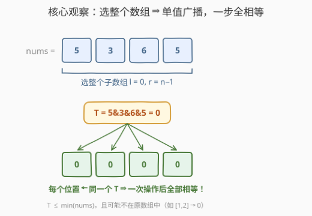
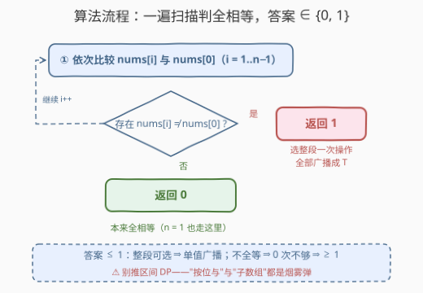

# LeetCode 数组元素相等的最小操作次数 题解

## 1. 题目概述

- **标题 / 题号**：数组元素相等的最小操作次数（#3674，easy）
- **链接**：https://leetcode.cn/problems/minimum-operations-to-equalize-array/
- **难度**：简单
- **标签**：位运算、脑筋急转弯、数组

**题意**：给你一个长度为 $n$ 的整数数组 `nums`。

在一次操作中，可以选择任意子数组 `nums[l...r]`（$0 \le l \le r < n$），并将该子数组中的**每个元素替换**为这段所有元素的**按位与（bitwise AND）**结果。

返回使数组 `nums` 中所有元素相等所需的**最小操作次数**。

**示例 1**：

```text
输入：nums = [1, 2]
输出：1
解释：选择 nums[0..1]：1 AND 2 = 0，数组变为 [0, 0]，一次操作后所有元素相等。
```

**示例 2**：

```text
输入：nums = [5, 5, 5]
输出：0
解释：数组本身就是 [5, 5, 5]，所有元素已经相等，不需要任何操作。
```

**约束**：

- $1 \le n = \text{nums.length} \le 100$
- $1 \le nums[i] \le 10^5$

> 💡 **审题关键**：① "任意子数组"的下标范围是 $0 \le l \le r < n$——**整个数组本身就是合法选择**；② 操作结果是把选中段的**每个位置都写成同一个值**（该段的 AND）。两点合起来意味着：一次操作就能把一个单值"广播"到全数组。

## 2. 解题思路

### 2.1 暴力思路：一个漂亮的陷阱

题目外表很像"区间操作"族：改数组、使全体相等、操作还带个按位与——很容易往**区间 DP** 或**状压 BFS** 的方向想：状态是整个数组，一次操作有 $O(n^2)$ 个子数组可选，转移数天文数字。或者退而求其次想"逐段修复"：找到不相等的相邻位置，一段一段 AND 过去……

这些全是歧途。正确的问题不是"怎么修"，而是：**一次操作的能力上界有多大？**

### 2.2 核心观察：答案只可能是 0 或 1



操作允许选 $l = 0,\ r = n-1$，即**整个数组**。此时每个位置都被写成同一个值

$$T = nums[0] \,\&\, nums[1] \,\&\, \cdots \,\&\, nums[n-1]$$

于是答案被两侧夹死：

- **上界 $\le 1$**：选整段做一次操作，所有位置同时变成 $T$，一步全相等——**与数组内容无关，总能做到**；
- **下界 $\ge 1$（若不全相等）**：不做操作数组就不会变，起点不全相等时 0 次操作不可能达成目标。

$$\text{answer} = \begin{cases} 0 & \text{所有元素本来就相等（含 } n = 1\text{）} \\ 1 & \text{否则} \end{cases}$$

两个顺手的小性质（帮助理解 $T$，不影响答案）：

- AND 只会清零比特、不会置一，故 $T \le \min(nums)$；
- $T$ 可能不在原数组中（示例 1：$1 \,\&\, 2 = 0$）——题目只要求"**相等**"，不要求等于某个指定值，所以无碍。

> 💡 这是典型的**脑筋急转弯**：先把答案值域坍缩到 $\{0, 1\}$，代码反而是全篇最短的一环。

### 2.3 算法流程：一遍扫描判全相等



| 步骤 | 操作 | 说明 |
|------|------|------|
| ① | 遍历 $i = 1..n-1$，比较 $nums[i]$ 与 $nums[0]$ | 只需知道"有没有人不等" |
| ② | 一旦发现 $nums[i] \ne nums[0]$ | 立即返回 1 |
| ③ | 扫完没有任何差异 | 返回 0（$n = 1$ 天然落在这里） |

> ⚠️ 唯一的坑是**想多了**：推区间 DP、枚举子数组、纠结 $T$ 是否"合法"，都是被"按位与"和"子数组"两个词吓出来的。

### 2.4 示例演算

| 输入 | 全相等？ | 答案 | 一步操作后的数组 |
|------|----------|------|------------------|
| `[1, 2]` | 否（$1 \ne 2$） | 1 | $[1 \,\&\, 2] \to [0, 0]$ |
| `[5, 5, 5]` | 是 | 0 | 无需操作 |
| `[7]` | 是（单元素） | 0 | 无需操作 |

## 3. 参考代码

### C++

```cpp
class Solution {
public:
    int minOperations(vector<int>& nums) {
        for (int i = 1; i < (int)nums.size(); ++i)
            if (nums[i] != nums[0]) return 1;
        return 0;
    }
};
```

### Python

```python
class Solution:
    def minOperations(self, nums: List[int]) -> int:
        return 0 if len(set(nums)) == 1 else 1
```

## 4. 复杂度分析

| 维度 | 复杂度 | 说明 |
|------|--------|------|
| **时间复杂度** | $O(n)$ | 一遍扫描判全相等，发现不等可立即短路返回 |
| **空间复杂度** | $O(1)$ | C++ 版仅常数变量；Python `set` 写法为 $O(n)$，换 `all(x == nums[0] for x in nums)` 即 $O(1)$ |

## 5. 扩展：单值广播——与 AND 无关的实质

**换个运算符答案不变**。把 AND 换成 OR、XOR、$\min$、$\max$、求和……只要操作语义是"把选中子数组的每个位置替换成该段聚合出的**单一值**"，选整段就能一步全相等——答案仍是 $\{0, 1\}$。本题的实质是"**单值广播**"：一次操作能把任意长的一段（包括整段）统一成一个值，"按位与"只是包装。

**如果目标改成"全等于指定值 $k$"**，味道立刻变了：一步能广播出去的只有 $T$；一般地可对操作次数归纳证明，任何位置的终态值都等于**原数组某个子集的 AND**（AND 对自身满足结合律，段与段的 AND 等于元素并集的 AND），因此比特上是 $T$ 的超集——可达性论证变成一道真正需要思考的题。"使相等"与"等于 $k$"的一字之差，正是本题作为面试题的区分点之一。

**约束为什么这么小**：$n \le 100$、$nums[i] \le 10^5$ 纯属烟雾弹，正解 $O(n)$ 与它们无关；小约束也意味着任何暴力（甚至真的 BFS）都能过，但面试中应当直接给出 $O(n)$ 判等并说清理由。

## 6. 面试要点

**Q1：为什么答案最多是 1？**

> 操作允许选择整个数组（$l=0,\ r=n-1$）。操作后每个位置都等于整段 AND 结果 $T$——同一个值广播到所有位置，一步即全相等，与数组内容无关。

**Q2：为什么不会无解？**

> 同上——任何数组都可以在一步内变成全相等，因此答案永远存在，取值只可能是 0 或 1。

**Q3：这题的陷阱在哪？**

> "子数组 + 按位与"的包装让人本能地往区间 DP / BFS 想。破局点是先估计**答案的值域**而非急着设计算法：一旦发现整段可选，值域坍缩成 $\{0, 1\}$，代码就只剩判全相等。

**Q4：判"全相等"有什么实现细节？**

> 统统拿 $nums[0]$ 当基准比较即可，$O(n)$ 时间、$O(1)$ 空间，发现不等可立即短路返回；$n = 1$ 时循环体不执行，自然返回 0。Python 里 `len(set(nums)) == 1` 或 `all(x == nums[0] for x in nums)` 皆可。

**Q5：这类脑筋急转弯的通用打法？**

> 先证**答案值域极小或有闭式**（本题 $\{0, 1\}$；292 Nim 是必胜/必败二值；319 灯泡是完全平方数个数），再写最短的代码；切忌上来就模拟或 DP。面试时把"值域为什么这么小"讲清楚，比代码本身更得分。

> 💡 **一句话总结**：整段子数组可选 ⇒ 一次操作即单值广播 ⇒ 答案 = 全相等 ? 0 : 1；其余一切（按位与、区间、小约束）都是烟雾弹。

## 同类练习题

| # | 题目 | 与本题的关联 |
|---|------|-------------|
| 292 | [Nim 游戏](https://leetcode.cn/problems/nim-game/) | 答案只有"能/不能"两种取值，先坍缩值域再动手的祖师爷 |
| 319 | [灯泡开关](https://leetcode.cn/problems/bulb-switcher/) | 答案有闭式（完全平方数个数），模拟必超时——值域思维的经典训练 |
| 201 | [数字范围按位与](https://leetcode.cn/problems/bitwise-and-of-numbers-range/) | 区间 AND 的公共前缀快速求法，是本题里 $T$ 的延伸阅读 |
| 810 | [黑板异或游戏](https://leetcode.cn/problems/chalkboard-xor-game/) | 位运算＋脑筋急转弯，用异或和判先手必胜 |
