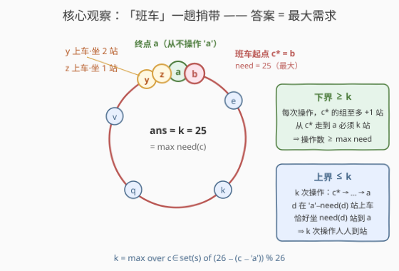
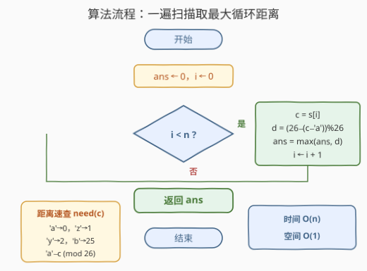

# LeetCode 转换字符串的最小操作次数 题解

## 1. 题目概述

- **标题 / 题号**：转换字符串的最小操作次数（#3675，medium）
- **链接**：https://leetcode.cn/problems/minimum-operations-to-transform-string/
- **难度**：中等
- **标签**：贪心、字符串

**题意**：给你一个仅由小写英文字母组成的字符串 `s`。你可以执行以下操作任意次（包括零次）：

- 选择字符串中**出现的一个字符** `c`，并将 `s` 中**每个**出现的 `c` 替换为英文字母表中的**下一个**小写字母（字母表循环，`'z'` 的下一个字母是 `'a'`）。

返回将 `s` 转换为仅由 `'a'` 组成的字符串所需的**最小操作次数**。

**示例 1**：

```text
输入：s = "yz"
输出：2
解释：将 'y' 变为 'z'，得到 "zz"；再将 'z' 变为 'a'，得到 "aa"。
```

**示例 2**：

```text
输入：s = "a"
输出：0
解释：字符串已经全为 'a'，无需操作。
```

**约束**：

- $1 \le |s| \le 5 \times 10^5$
- `s` 仅由小写英文字母组成

> 💡 **审题关键**：① 操作选的是**字符值**而非下标——选了 `c`，串里**所有** `c` 一起前进一格；② 位置完全不重要，`s` 的状态可以压缩成「出现过哪些字符」（至多 26 种）；③ 字母表是**环**，`'z'` 推一步就到 `'a'`；④ 只要求最终全 `'a'`，中间过程不受限制。

## 2. 解题思路

### 2.1 暴力思路

**暴力一：BFS 模拟**。由于操作只作用于字符值，字符串的实际状态就是「当前出现的字符集合」。从 $\mathrm{set}(s)$ 出发，每次转移枚举集合中的一个字符 $c$ 把它换成 $c{+}1$（环上），目标状态 $\{a\}$。这能给出正确答案（本篇对拍就用它），但可达状态最坏 $2^{26}$ 量级，不可扩展。

**暴力二（陷阱）：逐字符求和**。对每个字符独立计算它走到 `'a'` 的步数再求和——错！示例 1 中 $\mathrm{need}(y)=2$、$\mathrm{need}(z)=1$，求和得 3，但正确答案是 2：把 `'y'` 推成 `'z'` 后**与原有的 `'z'` 合并成一组**，后续操作一组白嫖。

> 💡 求和错在**重复计费**：多个字符可以搭同一趟"顺风车"。正确答案恰恰是另一个极端——**只取最大值**。

### 2.2 核心观察：「班车」一趟捎带，答案 = 最大需求



定义每个字符走到 `'a'` 的**循环距离**：

$$\mathrm{need}(c) = \bigl(26 - (\mathrm{ord}(c) - \mathrm{ord}(\texttt{'a'}))\bigr) \bmod 26$$

即 `'a'` 的距离是 0、`'z'` 是 1、`'b'` 是 25。**答案就是所有出现字符的 $\mathrm{need}$ 的最大值**：

$$\boxed{\;\mathrm{ans} = \max_{c \in \mathrm{set}(s)} \mathrm{need}(c)\;}$$

**下界（≥ max）**：取 $\mathrm{need}$ 最大的字符 $c^*$，令 $k = \mathrm{need}(c^*)$。盯住"源自 $c^*$ 的那些出现"：操作只有 +1 方向，它们要从 $c^*$ 走到 `'a'` 必须恰好前进 $k$ 站；而**每次操作至多让它们前进 1 站**（不作用于它们所在值时前进 0 站）。所以操作总数 $\ge k$。

**上界（≤ max）：一趟"班车"**。让 $c^*$ 当班车，从值 $c^*$ 出发**连续**做 $k$ 次操作，依次作用于值 $c^*,\ c^*{+}1,\ \dots,\ c^*{+}k{-}1$（环上），班车就走完了 $c^* \to \cdots \to a$ 的全程。关键在于班车**经过哪些站**：

- $c^* = \texttt{'a'} - k \pmod{26}$，所以班车途经的 $k$ 个值恰好是 $\{\texttt{'a'}-k,\ \dots,\ \texttt{'a'}-1\}$（环上 `'a'` 之前的那一段）；
- 任何其它出现的字符 $d$ 满足 $d = \texttt{'a'} - \mathrm{need}(d)$ 且 $\mathrm{need}(d) \le k$，即 $d$ **必然是班车途经的某一站**——班车开到 $d$ 时，$d$ 的所有出现被一起推进（合并进组），随后随班车一路坐到 `'a'`；
- $d$ 一共被推进 $k - (k - \mathrm{need}(d)) = \mathrm{need}(d)$ 次——**恰好坐满自己需要的站数**，不多不少到站下车；
- $\mathrm{need}=0$ 的 `'a'` 本身永不被触碰：班车终点就是 `'a'`，操作序列里根本不含对值 `'a'` 的操作。

于是 $k$ 次操作后全串变 `'a'`，上界成立。两边夹逼，答案 $= \max \mathrm{need}$。

### 2.3 算法流程：一遍扫描取最大



逻辑非常短，一遍扫描即可：

| 步骤 | 操作 | 说明 |
|------|------|------|
| ① 初始化 | `ans = 0` | 全 `'a'` 时保持 0 |
| ② 扫描 | 对每个 `s[i]` 计算 `d = (26 - (s[i] - 'a')) % 26` | 循环距离，'a'→0、'z'→1、'b'→25 |
| ③ 归约 | `ans = max(ans, d)` | 只取最大，不求和 |
| ④ 返回 | `ans` | 即班车趟数 |

> ⚠️ **两个易错点**：① 别把 `(26 - x) % 26` 写成 `26 - x`——`'a'` 会算出 26；② 别手滑对 `need` 求和（2.1 的陷阱）。

### 2.4 示例演算

**示例 1：`s = "yz"`**

- $\mathrm{need}(y) = 2$，$\mathrm{need}(z) = 1$，最大值 $k = 2$，班车起点 $c^* = \texttt{'a'} - 2 = y$。
- 操作 1（作用于 `y`）：`"yz"` → `"zz"`，原有的 `'z'` 在 $z$ 站上车（与被推进到 `z` 的 `'y'` 合并成一组）；
- 操作 2（作用于 `z`）：`"zz"` → `"aa"`，全组到站。共 **2** 次 ✓。
- 对照求和陷阱：$2 + 1 = 3 \ne 2$——`'z'` 那一步被班车顺路捎带，不单独计费。

**示例 2：`s = "ab"`**

- $\mathrm{need}(a) = 0$，$\mathrm{need}(b) = 25$，$k = 25$，班车起点 $c^* = b$。
- 连续 25 次操作依次作用于 `b, c, d, …, z`：`'b'` 一路推进 `b→c→…→z→a`；原有的 `'a'` 全程未被触碰（操作序列不含 `'a'`）。共 **25** 次。
- 这个例子说明答案是环上的"长路"——`'b'` 是离 `'a'` 最远（顺时针）的字符。

## 3. 参考代码

### C++

```cpp
class Solution {
public:
    int minOperations(string s) {
        int ans = 0;
        for (char c : s) {
            ans = max(ans, (26 - (c - 'a')) % 26);
        }
        return ans;
    }
};
```

### Python

```python
class Solution:
    def minOperations(self, s: str) -> int:
        return max((26 - (ord(c) - 97)) % 26 for c in s)
```

## 4. 复杂度分析

| 维度 | 复杂度 | 说明 |
|------|--------|------|
| **时间复杂度** | $O(n)$ | 一遍扫描，每个字符 $O(1)$ 计算距离取 max |
| **空间复杂度** | $O(1)$ | 只维护一个 `ans`（连 26 长度计数表都不需要） |

> 对 $n = 5 \times 10^5$ 轻松通过；先 `set(s)` 去重再取最大也是 $O(n)$，但没必要。

## 5. 扩展：操作序列还原与变体

**还原具体操作序列**（面试官可能追问"怎么构造"）：令 $k = \mathrm{ans}$，班车起点 $c^* = \texttt{'a'} - k \pmod{26}$，依次对值 $c^*,\ c^*{+}1,\ \dots,\ c^*{+}k{-}1$（环上）各执行一次操作即可。合法性保证：第 $i$ 次操作前班车组正位于值 $c^*{+}i$，该值必然出现在串中（本篇已用随机对拍验证该构造 5000 组全过）。

**变体一：目标改为全 `t`**。答案即 $\max_{c} \bigl((\mathrm{ord}(t) - \mathrm{ord}(c)) \bmod 26\bigr)$，班车终点从 `'a'` 换成 `t`，论证完全照搬。

**变体二：操作方向改为 −1**（每个 `c` 变成上一个字母）。距离反号：$\mathrm{need}(c) = (\mathrm{ord}(c) - \mathrm{ord}(\texttt{'a'})) \bmod 26$，仍然取最大值，班车逆向开一圈。

**为什么 BFS 不必要**：状态图虽是隐式的，但"环形 + 只进不退的最优性"让最短路结构退化为一个 max——遇到循环字母表类问题，先算每个字符的循环距离再想贪心结构，往往能免掉整个图搜索。

## 6. 面试要点

**Q1：为什么答案是 max 而不是各字符 need 之和？**

> 操作作用于字符值时是"批量"的：值相同的出现一起前进，且班车（最大需求字符的组）途中经过的站恰好覆盖所有 $\mathrm{need} \le k$ 的字符值，它们全部被顺路捎带。求和会把"搭车"的部分重复计费（`"yz"`：求和 3，实际 2）。

**Q2：下界论证为什么成立？**

> 盯住 $\mathrm{need}$ 最大的字符 $c^*$ 的出现：它们必须沿 +1 方向恰好前进 $k$ 站才能到 `'a'`；每次操作要么推进它们（作用于其当前值）要么不推进，至多 +1 站。故操作数 $\ge k = \max \mathrm{need}$。

**Q3：上界构造中，其它字符为什么"恰好到站"而不会坐过站？**

> 字符 $d$ 的初始值是 $\texttt{'a'} - \mathrm{need}(d)$，必在班车途经的 $k$ 个站中。班车经过 $d$ 站时 $d$ 上车，随后与班车组同值同进退，直到终点 `'a'`——全程恰好 $\mathrm{need}(d)$ 站。`'a'` 自身不会被误伤，因为操作序列从不含对值 `'a'` 的操作。

**Q4：位置信息为什么可以完全丢弃？**

> 操作的定义只依赖字符值（"把每个出现的 c 替换为下一个字母"），与下标无关；转移与终态判定也只看值的分布。所以字符串状态坍缩为「出现字符集合」，进而坍缩为「每个出现字符的 need」——这是从 $5 \times 10^5$ 长度直接降到 26 个距离值的关键一步。

**Q5：实现上最容易翻车的细节是什么？**

> 距离公式必须取模：`(26 - (c - 'a')) % 26`，漏掉 `% 26` 时 `'a'` 会被算成 26；其余都是白给。Python 一行 `max(... for c in s)` 依赖 $|s| \ge 1$ 的约束，若想更稳可对 `set(s)` 取 max。

> 💡 **一句话总结**：3675 = 位置无关（只看字符集合）+ 班车捎带（下界 max / 上界一趟）+ 一遍扫描取最大循环距离。

## 同类练习题

| # | 题目 | 与本题的关联 |
|---|------|-------------|
| 752 | [打开转盘锁](https://leetcode.cn/problems/open-the-lock/) | 同为循环字符邻接（`'9'`→`'0'`）上的最短路，BFS 打基础；可与本题对照"什么时候图搜索能退化为贪心闭式" |
| 134 | [加油站](https://leetcode.cn/problems/gas-station/) | 环形结构上一趟扫描的贪心，"最大缺口决定起点"与本题"最大 need 决定班车起点"气质相通 |
| 316 | [去除重复字母](https://leetcode.cn/problems/remove-duplicate-letters/) | 字符计数 + 贪心的字符串基本功 |
| 1400 | [构造 K 个回文字符串](https://leetcode.cn/problems/construct-k-palindrome-strings/) | 只看字符计数不看位置即可判定，与本题"位置无关"的观察同源 |
