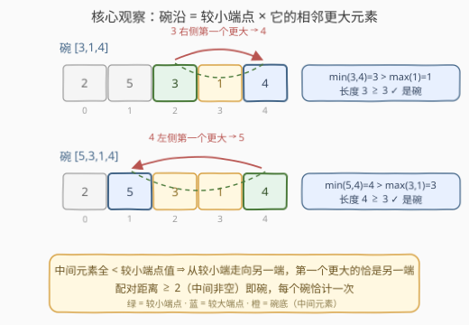
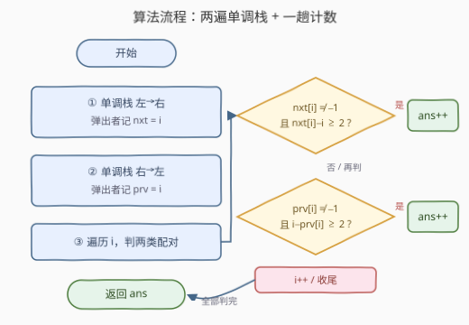

# LeetCode 碗子数组的数目 题解

## 1. 题目概述

- **标题 / 题号**：碗子数组的数目（#3676，medium）
- **链接**：https://leetcode.cn/problems/count-bowl-subarrays/
- **难度**：中等
- **标签**：栈、数组、单调栈

**题意**：给定一个整数数组 `nums`，其中元素**互不相同**。

子数组 `nums[l..r]` 被称为**碗（bowl）**，如果满足：

- 子数组长度至少为 3，即 $r - l + 1 \ge 3$；
- 两端元素的**最小值**严格大于**中间所有元素的**最大值，即 $\min(nums[l],\ nums[r]) > \max(nums[l+1],\ \ldots,\ nums[r-1])$。

返回 `nums` 中**碗子数组的数目**。

**示例 1**：

```text
输入：nums = [2,5,3,1,4]
输出：2
解释：碗子数组是 [3,1,4] 和 [5,3,1,4]。
- min(3,4)=3 > max(1)=1 ✓
- min(5,4)=4 > max(3,1)=3 ✓
```

**示例 2**：

```text
输入：nums = [5,1,2,3,4]
输出：3
解释：碗子数组是 [5,1,2]、[5,1,2,3] 和 [5,1,2,3,4]。
```

**示例 3**：

```text
输入：nums = [1000000000,999999999,999999998]
输出：0
解释：没有子数组是碗。
```

**约束**：$3 \le nums.length \le 10^5$，$1 \le nums[i] \le 10^9$，元素互不相同。

> 💡 「碗」的意象很直观：两端是高高的碗沿，中间全部凹陷下去——**子数组的两个最大值恰好钉在两端**。抓住这一点，计数对象就能从 $O(n^2)$ 个子数组坍缩成 $O(n)$ 对「碗沿配对」。

## 2. 解题思路

### 2.1 暴力思路

枚举所有 $(l, r)$ 对，同时维护中间最大值 $M = \max(nums[l+1..r-1])$，判断 $\min(nums[l], nums[r]) > M$。固定 $l$ 向右扩 $r$ 时 $M$ 可以 $O(1)$ 递推，总复杂度 $O(n^2)$。

$n = 10^5$ 时约 $5 \times 10^9$ 次判断，必然超时。需要把视角从「枚举子数组」切换到「枚举**碗沿配对**」。

### 2.2 核心观察：碗沿 = 「较小端点 × 它的相邻更大元素」

把碗的条件改写：中间每个元素都严格小于两端中**较小**的一个。等价地——

> **一个子数组是碗 ⟺ 它的最大值与次大值恰好落在两个端点上。**

设 $p$ 为**较小端点**（$nums[p] = \min$），$q$ 为另一端，则：

- 中间元素全部位于 $p, q$ 之间，且都 $< nums[p]$；
- $nums[q] > nums[p]$。

于是**从 $p$ 朝 $q$ 的方向走，遇到的第一个比 $nums[p]$ 大的元素恰好就是 $q$**——中间没有更大的，而 $q$ 本身比 $nums[p]$ 大。用单调栈的语言说：

- $q$ 在 $p$ 右侧 ⟹ $q = nxt[p]$（$p$ 的**下一个更大元素**位置）；
- $q$ 在 $p$ 左侧 ⟹ $q = prv[p]$（$p$ 的**上一个更大元素**位置）。

**反向也成立**：对任意配对 $(p,\ nxt[p])$，$p$ 到 $nxt[p]$ 之间的元素全都 $< nums[p] < nums[nxt[p]]$，只要两端距离 $\ge 2$（中间非空），它就是一个碗，且 $p$ 正是其较小端点。

**不重不漏**：

- **不漏**：每个碗按其（唯一的，因元素互异）较小端点 $p$ 拆出一对「相邻更大」配对；
- **不重**：碗由端点对 $(l, r)$ 唯一确定，而两类配对集合不相交——若 $(a, b)$ 既是 $(a,\ nxt[a])$ 又是 $(prv[b],\ b)$，则需同时 $nums[b] > nums[a]$ 与 $nums[a] > nums[b]$，矛盾；
- 相邻元素对（距离 1）必然是一对「相邻更大」配对，但因中间为空、长度不足 3，被「距离 $\ge 2$」自动过滤。

$$
\boxed{\ \text{ans} = \sum_{i=0}^{n-1} \big[\,nxt[i] \ne -1 \ \wedge\ nxt[i]-i \ge 2\,\big] + \sum_{i=0}^{n-1} \big[\,prv[i] \ne -1 \ \wedge\ i-prv[i] \ge 2\,\big]\ }
$$

附带一个有趣的事实：候选配对总数 $\le 2n - 2$（每个下标至多向左、向右各贡献一对），所以**碗的数目是线性的**——尽管子数组有 $O(n^2)$ 个，「前两大值钉在两端」的约束苛刻到只留下 $O(n)$ 个。



### 2.3 算法流程图



### 2.4 示例演算

以示例 1 `nums = [2,5,3,1,4]`（下标 0–4）为例：

| $i$ | $nums[i]$ | $prv[i]$ | $nxt[i]$ | nxt 距离 $\ge 2$？ | prv 距离 $\ge 2$？ |
|-----|-----------|----------|----------|------------------|------------------|
| 0 | 2 | $-1$ | 1 | ✗（距离 1） | — |
| 1 | 5 | $-1$ | $-1$ | — | — |
| 2 | 3 | 1 | **4** | **✓（距离 2）** | ✗（距离 1） |
| 3 | 1 | 2 | 4 | ✗（距离 1） | ✗（距离 1） |
| 4 | 4 | **1** | $-1$ | — | **✓（距离 3）** |

命中两对配对：

- $i=2$ 的 nxt 对 $(2, 4)$ → 碗 $[3,1,4]$；
- $i=4$ 的 prv 对 $(1, 4)$ → 碗 $[5,3,1,4]$。

答案 $= 2$ ✓，与示例一致。

## 3. 参考代码

### C++

```cpp
class Solution {
public:
    long long bowlSubarrays(vector<int>& nums) {
        int n = nums.size();
        vector<int> nxt(n, -1), prv(n, -1);
        stack<int> st;
        for (int i = 0; i < n; i++) {          // 左 -> 右，下一个更大
            while (!st.empty() && nums[st.top()] < nums[i]) {
                nxt[st.top()] = i;
                st.pop();
            }
            st.push(i);
        }
        st = stack<int>();
        for (int i = n - 1; i >= 0; i--) {     // 右 -> 左，上一个更大
            while (!st.empty() && nums[st.top()] < nums[i]) {
                prv[st.top()] = i;
                st.pop();
            }
            st.push(i);
        }
        long long ans = 0;
        for (int i = 0; i < n; i++) {
            if (nxt[i] != -1 && nxt[i] - i >= 2) ans++;
            if (prv[i] != -1 && i - prv[i] >= 2) ans++;
        }
        return ans;
    }
};
```

### Python

```python
class Solution:
    def bowlSubarrays(self, nums: List[int]) -> int:
        n = len(nums)
        nxt = [-1] * n
        prv = [-1] * n
        st = []
        for i in range(n):                      # 左 -> 右，下一个更大
            while st and nums[st[-1]] < nums[i]:
                nxt[st.pop()] = i
            st.append(i)
        st = []
        for i in range(n - 1, -1, -1):          # 右 -> 左，上一个更大
            while st and nums[st[-1]] < nums[i]:
                prv[st.pop()] = i
            st.append(i)
        ans = 0
        for i in range(n):
            if nxt[i] != -1 and nxt[i] - i >= 2:
                ans += 1
            if prv[i] != -1 and i - prv[i] >= 2:
                ans += 1
        return ans
```

## 4. 复杂度分析

| 维度 | 复杂度 | 说明 |
|------|--------|------|
| 时间 | $O(n)$ | 两遍单调栈 + 一趟计数；每个下标至多入栈、出栈各一次 |
| 空间 | $O(n)$ | `nxt`、`prv` 两个数组与栈 |
| 答案规模 | $\le 2n - 2$ | 每个下标至多贡献一对 nxt 配对与一对 prv 配对；$n \le 10^5$ 时答案不过 $2 \times 10^5$ 量级，无溢出风险（C++ 返回 `long long` 直接累加即可） |

## 5. 扩展：元素互异是双射成立的前提

整套论证有一个隐含支点：**元素互异 ⟹ 较小端点唯一**。若允许重复，至少出现两处松动：

- **两端相等**：如 $[5, 3, 3']$（$3' = 3$）中两端同为最大值时，「较小端点」不再唯一；且另一端不再满足「严格更大」，$(p,\ nxt[p])$ 这类配对捕捉不到「等值碗沿」——需要把单调栈条件改成「第一个 $\ge$」，并单独统计「两端等值、中间更小」的配对；
- **中间与端点相等**：严格不等号使得「等于较小端点值的中间元素」也能充当壁垒，配对判定要改为「第一个 $\ge nums[p]$ 的位置」并分类讨论。

这正是许多单调栈计数题（如子数组最值贡献法）在「含重复元素」版本里需要小心调整弹栈条件（`<` 还是 `<=`）的原因。本题保证了互异，才让双射如此干净。

## 6. 面试要点

**Q1：碗的条件为什么等价于「子数组的最大值与次大值恰好在两端」？**
　　$\min(\text{两端}) > \max(\text{中间})$ 意味着中间每个值都小于两端中较小的一个，更小于较大的一个；反过来，若前两大值恰是两端，则中间全部小于次大值 = 较小端点。二者互为充要。

**Q2：为什么较小端点的「相邻更大元素」恰好是另一端？**
　　中间元素全 $< nums[p]$ 且都夹在 $p, q$ 之间，而 $nums[q] > nums[p]$；所以从 $p$ 朝 $q$ 方向扫描，第一个比 $nums[p]$ 大的元素必然是 $q$ 本身——即 $q = nxt[p]$ 或 $q = prv[p]$。

**Q3：怎么保证每碗恰计数一次？**
　　每碗的较小端点 $p$ 唯一（元素互异），它唯一确定一对「相邻更大」配对；两类配对集合不相交（$(a, nxt[a])$ 要求 $nums[b] > nums[a]$，$(prv[b], b)$ 要求相反，同对不可能兼具）；距离 1 的相邻配对因长度不足被过滤。

**Q4：单调栈求 $nxt$ / $prv$ 的写法与复杂度？**
　　维护值递减的下标栈：新元素比栈顶大时弹栈并在弹出位记录答案；每个下标至多入栈、出栈各一次，两遍共 $O(n)$。

**Q5：如果数组元素可能重复，本解法在哪一步失效？**
　　「较小端点唯一」与「另一端严格更大」同时失效：两端等值的碗（中间全小于该值）中，另一端不是任何一端的「下一个更大」；需改用「第一个 $\ge$」的弹栈条件并专门处理等值端点配对与去重（见第 5 节）。

## 同类练习题

| # | 题目 | 与本题的关联 |
|---|------|-------------|
| 496 | [下一个更大元素 I](https://leetcode.cn/problems/next-greater-element-i/) | 单调栈求「下一个更大元素」的入门模板 |
| 901 | [股票价格跨度](https://leetcode.cn/problems/online-stock-span/) | 在线维护「上一个更大元素」的距离，与本题 $prv$ 数组同源 |
| 2104 | [子数组范围和](https://leetcode.cn/problems/sum-of-subarray-ranges/) | 按「相邻更大配对」的贡献法统计子数组最值，与本题同一思想族 |
| 2454 | [下一个更大元素 IV](https://leetcode.cn/problems/next-greater-element-iv/) | 嵌套两层「下一个更大」的进阶练习 |
| 42 | [接雨水](https://leetcode.cn/problems/trapping-rain-water/) | 单调栈经典应用，「碗状蓄水」的意象与本题遥相呼应 |
