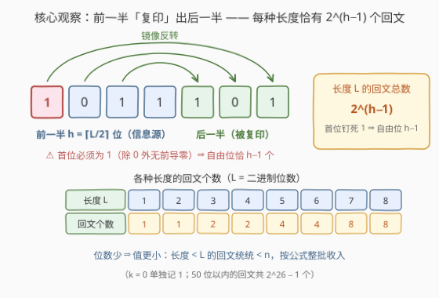
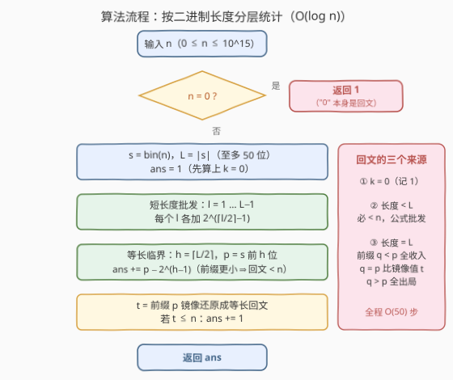

# 统计二进制回文数字的数目

- **题目名称**：统计二进制回文数字的数目
- **链接**：[3677. 统计二进制回文数字的数目](https://leetcode.cn/problems/count-binary-palindromic-numbers/)
- **难度**：困难
- **标签**：位运算、数学

## 1. 题目概述

给你一个**非负**整数 `n`。如果一个**非负**整数的二进制表示（不含前导零）正着读和倒着读都一样，则称该数为**二进制回文数**。返回满足 $0 \le k \le n$ 且 $k$ 的二进制表示是回文数的整数 $k$ 的数量。

注意：数字 `0` 被认为是二进制回文数，其表示为 `"0"`。

**示例 1**：

```text
输入：n = 9
输出：6
解释：范围 [0, 9] 内的二进制回文数有：
0 → "0"、1 → "1"、3 → "11"、5 → "101"、7 → "111"、9 → "1001"，
其余值的二进制形式都不是回文，因此计数为 6。
```

**示例 2**：

```text
输入：n = 0
输出：1
解释："0" 本身是回文数，所以计数为 1。
```

**约束条件**：

- $0 \le n \le 10^{15}$

> 💡 **审题关键**：① $10^{15} < 2^{50}$，`n` 的二进制至多 **50 位**，逐个枚举必然爆炸；② 不含前导零 ⇒ 除 0 外首位必为 1；③ 「二进制串是回文」天然适合**按串长分层**——先按长度分桶，再在桶内数个数；④ 0 是被钦定的回文，要单独记账。

---

## 2. 解题思路

### 2.1 暴力思路

**暴力一：逐个判定**。枚举 $k \in [0, n]$，把 $\mathrm{bin}(k)$ 翻转比较——$O(n \log n)$，$n = 10^{15}$ 直接出局。

**暴力二：枚举回文**。注意到回文由前一半决定，可以只枚举前缀再镜像还原：50 位以内的二进制回文共 $2^{26} - 1 \approx 6.7 \times 10^7$ 个（见 2.2 的计数），逐一与 $n$ 比较勉强能过，但仍是千万级。

> 💡 正确的姿势是**根本不枚举，直接数**：回文与「前一半」一一对应，而前缀值是连续整数区间——区间长度直接算出来，连回文本身都不用构造。

### 2.2 核心观察：前一半「复印」出后一半



设某回文的二进制长度为 $L$，前一半长度 $h = \lceil L/2 \rceil$：

- **回文由前 $h$ 位唯一决定**：后 $L - h$ 位只是前一半（去掉中心位后）的反转「复印」，没有任何自由度；
- **首位必须为 1**（无前导零），故自由位只有 $h - 1$ 个，于是

$$\#\{\text{长度为 } L \text{ 的二进制回文}\} = 2^{\lceil L/2 \rceil - 1} \qquad (L \ge 1)$$

再设 $s = \mathrm{bin}(n)$，$L = |s|$。把 $\le n$ 的回文按长度分成三类：

| 类别 | 个数 | 理由 |
|------|------|------|
| $k = 0$ | $1$ | 题目钦定 "0" 是回文 |
| 长度 $< L$ | $\sum_{l=1}^{L-1} 2^{\lceil l/2 \rceil - 1}$ | 位数更少 ⇒ 值必然更小，整批收入 |
| 长度 $= L$ | $p - 2^{h-1} + [\,t \le n\,]$ | 见下 |

**等长临界的计数**：设 $p$ 为 $s$ 前 $h$ 位组成的整数（即 $n$ 的「前缀值」），等长回文的前缀值 $q$ 取遍 $[2^{h-1}, 2^h - 1]$（首位为 1）：

- $q < p$：回文的前 $h$ 位已严格小于 $n$ 的前 $h$ 位 ⇒ 回文 $< n$，全部收入，共 $p - 2^{h-1}$ 个；
- $q > p$：同理必 $> n$，全部出局；
- $q = p$：前 $h$ 位打平，胜负由镜像出来的后缀决定——把 $p$ 镜像还原成完整回文 $t$，与 $n$ 整体比较一次即可。

$$\boxed{\;\mathrm{ans} = 1 + \sum_{l=1}^{L-1} 2^{\lceil l/2 \rceil - 1} + \bigl(p - 2^{h-1}\bigr) + [\,t \le n\,]\;}$$

其中 $t$ 是「$n$ 的前一半镜像还原」得到的等长回文——它正是**不大于 $n$ 的最大等长回文候选**。

### 2.3 算法流程



| 步骤 | 操作 | 说明 |
|------|------|------|
| ① 特判 | `n == 0` 返回 1 | 只有 $k=0$ 一个 |
| ② 建串 | `s = bin(n)`，`L = len(s)` | 至多 50 位 |
| ③ 批发 | `ans = 1`；对 `l = 1..L-1` 各加 `2^(⌈l/2⌉−1)` | 长度更短的全 $< n$ |
| ④ 临界 | `h = ⌈L/2⌉`，`p = s[:h]` 的值；`ans += p − 2^(h−1)` | 前缀严格更小的等长回文 |
| ⑤ 收尾 | `t = s[:h] + s[:L−h][::-1]`；若 `t ≤ n` 则 `ans += 1` | 前缀相同者比镜像值 |

> ⚠️ **易错点**：① 镜像下标——偶数长度翻**整个**前缀、奇数长度翻**去掉末位**的前缀，统一写成 `s[:h] + s[:L-h][::-1]` 最不易错；② C++ 位移写 `1LL << (h-1)`（$h$ 可达 25，且前缀值是 50 位级别必须 `long long`）；③ `ans` 初值里的 $k=0$ 别丢。

### 2.4 示例演算

**示例：`n = 9`，`s = "1001"`，`L = 4`**

| 来源 | 计算 | 个数 |
|------|------|------|
| $k = 0$ | 题目钦定 | 1 |
| $l = 1$ | $2^{\lceil 1/2 \rceil - 1} = 2^0$ | 1（"1"） |
| $l = 2$ | $2^{\lceil 2/2 \rceil - 1} = 2^0$ | 1（"11"） |
| $l = 3$ | $2^{\lceil 3/2 \rceil - 1} = 2^1$ | 2（"101"、"111"） |
| $l = 4$，$q < p$ | $h = 2$，$p = 0\mathrm{b}10 = 2$，$2^{h-1} = 2$ ⇒ $p - 2^{h-1} = 0$ | 0 |
| $l = 4$，$q = p$ | $t = \mathrm{mirror}(\text{"10"}) = \text{"1001"} = 9 \le 9$ | 1 |

合计 $1 + 1 + 1 + 2 + 0 + 1 = 6$ ✓（即 0、1、3、5、7、9，与示例一致）。

**`n = 0`**：特判直接返回 1 ✓。

---

## 3. 参考代码

### C++

```cpp
class Solution {
public:
    int countBinaryPalindromes(long long n) {
        if (n == 0) return 1;                    // 只有 k = 0
        string s;
        for (long long m = n; m > 0; m >>= 1) s += char('0' + (m & 1));
        reverse(s.begin(), s.end());             // s = bin(n)，L = |s|
        int L = s.size();

        long long ans = 1;                                    // k = 0
        for (int l = 1; l < L; l++) ans += 1LL << ((l + 1) / 2 - 1);  // 短长度批发

        int h = (L + 1) / 2;
        long long p = stoll(s.substr(0, h), nullptr, 2);      // n 的前缀值
        ans += p - (1LL << (h - 1));                          // 前缀严格更小的等长回文

        string t = s.substr(0, h);
        for (int i = L - h - 1; i >= 0; i--) t += s[i];       // 镜像还原
        if (stoll(t, nullptr, 2) <= n) ans++;                 // 前缀相同的临界判定

        return (int)ans;    // 上界 2^26 - 1，int 足够
    }
};
```

### Python

```python
class Solution:
    def countBinaryPalindromes(self, n: int) -> int:
        if n == 0:
            return 1
        s = bin(n)[2:]
        L = len(s)
        ans = 1                                  # k = 0
        for l in range(1, L):
            ans += 1 << ((l + 1) // 2 - 1)       # 短长度批发
        h = (L + 1) // 2
        p = int(s[:h], 2)                        # n 的前缀值
        ans += p - (1 << (h - 1))                # 前缀严格更小的等长回文
        t = s[:h] + s[:L - h][::-1]              # 镜像还原
        if int(t, 2) <= n:
            ans += 1
        return ans
```

---

## 4. 复杂度分析

| 维度 | 复杂度 | 说明 |
|------|--------|------|
| **时间复杂度** | $O(\log n)$ | 二进制位数 $B \le 50$：构串、长度循环、前缀求值与镜像比较均为 $O(B)$ |
| **空间复杂度** | $O(\log n)$ | 存二进制串 `s` 与镜像串 `t` |

---

## 5. 扩展：闭式、前缀和与逆问题

- **短长度批发和的闭式**：令 $m = L - 1$，按 $l$ 的奇偶成对合并可得 $m$ 为偶数时和为 $2^{m/2+1} - 2$、$m$ 为奇数时为 $3 \cdot 2^{(m-1)/2} - 2$，循环可省（但直接写循环更不易错）。顺带一提，长度 $1 \sim 50$ 的回文总数恰为 $2^{26} - 1$。
- **区间计数**：$[a, b]$ 内的二进制回文数 $= f(b) - f(a-1)$，本解即是前缀函数 $f$。
- **第 k 小回文（逆问题）**：由每层恰 $2^{\lceil L/2 \rceil - 1}$ 个，可先定位长度再由 $k$ 反解出前缀——计数与定位互为逆运算（2081 的枚举构造用的正是同一套「前半定全身」）。
- **数位 DP 写法**：按位记忆化（状态含位置、是否贴上界、已写下的前半信息）同样可做，但「回文 = 前缀决定后缀」的结构让分层计数显著更简洁——遇到回文约束优先想前缀，再想数位 DP。

---

## 6. 面试要点

**Q1：为什么长度严格小于 L 的回文一定 ≤ n？**

> 无前导零时位数即量级：任意 $l < L$ 位的正整数 $< 2^{l} \le 2^{L-1} \le n$。所以短长度桶内的回文无需看具体值，按公式 $2^{\lceil l/2 \rceil - 1}$ 整批收入。

**Q2：等长（长度 = L）回文的个数为什么是 p − 2^(h−1) 加一次判定？**

> 等长回文与前缀值 $q \in [2^{h-1}, 2^h)$ 一一对应。两个同长二进制数比较，前 $h$ 位不同则高下立判：$q < p$ 必小于 $n$（收入 $p - 2^{h-1}$ 个），$q > p$ 必大于（出局）；唯一悬而未决的是 $q = p$——把前缀镜像还原成 $t$ 后与 $n$ 整体比一次。

**Q3：为什么 0 要单独处理？**

> 「首位必须为 1」的推导只覆盖正数；0 的二进制 "0" 是题目钦定的回文，且 `bin(0)` 会破坏 $L$ 的定义，直接特判返回 1 最干净。

**Q4：这套「分层批发 + 临界比较」框架还在哪里出现过？**

> 数位统计的通用骨架：902（数字组合 ≤ N）、600（不含连续 1）、233（数字 1 的个数）都是「短长度按组合数学批发、等长贴上界逐位比较」。本题特殊在回文约束让等长部分坍缩成「前缀比大小 + 一次镜像」，连逐位比较都省了。

**Q5：实现上最容易翻车的细节？**

> ① 镜像公式：奇数长度别把中心位重复一次——统一写 `s[:h] + s[:L-h][::-1]`（$L - h$ 恰是需要反转的位数）；② C++ 前缀值与镜像值是 50 位数级别，必须 `long long`，位移用 `1LL <<`；③ 答案上界 $2^{26} - 1 \approx 6.7 \times 10^7$，`int` 返回没问题，但中间量不行。

> 💡 **一句话总结**：3677 = 前一半决定全身（每长度 $2^{\lceil L/2 \rceil - 1}$ 个）+ 短长度按幂批发 + 等长前缀比大小、镜像值踢临门一脚。

---

## 7. 同类练习题

- [2081. K 镜像数的和](https://leetcode.cn/problems/sum-of-k-mirror-numbers/)：「前半构造回文」的枚举版兄弟，本题正是它的计数版
- [866. 回文素数](https://leetcode.cn/problems/prime-palindrome/)：按长度奇偶批量生成回文再判素数，同一个「回文看前半」观察
- [600. 不含连续 1 的非负整数](https://leetcode.cn/problems/non-negative-integers-without-consecutive-ones/)：统计 ≤ n 且二进制满足性质的数位 DP 范本，可与本题的分层计数对照
- [902. 最大为 N 的数字组合](https://leetcode.cn/problems/numbers-at-most-n-given-digit-set/)：「短长度批发 + 等长贴上界比较」框架的标准数位统计题
- [479. 最大回文数乘积](https://leetcode.cn/problems/largest-palindrome-product/)：回文数的另一面——构造最大而非计数
