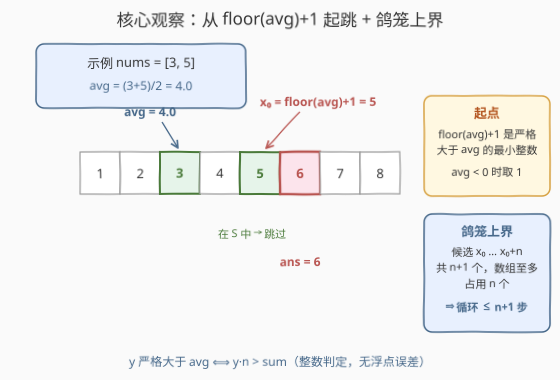
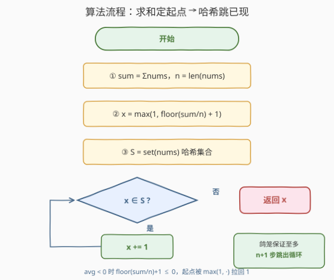

# 大于平均值的最小未出现正整数

- **题目名称**：大于平均值的最小未出现正整数
- **链接**：[3678. 大于平均值的最小未出现正整数](https://leetcode.cn/problems/smallest-absent-positive-greater-than-average/)
- **难度**：简单
- **标签**：数组、哈希表

## 1. 题目概述

给你一个整数数组 `nums`。返回**严格大于** `nums` 中所有元素**平均值**的**最小未出现正整数**。

数组的**平均值**定义为数组中所有元素的总和除以元素的数量。

**示例 1**：

```text
输入：nums = [3, 5]
输出：6
解释：平均值是 (3 + 5) / 2 = 4。大于 4 的最小未出现正整数是 6（5 大于 4 但已出现，跳过）。
```

**示例 2**：

```text
输入：nums = [-1, 1, 2]
输出：3
解释：平均值是 (-1 + 1 + 2) / 3 = 2/3 ≈ 0.667。1 和 2 都已出现，答案为 3。
```

**示例 3**：

```text
输入：nums = [4, -1]
输出：2
解释：平均值是 (4 + (-1)) / 2 = 1.5。大于 1.5 的最小未出现正整数是 2。
```

**约束条件**：

- $1 \le \text{nums.length} \le 100$
- $-100 \le \text{nums}[i] \le 100$

> 💡 **审题关键**：答案要同时满足三个条件——① 是**正整数**（$\ge 1$）；② **严格大于**平均值（avg 恰为整数时不能取等，示例 1 中 avg = 4，4 本身不合法）；③ **未出现在** `nums` 中。前两个条件把答案压到一个明确的下界，第三个条件只需从下界起向后跳过已出现的值。

---

## 2. 解题思路

### 2.1 暴力思路

从 $y = 1$ 开始逐个枚举正整数，对每个 $y$ 检查两个条件：

- **严格大于平均值**：避免浮点，用整数判定 $y \cdot n > \text{sum}$（$n$ 为数组长度，$n > 0$ 时不等号方向不变）；
- **未出现**：线性扫一遍 `nums` 看 $y$ 是否存在。

第一个同时满足的 $y$ 即答案。由约束可估出枚举上界：$\text{avg} \in [-100, 100]$，起点至多为 $\lfloor 100 \rfloor + 1 = 101$，再往后走至多 $n \le 100$ 步，即答案 $\le 201$，枚举总量很小，本题数据下能过。但每个 $y$ 的存在性检查是 $O(n)$，总复杂度 $O(201 \, n)$，且逻辑上"从 1 开始枚举"浪费了大量必然不满足条件①②的候选——起点完全可以直接算出来。

### 2.2 核心观察：起点 $\lfloor \text{avg} \rfloor + 1$ 与鸽笼上界



**观察一（起跳点）**：答案是整数且严格大于 $\text{avg}$，而**严格大于 $\text{avg}$ 的最小整数就是 $\lfloor \text{avg} \rfloor + 1$**：

- 当 $\text{avg}$ 为整数（如 $4.0$）时，$\lfloor \text{avg} \rfloor + 1 = \text{avg} + 1$，是第一个严格大于它的整数；
- 当 $\text{avg}$ 非整数（如 $1.5$）时，$\lfloor \text{avg} \rfloor + 1$ 即向上取整，同样是第一个严格大于它的整数。

再叠加"正整数"约束，起跳点为：

$$x_0 = \max\bigl(1,\ \lfloor \text{avg} \rfloor + 1\bigr)$$

**观察二（鸽笼上界）**：从 $x_0$ 开始的连续 $n+1$ 个候选 $[x_0,\ x_0 + n]$ 中，`nums` 至多含有其中 $n$ 个**不同**值（数组只有 $n$ 个元素），因此**必存在未出现者**，答案 $\le x_0 + n$。也就是说，从 $x_0$ 起最多向后走 $n+1$ 步必然命中答案，循环有明确的上界。

$$\boxed{\;\text{ans} = \min\{\, x \ge x_0 : x \notin \text{nums} \,\}\;}$$

### 2.3 算法流程：定起点 + 哈希跳已现



| 步骤 | 操作 | 说明 |
|------|------|------|
| ① 求和 | 计算 $\text{sum} = \sum \text{nums}$，$n = \text{len}(\text{nums})$ | 整数运算，不引入浮点 |
| ② 定起点 | $x = \max(1, \lfloor \text{sum}/n \rfloor + 1)$ | 严格大于 avg 的最小整数，再兜底为正 |
| ③ 建集合 | $S = \text{set}(\text{nums})$ | $O(1)$ 查询"是否出现" |
| ④ 跳已现 | `while x ∈ S: x += 1` | 鸽笼保证至多 $n+1$ 次迭代 |
| ⑤ 返回 | 返回 $x$ | 即最小合法答案 |

> ⚠️ **易错点**：① "严格大于"不能写成 $\ge$——示例 1 中 avg = 4，若允许取等则 4 本身要参与候选（本题恰好 4 未出现，会错误地返回 4）；② 起点别忘了和 1 取 max——全负数数组（如 `[-2, -1]`，avg = −1.5）时 $\lfloor \text{avg} \rfloor + 1 = -1$ 不是正整数，应从 1 起跳。

### 2.4 示例演算

**示例 1：`nums = [3, 5]`**

- $\text{sum} = 8$，$n = 2$，$\text{avg} = 4$，$x_0 = \max(1, 4 + 1) = 5$；
- $x = 5$：在 $S = \{3, 5\}$ 中 → 跳过，$x = 6$；
- $x = 6$：不在 $S$ 中 → 返回 **6** ✓（5 大于 4 但已出现，被跳过）。

**示例 2：`nums = [-1, 1, 2]`**

- $\text{sum} = 2$，$n = 3$，$\text{avg} = 2/3$，$x_0 = \max(1, 0 + 1) = 1$；
- $1 \in S$ → $2 \in S$ → $3 \notin S$ → 返回 **3** ✓（起点被连续出现的 1、2 顶了 2 步，鸽笼界内解决）。

**示例 3：`nums = [4, -1]`**

- $\text{sum} = 3$，$n = 2$，$\text{avg} = 1.5$，$x_0 = \max(1, 1 + 1) = 2$；
- $2 \notin S = \{4, -1\}$ → 直接返回 **2** ✓。

---

## 3. 参考代码

### C++

```cpp
class Solution {
public:
    int smallestAbsent(vector<int>& nums) {
        int n = nums.size();
        int sum = accumulate(nums.begin(), nums.end(), 0);
        int x = max(1, sum / n + 1);   // 见下方说明：向零截断在此写法下恰好安全
        unordered_set<int> s(nums.begin(), nums.end());
        while (s.count(x)) {
            x++;
        }
        return x;
    }
};
```

> 💡 **关于 `sum / n` 的整除细节**：C++ 的 `/` 向零截断，负数时不等于 floor（如 $-1 / 2 = 0$，而 $\lfloor -0.5 \rfloor = -1$）。但本写法恰好无恙：
>
> - $\text{sum} \ge 0$ 时截断与 floor 一致；
> - $\text{sum} < 0$ 时 $\text{avg} < 0$，则 $\lfloor \text{avg} \rfloor + 1 \le 0$，被 $\max(1, \cdot)$ 拉成 1；而截断商 $\le 0$，加 1 后 $\le 1$，同样被拉成 1——两条路殊途同归。
>
> 若不放心，可显式写 `int x = max(1, (int)floor((double)sum / n) + 1);`，本题值域（$|\text{sum}| \le 10^4$）下 double 无精度风险。

### Python

```python
class Solution:
    def smallestAbsent(self, nums: List[int]) -> int:
        s = set(nums)
        x = max(1, sum(nums) // len(nums) + 1)   # // 是 floor 除法，负数也正确
        while x in s:
            x += 1
        return x
```

---

## 4. 复杂度分析

| 维度 | 复杂度 | 说明 |
|------|--------|------|
| **时间复杂度** | $O(n)$ | 建哈希集合 $O(n)$；起跳后由鸽笼原理至多走 $n+1$ 步，每步 $O(1)$ 查询 |
| **空间复杂度** | $O(n)$ | 哈希集合存放全部元素 |

> 由约束还能给出更紧的具体界：$\text{avg} \in [-100, 100]$，故 $x_0 \le 101$，答案 $\le x_0 + n \le 201$——值域完全有界，这也是 2.5 节用布尔数组替代哈希的底气。

---

## 5. 扩展：值域有界时的布尔数组写法

由约束 $\text{nums}[i] \in [-100, 100]$、$n \le 100$ 可知答案落在 $[1, 201]$ 内。于是可以用一个定长布尔数组代替哈希集合，省去哈希开销：

```cpp
class Solution {
public:
    int smallestAbsent(vector<int>& nums) {
        int n = nums.size();
        int sum = accumulate(nums.begin(), nums.end(), 0);
        int x = max(1, sum / n + 1);
        bool vis[202] = {false};
        for (int v : nums) {
            if (v >= 1 && v <= 201) vis[v] = true;
        }
        while (vis[x]) x++;
        return x;
    }
};
```

这与经典的 [41. 缺失的第一个正整数](https://leetcode.cn/problems/first-missing-positive/) 形成有趣对照：41 题要找最小未出现正整数但值域无界（起点固定为 1），进阶要求 $O(n)$ 时间 $O(1)$ 空间，需要原地置换的巧思；本题因**起点被平均值抬高且值域有界**，直接"定起点 + 哈希跳已现"就是最自然的解。

**变体**：若条件改为"大于**等于**平均值"，起跳点相应变为 $\max(1, \lceil \text{avg} \rceil)$，其中 $\lceil \text{avg} \rceil = \lfloor (\text{sum} + n - 1) / n \rfloor$（$n > 0$），其余逻辑不变。

---

## 6. 面试要点

**Q1：为什么起点是 $\lfloor \text{avg} \rfloor + 1$ 而不是 $\lceil \text{avg} \rceil$？**

> avg 为整数时 $\lceil \text{avg} \rceil = \text{avg}$，不满足"严格大于"；非整数时两者相等。$\lfloor \text{avg} \rfloor + 1$ 在两种情况下都是严格大于 avg 的最小整数，是唯一正确的统一表达式。

**Q2：while 循环为什么一定会终止？至多走多少步？**

> 鸽笼原理：候选区间 $[x_0, x_0 + n]$ 含 $n+1$ 个连续整数，而数组只有 $n$ 个元素，至多占住其中 $n$ 个不同值，必有未出现者。故循环至多 $n + 1$ 次迭代，答案上界 $x_0 + n$。

**Q3：C++ 里 `sum / n` 对负数向零截断，为什么代码里不用 floor 修正？**

> 两条路径在 $\max(1, \cdot)$ 之后必然相等：sum ≥ 0 时截断就是 floor；sum < 0 时 avg < 0，无论 floor 还是截断，商加 1 都 ≤ 1，被 max 拉成同一个起点 1。这一论证依赖"答案必须是正整数"这一条件。

**Q4：为什么建议用 $y \cdot n > \text{sum}$ 而不是浮点比较 $y > \text{avg}$？**

> 整数判定零误差。本题值域极小（|sum| ≤ 10⁴，n ≤ 100），double 表示完全安全，浮点比较也不会出错；但整数比较是无需依赖值域分析的好习惯，在值域更大的场景（sum 累加到 10¹⁸ 量级）依然稳。

**Q5：全负数数组时行为如何？**

> 如 `nums = [-2, -1]`：avg = −1.5，$\lfloor \text{avg} \rfloor + 1 = -1$，被 max 拉回 1；1 未出现，直接返回 1——正是"严格大于 −1.5 的最小未出现正整数"。

> 💡 **一句话总结**：3678 = 起点一步算出（$\max(1, \lfloor \text{avg} \rfloor + 1)$）+ 哈希集合跳已现 + 鸽笼兜底（至多 $n+1$ 步），全程整数运算。

---

## 7. 同类练习题

- [41. 缺失的第一个正整数](https://leetcode.cn/problems/first-missing-positive/)：无平均值条件的"最小未出现正整数"原型题，进阶 $O(n)$ 时间 $O(1)$ 空间的原地置换解法
- [268. 丢失的数字](https://leetcode.cn/problems/missing-number/)：值域 $[0, n]$ 中找缺失者，数学求和 / 异或消去出现值
- [1539. 第 k 个缺失的正整数](https://leetcode.cn/problems/kth-missing-positive-number/)：有序序列上"跳过已出现值"的推广版本，双指针或二分
- [217. 存在重复元素](https://leetcode.cn/problems/contains-duplicate/)：哈希集合判存在的最基本功，本题第 ④ 步的地基
