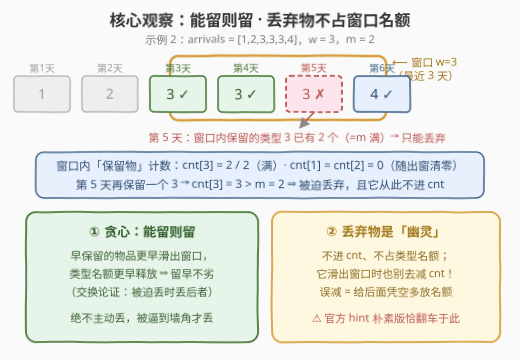
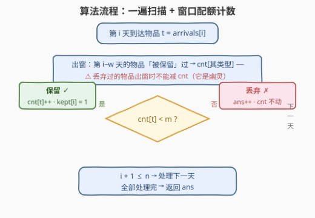

# LeetCode 使库存平衡的最少丢弃次数 题解

## 1. 题目概述

- **标题 / 题号**：使库存平衡的最少丢弃次数（#3679，medium）
- **链接**：https://leetcode.cn/problems/minimum-discards-to-balance-inventory/
- **难度**：中等
- **标签**：数组、哈希表、计数、滑动窗口、模拟

**题意**：给你两个整数 `w` 和 `m`，以及一个整数数组 `arrivals`，其中 `arrivals[i]` 表示第 `i` 天到达的物品类型（天数从 1 开始编号）。

物品的管理遵循以下规则：

- 每个到达的物品可以被**保留**或**丢弃**，物品只能在**到达当天**被丢弃；
- 对于每一天 `i`，考虑天数范围为 `[max(1, i - w + 1), i]`（直到第 `i` 天为止最近的 `w` 天）：对于任何这样的时间窗口，在**被保留**的到达物品中，每种类型最多只能出现 `m` 次；
- 如果在第 `i` 天保留该到达物品会导致其类型在该窗口中出现次数**超过** `m` 次，那么该物品必须被丢弃。

返回为满足每个 `w` 天的窗口中每种类型最多出现 `m` 次，**最少**需要丢弃的物品数量。

**示例 1**：

```text
输入：arrivals = [1,2,1,3,1], w = 4, m = 2
输出：0
解释：第 5 天的窗口 [2, 1, 3, 1] 中类型 1 恰好出现两次（= m），始终合法，无需丢弃任何物品。
```

**示例 2**：

```text
输入：arrivals = [1,2,3,3,3,4], w = 3, m = 2
输出：1
解释：第 5 天的窗口 [3, 3, 3] 中若三个 3 全保留则出现三次 > m = 2，第 5 天的 3 必须丢弃；
     第 6 天的窗口（第 4~6 天）中保留物为 [3, 4]（第 5 天的已被丢弃、不计数），合法。
```

**约束**：

- $1 \le \mathrm{arrivals.length} \le 10^5$
- $1 \le \mathrm{arrivals}[i] \le 10^5$
- $1 \le w \le \mathrm{arrivals.length}$
- $1 \le m \le w$

> 💡 **审题关键**：① 窗口是「以第 `i` 天结尾的最近 `w` 天」，随 `i` 逐日右移——**定长滑动窗口**；② 限制只针对**被保留**的物品——丢弃的物品完全不计数（示例 2 官方解释里第 6 天窗口写作 `[3, 4]`，第 5 天被丢弃的 3 直接消失）；③ 物品只能在**到达当天**丢弃，决策是一次性、在线的；④ 逐日检查时只需盯住「当天物品的类型」——之前天数的窗口约束已在此前每步保证过，新的一天唯一可能 newly 违规的就是刚到的这个类型。

## 2. 解题思路

### 2.1 暴力思路

每个物品独立二选一（保留 / 丢弃），共 $2^n$ 种方案；对每个方案枚举每一天 `i`，数一遍窗口 `[max(1, i-w+1), i]` 内各类型的**保留**计数是否都 $\le m$，取合法方案中的最小丢弃数。复杂度 $O(2^n \cdot n \cdot w)$，$n \ge 25$ 即爆炸——但它是本篇对拍验证贪心正确性的"标准答案"。

更聪明的暴力会想到 DP：`dp[i][窗口内各类型保留计数的分布]`——状态空间同样是指数级，不可行。突破口在于发现**决策根本不需要回溯**：能留就留，被逼到墙角才丢。

### 2.2 核心观察：能留则留的滑窗贪心



**观察一（决策局部性）**：第 `i` 天是否被迫丢弃，只取决于一个数——当前窗口 `[max(1, i-w+1), i]` 内**已保留**的同类物品数是否已经等于 `m`。等于则丢，否则留。维护一张「类型 → 窗口内保留计数」的哈希表 `cnt`，配合出窗减数即可 $O(1)$ 得到该数。

**观察二（贪心正确性：交换论证）**：**能留则留**永远不亏。考察任意最优解 `OPT`：若它在某天 `i` 丢弃了一个"本可保留"的物品 `x`（类型 `t`），由于贪心与 `OPT` 在前 `i-1` 天决策完全相同时窗口状态相同，把 `OPT` 改为「保留 `x`、转而丢弃窗口内一个**更晚**到来的同类保留物」：

- 丢弃数不增（一换一）；
- 对任何以第 `d` 天结尾的窗口：`x` 比被换下的物品**更早滑出**窗口——`x` 占用类型 `t` 名额的时间区间是被换者时间区间的子区间（来得早 ⇒ 走得也早），因此任何窗口内类型 `t` 的保留计数都不会超过改动前，合法性保持。

于是「贪心解的丢弃数 $\le$ 最优解」成立。本篇用上述 $O(2^n)$ 暴力对随机数据对拍 4000+ 组，贪心全部吻合。

**观察三（灵魂细节：丢弃物是"幽灵"）**：被丢弃的物品**不进窗口计数**——因此当它随窗口右移滑出去时，**也不能去减 `cnt`**。官方 hint 给出的朴素写法（出窗时无条件 `cnt[arrivals[left]]--`）恰在这里翻车：反例 `arrivals = [1,1,1,1,1], w = 2, m = 1`——

```text
正确过程：留₁ 丢₂ 留₃ 丢₄ 留₅ → 答案 3
朴素 hint：丢₂ 出窗时多减一次 cnt[1] → 第 4 天误判"还有名额"而保留 → 答案 2（错！）
```

窗口 `[3,4]` 与 `[4,5]` 各自至多容 1 个保留的 1，两段不相交，下界就是 2 次丢弃/段 × 减去首段——逐段数下来正确答案是 3。本篇对拍中朴素版在约 7% 的随机用例上出错，必须用 `kept[]` 布尔数组记账：**出窗时只减"当年保留过"的物品**。

### 2.3 算法流程：一遍扫描



| 步骤 | 操作 | 说明 |
|------|------|------|
| ① 初始化 | `cnt`（类型→窗口内保留数）、`kept[]` 布尔、`ans = 0` | 值域 $\le 10^5$，C++ 可直接开桶 |
| ② 出窗 | 第 `i-w` 天存在且 `kept[i-w]` → `cnt[arrivals[i-w]]--` | ⚠️ 只减**保留过**的；幽灵出窗零动作 |
| ③ 判定 | `cnt[t] < m`？ | `t = arrivals[i]`，是则转④，否则转⑤ |
| ④ 保留 | `cnt[t]++`，`kept[i] = true` | 名额被占用，等出窗时归还 |
| ⑤ 丢弃 | `ans++`，`cnt` 不动 | 幽灵诞生：不占名额、出窗不还 |
| ⑥ 收尾 | `i` 走完 `n` 天，返回 `ans` | 每天严格 $O(1)$ |

> ⚠️ **两个易错点**：① 步骤②的条件 `kept[i-w]` 不可省——这正是 2.2 观察三的全部内容；② 步骤③是与 `m` 比较**严格小于**：`cnt[t] == m` 时再保留一个就成 `m+1`，必须丢。

### 2.4 示例演算

**示例 2：`arrivals = [1,2,3,3,3,4], w = 3, m = 2`**（0 下标对齐题面第 1~6 天）：

| 天 `i` | 类型 | 出窗动作（第 `i-3` 天） | 窗口内保留的类型 3 | 判定 `cnt[3] < 2`？ | 决策 |
|--------|------|--------------------------|--------------------|---------------------|------|
| 1 | 1 | — | 0 | 0 < 2 ✓ | 保留（cnt[1]=1） |
| 2 | 2 | — | 0 | 0 < 2 ✓ | 保留（cnt[2]=1） |
| 3 | 3 | — | 0 | 0 < 2 ✓ | 保留（cnt[3]=1） |
| 4 | 3 | 第 1 天保留过 → cnt[1]-- 归 0 | 1 | 1 < 2 ✓ | 保留（cnt[3]=2，满） |
| 5 | 3 | 第 2 天保留过 → cnt[2]-- 归 0 | 2 | 2 < 2 ✗ | **丢弃，ans=1**（cnt 不动） |
| 6 | 4 | 第 3 天保留过 → cnt[3]-- 归 1 | 1 | （类型 4：0 < 2 ✓） | 保留（cnt[4]=1） |

返回 `ans = 1` ✓。注意第 5 天被丢弃的 3 在第 6 天**已经不在窗口里**（窗口是第 4~6 天），但即便它还在窗口里也不计数——幽灵属性与是否在窗口内无关。

**示例 1：`arrivals = [1,2,1,3,1], w = 4, m = 2`**：逐日 `cnt[1]` 峰值出现在第 3、5 天均为 2（= m），从未越限，全程零丢弃，返回 `0` ✓。

## 3. 参考代码

### C++

```cpp
class Solution {
public:
    int minArrivalsToDiscard(vector<int>& arrivals, int w, int m) {
        int n = arrivals.size();
        vector<int> cnt(100001, 0);      // 类型 -> 窗口内「保留物」计数
        vector<char> kept(n, 0);          // 记账：第 i 天的物品是否被保留
        int ans = 0;
        for (int i = 0; i < n; i++) {
            int j = i - w;                // 恰好滑出窗口的那一天
            if (j >= 0 && kept[j]) {      // ⚠️ 幽灵（丢弃物）出窗不减计数
                cnt[arrivals[j]]--;
            }
            if (cnt[arrivals[i]] < m) {   // 还有名额 → 能留则留
                cnt[arrivals[i]]++;
                kept[i] = 1;
            } else {                      // 名额已满 → 被迫丢弃
                ans++;
            }
        }
        return ans;
    }
};
```

### Python

```python
class Solution:
    def minArrivalsToDiscard(self, arrivals: List[int], w: int, m: int) -> int:
        cnt = defaultdict(int)          # 类型 -> 窗口内「保留物」计数
        kept = [False] * len(arrivals)  # 记账：第 i 天的物品是否被保留
        ans = 0
        for i, t in enumerate(arrivals):
            j = i - w                   # 恰好滑出窗口的那一天
            if j >= 0 and kept[j]:      # ⚠️ 幽灵（丢弃物）出窗不减计数
                cnt[arrivals[j]] -= 1
            if cnt[t] < m:              # 还有名额 → 能留则留
                cnt[t] += 1
                kept[i] = True
            else:                       # 名额已满 → 被迫丢弃
                ans += 1
        return ans
```

## 4. 复杂度分析

| 维度 | 复杂度 | 说明 |
|------|--------|------|
| **时间复杂度** | $O(n)$ | 每天恰好一次出窗判定 + 一次保留/丢弃判定，全是 $O(1)$ 哈希（桶）操作 |
| **空间复杂度** | $O(n + U)$ | `cnt` 桶 $O(U)$（$U = 10^5$ 值域）+ `kept` 记账数组 $O(n)$ |

> $n = 10^5$ 轻松通过。`cnt` 用 `defaultdict` 时空间只与**出现过的类型数**相关；`kept` 数组理论上是唯一 $O(n)$ 记账，但语义清晰、代价可忽略。

## 5. 扩展：hint 朴素版的坑与两个变体

**为什么官方 hint 的朴素实现是错的**。hint 流程（右端进窗 `cnt++`，超长则左端 `cnt--`，`cnt[t] > m` 则丢）隐含假设了「窗口里每个到达物都占一个名额」。但本题限制只数**保留物**：丢弃物从不进 `cnt`，其出窗自然也无账可还。无条件 `cnt--` 等于给幽灵虚构了一次归还，窗口配额被凭空放大，后续同类型物品被错误放行。对拍统计：随机用例（$n \le 10$、$\sigma \le 4$）约 7% 出错，全是"某物丢弃后又滑出窗口"的场景。修复只需一个 `kept[]`。

**变体一：物品允许事后丢弃（任意天都能丢）**。约束退化为每个定长窗口内**到达**（无论保留与否）的同类型数 $\le m$——不再有"当天决策"的强制性，但每窗口的到达数是定死的，答案是 $\max_i(\text{window 内类型计数} - m)$ 型的逐窗统计，与本题的"在线被迫决策"有本质区别。

**变体二：`m ≥ w` 时答案恒为 0**。窗口至多 `w` 天，单类型保留计数 $\le w \le m$，永不触发丢弃。同理 `w = 1` 时窗口只含当天，计数 $\le 1 \le m$，答案也是 0——这两个边界可当 sanity check。

## 6. 面试要点

**Q1：为什么"能留则留"的贪心是最优的？**

> 交换论证：若最优解丢弃了某天可保留的物品 `x`，改为保留 `x`、丢掉窗口内一个更晚的同类保留物——`x` 占用类型名额的时间区间是后者的子区间（来得早走得早），任何窗口的同类保留计数都不增，合法性与丢弃数均不受损。故贪心解逐日追平最优。

**Q2：丢弃的物品滑出窗口时为什么不能减 `cnt`？给个反例。**

> 丢弃物是"幽灵"：不进 `cnt`、不占名额，出窗自然无账可还。反例 `[1,1,1,1,1], w=2, m=1`：第 2 天的 1 被丢弃后，第 4 天它滑出窗口，朴素版 `cnt[1]--` 把名额凭空还回来，导致第 4 天误判可保留，答案算成 2；而窗口 `[3,4]`、`[4,5]` 各至多容 1 个保留的 1，正确答案是 3。

**Q3：逐日判定为什么只需检查当天到达的类型，而不用复查整个窗口？**

> 归纳：第 `1..i-1` 天的窗口约束在之前的每步已被满足；第 `i` 天新加入窗口的只有当天这一个物品，唯一可能超限的就是它的类型。出窗侧只会让计数变小，不会制造违规。所以 `cnt[t] < m` 一个比较就是全部判定。

**Q4：本题与 3 / 219 那类经典滑动窗口有什么同与不同？**

> 同：都是定长（或收缩）窗口 + 哈希计数维护。不同：经典题窗口左右端都是**主动**决策（求最长/最短合法窗口）；本题窗口右端被动跟随天数、左端被动滑出，真正主动的决策是每个物品"留/丢"——结构是滑窗，语义是**在线配额控制**，且计数只统计幸存者（幽灵记账是独有坑点）。

**Q5：实现上还有哪些细节？**

> ① 出窗下标是 `i - w` 而非 `i - w + 1`（窗口 `[i-w+1, i]` 恰长 `w`）；② 判定用严格小于 `cnt[t] < m`，`== m` 即丢；③ C++ 值域 $10^5$ 直接静态开桶比 `unordered_map` 快且稳；④ `kept` 用 `char`/`bool` 数组即可，无需更花哨的结构。

> 💡 **一句话总结**：3679 = 定长滑窗配额（窗口内同类保留数 ≤ m）+ 能留则留贪心（留早的出窗早、名额早释放）+ 幽灵记账（丢弃物不进 cnt、出窗不还账，`kept[]` 是唯一防翻车细节）。

## 同类练习题

| # | 题目 | 与本题的关联 |
|---|------|-------------|
| 3 | [无重复字符的最长子串](https://leetcode.cn/problems/longest-substring-without-repeating-characters/) | 滑窗 + 哈希计数的母题；本题可视为其"窗口定长、计数只数幸存者"的反向变体 |
| 219 | [存在重复元素 II](https://leetcode.cn/problems/contains-duplicate-ii/) | 定长窗口内同值出现距离判定，`m=0` 配额的判定版，出窗减计数的正确姿势入门 |
| 424 | [替换后的最长重复字符](https://leetcode.cn/problems/longest-repeating-character-replacement/) | 窗口 + 「预算 m」思想，与本题的类型配额 m 同源 |
| 904 | [水果成篮](https://leetcode.cn/problems/fruit-into-baskets/) | 窗口内种类配额（k=2）的双指针模板 |
| 2024 | [考试的最大困扰度](https://leetcode.cn/problems/maximize-the-confusion-of-an-exam/) | 「至多 m 次」预算塞进定长窗口的典型题，配额语义与本题最接近 |
