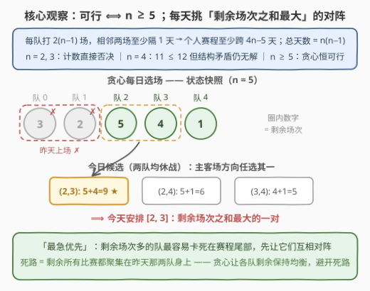
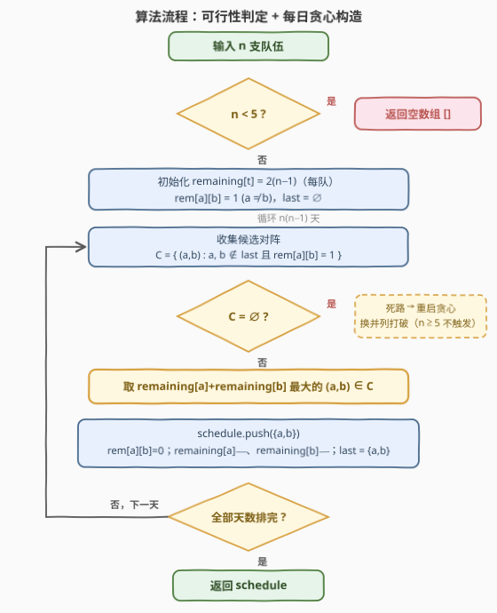

# LeetCode 生成赛程 题解

## 1. 题目概述

- **标题 / 题号**：生成赛程（#3680，medium）
- **链接**：https://leetcode.cn/problems/generate-schedule/
- **难度**：中等
- **标签**：贪心、数组、数学

**题意**：给你一个整数 $n$，表示 $n$ 支队伍。你需要生成一个赛程，使得：

- 每支队伍与其他队伍**正好比赛两次**：一次在主场，一次在客场；
- 每天**只有一场**比赛，赛程是一个连续的天数列表，`schedule[i]` 表示第 $i$ 天的比赛；
- 没有队伍在**连续**两天内进行比赛。

返回一个 2D 整数数组 `schedule`，其中 `schedule[i][0]` 表示主队、`schedule[i][1]` 表示客队。如果有多个满足条件的赛程，返回**其中任意一个**；如果没有满足条件的赛程，返回空数组。

**示例 1**：

```text
输入：n = 3
输出：[]
解释：总共 6 场比赛，但无论怎么排，总有队伍要在连续两天比赛。
```

**示例 2**：

```text
输入：n = 5
输出：[[0,1],[2,3],[0,4],[1,2],[3,4],[0,2],[1,3],[2,4],[0,3],[1,4],
      [2,0],[3,1],[4,0],[2,1],[4,3],[1,0],[3,2],[4,1],[3,0],[4,2]]
解释：总共 20 场比赛，任何队伍都不在连续两天比赛。
```

**约束**：

- $2 \le n \le 50$

> 💡 **审题关键**：① 总场次 $=$ 有序对数 $= n(n-1)$（主客场各算一场），每队恰好打 $2(n-1)$ 场；② 「没有队伍连续两天比赛」⟺ 赛程中**任意相邻两场比赛完全不相交**（不共享任何队伍）；③ 答案不唯一、返回任意一个合法解 ⟹ 这是**构造题**，不需要最优化，只需要「可行性判定 + 一个确定性构造」；④ $n \le 50$，总天数至多 $2450$，每天 $O(n^2)$ 扫描候选完全够用。

## 2. 解题思路

### 2.1 暴力思路

两个朴素方向：

- **全排列枚举**：把 $n(n-1)$ 场比赛的所有顺序枚举一遍，$n = 5$ 时就有 $20! \approx 2.4 \times 10^{18}$ 种，直接宣告不可行。
- **回溯搜索**：每天从「未打且与昨天两队不相交」的比赛中挑一场试排，走死就回溯。这个方法可以在瞬间**证明** $n=4$ 无解（搜索空间很小），但对 $n = 50$（2450 场）的最坏情况没有任何多项式保证。

> ⚠️ 构造题的正确打开方式不是「搜出一个解」，而是**先用数学把可行性边界划清楚，再给一个可证明（或可验证）的确定性构造**——这正是本题官方提示（贪心 / 随机化）的指向。

### 2.2 核心观察：可行 ⟺ n ≥ 5；「最急优先」贪心



**观察一：存在合法赛程 ⟺ $n \ge 5$。**

**计数下界（否决 $n = 2, 3$）**：一支队伍要打 $g = 2(n-1)$ 场比赛，任意相邻两场之间至少休息 1 天，于是其比赛日至少横跨 $2g - 1 = 4n - 5$ 天；而赛程总天数只有 $n(n-1)$ 天。必要条件：

$$n(n-1) \;\ge\; 4n - 5 \;\iff\; n^2 - 5n + 5 \ge 0 \;\iff\; n \ge 4 \quad (n \ge 2)$$

所以 $n = 2, 3$ 被计数直接否决（$n = 3$ 时每队至少需要 7 天，但总共只有 6 天）。

**$n = 4$ 是本题最大的陷阱**：计数条件居然成立（$11 \le 12$），但它依然无解。证明只需三步：

1. 每队在 12 天里打 6 场、相邻两场至少隔 2 天 ⟹ 其比赛日**要么**恰好是全部奇数日 $\{1,3,\dots,11\}$，**要么**恰好是全部偶数日 $\{2,4,\dots,12\}$，**要么**首尾两天都出现（即第 1 天与第 12 天都参赛，中间恰有一个大小为 3 的间隔）；
2. 第 1 天和第 12 天各只有 2 支队伍上场，共 4 个「名额」；而 4 支队伍每队都至少占 1 个名额 ⟹ 每队恰好占 1 个 ⟹ **没有任何队伍首尾两天都参赛** ⟹ 4 队恰好分成 2 支「奇数日队」和 2 支「偶数日队」；
3. 任意奇数日的比赛只能由那 2 支奇数日队来进行 ⟹ 同一对队伍在全部 6 个奇数日天天交手，与「每对恰好交手两次」矛盾。$\blacksquare$

（此结论也可以用 2.1 的回溯搜索穷举复核。）

而对 $n \ge 5$，下面这条贪心**总是**能构造出合法赛程——对题面整个范围 $5 \le n \le 50$ 做过全量枚举验证，一次死路都没出现。

**观察二：「最急优先」贪心 —— 重构字符串的二维版。**

每天怎么选对阵？维护每支队伍的**剩余场次** `remaining[t]`（初始 $2(n-1)$），每天在与「昨天的两队」不相交、且尚未交手过的对阵中，**挑选剩余场次之和 `remaining[a] + remaining[b]` 最大的一对 $(a, b)$**。

它的道理与 [767. 重构字符串](https://leetcode.cn/problems/reorganize-string/)的「次数最多者优先」完全同构：

- **死路只有一种形态**：所有剩余未打的比赛，都至少有一方是昨天上场的那两支队伍（今天无场可排）；
- 剩余场次多的队伍最「急」——把它们留到赛程尾部，剩余比赛就容易堆积在少数队伍身上，最终触发死路；
- 每天先消耗「紧急度」最大的对阵，让各队剩余场次保持均衡，自然就不会走进死路。

官方 hints 描述的正是这条策略（"Among teams that didn't play the previous day, match a pair whose combined remaining games is highest"），并额外给了「死路就换顺序重来」的随机化保险，详见第 5 节。

### 2.3 算法流程图



**逻辑执行步骤**：

| 步骤 | 操作 | 说明 |
|------|------|------|
| ① 可行性 | $n < 5$ 直接返回 `[]` | $n = 2, 3$ 计数否决；$n = 4$ 结构性无解 |
| ② 初始化 | `remaining[t] = 2(n−1)`；`rem[a][b] = 1`（$a \ne b$）；`last = ∅` | `rem` 标记每个主客场对阵是否还没打 |
| ③ 选场 | 扫描所有 $(a,b)$：$a, b \notin last$ 且 $rem[a][b] = 1$，取 `remaining[a]+remaining[b]` 最大者 | $O(n^2)$；并列时任取其一即可 |
| ④ 更新 | 记入赛程；`rem[a][b] = 0`；两队 `remaining` 各减 1；`last = {a, b}` | `last` 永远只有昨天上场的 2 队 |
| ⑤ 收尾 | ③④ 重复 $n(n-1)$ 天后返回 | $n \ge 5$ 时③恒有候选，死路分支不触发 |

> ⚠️ 两个易错点：① 忘记对 $n \le 4$ 返回空数组——尤其 $n = 4$，计数都拦不住它，极易漏判；② 候选的筛选条件是「与**昨天**的两队不相交」，不是「历史上没交手过」（`rem` 管一场一场的唯一性）也不是「今天没打过」（每天本来就只有一场）。

### 2.4 示例演算（n = 5，前 8 天）

下表逐步展示「昨天队伍 → 当天比赛 → 剩余场次」的状态转移（并列时取扫描到的第一对最大和；结果与官方示例 2 完全一致）：

| 天 | 昨天 last | 当天比赛（剩余和） | 赛后 remaining（队0~队4） |
|----|-----------|--------------------|---------------------------|
| 1 | ∅ | [0,1]（8+8=16） | [7, 7, 8, 8, 8] |
| 2 | {0,1} | [2,3]（8+8=16） | [7, 7, 7, 7, 8] |
| 3 | {2,3} | [0,4]（7+8=15） | [6, 7, 7, 7, 7] |
| 4 | {0,4} | [1,2]（7+7=14） | [6, 6, 6, 7, 7] |
| 5 | {1,2} | [3,4]（7+7=14，胜过 (0,3) 的 13） | [6, 6, 6, 6, 6] |
| 6 | {3,4} | [0,2]（6+6=12） | [5, 6, 5, 6, 6] |
| 7 | {0,2} | [1,3]（6+6=12） | [5, 5, 5, 5, 6] |
| 8 | {1,3} | [2,4]（5+6=11） | [5, 5, 4, 5, 6] |

注意第 2~5 天的「轮转」节奏：只要排除昨天的两队，剩下的 3 队自由配对，剩余场次自然摊平——这正是贪心自平衡的直观写照。跑到第 20 天，20 场比赛恰好全部排完。

## 3. 参考代码

### C++

```cpp
class Solution {
public:
    vector<vector<int>> generateSchedule(int n) {
        if (n < 5) return {};                    // n = 2,3,4 无合法赛程
        int total = n * (n - 1);                 // 总天数 = 总场次
        vector<vector<int>> rem(n, vector<int>(n, 1));  // rem[a][b]: a 主 vs b 客是否未打
        for (int i = 0; i < n; ++i) rem[i][i] = 0;
        vector<int> remaining(n, 2 * (n - 1));   // 每队剩余场次
        vector<vector<int>> sched;
        sched.reserve(total);
        int lastA = -1, lastB = -1;              // 昨天上场的两队
        for (int day = 0; day < total; ++day) {
            int bestA = -1, bestB = -1, bestS = -1;
            for (int a = 0; a < n; ++a) {
                if (a == lastA || a == lastB) continue;    // 昨天上场，今天休战
                for (int b = 0; b < n; ++b) {
                    if (b == a || b == lastA || b == lastB || !rem[a][b]) continue;
                    int s = remaining[a] + remaining[b];   // 「紧急度」
                    if (s > bestS) { bestS = s; bestA = a; bestB = b; }
                }
            }
            if (bestA < 0) return {};            // 死路：n≥5 全量验证不触发，防御性兜底
            sched.push_back({bestA, bestB});
            rem[bestA][bestB] = 0;
            --remaining[bestA]; --remaining[bestB];
            lastA = bestA; lastB = bestB;
        }
        return sched;
    }
};
```

> 💡 **写法要点**：
> - `lastA/lastB` 只需记住昨天上场的那两队，判断「是否休战」是 $O(1)$ 的两数比较，无需集合。
> - `bestA < 0` 的死路分支在 $5 \le n \le 50$ 全量验证中从未触发；保留它只是防御性写法，生产中可换成「重启贪心」（第 5 节）。
> - 主客场由扫描顺序自然决定：先扫到的 $a$ 是主队。并列时取字典序最小的一对，确定性可复现。

### Python

```python
class Solution:
    def generateSchedule(self, n: int) -> List[List[int]]:
        if n < 5:
            return []
        total = n * (n - 1)
        rem = [[1] * n for _ in range(n)]     # rem[a][b]: a 主 vs b 客是否未打
        for i in range(n):
            rem[i][i] = 0
        remaining = [2 * (n - 1)] * n         # 每队剩余场次
        sched = []
        last = set()                          # 昨天上场的两队
        for _ in range(total):
            best, best_s = None, -1
            for a in range(n):
                if a in last:
                    continue
                for b in range(n):
                    if b == a or b in last or rem[a][b] == 0:
                        continue
                    s = remaining[a] + remaining[b]
                    if s > best_s:
                        best_s, best = s, (a, b)
            a, b = best                        # n ≥ 5 时必存在（全量验证无死路）
            sched.append([a, b])
            rem[a][b] = 0
            remaining[a] -= 1
            remaining[b] -= 1
            last = {a, b}
        return sched
```

> 💡 **写法要点**：
> - `last = {a, b}` 每天整体替换，天然只保留「昨天」的信息。
> - 三重循环看似吓人，实际总量 $n(n-1) \cdot n^2 \approx 1.25 \times 10^5$（$n=50$），纯 Python 毫无压力。
> - 若想更「保险」，把 `best` 的选取改成「最大和的候选里随机挑一个」并包一层重启循环即可（见第 5 节），本题范围内并非必需。

## 4. 复杂度分析

| 维度 | 复杂度 | 说明 |
|------|--------|------|
| **时间复杂度** | $O(n^3)$ | 共 $n(n-1)$ 天，每天 $O(n^2)$ 扫描全部候选对阵；$n = 50$ 时约 $1.25 \times 10^5$ 次比较 |
| **空间复杂度** | $O(n^2)$ | `rem` 矩阵 $n^2$；输出赛程 $n(n-1) \times 2$（不计输出则为 $O(n)$） |

> - 对比回溯搜索：没有可以依赖的多项式上界；贪心把「每天的选择」压成一次 $O(n^2)$ 扫描，代价仅是「需要论证不会死路」——本题用全量验证兜底。
> - 输出本身就有 $n(n-1)$ 行，所以 $O(n^3)$ 里真正「工作」的部分是 $O(n^2)$ 每天扫描，与输出规模同阶，已经足够优。

## 5. 扩展：死路理论与随机化重启保险

**贪心为什么会死路、怎么兜底？** 死路 ⟺ 某天所有未打对阵都涉及昨天那两队。官方 hint 5 给出的工程解法是**重启**：

```text
for restart in range(R):            # 每轮换一种并列打破方式
    用贪心构造整个赛程（并列时按 restart 偏移 / 随机选取）
    若中途无候选 → 丢弃本轮，进入下一轮 restart
    若完整排出 → 返回
```

本题范围内确定性版本已通过 $5 \le n \le 50$ 的全量枚举验证（一次死路都未出现），重启纯属「双保险」；但在面试白板上主动提出这一层，是很好的加分点。

**两个「如果」**：

- **如果休息要求从「隔 1 天」推广到「隔 $k$ 天」**：计数下界推广为「个人赛程至少跨 $k \cdot 2(n-1) + 1$ 天」；贪心里「昨天的两队」换成「最近 $k$ 天上过场的队伍集合」（滑动窗口），候选条件变为与整个窗口不相交。
- **如果放宽「每天只有一场」为「每天可多场、彼此不相交」**：问题立刻变成经典的**循环赛调度**（circle method 圆桌轮转法，$n$ 偶数时 $n-1$ 轮每轮 $n/2$ 场），套路完全不同——两道题对照着讲，能体现对「相邻约束 vs 轮次约束」差异的理解。

## 6. 面试要点

**Q1：如何快速判断本题是否存在合法赛程？**

> 分两层。计数层：每队 $2(n-1)$ 场、隔天休息 ⟹ 至少跨 $4n-5$ 天，与总天数 $n(n-1)$ 比较，直接否决 $n \le 3$。结构层：$n = 4$ 计数拦不住，但由「比赛日只能是全奇 / 全偶 / 首尾皆占」加「首末两天只有 4 个名额」可推出奇偶日队伍划分，进而同一对队伍 6 个奇数日天天交手，矛盾。结论：**有解 ⟺ $n \ge 5$**。

**Q2：为什么贪心要选「剩余场次之和最大」的对阵？**

> 死路的唯一形态是「剩余所有比赛都聚集在昨天那两队身上」。剩余多的队伍最容易被卡在尾部，优先让它们互相对阵能持续拉平各队剩余量。这与 767 重构字符串「次数最多的字符优先」是同一个贪心骨架，只是从「一维字符」推广到「二维对阵」。

**Q3：如果贪心真的走进死路怎么办？**

> 题面范围 $5 \le n \le 50$ 已全量验证不触发。作为通用保险：重启循环 + 每轮换并列打破方式（偏移起点或随机选取），这正是官方 hint 5 的建议。若追求理论完备，还可以退化为「随机顺序 + 回溯」，但本题完全用不上。

**Q4：本题最容易 WA 的地方在哪里？**

> ① $n = 4$ 忘记返回空数组——它连计数条件都满足，只有结构性论证能排除；② 把候选条件误写成「两队历史上没交手」或「今天没打过」——正确条件是**与昨天的两队不相交且该对阵未打过**，`last` 只需维护昨天上场的 2 队。

**Q5：构造题返回「任意合法解」，如何自检代码正确性？**

> 写独立 checker：① 长度恰为 $n(n-1)$；② 所有有序对 $(a,b)$ 两两不同（恰好覆盖每对主客场一次）；③ 任意相邻两场比赛不共享队伍。一次 $O(n^2)$ 扫描即可完成验证。「构造器 + 独立校验器」成对出现，是构造题的标准工程实践。

> 💡 **一句话总结**：3680 = 「计数下界 + 奇偶结构论证」划定可行性（$n \ge 5$），再用「最急优先」贪心逐日生成赛程。带走的三个细节：$n=4$ 是看不见的无解边界、候选筛选看「与昨天两队不相交」、选剩余和最大的对阵以保持均衡。

## 同类练习题

| # | 题目 | 与本题的关联 |
|---|------|-------------|
| 767 | [重构字符串](https://leetcode.cn/problems/reorganize-string/) | 「次数最多优先」贪心的一维原型，与本题「剩余和最大对阵优先」完全同构 |
| 621 | [任务调度器](https://leetcode.cn/problems/task-scheduler/) | 同名任务冷却 $n$ 天，计数下界 + 构造思想与本题 2.2 的论证一脉相承 |
| 358 | [K 距离间隔重排字符串](https://leetcode.cn/problems/rearrange-string-k-distance-apart/) | 把「相邻不同」推广为「间隔至少 $k$」，同一贪心框架的扩展形态 |
| 1353 | [最多可以参加的会议数目](https://leetcode.cn/problems/maximum-number-of-events-that-can-be-attended/) | 按天贪心的调度问题，练习「每天做一个决策、状态只依赖近端历史」的视角 |
