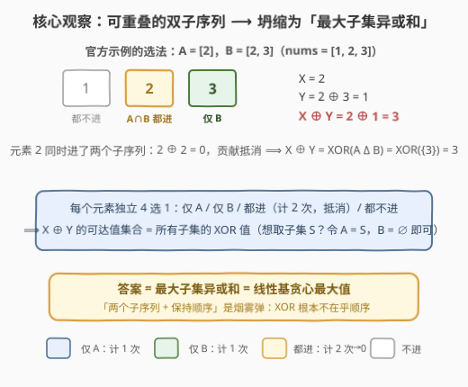
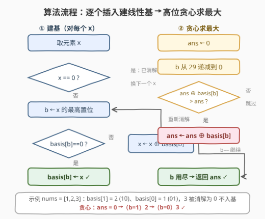

# 子序列最大 XOR 值

- **题目名称**：子序列最大 XOR 值
- **链接**：[3681. Maximum XOR of Subsequences](https://leetcode.cn/problems/maximum-xor-of-subsequences/)
- **难度**：困难
- **标签**：贪心、位运算、数组、数学

## 1. 题目概述

给你一个长度为 $n$ 的整数数组 `nums`，其中每个元素都是**非负整数**。

选择**两个** `nums` 的子序列（它们可以为空，并且**允许重叠**），每个子序列保持原始元素顺序。定义：

- $X$ 为第一个子序列中所有元素的按位 XOR；
- $Y$ 为第二个子序列中所有元素的按位 XOR。

返回 $X \oplus Y$ 的**最大值**。

**示例 1**：

```text
输入：nums = [1,2,3]
输出：3
解释：取第一个子序列 [2]（X = 2），第二个子序列 [2,3]（Y = 2⊕3 = 1），
X ⊕ Y = 2 ⊕ 1 = 3，是所有选法中的最大值。
```

**示例 2**：

```text
输入：nums = [5,2]
输出：7
解释：取第一个子序列 [5]（X = 5），第二个子序列 [2]（Y = 2），X ⊕ Y = 7。
```

**约束条件**：

- $2 \le \text{nums.length} \le 10^5$
- $0 \le \text{nums[i]} \le 10^9$

> 💡 **审题关键**：① XOR 满足交换律与结合律，**子序列的「保持顺序」对 XOR 毫无影响**——子序列退化为子集；② 两个子序列**独立选取且允许重叠**，因此每个元素有 4 种归属：仅进第一个 / 仅进第二个 / 两个都进 / 都不进；③ 「两个都进」的元素在 $X \oplus Y$ 中出现两次，$a \oplus a = 0$ **贡献抵消**；④ $n$ 到 $10^5$，任何 $O(2^n)$ 的子集枚举都不可行，需要线性代数视角（线性基）。

---

## 2. 解题思路

### 2.1 暴力思路：枚举每个元素的归属

最直接的暴力：每个元素独立地 4 选 1（仅 A / 仅 B / 都进 / 都不进），共 $4^n$ 种组合，对每种组合算一次 $X \oplus Y$ 取最大——$n \ge 17$ 就爆了。

即便看穿了「重叠抵消」、把问题降维成「任选一个子集求最大异或和」，朴素枚举仍是 $O(2^n)$：对 $10^5$ 个数完全不可行。而「最大子集异或和」是一个有百年历史的经典问题，标准武器是**线性基**（linear basis，即异或空间的高斯消元）。

> ⚠️ 本题最大的陷阱在题面：**「两个子序列」「保持原始顺序」全是烟雾弹**。很容易被带偏去设计 $O(n^2)$ 的子序列 DP 或者分情况讨论两个子序列的关系——但 XOR 的交换律 + 抵消律会把整个二维设置压扁成一个一维的子集问题（下一节严格论证）。

### 2.2 核心观察：X ⊕ Y = XOR(A Δ B) ⟹ 最大子集异或和



**观察一：顺序无关。** XOR 交换律、结合律保证一组数的异或值与排列顺序无关，所以「子序列」在本题语境下就是「子集」——下文直接用集合语言，记两个子序列对应的下标集合为 $A$、$B$。

**观察二：$X \oplus Y = \text{XOR}(A \,\Delta\, B)$。** 把 $X \oplus Y$ 展开到元素级别：落在 $A \cap B$ 中的元素贡献两次、相互抵消；落在对称差 $A \Delta B = (A \setminus B) \cup (B \setminus A)$ 中的元素恰好贡献一次。于是

$$X \oplus Y = \bigoplus_{i \in A \Delta B} \text{nums}[i]$$

官方示例正是活教材：$A = \{2\}$、$B = \{2, 3\}$，元素 2 同时进入两个子序列而抵消，$X \oplus Y = 3$ 其实就是单选 $\{3\}$ 的异或值——**「两个子序列」的选法与单个子集完全等价**。

**观察三：可达值集合恰为「所有子集异或值」。** 两个方向夹逼：

- **任意子集可达**：想取子集 $S$？令 $A = S$、$B = \varnothing$（空子序列 XOR 为 0，题目明说允许），则 $X \oplus Y = \text{XOR}(S)$；
- **不会超出子集范围**：任何 $(A, B)$ 组合的 $X \oplus Y$ 都等于某个子集（即 $A \Delta B$）的异或值。

$$\therefore \quad \text{ans} = \max_{S \subseteq \{1..n\}} \; \bigoplus_{i \in S} \text{nums}[i]$$

**这个「最大子集异或和」怎么求？——线性基：**

维护数组 `basis[b]`：**若非零，则其最高置位恰为第 $b$ 位**。它满足两条不变量：

1. **最高位互异**：不同的 $b$ 对应的基向量最高位不同，因此基中至多有 30 个非零向量（$10^9 < 2^{30}$）；
2. **张成不变**：任意时刻，基中向量的全部子集异或值构成的集合 = 已插入元素的全部子集异或值构成的集合。

- **插入 $x$**：从 $x$ 的最高置位 $b$ 开始考察。若 `basis[b]` 为空则放入、结束；否则 $x \leftarrow x \oplus \text{basis}[b]$（消去第 $b$ 位，最高位严格下降），继续。若 $x$ 变为 0，说明 $x$ 已能被现有基线性表出，无需入基。
- **求最大**：$ans \leftarrow 0$，从 $b = 29$ 到 $0$ 逐位贪心：若 $ans \oplus \text{basis}[b] > ans$ 则异或之。正确性：`basis[b]` 的最高位恰是 $b$，$ans \oplus \text{basis}[b] > ans$ 当且仅当 $ans$ 的第 $b$ 位为 0——异或后第 $b$ 位翻成 1 且**所有高于 $b$ 的位不变**，即「在不动高位的前提下白赚一个 1」，高位优先的贪心天然正确。

> 💡 一句话：本题 = 「对称差抵消」看穿题面 + 线性基求最大子集异或和。$4^{10^5}$ 的归属枚举，坍缩成 $30$ 维空间里的高斯消元。

### 2.3 算法流程图



**逻辑执行步骤**：

| 步骤 | 操作 | 说明 |
|------|------|------|
| ① 建基 | 对每个 $x$：取最高置位 $b$；`basis[b]==0` 则放入，否则 $x \oplus= \text{basis}[b]$ 后重复 | 每消解一次最高位严格下降，单次插入至多 30 轮 |
| ② 贪心 | $ans = 0$；$b$ 从 29 到 0：若 $ans \oplus \text{basis}[b] > ans$ 则 $ans \oplus= \text{basis}[b]$ | 高位优先，每步「白赚一个 1」且不动高位 |
| ③ 返回 | `ans` | 即全体元素张成的异或空间中的最大值 |

> ⚠️ 两处易错：① 插入时要用 $x$ **当前**的最高置位（异或消解后最高位会变），不要缓存初始值；② 判断「能否变大了」必须用大小比较 `>` 而不是判 `basis[b]` 非零就无脑异或——若 $ans$ 第 $b$ 位已是 1，再异或 `basis[b]` 反而会把它清 0、变小。

### 2.4 示例演算（示例 1：nums = [1,2,3]）

**建基**（二进制：1 = `01`，2 = `10`，3 = `11`）：

| 插入 | 过程 | 基状态 |
|------|------|--------|
| 1 | 最高位 $b=0$，`basis[0]` 空 → 放入 | `basis[0] = 1` |
| 2 | 最高位 $b=1$，`basis[1]` 空 → 放入 | `basis[1] = 2` |
| 3 | $b=1$ 非空 → $3 \oplus 2 = 1$；$b=0$ 非空 → $1 \oplus 1 = 0$，**消解完毕，不入基** | 不变 |

**贪心求最大**：

| 位 $b$ | basis[b] | $ans \oplus \text{basis}[b]$ | 比较 | 动作后 $ans$ |
|--------|----------|------------------------------|------|--------------|
| 1 | 2 | $0 \oplus 2 = 2$ | $> 0$ ✓ | 2 |
| 0 | 1 | $2 \oplus 1 = 3$ | $> 2$ ✓ | **3** |

**答案 = 3**，与示例一致——对应的子集是 $\{3\}$（也即官方选法中两个子序列抵消掉公共元素 2 之后剩下的对称差）。

---

## 3. 参考代码

### C++

```cpp
class Solution {
public:
    int maxXorSubsequences(vector<int>& nums) {
        int basis[30] = {};                          // nums[i] ≤ 1e9 < 2^30
        for (int x : nums) {
            while (x) {
                int b = 31 - __builtin_clz(x);       // x 当前最高置位
                if (!basis[b]) { basis[b] = x; break; }
                x ^= basis[b];                       // 消去最高位，b 严格下降
            }
        }
        int ans = 0;
        for (int b = 29; b >= 0; --b)
            if ((ans ^ basis[b]) > ans)              // 白赚一个第 b 位的 1
                ans ^= basis[b];
        return ans;
    }
};
```

> 💡 **写法要点**：
> - `__builtin_clz(x)` 求 $x$ 前导零个数，`31 - clz(x)` 即最高置位下标；$x = 0$ 时循环体不进入，无未定义行为。
> - 插入内层 `while` 每轮最高位严格下降，均摊 $O(30)$；总时间 $O(30n) \approx 3 \times 10^6$。
> - 值域上界 $10^9 < 2^{30}$，30 个基向量足矣；若值域升至 $2^{63}$ 只需把数组开到 63 并改用 `unsigned long long`。

### Python

```python
class Solution:
    def maxXorSubsequences(self, nums: List[int]) -> int:
        B = 30                                       # nums[i] ≤ 1e9 < 2^30
        basis = [0] * B
        for x in nums:
            while x:
                b = x.bit_length() - 1               # x 当前最高置位
                if basis[b] == 0:
                    basis[b] = x
                    break
                x ^= basis[b]                        # 消去最高位，b 严格下降

        ans = 0
        for b in range(B - 1, -1, -1):
            if ans ^ basis[b] > ans:                 # 白赚一个第 b 位的 1
                ans ^= basis[b]
        return ans
```

> 💡 **写法要点**：
> - `x.bit_length() - 1` 一步取最高置位，等价于 C++ 的 `31 - __builtin_clz(x)`。
> - 基建好后 `basis` 中非零位即异或空间的「主元位」，贪心最多 30 步；整体 $O(30n) \approx 3 \times 10^6$ 次整数运算，纯 Python 轻松通过。
> - `0` 永远不会入基（`while x` 直接跳过），因此重复元素、零元素无需任何特判。

---

## 4. 复杂度分析

| 维度 | 复杂度 | 说明 |
|------|--------|------|
| **时间复杂度** | $O(n \cdot B + B)$，$B = 30$ | 建基 $n$ 次插入、每次至多 $B$ 轮消解；贪心 $B$ 步；总计约 $3 \times 10^6$ |
| **空间复杂度** | $O(B)$ | 基数组仅 30 个整数，与 $n$ 无关 |

> - 对比暴力 $O(4^n)$ / 子集枚举 $O(2^n)$：线性基的本质是**高斯消元**——$10^5$ 个向量张成的异或空间秩至多 30，消元后只需维护 30 个主元。
> - 「秩 ≤ 位宽」是线性基一切高效性的根源：无论 $n$ 多大，有意义的信息量被 30 位空间封顶。

---

## 5. 扩展：线性基的常用形态与本题变体

**线性基是一个「工具箱」，本题只用了两个接口。** 其余常用接口：

- **判定 $x$ 能否被表出**：对 $x$ 跑一遍插入流程，最终被消解为 0 即可表出；
- **最小非零子集异或和**：把基再做一轮「列消元」（让每个主元位只出现在自己的基向量中，即行简化阶梯形）后，**主元位最低的基向量**就是最小值；若原数组线性相关（存在非空子集异或为 0），最小值直接为 0；
- **第 $k$ 小异或值**：列消元后按 $k$ 的二进制位拼装基向量即可。

**带时间戳的前缀线性基**：边插边记录每个基向量的「插入时间」，查询 $[l, r]$ 区间内任取子集的最大异或时只认时间戳 $\ge l$ 的基向量——[1707 题](https://leetcode.cn/problems/maximum-xor-with-an-element-from-array/)的可持久化 Trie 也可以用它做。

**本题的两个「如果」**：

- **如果两个子序列不允许重叠？** 答案不变。不重叠时 $X \oplus Y = \text{XOR}(A \cup B)$，仍可取 $B = \varnothing$ 令 $A = S$ 达成任意子集；反之任何 $(A, B)$ 的并仍是子集——可达集合与原来完全一致。
- **如果要求两个子序列都非空？** 答案依旧不变（$n \ge 2$ 时）：目标 $T = \text{XOR}(S)$ 非空时取 $t \notin S$、$A = S \cup \{t\}$、$B = \{t\}$，则 $X \oplus Y = T \oplus t \oplus t = T$；若 $S$ 已是全集，拆成 $A = S \setminus \{s\}$、$B = \{s\}$ 同样得 $T$；目标为 0 时取 $A = B = \{$ 同一个元素 $\}$。换句话说，**只要允许重叠，「非空」约束形同虚设**。

---

## 6. 面试要点

**Q1：为什么「两个子序列」的设置可以坍缩成「一个子集」？**

> 双向夹逼。上界方向：$X \oplus Y = \text{XOR}(A \Delta B)$，重叠元素贡献两次抵消，所以任何选法的 $X \oplus Y$ 都是某个子集的异或值；可达方向：想达成任意子集 $S$，令 $A = S$、$B = \varnothing$ 即可（空子序列 XOR 为 0、重叠合法）。可达集合恰好等于全体子集异或值集合，答案即最大子集异或和。

**Q2：线性基插入操作为什么是正确的？**

> 关键不变量：**张成空间不变**。插入 $x$ 时，若 `basis[b]` 非空就做 $x \oplus= \text{basis}[b]$——这一步只是用旧基表出 $x$ 的一部分，$x$ 的新旧取值张成的空间完全相同；若 `basis[b]` 为空则放入 $x$，它对空间的贡献恰好补上「最高位 $b$ 缺主元」的洞。归纳可得任意时刻基的张成 = 已插入元素的子集异或集合。

**Q3：高位贪心为什么能得到最大值？比较大小为什么就够？**

> 消元后的基满足「`basis[b]` 的最高位恰为 $b$」。于是 $ans \oplus \text{basis}[b] > ans$ 当且仅当 $ans$ 的第 $b$ 位是 0，且异或后第 $b$ 位变 1、**所有高于 $b$ 的位保持不变**——每一步都是「不动已敲定的高位、白赚一个新高位」。按 $b$ 从高到低过一遍，每一位都取到力所能及的最优，与「二进制比较即字典序」一致，贪心得证。

**Q4：为什么基至多 30 个向量？这决定了什么复杂度？**

> 基向量的最高置位两两不同（插入算法保证），而值 $< 2^{30}$ 只有 30 个可能的最高位，故秩 $\le 30$。它决定：建基 $O(30n)$、贪心 $O(30)$、空间 $O(30)$——$n = 10^5$ 也只需约 $3 \times 10^6$ 次位运算。

**Q5：线性基和 01-Trie 都能处理异或最值，怎么选？**

> 看选择自由度：「**任选若干个数**异或」是子集问题，用线性基（秩 ≤ 位宽，天然压缩）；「**给定查询值 $x$，与数组中恰好一个元素**配对异或最大」是查询问题，用 01-Trie（沿 $x$ 的补码路径走，如 [421 题](https://leetcode.cn/problems/maximum-xor-of-two-numbers-in-an-array/)）。而「$x$ 与任选子集异或最大」线性基一条贪心就能答——本题正是这一纯粹形态。

> 💡 **一句话总结**：3681 = 「重叠抵消 ⟹ 对称差 ⟹ 任意子集」的看穿 + 线性基贪心最大值。带走的三个细节：插入要用当前最高位、贪心判断用大小比较而非盲异或、秩 ≤ 位宽封顶了一切复杂度。

---

## 7. 同类练习题

- [421. 数组中两个数的最大异或值](https://leetcode.cn/problems/maximum-xor-of-two-numbers-in-an-array/)：「恰好选两个数」的最大异或，01-Trie / 逐位贪心的代表，与本题「任选子集」的线性基互为镜像
- [1707. 与数组中元素的最大异或值](https://leetcode.cn/problems/maximum-xor-with-an-element-from-array/)：带查询的最大异或，可持久化 Trie 或前缀线性基（时间戳）两种姿势都值得练
- [1310. 子数组异或查询](https://leetcode.cn/problems/xor-queries-of-a-subarray/)：前缀异或 + $a \oplus a = 0$ 抵消思想的最直接运用，正是本题「重叠抵消」的近亲
- [1734. 解码异或后的排列](https://leetcode.cn/problems/decode-xored-permutation/)：利用全体异或的抵消技巧反推原数组，抵消律的另一种玩法
