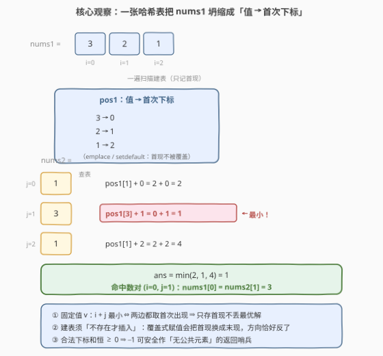
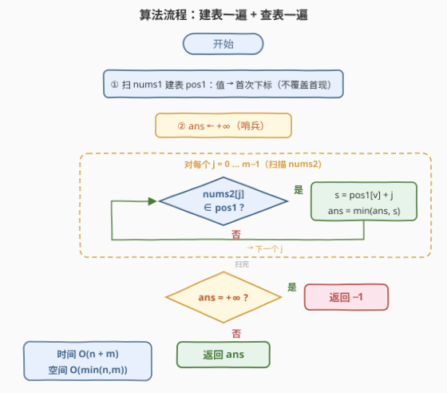

# 公共元素的最小索引和

- **题目名称**：公共元素的最小索引和
- **链接**：[3682. 公共元素的最小索引和](https://leetcode.cn/problems/minimum-index-sum-of-common-elements/)
- **难度**：中等
- **标签**：数组、哈希表

## 1. 题目概述

> ⚠️ 本题为 LeetCode 付费题（Plus 会员专享），题意描述根据官方示例用例与 hints 重建，可能与官方题面有出入。

**题意**：给定两个整数数组 `nums1` 与 `nums2`。若 $\mathrm{nums1}[i] = \mathrm{nums2}[j]$，称 $(i, j)$ 为一对**公共元素匹配**。求所有匹配中 $i + j$ 的**最小值**；若两数组没有公共元素，返回 $-1$（接口按题意推断为 `minIndexSum(nums1, nums2)`，返回 `int`）。

官方 hints 原文（题意重建依据）：

1. Build a hash map `pos1` that stores, for each value in `nums1`, the smallest index where it appears.（建哈希表 `pos1`：`nums1` 的每个值 → 其出现的**最小**下标）
2. Iterate through `nums2`. For each index `j`, if `nums2[j]` exists in `pos1`, compute `pos1[nums2[j]] + j`.（扫描 `nums2`，命中就算 $\mathrm{pos1}[v] + j$）
3. Track the minimum index sum across all such matches.（跟踪所有命中的最小下标和）
4. If no common element is found, return `-1`.（无公共元素返回 $-1$）

**示例 1**：

```text
输入：nums1 = [3,2,1], nums2 = [1,3,1]
输出：1
解释：公共值 3 命中数对 (i=0, j=1)，0+1=1；公共值 1 命中数对 (i=2, j=0)，2+0=2。
      最小下标和为 1。
```

**示例 2**：

```text
输入：nums1 = [5,1,2], nums2 = [2,1,3]
输出：2
解释：值 2 命中 (i=2, j=0)，2+0=2；值 1 命中 (i=1, j=1)，1+1=2；值 5 无匹配。
      最小下标和为 2（两个公共值并列最小，返回和则并列无影响）。
```

**示例 3**：

```text
输入：nums1 = [6,4], nums2 = [7,8]
输出：-1
解释：两数组无公共元素，返回 -1。
```

**约束条件**（官方约束未公开，按同类题与 hints 口径推测）：

- $1 \le n, m \le 10^5$
- 数组元素为 32 位整数，且**可能含重复值**（hint 1 特意强调"最小下标"，示例 1 中 `nums2 = [1,3,1]` 亦重复）

> 💡 **审题关键**：① 求的是**下标和的最小值**，不是公共元素本身；② 两数组都可能有**重复值**——同一值的多次出现里只有首现有用；③ 无公共元素返回 $-1$，而合法下标和恒 $\ge 0$，哨兵不冲突；④ 数组无序、值域是 32 位整数——计数排序没戏，比较排序又丢下标信息，$O(n+m)$ 的哈希是唯一抓手。

---

## 2. 解题思路

### 2.1 暴力思路：枚举全部数对

双重循环枚举所有 $(i, j)$，$\mathrm{nums1}[i] = \mathrm{nums2}[j]$ 时更新最小和——$O(nm)$，$n = m = 10^5$ 时 $10^{10}$ 次比较，必然超时。

浪费在哪？**同一个值 $v$ 的所有匹配共享同一个"最优姿势"**：对固定的 $v$，$i + j$ 取最小当且仅当 $i$、$j$ 都取 $v$ 的**首次出现下标**。暴力把同一个值的不同出现当成不同候选反复比较，其实每个值只需看一次。

### 2.2 核心观察：值 → 首现下标，一张哈希表坍缩一个数组



把「枚举数对」换成「枚举值」：

$$\min_{\mathrm{nums1}[i]=\mathrm{nums2}[j]} (i+j) \;=\; \min_{v \in \text{公共值}} \bigl(\mathrm{first}_1(v) + \mathrm{first}_2(v)\bigr)$$

两个方向各一句话证**相等**：

- **算法最小值 ≥ 真答案**：算法取的每个候选 $\mathrm{pos1}[v] + j$ 本身就对应一个合法匹配 $(\mathrm{pos1}[v],\ j)$，而真答案是**全部**合法匹配的最小值；
- **算法最小值 ≤ 真答案**：设最优匹配 $(i^*, j^*)$，其值 $v^*$ 满足 $\mathrm{pos1}[v^*] \le i^*$，扫描到 $j^*$ 时必产生候选 $\mathrm{pos1}[v^*] + j^* \le i^* + j^*$。

于是**只需一张表**：`pos1` 记录 `nums1` 每个值的首次下标（$O(n)$ 空间），再扫一遍 `nums2` 逐位查表即可。`nums2` 侧无须建表——扫描天然覆盖它的每个下标 $j$，重复值自动被 `min` 淘汰。

> ⚠️ **建表必须"不存在才插入"**：C++ `pos1[v] = i`（`operator[]` 赋值）与 Python `pos1[v] = i` 在顺序扫描时会**覆盖成最后一次出现**——方向恰好反了（`[7,7]` 配 `[7]` 会算出 1 而非 0）。C++ 用 `emplace`、Python 用 `setdefault`（或先判 `in`）才保住首现。

### 2.3 算法流程：建表一遍 + 查表一遍



| 步骤 | 操作 | 说明 |
|------|------|------|
| ① 建表 | 顺序扫 `nums1`，`pos1.emplace(v, i)` | 已存在不覆盖 ⇒ 每个值留下最小下标 |
| ② 初始化 | `ans = INT_MAX`（哨兵） | 表示"尚未命中任何公共元素" |
| ③ 查表 | 顺序扫 `nums2`，命中则 `ans = min(ans, pos1[v] + j)` | 每个下标 $j$ 都被检查，重复值自动被 `min` 淘汰 |
| ④ 收尾 | `ans` 仍是哨兵则返回 `-1`，否则返回 `ans` | 下标和恒 $\ge 0$，哨兵不与合法答案冲突 |

> 💡 **空间再省一半**：哪边建表都行——对**较短**的数组建表、扫较长的那边，空间降到 $O(\min(n, m))$，逻辑完全对称。

### 2.4 示例演算

**示例 1：`nums1 = [3,2,1]`，`nums2 = [1,3,1]`**

- 建表：`pos1 = {3:0, 2:1, 1:2}`；
- 查表：`j=0` 值 1 → $2+0=2$；`j=1` 值 3 → $0+1=1$ ✓；`j=2` 值 1 → $2+2=4$；
- `ans = min(2, 1, 4) = 1`——值 1 在 `nums2` 中出现两次，第二次（和为 4）被 `min` 自然淘汰，无须特判。

**示例 2：`nums1 = [5,1,2]`，`nums2 = [2,1,3]`**

- 建表：`pos1 = {5:0, 1:1, 2:2}`；查表：值 2 → $2+0=2$，值 1 → $1+1=2$，值 3 未命中；
- `ans = 2`——两个公共值**并列**最小。本题返回和本身，并列无影响；对照 599（返回并列的全部字符串）则须收集并列答案，见第 5 节。

---

## 3. 参考代码

### C++

```cpp
class Solution {
public:
    int minIndexSum(vector<int>& nums1, vector<int>& nums2) {
        unordered_map<int, int> pos1;                    // 值 → 首次出现下标
        for (int i = 0; i < (int)nums1.size(); ++i)
            pos1.emplace(nums1[i], i);                   // 已存在不覆盖 ⇒ 保首现

        int ans = INT_MAX;                               // 哨兵：尚未命中
        for (int j = 0; j < (int)nums2.size(); ++j) {
            auto it = pos1.find(nums2[j]);
            if (it != pos1.end())
                ans = min(ans, it->second + j);
        }
        return ans == INT_MAX ? -1 : ans;
    }
};
```

### Python

```python
class Solution:
    def minIndexSum(self, nums1: List[int], nums2: List[int]) -> int:
        pos1 = {}
        for i, v in enumerate(nums1):
            pos1.setdefault(v, i)                        # 已存在不覆盖 ⇒ 保首现

        ans = float('inf')
        for j, v in enumerate(nums2):
            if v in pos1:
                ans = min(ans, pos1[v] + j)
        return -1 if ans == float('inf') else ans
```

> 💡 **写法要点**：`emplace` / `setdefault` 是"不存在才插入"的语义，一行完成保首现；若用 `pos1[v] = i` 顺序覆盖，留下的是**末次**下标。哨兵用 `INT_MAX` / `inf`，下标和 $\le 2 \times 10^5$ 绝不会与之混淆，返回前判一次即可。

---

## 4. 复杂度分析

| 维度 | 复杂度 | 说明 |
|------|--------|------|
| **时间复杂度** | $O(n + m)$ | 建表一遍 $O(n)$ + 查表一遍 $O(m)$，哈希操作均摊 $O(1)$ |
| **空间复杂度** | $O(\min(n, m))$ | 对较短数组建表即可（对 `nums1` 建表则是 $O(n)$） |

---

## 5. 扩展：并列答案、返回元素与多数组推广

**变体一：返回元素本身（599 口径）**。[599. 两个列表的最小索引和](https://leetcode.cn/problems/minimum-index-sum-of-two-lists/) 返回的是取得最小下标和的**字符串（可能并列多个）**。改法：命中时按 $s = \mathrm{pos1}[v] + j$ 与 `ans` 三分支——$s < \mathrm{ans}$ 清空答案列表记下元素、$s = \mathrm{ans}$ 追加元素、$s > \mathrm{ans}$ 跳过。本题返回和本身，并列时答案唯一，代码反而更短。

**变体二：两边都建表**。等价写法是对两个数组各建一张首现表，在公共键上求 $\mathrm{first}_1(v) + \mathrm{first}_2(v)$ 的最小值——即 SQL 里 `JOIN` 后 `MIN` 的数组版，两遍扫描的自然推广。

**变体三：k 个数组**。求"在所有数组中都出现、各数组首次下标之和最小"的值：每个数组各建一张首现表，在第一张表的键上过滤出公共键，逐键求和取最小，$O(\sum n_i)$。

**为什么排序 + 双指针不行**：值域 32 位整数无法计数排序；比较排序虽能对齐公共值，但**丢失原始下标**——必须把下标与值捆绑排序，$O(n \log n + m \log m)$ 且代码更长，全面劣于哈希两遍扫描。

---

## 6. 面试要点

**Q1：为什么 pos1 只存首次出现下标就是完备的？**

> 对固定值 $v$，任何匹配 $(i, j)$ 满足 $i + j \ge \mathrm{first}_1(v) + j \ge \mathrm{first}_1(v) + \mathrm{first}_2(v)$——把 $i$ 换成首现、再把 $j$ 换成首现，和只减不增。所以最优解必落在"两边都取首现"的候选里，单表 + 全扫不丢解。

**Q2：nums2 有重复值（如示例 1 的 `[1,3,1]`）需要预处理吗？**

> 不需要。逐位扫描会为同一个值产生多个候选（$2+0=2$ 与 $2+2=4$），`min` 自动淘汰较大者——`nums2` 侧的"首现优先"是被动成立的，无须额外结构。

**Q3：最容易写错的细节是什么？**

> 建表用覆盖式赋值：顺序执行 `pos1[v] = i` 后留下的是**最后一次**下标，"最小索引和"直接偏向"最大索引"。C++ `emplace` / Python `setdefault`（或 `if v not in pos1`）一行修复。

**Q4：为什么可以放心用 −1 当哨兵？**

> 合法答案是最小下标和，$i, j \ge 0$ 恒成立，任何命中答案 $\ge 0$，与 $-1$ 无冲突；这也解释了题面选 $-1$ 而非 $0$ 作失败返回值——$0$ 本身是可达答案（两数组首元素即相等）。

**Q5：和两数之和（1 题）的哈希用法有何异同？**

> 同：都是"值 → 下标"哈希表 + 一遍扫描查表。异：1 题在同一数组内查**补数**（$\mathrm{target} - v$），查到即返回；本题跨两个数组查**相等值**，且要维护**最小和**而非找到即停——一个是存在性问题，一个是最优化问题。

> 💡 **一句话总结**：3682 = 枚举值不枚举对（首现坍缩）+ `emplace`/`setdefault` 保首现的一张哈希表 + 建表查表两遍扫描取 `min`，无命中回 $-1$。

---

## 7. 同类练习题

- [599. 两个列表的最小索引和](https://leetcode.cn/problems/minimum-index-sum-of-two-lists/)：本题的字符串版，须返回并列的全部答案——对照"返回和"与"返回元素"两种口径
- [350. 两个数组的交集 II](https://leetcode.cn/problems/intersection-of-two-arrays-ii/)：同为两数组公共元素，哈希计数（频次抵扣）版，无下标维度
- [1. 两数之和](https://leetcode.cn/problems/two-sum/)："值 → 下标"哈希的鼻祖题，查补数即返回 vs 本题查相等值取最小
- [219. 存在重复元素 II](https://leetcode.cn/problems/contains-duplicate-ii/)：值 → 最近下标哈希，判同值下标距离 ≤ k——同款"下标进哈希"姿势
- [1213. 三个有序数组的交集](https://leetcode.cn/problems/intersection-of-three-sorted-arrays/)：多数组公共元素的推广（有序版三指针），对应第 5 节变体三
