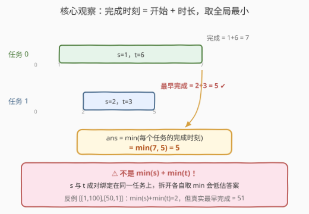
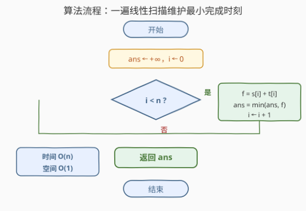

# LeetCode 完成一个任务的最早时间 题解

## 1. 题目概述

- **标题 / 题号**：完成一个任务的最早时间（#3683，easy）
- **链接**：https://leetcode.cn/problems/earliest-time-to-finish-one-task/
- **难度**：简单
- **标签**：数组

**题意**：给你一个二维整数数组 `tasks`，其中 `tasks[i] = [si, ti]`：

- 任务 $i$ 的**开始时间**为 $s_i$；
- 完成该任务需要 $t_i$ 个时间单位。

也就是说，任务 $i$ 从时刻 $s_i$ 开始执行，并在时刻 $s_i + t_i$ 完成。返回**至少完成一个任务**的最早时间。

**示例 1**：

```text
输入：tasks = [[1,6],[2,3]]
输出：5
解释：任务 0 在 1 + 6 = 7 时完成，任务 1 在 2 + 3 = 5 时完成，最早为 5。
```

**示例 2**：

```text
输入：tasks = [[100,100],[100,100],[100,100]]
输出：200
解释：三个任务都在 100 + 100 = 200 时完成。
```

**约束**：

- $1 \le \text{tasks.length} \le 100$
- $1 \le s_i, t_i \le 100$

> 💡 **审题关键**：① 任务的开始时刻 $s_i$ 是**给定且固定**的，不存在「推迟开始」的决策（对比 [3633](https://leetcode.cn/problems/earliest-finish-time-for-land-and-water-rides-i/) 中设施可推迟开始），因此每个任务的完成时刻**唯一确定**为 $s_i + t_i$；②「至少完成一个」=「任意一个任务的完成时刻」，取**全局最小**即可。

## 2. 解题思路

### 2.1 暴力思路：逐时刻模拟或排序取首

最朴素的两种做法：

1. **逐时刻模拟**：让时间 $t$ 从 1 开始一格格推进，每步检查是否有任务恰好在 $t$ 完成，时间 $O\big(\max(s_i + t_i) \cdot n\big)$；
2. **算出所有完成时刻再排序**：先求 `finish[i] = s[i] + t[i]`，排序后取首元素，时间 $O(n \log n)$。

本题 $n \le 100$ 两种做法都能过，但都未触及问题本质：**答案只依赖每个任务的完成时刻，而完成时刻一遍就能算出来**——排序是为了取最小值付出的全序代价，模拟则连完成时刻的公式都没用上。

### 2.2 核心观察：答案 = min(sᵢ + tᵢ)，一遍扫描



每个任务的完成时刻为 $f_i = s_i + t_i$，「至少完成一个任务的最早时间」就是所有完成时刻的最小值：

$$\text{ans} = \min_{0 \le i < n} \big(s_i + t_i\big)$$

一次线性扫描、一个滚动变量即可，无需排序、无需额外数组。

> ⚠️ **常见错误**：把答案写成 $\min(s_i) + \min(t_i)$。$s$ 和 $t$ **成对绑定**在同一个任务上，拆开各取最小可能来自两个不同任务，拼出一个没有任何任务完成的时刻。例如 `[[1,100],[50,1]]`：$\min(s) + \min(t) = 2$，但真实的最早完成时刻是 $50 + 1 = 51$。

### 2.3 算法流程图



与「打擂台」求最小值的标准模板完全一致：扫描 → 计算 → 比较 → 更新，`i` 越界即返回 `ans`。

### 2.4 示例演算

以示例 1 演算（$n = 2$）：

```text
i = 0：f = 1 + 6 = 7，7 < +∞   → ans = 7
i = 1：f = 2 + 3 = 5，5 < 7    → ans = 5
扫描结束，返回 ans = 5 ✔
```

以示例 2 演算（$n = 3$）：

```text
i = 0：f = 100 + 100 = 200     → ans = 200
i = 1：f = 200，200 < 200 不成立 → ans 不变
i = 2：f = 200，同上            → ans 不变
返回 200 ✔（用严格小于更新，并列时保留先出现的任务）
```

## 3. 参考代码

### C++

```cpp
class Solution {
public:
    int earliestTime(vector<vector<int>>& tasks) {
        int ans = INT_MAX;
        for (const auto& t : tasks)
            ans = min(ans, t[0] + t[1]);
        return ans;
    }
};
```

### Python

```python
class Solution:
    def earliestTime(self, tasks: List[List[int]]) -> int:
        return min(s + t for s, t in tasks)
```

生成器表达式等价于显式打擂台（流式输入时用这种写法，来一个处理一个）：

```python
class Solution:
    def earliestTime(self, tasks: List[List[int]]) -> int:
        ans = inf
        for s, t in tasks:
            ans = min(ans, s + t)
        return ans
```

## 4. 复杂度分析

| 维度 | 复杂度 | 说明 |
|------|--------|------|
| 时间复杂度 | $O(n)$ | 每个任务恰好计算一次 $s_i + t_i$ 并比较一次 |
| 空间复杂度 | $O(1)$ | 仅一个滚动变量 `ans`，不随输入规模增长 |
| 对比 | 排序版 $O(n \log n)$，模拟版 $O(n \cdot \max f_i)$ | 均能过本题，但都不必要 |

## 5. 扩展：三个变体

**变体一：任务可以推迟开始**（开始时刻 $\ge s_i$ 即可）。推迟只会让完成时刻变大或不变，所以「能等」不等于「要等」，立即开工最优，答案仍是 $\min(s_i + t_i)$——这正是 [3633](https://leetcode.cn/problems/earliest-finish-time-for-land-and-water-rides-i/) 中单段行程贪心直觉的来源。

**变体二：求完成「所有」任务的最早时间**（任务彼此独立、可并行）。整体完成时刻由**最后一个**完成的任务决定，答案翻转为 $\max(s_i + t_i)$——问法一字之差，min 变 max。

**变体三：任务分两类、每类各做一个且可推迟开始**。这就是 [3633](https://leetcode.cn/problems/earliest-finish-time-for-land-and-water-rides-i/) / [3635](https://leetcode.cn/problems/earliest-finish-time-for-land-and-water-rides-ii/)：两段行程的开始时刻由 $\max(\text{前一段结束}, \text{下一段开放})$ 耦合，单点 min 不再够用，需要按方向拆解 + 贪心，大规模版还要排序 + 二分。

## 6. 面试要点

**Q1：为什么答案是 $\min(s_i + t_i)$ 而不是 $\min(s_i) + \min(t_i)$？**

> $s_i$ 与 $t_i$ 是同一个任务的两个属性，下标必须配对。拆开取 min 可能拼出一个不存在的「缝合任务」：`[[1,100],[50,1]]` 中 $\min(s) + \min(t) = 2$，但没有任何任务在时刻 2 完成，真实答案是 51。

**Q2：本题与 3633（最早完成陆地和水上游乐设施的时间 I）的本质区别是什么？**

> 3633 的设施**可以在开放时间之后任意时刻开始**，开始时刻是决策变量，需要枚举或贪心；本题任务的开始时刻 $s_i$ 固定，每个任务的完成时刻唯一确定，没有任何决策空间，退化为一遍求 min。

**Q3：需要排序吗？数据范围放大到 $10^6$ 还能过吗？**

> 不需要。求最小值只需线性扫描 $O(n)$，排序 $O(n \log n)$ 是纯开销。$n$ 放大到 $10^6$ 时一遍扫描依然毫秒级；若任务是**流式**到达（内存存不下全部），单变量打擂台的写法天然是在线算法，来一个处理一个。

**Q4：若要返回最早完成的任务**下标**而非时间，要改哪里？**

> 打擂台时多维护一个下标：`if (f < ans) { ans = f; idx = i; }`。注意用**严格小于**更新，并列时保留最先出现的任务；若要求并列取最后一个，相应换成 `<=` 即可。

**Q5：$s_i, t_i \le 100$ 之外，还需要担心溢出吗？**

> 本题不需要（上界仅 $200$）。但若数据放大到 $10^9$ 级别，单个和 $s_i + t_i$ 可达 $2 \times 10^9$，已贴近 32 位 `int` 上界 $2147483647$、毫无余量，C++ 应直接用 `long long`——溢出发生在**求和**这一步，别只盯着 min 的结果类型。

## 同类练习题

| # | 题目 | 与本题的关联 |
|---|------|-------------|
| 3633 | [最早完成陆地和水上游乐设施的时间 I](https://leetcode.cn/problems/earliest-finish-time-for-land-and-water-rides-i/) | 同样的「完成 = 开始 + 时长」，升级为两段行程且可推迟开始，需按方向贪心。 |
| 3635 | [最早完成陆地和水上游乐设施的时间 II](https://leetcode.cn/problems/earliest-finish-time-for-land-and-water-rides-ii/) | 3633 的大规模版，线性贪心 + 排序/二分才能过。 |
| 435 | [无重叠子区间](https://leetcode.cn/problems/non-overlapping-intervals/) | 以「结束时间」这一派生量为核心的经典贪心入门。 |
| 2054 | [两个最好的不重叠活动](https://leetcode.cn/problems/two-best-non-overlapping-events/) | 按结束时间组织前缀最优的进阶练习，与 3633 的「两段行程」结构同源。 |
