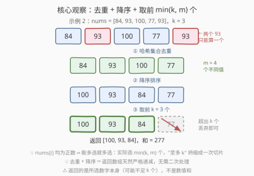
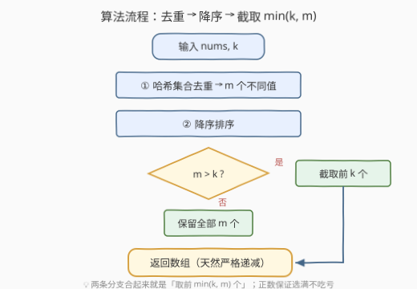

# LeetCode 至多 K 个不同元素的最大和 题解

## 1. 题目概述

- **标题 / 题号**：至多 K 个不同元素的最大和（#3684，easy）
- **链接**：https://leetcode.cn/problems/maximize-sum-of-at-most-k-distinct-elements/
- **难度**：简单
- **标签**：贪心、数组、哈希表、排序

**题意**：给你一个**正整数**数组 `nums` 和一个整数 `k`。从 `nums` 中选择**最多 `k` 个元素**，使它们的**和最大化**，但所选的数字必须**互不相同**。

返回一个包含所选数字的数组，数组中的元素按**严格递减**顺序排序。

**示例 1**：

```text
输入：nums = [84,93,100,77,90], k = 3
输出：[100,93,90]
解释：最大和为 283，可以通过选择 93、100 和 90 实现。
     将它们按严格递减顺序排列，得到 [100, 93, 90]。
```

**示例 2**：

```text
输入：nums = [84,93,100,77,93], k = 3
输出：[100,93,84]
解释：最大和为 277，可以通过选择 84、93 和 100 实现。
     不能选择 93、100 和另一个 93，因为所选数字必须互不相同。
```

**示例 3**：

```text
输入：nums = [1,1,1,2,2,2], k = 6
输出：[2,1]
解释：最大和为 3，可以通过选择 1 和 2 实现。
     不同值只有 2 个，k = 6 也只能选 2 个。
```

**约束**：

- $1 \le \text{nums.length} \le 100$
- $1 \le \text{nums[i]} \le 10^9$
- $1 \le k \le \text{nums.length}$

> 💡 **审题关键**：① "所选数字互不相同"约束的是**值**而非下标——同值至多选一个，重复元素是烟雾弹；② $\text{nums[i]} \ge 1$ 全为正数，"至多 k 个"实际上会被推到"恰好 $\min(k, m)$ 个"（$m$ 为不同值个数）；③ 返回的是**所选数字本身**（严格递减数组），不是数值和——输出形态先看清，别交成 `int`。

## 2. 解题思路

### 2.1 暴力思路

最朴素的做法是**枚举所有子序列**：$2^n$ 个子序列逐一检查「长度 $\le k$ 且元素互不相同」，取合法者中和最大的。$n = 100$ 时 $2^{100}$ 是天文数字，完全不可行。

稍作改进：先意识到重复值无用（同值至多选一个），哈希去重得 $m$ 个不同值后再枚举子集——组合数 $\binom{m}{k}$ 在 $m = 100$ 时同样爆炸。

两次失败都卡在"**枚举选择**"上。其实题目有两个极强的结构性质，抓住后可直接跳过搜索：

1. **全为正数**——多选一个合法元素，和严格变大，没有任何理由少选；
2. **值互不相同**——候选集天然是去重后的集合，"选哪些"退化成"从大到小拿"。

### 2.2 核心观察：去重 + 降序 + 取前 $\min(k, m)$ 个



把三条观察串成一条链：

- **观察一（互异 ⇒ 看集合）**：所选数字两两不同 ⇒ 同值至多选一次 ⇒ 题目只与 `nums` 去重后的**值集合**有关，用**哈希集合**一步坍缩，设不同值个数为 $m$；
- **观察二（正数 ⇒ 选满）**：$\text{nums[i]} \ge 1$ ⇒ 每多选一个不同值，和严格增加 ⇒ 最优解必选 $\min(k, m)$ 个，"至多 k"的上限永远打满；
- **观察三（贪心取大，交换论证）**：若最优解漏选了某个可用值 $v$，却选了更小的 $u$，把 $u$ 换成 $v$——个数不变、互异性不变、和严格变大，与"最优"矛盾 ⇒ 必取去重后**前 $\min(k, m)$ 大**的值。

于是答案就是一行：**去重、降序排序、截取前 $k$ 个**（不同值不足 $k$ 个时全取）。降序 + 两两不同叠加，返回数组**天然严格递减**，连输出格式都省了。

> ⚠️ 注意示例 3 的情形：$m < k$ 时返回长度**不足 $k$**（`[2,1]` 只有 2 个元素），不要强行凑数或补 0。

### 2.3 算法流程



| 步骤 | 操作 | 说明 |
|------|------|------|
| ① 去重 | 遍历 `nums` 入哈希集合 | 得 $m$ 个不同值，$m \le n$ |
| ② 排序 | 不同值降序排序 | $O(m \log m)$ |
| ③ 截取 | 取前 $\min(k, m)$ 个 | "至多 k" 的两种落点合一 |
| ④ 返回 | 输出该数组 | 互异 + 降序 ⇒ 天然严格递减 |

### 2.4 示例演算

以示例 3 `nums = [1,1,1,2,2,2], k = 6` 为例：

| 阶段 | 结果 | 说明 |
|------|------|------|
| 去重 | $\{1, 2\}$，$m = 2$ | 六个元素只剩两种值 |
| 降序 | $[2, 1]$ | — |
| 截取 | $m = 2 < k = 6$ ⇒ 全取 | 返回 `[2,1]`，长度 2 < 6 属预期 |

示例 1 同理：去重得 5 个值 $\{84,93,100,77,90\}$，降序 `[100,93,90,84,77]`，截前 3 个得 `[100,93,90]`，和 $283$。

## 3. 参考代码

### C++

```cpp
class Solution {
public:
    vector<int> maxKDistinct(vector<int>& nums, int k) {
        unordered_set<int> s(nums.begin(), nums.end());  // ① 哈希去重
        vector<int> a(s.begin(), s.end());
        sort(a.begin(), a.end(), greater<int>());        // ② 降序排序
        if ((int)a.size() > k) a.resize(k);              // ③ 截前 k 个（不足则全取）
        return a;                                        // ④ 天然严格递减
    }
};
```

### Python

```python
class Solution:
    def maxKDistinct(self, nums: List[int], k: int) -> List[int]:
        return sorted(set(nums), reverse=True)[:k]
```

Python 的切片 `[:k]` 在长度不足 `k` 时自动取全部，恰好覆盖 $m < k$ 的分支，一行收工。

## 4. 复杂度分析

| 维度 | 复杂度 | 说明 |
|------|--------|------|
| **时间复杂度** | $O(n \log n)$ | 哈希去重平均 $O(n)$ + 排序 $O(m \log m)$，$m \le n$；$n \le 100$ 实际瞬间完成 |
| **空间复杂度** | $O(n)$ | 哈希集合与去重数组至多存 $n$ 个值；输出占 $\min(k, m)$ |

## 5. 扩展：免整排序的取前 k 大 与 "正数"条件的分量

**$k \ll n$ 时免整排序**：本题只要前 $k$ 大的不同值，不必对全部 $m$ 个值排序——

- **大小为 k 的最小堆**：遍历不同值，堆长不足 $k$ 直接入堆；否则新值大于堆顶才替换。$O(n \log k)$，最后弹出 $k$ 个再反转（并排序）即得严格递减；
- **快速选择**（quickselect）：平均 $O(n)$ 定位第 $k$ 大，再对前 $k$ 个排序 $O(k \log k)$ 输出。

**"正数"条件有多重要**：把约束改成允许负数后，观察二失效——选一个负值会让和变小，"选满"不再必然。此时正确做法是降序取前 $\min(k, m)$ 个后，继续**丢弃尾部负值**（选不选 0 无所谓）；若进一步改成"恰好 k 个"，则负值也必须选，问题性质完全不同。面试中主动指出"我的贪心依赖正数条件"是加分项。

## 6. 面试要点

**Q1：「至多 k 个」为什么最后变成「恰好 $\min(k, m)$ 个」？**

> 两个条件叠加：值互不相同 ⇒ 候选上限是不同值个数 $m$；全为正数 ⇒ 多选一个不同值和严格变大，没有理由少选。所以实际选择数被 $\min(k, m)$ 锁死，示例 3 正是 $m < k$ 的落点。

**Q2：贪心"取前 $\min(k, m)$ 大"的正确性怎么证？**

> 交换论证：设最优解漏选可用值 $v$（位于去重降序序列前 $\min(k, m)$ 位）而选了更小的 $u$，将 $u$ 换成 $v$，元素个数与互异性不变、和严格变大，与最优性矛盾。故最优解必含前 $\min(k, m)$ 大的所有值。

**Q3：为什么返回数组天然满足"严格递减"？**

> 去重保证两两不同，降序排序保证非严格递减，二者叠加即严格递减。反过来说，若忘了去重，降序数组会出现相邻相等（示例 2 的两个 93），既违反互异也违反严格递减——去重是双重必需。

**Q4：若允许负数，算法哪里要改？**

> "能选就选"失效：降序取前 $\min(k, m)$ 个后还要把尾部负值丢掉，等价于在"和不再增大"处截断。若要求"恰好 k 个"则无法丢弃，须全选。这说明正数条件是本题贪心的隐含支柱。

**Q5：$n$ 很大、$k$ 很小时如何优化？**

> 免整排序：大小为 $k$ 的最小堆一趟维护前 $k$ 大，$O(n \log k)$；或快速选择平均 $O(n)$。最后仍需对 $k$ 个结果排序输出严格递减，总代价 $O(n + k \log k)$ 级别。

> 💡 **一句话总结**：3684 = **哈希去重 + 降序排序 + 取前 $\min(k, m)$ 个**；三条观察（互异看集合、正数选满、贪心取大）把"至多 k"坍缩成一次切片，输出格式由"互异 + 降序"自动满足。

## 同类练习题

| # | 题目 | 与本题的关联 |
|---|------|-------------|
| 414 | [第三大的数](https://leetcode.cn/problems/third-maximum-number/) | 去重后取第 3 大，"distinct + top-k"的单遍三变量维护版 |
| 2656 | [K 个元素的最大和](https://leetcode.cn/problems/maximum-sum-with-exactly-k-elements/) | 恰好选 k 个元素求最大和，同为"正数贪心取大"套路 |
| 215 | [数组中的第K个最大元素](https://leetcode.cn/problems/kth-largest-element-in-an-array/) | top-k 选择的经典训练场（堆 / 快速选择），对应第 5 节的优化方向 |
| 3572 | [选择不同X值三元组使Y值之和最大](https://leetcode.cn/problems/maximize-ysum-by-picking-a-triplet-of-distinct-xvalues/) | 哈希分桶去重 + 组内取最大，"同值互斥"贪心的进阶版 |
