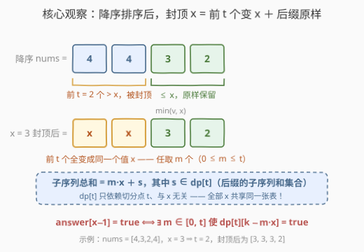
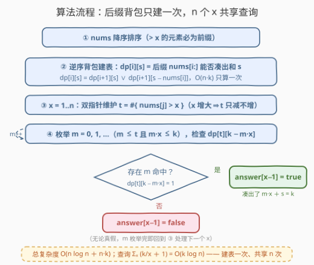

# 含上限元素的子序列和

- **题目名称**：含上限元素的子序列和
- **链接**：[3685. Subsequence Sum After Capping Elements](https://leetcode.cn/problems/subsequence-sum-after-capping-elements/)
- **难度**：中等
- **标签**：数组、排序、动态规划、双指针

## 1. 题目概述

给你一个大小为 $n$ 的整数数组 `nums` 和一个正整数 $k$。

通过将每个元素 $nums[i]$ 替换为 $\min(nums[i], x)$，可以得到由值 $x$ **限制（capped）**后的数组。

对于从 $1$ 到 $n$ 的**每个**整数 $x$，判断能否从限制后的数组中选出一个**子序列**，使所选元素之和**恰好为 $k$**。

返回下标从 $0$ 开始、大小为 $n$ 的布尔数组 `answer`，其中 $answer[i]$ 为 `true` 表示 $x = i + 1$ 时可以选出满足要求的子序列。

**示例 1**：

```text
输入：nums = [4,3,2,4], k = 5
输出：[false,false,true,true]
解释：
  x = 1：限制后 [1,1,1,1]，可能和为 1~4，凑不出 5
  x = 2：限制后 [2,2,2,2]，可能和为 2/4/6/8，凑不出 5
  x = 3：限制后 [3,3,2,3]，选 [2,3] 和为 5 ✓
  x = 4：限制后 [4,3,2,4]，选 [3,2] 和为 5 ✓
```

**示例 2**：

```text
输入：nums = [1,2,3,4,5], k = 3
输出：[true,true,true,true,true]
解释：对每个 x 都能选出和恰为 3 的子序列。
```

**约束条件**：

- $1 \le n = \text{nums.length} \le 4000$
- $1 \le nums[i] \le n$
- $1 \le k \le 4000$

> 💡 **审题关键**：① 有 $n$ 个**独立的询问**（每个 $x$ 一问），不是只问一次；② "子序列"在本题里等价于"子集"——顺序无关紧要，只关心能凑出哪些和；③ $nums[i] \le n$ 且 $x \le n$，值域与 $n$ 同阶，这是后面"排序前缀"观察的前提。

---

## 2. 解题思路

### 2.1 暴力思路：每个 x 单独做一次背包

最直接的做法：对每个 $x \in [1, n]$，构造限制后的数组 $[\min(v, x) \mid v \in nums]$，对其跑一遍 0/1 背包可行性 DP（`can[s]` 表示和 $s$ 是否可达），最后看 `can[k]`。

单个询问 $O(n \cdot k)$，总共 $n$ 个询问：

$$O(n^2 k) = 4000^2 \times 4000 = 6.4 \times 10^{10}$$

必然超时。**瓶颈在于：$n$ 个询问各自重复建背包，而它们的信息高度重叠**——$x$ 变化时，只有"超过 $x$ 的那些元素"被改写，其余元素原封不动。

### 2.2 核心观察：降序排序后，封顶 = 「前 t 个变 x」＋「后缀原样」



把 `nums` **降序排序**。此时对任意 $x$，所有 $> x$ 的元素恰好构成**前缀**。设 $t$ 为 $> x$ 的元素个数，则限制后的数组只有两段：

- **前 $t$ 个**（原本 $> x$）：全部被改写成**同一个值 $x$**；
- **后缀 `nums[t:]`**（原本 $\le x$）：**一个都没变**。

于是限制后数组的任何一个子序列，都可以拆成"从 $t$ 个 $x$ 里任取 $m$ 个（$0 \le m \le t$）＋ 从后缀里取一个和为 $s$ 的子序列"，总和为

$$m \cdot x + s$$

**决定性的一步**：后缀部分与 $x$ 本身无关，只依赖切分点 $t$！而 $t \in [0, n]$ 只有 $n+1$ 种取值。因此只需建**一张**后缀可行性表：

$$dp[i][s] = \text{true} \iff \text{后缀 } nums[i:] \text{ 中存在和恰为 } s \text{ 的子序列}$$

用逆序 0/1 背包一次建好：

$$dp[i][s] = dp[i+1][s] \;\lor\; \bigl(s \ge nums[i] \land dp[i+1][s - nums[i]]\bigr)$$

那么对每个 $x$（其对应切分点为 $t$）：

$$answer[x-1] = \text{true} \iff \exists\, m \in [0, t]\text{ 使得 } k - m \cdot x \ge 0 \text{ 且 } dp[t][k - m\cdot x] = \text{true}$$

> 💡 这就是把 $O(n^2k)$ 压到 $O(nk)$ 的全部秘密：**$n$ 个询问共享同一张后缀背包表**。排序的作用是把"$> x$ 的元素"聚成前缀，使"被改写的部分"与"保留的部分"在数组上完全分离。

### 2.3 算法流程：后缀背包 ＋ 双指针 ＋ 枚举 m



| 步骤 | 操作 | 说明 |
|------|------|------|
| ① | `nums` 降序排序 | $O(n \log n)$，让封顶段成为前缀 |
| ② | 逆序背包建表 `dp[i][s]` | $O(n \cdot k)$，只建**一次** |
| ③ | $x$ 从 $1$ 到 $n$，双指针维护 $t = \#\{nums[j] > x\}$ | $x$ 递增时 $t$ **单调不增**，两个指针各扫一遍 |
| ④ | 枚举 $m = 0, 1, \dots$（$m \le t$ 且 $m \cdot x \le k$），查 $dp[t][k - m\cdot x]$ | 命中任一 $m$ 即 `true` |

查询部分的总量是调和级数：

$$\sum_{x=1}^{n} \left(\frac{k}{x} + 1\right) = O(k \log n + n) \approx 3.7 \times 10^4$$

完全可以忽略，总复杂度由建表主导。

> ⚠️ 细节一：$k \ge 1$ 而空子序列和为 $0$，所以"子序列必须非空"这一条件**无需特判**。细节二：`dp` 只需算到 $s \le k$，更大的和永远用不上（查询里 $k - m\cdot x \le k$）。

### 2.4 示例演算

以示例 1 为例：`nums = [4,3,2,4], k = 5`，降序排序得 `[4,4,3,2]`。

**后缀和集合**（即 `dp` 表每行为 1 的位置）：

| 切分点 $t$ | 后缀 `nums[t:]` | 可达和集合 $dp[t]$ |
|:---:|:---:|:---|
| 0 | `[4,4,3,2]` | $\{0,2,3,4,5,6,7,8,9,10,11,13\}$ |
| 1 | `[4,3,2]` | $\{0,2,3,4,5,6,7,9\}$ |
| 2 | `[3,2]` | $\{0,2,3,5\}$ |
| 3 | `[2]` | $\{0,2\}$ |
| 4 | `[]` | $\{0\}$ |

**逐 $x$ 判定**（检查是否存在 $m \le t$ 使 $k - m\cdot x$ 落在 $dp[t]$ 中）：

| $x$ | $t$（$>x$ 的个数） | 枚举过程 | 结果 |
|:---:|:---:|:---|:---:|
| 1 | 4 | $5 - m$：$m \le 4 \Rightarrow s \ge 1$，但 $dp[4]=\{0\}$ | false |
| 2 | 3 | $m=0,1,2$（$m\cdot2\le5$）：$s=5,3,1$ 均不在 $dp[3]=\{0,2\}$ | false |
| 3 | 2 | $m=0$：$s=5 \in dp[2]=\{0,2,3,5\}$ ✓ | true |
| 4 | 0 | $m=0$：$s=5 \in dp[0]$ ✓（$x=4$ 不改写任何元素） | true |

与期望输出 `[false,false,true,true]` 一致。

---

## 3. 参考代码

### C++

```cpp
class Solution {
public:
    vector<bool> subsequenceSumAfterCapping(vector<int>& nums, int k) {
        int n = nums.size();
        sort(nums.begin(), nums.end(), greater<int>());

        // dp[i][s]: 后缀 nums[i..n-1] 中是否存在和恰为 s 的子序列
        vector<vector<char>> dp(n + 1, vector<char>(k + 1, 0));
        dp[n][0] = 1;
        for (int i = n - 1; i >= 0; --i)
            for (int s = 0; s <= k; ++s)
                dp[i][s] = dp[i + 1][s] ||
                           (s >= nums[i] && dp[i + 1][s - nums[i]]);

        vector<bool> ans(n, false);
        int t = n;                       // t = #{ nums[j] > x }，随 x 增大单调不增
        for (int x = 1; x <= n; ++x) {
            while (t > 0 && nums[t - 1] <= x) --t;   // 双指针收缩
            for (int m = 0; m <= t && m * x <= k; ++m)
                if (dp[t][k - m * x]) { ans[x - 1] = true; break; }
        }
        return ans;
    }
};
```

### Python

```python
class Solution:
    def subsequenceSumAfterCapping(self, nums: List[int], k: int) -> List[bool]:
        n = len(nums)
        nums.sort(reverse=True)

        # dp[i] 的第 s 位为 1  <=>  后缀 nums[i:] 能凑出和 s（大整数即 bitset）
        full = (1 << (k + 1)) - 1
        dp = [0] * (n + 1)
        dp[n] = 1
        for i in range(n - 1, -1, -1):
            dp[i] = (dp[i + 1] | (dp[i + 1] << nums[i])) & full

        ans = [False] * n
        t = n                          # t = #{ nums[j] > x }，单调不增
        for x in range(1, n + 1):
            while t > 0 and nums[t - 1] <= x:
                t -= 1
            m = 0
            while m <= t and m * x <= k:
                if (dp[t] >> (k - m * x)) & 1:
                    ans[x - 1] = True
                    break
                m += 1
        return ans
```

> 💡 Python 版把每一行 `dp` 压成一个**大整数**当作 bitset：`dp[i] | (dp[i] << nums[i])` 一条语句完成整行转移，比嵌套循环快约一个数量级；`& full` 把和超过 $k$ 的位裁掉，防止大整数无限膨胀。

---

## 4. 复杂度分析

| 维度 | 复杂度 | 说明 |
|------|--------|------|
| **时间：建表** | $O(n \log n + n \cdot k)$ | 排序 + 一次逆序背包，$\approx 1.6 \times 10^7$ |
| **时间：查询** | $O(k \log n + n)$ | $\sum_x (k/x + 1)$ 调和级数，$\approx 3.7 \times 10^4$，可忽略 |
| **空间** | $O(n \cdot k)$ | C++ `char` 表约 16 MB；Python 大整数位掩码约 $n\cdot k/8 \approx 2$ MB |

---

## 5. 扩展：空间还能压到 O(k)

**滚动数组版**：注意到询问顺序 $x = 1 \dots n$ 对应的 $t$ **单调不增**，而 `dp` 恰好是按 $i$ 从 $n$ 递减建出来的——两个方向完美同频。于是可以把建表与查询**交错**进行：`dp` 只保留当前行与上一行（滚动），每当 $i$ 递减到某个 $t$，就把所有切分点为 $t$ 的询问 $x$ 现场答掉。额外空间降到 $O(k)$。

**为什么必须排序**：本质是把"被改写成 $x$ 的元素"聚成**连续前缀**，使保留部分成为**连续后缀**、与切分点一一对应。不排序的话 $> x$ 的元素散落各处，"保留部分"随 $x$ 变化不构成可复用的子问题结构。

**bitset 常数优化**：$k \le 4000$ 编译期已知时，C++ 可用 `std::bitset<4001>`，转移 `dp[i] = dp[i+1] | (dp[i+1] << nums[i])` 一次处理 64 位，理论提速 $\times 64$；Python 大整数天然就是这个写法。

---

## 6. 面试要点

**Q1：为什么封顶后前 t 个元素可以"合并成 m 个 x"处理？**

> 降序排序后 $> x$ 的元素恰是前 $t$ 个，封顶后它们的值**全部等于 $x$**，彼此不可区分。从中选任意 $m$ 个贡献都是 $m\cdot x$，因此只需枚举个数 $m \in [0, t]$，无需关心具体选了哪些。

**Q2：这题的优化核心是什么？从多少降到多少？**

> $n$ 个询问共享一张"后缀子序列和可行性表" `dp[i][s]`。瓶颈从"每个 $x$ 各建一次背包"的 $O(n^2 k)$ 降到"建一次 + 逐个查询"的 $O(nk)$。识别点是：限制操作只改写前缀、保留后缀，且后缀由切分点 $t$ 唯一决定。

**Q3：枚举 m 的总量为什么不是 O(n·t)？**

> 有两重截断：$m \le t$ 且 $m \cdot x \le k$。对每个 $x$ 至多枚举 $\lfloor k/x \rfloor + 1$ 个 $m$，求和是调和级数 $O(k \log n + n)$，远小于 $O(nk)$。

**Q4：t 为什么要用双指针维护？**

> $x$ 从 $1$ 递增到 $n$ 时，$> x$ 的元素个数 $t$ 单调不增；降序数组上用一个从 $n$ 出发只向左收缩的指针即可，均摊 $O(n)$。若每个 $x$ 都重新计数或二分，会多一个 $O(\log n)$ 或 $O(n)$ 因子（本题量级下也能过，但双指针更干净）。

**Q5：dp 表的空间 16 MB 能接受吗？怎么压？**

> $n, k \le 4000$，`char` 表约 16 MB，多数评测机可过但已接近上限。压法：① 位存储（`vector<bool>` / `bitset` / Python 大整数）降到 $1/8$ 以下；② 利用 "$t$ 随 $x$ 单调不增" 把建表与查询交错，滚动两行降到 $O(k)$（见第 5 节）。

> 💡 **一句话总结**：排序让"封顶"变成"前缀改写"，后缀背包建表一次、$n$ 个 $x$ 共享，每个询问只需枚举 $m$ 查 $dp[t][k - m\cdot x]$。

---

## 7. 同类练习题

- [416. 分割等和子集](https://leetcode.cn/problems/partition-equal-subset-sum/)：0/1 背包"可行性"判断的祖师爷，本题建 `dp` 表的每一步就是它
- [494. 目标和](https://leetcode.cn/problems/target-sum/)：转化后即"子集和恰好为某值"的计数型背包，与本题的可行性版对照着练
- [2915. 和为目标值的最长子序列的长度](https://leetcode.cn/problems/length-of-the-longest-subsequence-that-sums-to-target/)：同样问"子序列凑出指定和"，把可行性换成最值
- [1981. 最小化目标值与所选元素的差](https://leetcode.cn/problems/minimize-the-difference-between-target-and-chosen-elements/)：多行各选一个数凑近目标值，bitset 优化思路与本题 Python 版相通
- [1049. 最后一块石头的重量 II](https://leetcode.cn/problems/last-stone-weight-ii/)：子集和背包的另一副面孔，体会"凑和"类问题的统一框架
