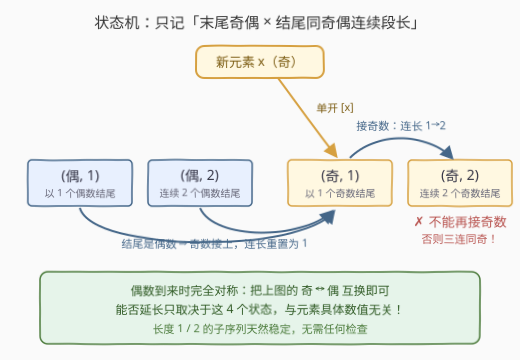
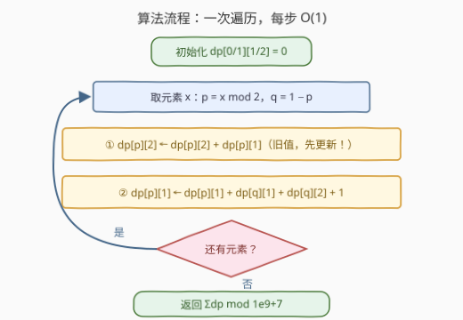

# LeetCode 稳定子序列的数量 题解

## 1. 题目概述

- **标题 / 题号**：稳定子序列的数量（#3686，hard）
- **链接**：https://leetcode.cn/problems/number-of-stable-subsequences/
- **难度**：困难
- **标签**：数组、动态规划、状态机 DP

**题意**：给你一个整数数组 `nums`。

如果一个**子序列**中**不存在连续三个**元素奇偶性相同（**仅考虑该子序列内部**的相邻关系），则称该子序列为**稳定子序列**。

请返回所有稳定子序列的数量。由于结果可能非常大，请将答案对 $10^9 + 7$ 取余数后返回。

子序列是一个从数组中通过删除某些元素（或不删除任何元素）、并保持剩余元素相对顺序不变得到的**非空**数组。

**示例 1**：

```text
输入：nums = [1,3,5]
输出：6
解释：
稳定子序列为：[1], [3], [5], [1,3], [1,5], [3,5]。
子序列 [1,3,5] 不稳定，因为它包含三个连续的奇数。
```

**示例 2**：

```text
输入：nums = [2,3,4,2]
输出：14
解释：
唯一的不稳定子序列是 [2,4,2]，因为它包含三个连续的偶数。
所有其他子序列都是稳定的，因此答案是 14。
```

**约束**：

- $1 \le \text{nums.length} \le 10^5$
- $1 \le \text{nums[i]} \le 10^5$

> 💡 **审题关键**：① "连续三个同奇偶"只看**子序列内部**的相邻关系，与原数组中的位置是否相邻无关；② 子序列**非空**，但长度 1、2 的子序列永远稳定；③ 判定合法性**只用到奇偶性**，元素具体数值无关紧要——这是后面状态压缩的伏笔；④ 答案是计数型，要取模。

## 2. 解题思路

### 2.1 暴力思路：枚举所有子序列

每个元素"选/不选"，共 $2^n - 1$ 个非空子序列，逐个检查是否稳定需要 $O(n)$：

$$O(n \cdot 2^n)$$

$n = 10^5$ 时天文数字，完全不可行。**瓶颈在于**：合法性与否只取决于子序列末尾的"奇偶模式"，而指数级枚举把大量共享同一模式的前缀结构重复检查了无数遍——典型的**计数 DP** 信号。

### 2.2 核心观察：状态机 DP——只记「末尾奇偶 × 结尾同奇偶段长」



一个已经稳定的子序列，**能否再接上新元素 x，只取决于两件事**：

1. 当前**最后一个元素**的奇偶性 $p'$；
2. 结尾**连续同奇偶段的长度**是 1 还是 2（到 2 就封顶，再接同奇偶即违规）。

元素的具体数值、子序列的前缀长什么样，统统无关。于是整个问题只有 **4 个状态**：

$$dp[p][c] = \{\text{以奇偶为 } p \text{ 的元素结尾、结尾同奇偶连续段长度为 } c\} \text{ 的稳定子序列个数}$$

其中 $p \in \{0, 1\}$（偶/奇），$c \in \{1, 2\}$。

**转移**：新来一个元素 $x$，设 $p = x \bmod 2$，$q = 1 - p$。以 $x$ 为新结尾的稳定子序列有三种来历：

| 来历 | 新状态 | 说明 |
|------|--------|------|
| 接在结尾奇偶为 $q$ 的子序列后 | $(p, 1)$ | 奇偶切换，连长重置为 1 |
| 接在状态 $(p, 1)$ 的子序列后 | $(p, 2)$ | 同奇偶接龙，连长 1→2 |
| 单独作为子序列 $[x]$ | $(p, 1)$ | 长度 1 天然稳定 |

状态 $(p, 2)$ **不能再接奇偶为 $p$ 的元素**——这正是"三连同奇"被排除的地方。写成一个元素的转移（注意都是**基于旧值**的累加，已有的子序列不选 $x$ 也依然计入原状态）：

$$dp[p][2] \leftarrow dp[p][2] + \underbrace{dp[p][1]}_{\text{旧值}}$$

$$dp[p][1] \leftarrow dp[p][1] + dp[q][1] + dp[q][2] + 1$$

> ⚠️ **更新顺序陷阱**：$dp[p][2]$ 的转移依赖**旧的** $dp[p][1]$。若先把 $dp[p][1]$ 更新了再算 $dp[p][2]$，会把"刚接上 $x$ 的序列"再次接龙，造成重复计数。必须**先更新 $dp[p][2]$，再更新 $dp[p][1]$**（或先用临时变量保存旧值）。

### 2.3 算法流程图



| 步骤 | 操作 | 说明 |
|------|------|------|
| ① | `dp[0/1][1/2]` 全部置 0 | 初始没有任何子序列 |
| ② | 依次取元素 $x$，令 $p = x \bmod 2$，$q = 1-p$ | 只看奇偶，$O(1)$ |
| ③ | `dp[p][2] += dp[p][1]` | **先**更新，用的是旧值 |
| ④ | `dp[p][1] += dp[q][1] + dp[q][2] + 1` | 接异奇偶结尾 ＋ 单开新序列 |
| ⑤ | 遍历结束，返回 $dp[0][1]+dp[0][2]+dp[1][1]+dp[1][2] \bmod (10^9+7)$ | 四状态求和即总数 |

每个元素只做常数次加法取模，整个过程**一次线性扫描**。

### 2.4 示例演算

以示例 2 `nums = [2,3,4,2]`（奇偶：偶、奇、偶、偶）为例，列出每步处理完后的四状态值：

| 处理元素 | 奇偶 $p$ | dp[偶][1] | dp[偶][2] | dp[奇][1] | dp[奇][2] | 累计个数 |
|:---:|:---:|:---:|:---:|:---:|:---:|:---:|
| （初始） | — | 0 | 0 | 0 | 0 | 0 |
| 2 | 偶 | 1 | 0 | 0 | 0 | 1 |
| 3 | 奇 | 1 | 0 | 2 | 0 | 3 |
| 4 | 偶 | 4 | 1 | 2 | 0 | 7 |
| 2 | 偶 | 7 | 5 | 2 | 0 | **14** |

几个关键行：

- **处理 4（偶）**：$dp[偶][1] = 1 + 2 + 0 + 1 = 4$，即旧有的 $[2]$、接在奇结尾 $[3],[2,3]$ 后的 $[3,4],[2,3,4]$、单开的 $[4]$；$dp[偶][2] = 0 + 1 = 1$，即 $[2]$ 接龙成 $[2,4]$。
- **处理最后的 2（偶）**：$dp[偶][1] = 4 + 2 + 0 + 1 = 7$；$dp[偶][2] = 1 + 4 = 5$，即旧有的 $[2,4]$ 加上 4 个偶结尾序列的接龙 $[2,2],[4,2],[3,4,2],[2,3,4,2]$。
- 唯一被封死的转移：状态 $(偶,2)$ 中的 $[2,4]$ 不能再接偶数 2——恰好对应**唯一**的不稳定子序列 $[2,4,2]$。$2^4 - 1 = 15$ 个子序列去掉它，答案 $14$ ✓。

## 3. 参考代码

### C++

```cpp
class Solution {
public:
    int countStableSubsequences(vector<int>& nums) {
        constexpr long long MOD = 1'000'000'007;
        // dp[p][c]：以奇偶为 p 的元素结尾、结尾同奇偶连续段长度为 c 的稳定子序列数
        long long dp[2][3] = {};
        for (int x : nums) {
            int p = x & 1, q = p ^ 1;
            dp[p][2] = (dp[p][2] + dp[p][1]) % MOD;                 // 先更新，用旧值
            dp[p][1] = (dp[p][1] + dp[q][1] + dp[q][2] + 1) % MOD; // 接异奇偶 + 单开
        }
        return (dp[0][1] + dp[0][2] + dp[1][1] + dp[1][2]) % MOD;
    }
};
```

### Python

```python
class Solution:
    def countStableSubsequences(self, nums: List[int]) -> int:
        MOD = 10**9 + 7
        # dp[p][c]：以奇偶为 p 的元素结尾、结尾同奇偶连续段长度为 c 的稳定子序列数
        dp = [[0, 0, 0], [0, 0, 0]]
        for x in nums:
            p = x & 1
            q = p ^ 1
            dp[p][2] = (dp[p][2] + dp[p][1]) % MOD                 # 先更新，用旧值
            dp[p][1] = (dp[p][1] + dp[q][1] + dp[q][2] + 1) % MOD  # 接异奇偶 + 单开
        return (dp[0][1] + dp[0][2] + dp[1][1] + dp[1][2]) % MOD
```

## 4. 复杂度分析

| 维度 | 复杂度 | 说明 |
|------|--------|------|
| **时间** | $O(n)$ | 每个元素一次 $O(1)$ 状态转移，$n \le 10^5$ 轻松通过 |
| **空间** | $O(1)$ | 仅 4 个计数器（`dp[2][3]`），与 $n$ 无关 |
| **正确性** | 不重不漏 | 每个稳定子序列按"最后被选入的元素"唯一归类到 4 个状态之一 |

## 5. 扩展：推广到「不许连续 k 个同奇偶」

把"三连同奇"推广为"**连续 $k$ 个同奇偶即违规**"：状态改为 $dp[p][c]$，$c \in \{1, \dots, k-1\}$，转移完全同构：

$$dp[p][c] \leftarrow dp[p][c] + dp[p][c-1] \quad (2 \le c \le k-1)$$

$$dp[p][1] \leftarrow dp[p][1] + \sum_{c=1}^{k-1} dp[q][c] + 1$$

时间 $O(nk)$、空间 $O(k)$。本题即 $k = 3$ 的特例，还能用 $dp[p][1] + dp[p][2]$ 合并成"同奇偶结尾总数"把空间压到 3 个变量。

另一个方向是**正难则反**：总数 $2^n - 1$ 减去不稳定子序列数。但"不稳定"的判定同样是"首次出现三连同奇"的结构，计数并不比原问题容易，反而要多记一层状态——直接正向计数才是本题的正解。

## 6. 面试要点

**Q1：为什么状态只需要「末尾奇偶 + 连续段长度」两个维度？**

> 因为子序列往后能否延长，只由末尾的奇偶性和结尾同奇偶段的长度决定；判定条件不涉及元素数值与更早的历史。能影响未来的"历史"只有这两个量，这就是状态设计的最小充分集。

**Q2：转移方程里的 `+1` 是什么意思？会不会重计数？**

> `+1` 是"单开新序列 $[x]$"。不重不漏的关键在于按**最后被选入的元素**给子序列分类：每个稳定子序列的末元素唯一，恰好落进 4 个状态之一；而转移时旧状态原值保留（不选 $x$ 的子序列继续计入），新值只加"以 $x$ 结尾"的新序列。

**Q3：两条转移都改 `dp[p][*]`，更新顺序为什么重要？**

> `dp[p][2]` 的转移依赖**旧的** `dp[p][1]`。若先更新 `dp[p][1]` 再更新 `dp[p][2]`，相当于让"刚以 $x$ 结尾、连长为 1"的序列立刻又接了一遍 $x$，连长错算成 2 并重复计数。必须先更新 `dp[p][2]`，或用临时变量暂存旧值。

**Q4：为什么不用「总数减不稳定」来算？**

> 总数是 $2^n - 1$，但不稳定子序列的计数同样需要 DP（还得处理"在哪个位置首次形成三连同奇"的重复去除），并不比正向计数简单。正向状态机 DP 一次扫描 $O(1)$ 空间，是更干净的做法。

**Q5：本题和「买卖股票含冷冻期」这类状态机 DP 有何共性？**

> 都是"用有限状态刻画历史对未来的全部影响"：股票题是（持有/冷冻/空仓），本题是（末尾奇偶 × 连长 1/2）。一旦发现约束只依赖局部模式、状态可枚举，就能把指数级枚举压成线性扫描。

> 💡 **一句话总结**：合法性只看末尾奇偶模式 ⇒ 四状态计数 DP，一次遍历、$O(1)$ 空间，注意转移要用旧值。

## 同类练习题

| # | 题目 | 与本题的关联 |
|---|------|-------------|
| 3201 | [有效子序列的最大长度 I](https://leetcode.cn/problems/find-the-maximum-length-of-valid-subsequence-i/) | 同样只看子序列内相邻元素的奇偶模式，把"计数"换成"求最长" |
| 3202 | [有效子序列的最大长度 II](https://leetcode.cn/problems/find-the-maximum-length-of-valid-subsequence-ii/) | 把模 2 的奇偶模式推广到模 k，状态设计思想与本题一脉相承 |
| 940 | [不同的子序列 II](https://leetcode.cn/problems/distinct-subsequences-ii/) | 子序列计数 + 取模的经典题，"以某字符结尾"的状态划分与本题同构 |
| 309 | [买卖股票的最佳时机含冷冻期](https://leetcode.cn/problems/best-time-to-buy-and-sell-stock-with-cooldown/) | 状态机 DP 入门题，体会"用有限状态概括历史" |
| 1524 | [和为奇数的子数组数目](https://leetcode.cn/problems/number-of-sub-arrays-with-odd-sum/) | 奇偶性参与计数取模的另一道练习 |
