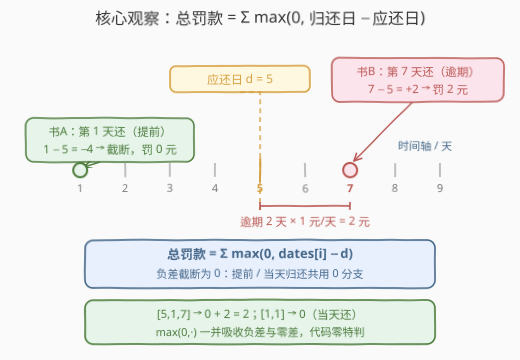
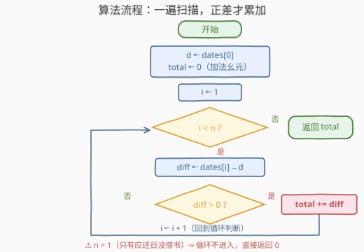

# LeetCode 图书馆逾期罚款计算器 题解

## 1. 题目概述

- **标题 / 题号**：图书馆逾期罚款计算器（#3687，easy）
- **链接**：https://leetcode.cn/problems/library-late-fee-calculator/
- **难度**：简单
- **标签**：数组、模拟

> ⚠️ 本题为 LeetCode 付费题（Plus 会员专享），题意描述根据官方示例用例与 hints 重建，可能与官方题面有出入。

**题意（重建口径）**：给定一个整数数组 `dates`。图书馆规定所有图书统一在**第 $d$ 天**归还，其中 $d = \mathrm{dates}[0]$；`dates[i]`（$i \ge 1$）表示第 $i$ 本书**实际归还**的日子。罚款规则：每本书每**逾期一天**罚款 $1$ 元；**按时或提前归还**不罚款（也不奖励）。返回读者需要缴纳的**总罚款**（接口按题意推断为 `lateFee(dates)`，返回 `int` / `long long`）。

重建依据（官方仅公开的信息）：

- 官方示例用例：`[5,1,7]` 与 `[1,1]`；
- 官方 hint 仅一句：**Simulate as described**（按题面描述直接模拟），标签为数组 + 模拟；
- 用例设计反推：`[5,1,7]` 中间的 $1$ 恰好**小于**首元素 $5$——像是专门用来测「提前归还 ⇒ 罚款截断为 $0$」的分支；`[1,1]` 则是「当天归还」的零罚款边界。两个用例正好覆盖「负差截断」「零差边界」两类分支，是本重建口径的主要依据。

**示例 1**：

```text
输入：dates = [5,1,7]
输出：2
解释：应还日 d = 5。书 A 第 1 天归还（提前 4 天）→ 罚 0 元；
      书 B 第 7 天归还（逾期 2 天）→ 罚 2 元。总罚款 0 + 2 = 2 元。
```

**示例 2**：

```text
输入：dates = [1,1]
输出：0
解释：应还日 d = 1，第 1 本书当天（第 1 天）归还，逾期 0 天，总罚款 0 元。
```

**约束条件**（官方约束未公开，按同批题目与 hints 口径推测）：

- $1 \le \mathrm{dates.length} \le 10^5$
- $1 \le \mathrm{dates}[i] \le 10^9$，且数组元素均为正整数
- 罚款总额可达 $\dfrac{10^5 \times 10^9}{2} \approx 5 \times 10^{13}$，**超出 32 位整数范围**，C/C++ 须用 64 位累加

> 💡 **审题关键**：① $\mathrm{dates}[0]$ 是**所有书共享的应还日**，本身不参与求和——它只作为被减数；② 逾期天数是 $\max(0,\ \mathrm{dates}[i] - d)$，**负差必须截断为 0**——"负罚款"不存在，提前归还不倒贴；③ 费率「$1$ 元/天」是重建口径的默认假设，若官方费率不同，只需把累加项乘上费率，骨架不变。

## 2. 解题思路

### 2.1 朴素思路：按天模拟数日子

既然 hint 说 "Simulate as described"，最老实的模拟是：对每本书，从应还日 $d$ 起**一天一天往后数**，数到实际归还日为止，数了几天罚几元，再把各书的罚款加起来。

正确性没有问题，但代价是 $O\bigl(\sum_i (\mathrm{dates}[i] - d)^+\bigr)$——$\mathrm{dates}[i]$ 到 $10^9$ 时要循环上亿次。问题出在：**数日子的结果本身就是一个闭式**——从第 $d$ 天数到第 $r$ 天，恰好数了 $r - d$ 天。逐一模拟是把这个 $O(1)$ 的减法展开成了 $O(r - d)$ 的循环。

### 2.2 核心观察：闭式减法 + 负差截断



把「数日子」坍缩成「做减法」，每本书的贡献是一个分段函数：

$$\text{fee}_i = \max\bigl(0,\ \mathrm{dates}[i] - d\bigr) = \begin{cases} \mathrm{dates}[i] - d, & \mathrm{dates}[i] > d \quad (\text{逾期}) \\ 0, & \mathrm{dates}[i] \le d \quad (\text{按时 / 提前}) \end{cases}$$

$$\text{总罚款} = \sum_{i=1}^{n-1} \max\bigl(0,\ \mathrm{dates}[i] - \mathrm{dates}[0]\bigr)$$

两个让代码变短的细节：

- **截断吸收两类边界**：提前归还（差为负）与当天归还（差恰为 $0$）都被 $\max(0, \cdot)$ 归入 $0$ 分支——示例 2 的 `[1,1]` 落在"等于"边界上，**无须任何特判**；
- **被减数是公共前缀**：每一项都减同一个 $d = \mathrm{dates}[0]$，一遍扫描顺手可得，连临时数组都不需要（对照 2.1 的"先收集逾期天数再求和"两步走，筛选与累积可同轮完成）。

> ⚠️ **最容易写错的一刀**：直接 `total += dates[i] - dates[0]` 不加截断——示例 1 会算出 $-4 + 2 = -2$，"负罚款"直接错。模拟题的失分点从来不在算法，而在**规则的边界翻译**：负差截断这一条必须显式落在代码里。

### 2.3 算法流程：一遍扫描，正差才累加



| 步骤 | 操作 | 说明 |
|------|------|------|
| ① 取参数 | $d \leftarrow \mathrm{dates}[0]$ | 所有书共享的应还日 |
| ② 初始化 | `total` $\leftarrow 0$ | 0 是加法幺元，兼作"无书/全按时"的返回值 |
| ③ 扫描 | 依次取 $i = 1 \dots n-1$，算 $\mathrm{diff} = \mathrm{dates}[i] - d$ | $n = 1$（只有应还日）时循环不进入，天然返回 0 |
| ④ 截断累加 | $\mathrm{diff} > 0$ 则 `total` += diff | 负差与零差都不累加，$\max(0,\cdot)$ 的分支写法 |
| ⑤ 返回 | 返回 `total` | 类型取 64 位，防大值域求和溢出 |

### 2.4 示例演算

**示例 1：`dates = [5,1,7]`**

```text
d = 5, total = 0
i=1：dates[1]=1， diff = 1 − 5 = −4 ≤ 0 → 不累加（提前归还）
i=2：dates[2]=7， diff = 7 − 5 = +2 > 0 → total = 0 + 2 = 2
返回 2 ✓
```

**示例 2：`dates = [1,1]`**

```text
d = 1, total = 0
i=1：dates[1]=1， diff = 1 − 1 = 0 ≤ 0 → 不累加（当天归还）
返回 0 ✓
```

两个示例分别踩中截断分支的两侧——一个负差、一个零差，代码里同一个 `> 0` 判断全部接住。

## 3. 参考代码

### C++

```cpp
class Solution {
public:
    long long lateFee(vector<int>& dates) {
        long long total = 0;                    // 加法幺元 0 起手
        int d = dates[0];                       // 所有书共享的应还日
        for (int i = 1; i < (int)dates.size(); ++i) {
            long long diff = (long long)dates[i] - d;
            if (diff > 0)                       // 负差/零差截断为 0
                total += diff;                  // 每逾期 1 天 1 元
        }
        return total;                           // 无书或全按时恰为 0
    }
};
```

### Python

```python
class Solution:
    def lateFee(self, dates: List[int]) -> int:
        d = dates[0]                            # 所有书共享的应还日
        return sum(max(0, r - d) for r in dates[1:])
```

> 💡 **写法要点**：C++ 里 `dates[i] - d` 两侧都到 $10^9$ 时差值本身不溢出 `int`，但**累加和**会（见约束推算），所以累加器用 `long long` 起手最稳；Python 无此顾虑，生成器版一行收工——`max(0, r - d)` 就是 2.2 的闭式逐字翻译。⚠️ 付费新题的真实接口签名未公开，`lateFee` 为按题意推断的命名，提交时以官方函数签名为准，改个名即可。

## 4. 复杂度分析

| 维度 | 复杂度 | 说明 |
|------|--------|------|
| **时间复杂度** | $O(n)$ | 一遍扫描，每个元素一次减法、至多一次累加 |
| **空间复杂度** | $O(1)$ | 只用常数个变量，无临时数组（朴素两步走是 $O(n)$） |

对照 2.1 的按天模拟 $O(\sum \text{逾期天数})$：闭式把每个元素的代价从"正比于逾期天数"压到"常数"，值域再大也无感——这是模拟题里最常见的优化姿势：**循环能被闭式替代时，用闭式**。

## 5. 扩展：费率规则的变体全家桶

罚款规则是本题唯一的"业务逻辑"，把它抽成一个 $\text{fee}(\text{daysLate})$ 函数，骨架完全不动即可换皮：

- **阶梯费率**：逾期前 $k$ 天每天 $1$ 元、之后每天 $2$ 元——$\text{fee}(x) = \min(x, k) + 2 \max(0, x - k)$，仍是闭式；
- **宽限期 $g$**：应还日顺延 $g$ 天，等价于把 $d$ 换成 $d + g$，一行改动；
- **单本封顶 $c$**：$\text{fee}(x) = \min(x, c)$，再套一层 $\min$；
- **每本书各自应还日**（输入变成二维数组 $[[d_1, r_1], [d_2, r_2], \dots]$，同批 3683「完成一个任务的最早时间」的用例风格）：$\sum \max(0, r_i - d_i)$，被减数不再是公共前缀而已；
- **按年月日分级**（HackerRank 经典 Library Fine）：同年同月按天罚、同年跨月按月罚、跨年定额罚——用"单位从小到大逐级比较"的分支结构，先判大单位再判小单位，避免天级差混进月级罚。

> 💡 这些变体的共同方法论：**把规则逐条翻译成分支，分支拼成分段函数，分段函数喂进求和**。模拟题的考点从来不是算法设计，而是"规则 → 代码"的无损翻译——漏掉一条边界（如本体的负差截断）就是全盘皆错。

## 6. 面试要点

**Q1：为什么必须对负差做截断？不截断会怎样？**

> 提前归还的差是负数，语义上"罚款不能为负"。不截断的话示例 1 算出 $-4 + 2 = -2$——提前归还反而"抵扣"了逾期书的罚款，题意不允许。$\max(0, \cdot)$ 是罚款下界的直接翻译，也是本题唯一的坑位。

**Q2：累加器什么时候必须用 64 位？**

> 按推测约束 $n \le 10^5$、$\mathrm{dates}[i] \le 10^9$，最坏情形（一本书提前、其余全部逾期近 $10^9$ 天）总和约 $5 \times 10^{13}$，超出 `int` 上限（约 $2.1 \times 10^9$）四个数量级。**判断口径永远是"项数 × 单项上界"**，与单元素是否溢出无关——本题单项差值不溢出，但和不安全。

**Q3：如果真实题意是"dates[i] 直接表示第 i 本书的逾期天数"（另一种重建口径）呢？**

> 那就是退化为纯求和 $\sum \mathrm{dates}[i]$，把 3. 的循环体里减法与判断删掉即可。两种口径共用"一遍扫描 + 累加器"骨架，笔试遇付费新题时**先把口径假设写进注释**，换口径只动一两行——这也是重建付费题题意时的通用自保姿势。

**Q4：本题的"模拟"体现在哪？和 DP、贪心类题目的区别是什么？**

> 模拟题没有状态设计、没有最优决策——每一步该做什么被规则**完全规定**，代码是题面的逐条直译。核心能力是翻译的完备性：把"每逾期一天 1 元 / 提前不罚 / 当天不罚"逐条映射成分支，不多不少。验收方法是拿题面每句话反问代码里"哪一行实现了你"。

**Q5：为什么说"循环能被闭式替代时优先闭式"？**

> 2.1 的按天数日子与 2.2 的闭式减法**语义完全等价**，复杂度却差着值域个数量级。识别"循环在算一个有闭式表达式的量"（这里是区间长度 $r - d$）是模拟题里唯一称得上"优化"的环节——先保正确再谈这点，模拟题的正确性优先级永远高于速度。

> 💡 **一句话总结**：3687 = $\sum \max(0,\ \mathrm{dates}[i] - \mathrm{dates}[0])$ 的一遍扫描——公共应还日做被减数、负差截断吸收全部边界、64 位累加器兜住大值域，$O(n)$ / $O(1)$ 收工。

## 同类练习题

| # | 题目 | 与本题的关联 |
|---|------|-------------|
| 2651 | [计算列车到站时间](https://leetcode.cn/problems/calculate-delayed-arrival-time/) | 延误时间换算的小模拟，同款"延迟量计算 + 取模防越界"的边界意识 |
| 1360 | [日期之间隔几天](https://leetcode.cn/problems/number-of-days-between-two-dates/) | 两个日期求间隔天数——"数日子"闭式化的日期版，体会等价换算 |
| 1480 | [一维数组的动态和](https://leetcode.cn/problems/running-sum-of-1d-array/) | 一遍扫描 + 累加器的最纯模板，本题骨架去掉业务分支即是它 |
| 2011 | [执行操作后的变量值](https://leetcode.cn/problems/final-value-of-variable-after-performing-operations/) | 规则逐条直译成代码的纯模拟，训练"题面 → 分支"的翻译完备性 |
| 2535 | [数组元素和与数字和的绝对差](https://leetcode.cn/problems/difference-between-element-sum-and-digit-sum-of-an-array/) | 遍历求和 + 边界（差为负取绝对值）的 Easy 组合，对照本题的截断处理 |
