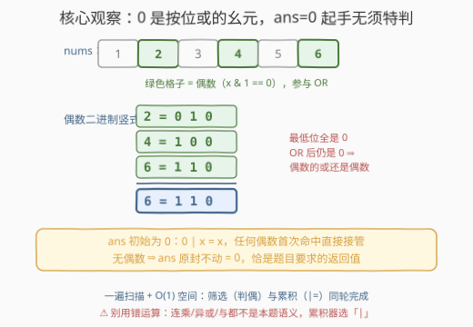
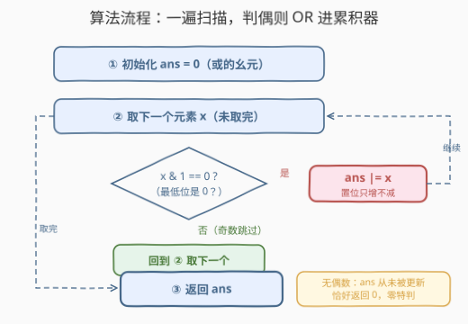

# LeetCode 偶数的按位或运算 题解

## 1. 题目概述

- **标题 / 题号**：偶数的按位或运算（#3688，easy）
- **链接**：https://leetcode.cn/problems/bitwise-or-of-even-numbers-in-an-array/
- **难度**：简单
- **标签**：位运算、数组、模拟

**题意**：给定一个整数数组 `nums`，返回其中**所有偶数**的按位**或**运算结果；若数组中没有偶数，返回 `0`。

**示例 1**：

```text
输入：nums = [1,2,3,4,5,6]
输出：6
解释：偶数为 2、4 和 6。2 | 4 | 6 = 6。
```

**示例 2**：

```text
输入：nums = [7,9,11]
输出：0
解释：数组中没有偶数，返回 0。
```

**示例 3**：

```text
输入：nums = [1,8,16]
输出：24
解释：偶数为 8 和 16。8 | 16 = 24。
```

**约束**：

- $1 \le \mathrm{nums.length} \le 100$
- $1 \le \mathrm{nums}[i] \le 100$

> 💡 **审题关键**：① 只把**偶数**纳入运算，奇数直接跳过；② 累积运算符是**按位或** `|`，不是异或、也不是按位与；③ 没有偶数返回 `0`——这个 `0` 不是随手规定的失败值，恰是按位或的**幺元**，下文会看到它让代码完全不需要特判。

## 2. 解题思路

### 2.1 朴素思路：先筛选、再归并

最直白的做法分两步：先把偶数收集到一个临时数组 `evens` 里，再对 `evens` 做一次折叠（fold）求所有元素的按位或；`evens` 为空则返回 `0`。

这当然正确，但多了 $O(n)$ 的临时数组和一次显式的"空数组判断"——**筛选和累积其实可以在同一轮循环里完成**，连"没有偶数"的分支也一并省掉。

### 2.2 核心观察：0 是按位或的幺元，起手无须特判



两个关键性质让一遍扫描 + 零特判成为可能：

- **幺元性质**：$0 \,|\, x = x$ 对任意 $x$ 成立。把累积器 `ans` 初始化为 $0$，第一个偶数直接"接管"答案；若从头到尾没有偶数，`ans` 原封不动保持 $0$——**恰好就是题目要求的返回值**，"没有偶数返回 0"的分支被初始值天然吸收。
- **判偶的位运算写法**：$x$ 是偶数 $\iff$ 二进制最低位为 $0$ $\iff$ `x & 1 == 0`，一次与运算代替取模，与本题的位运算主题一脉相承。

顺着竖式还能多看一个有趣的事实：偶数的二进制**最低位（bit 0）必然是 0**，而 OR 只会把位从 $0$ 变 $1$、绝不反向，所以所有操作数的 bit 0 全为 $0$ 时，结果的 bit 0 也是 $0$——**偶数的按位或结果必为偶数**（示例 1 的 $6$、示例 3 的 $24$ 都是佐证）。本题当然不需要这个结论，但它印证了 OR 的**单调性**：随着累积进行，`ans` 的置位集合只增不减。

> ⚠️ **别选错累积器**：异或 `^`、按位与 `&`、加法都不是本题语义。尤其异或——1486 题的肌肉记忆会让人顺手写 `^=`，偶数 $2 \oplus 4 \oplus 6 = 0$，直接错。

### 2.3 算法流程：一遍扫描，判偶则 OR 进累积器



| 步骤 | 操作 | 说明 |
|------|------|------|
| ① 初始化 | `ans = 0` | 按位或的幺元，兼作"无偶数"的返回值 |
| ② 扫描 | 依次取 $x \in \mathrm{nums}$ | 筛选与累积同轮完成 |
| ③ 判偶 | `x & 1 == 0`？ | 最低位为 0 即偶数 |
| ④ 累积 | 偶数则 `ans \|= x` | 置位只增不减；奇数跳过 |
| ⑤ 返回 | 扫描结束返回 `ans` | 无偶数时 `ans` 保持 0，零特判 |

### 2.4 示例演算

**示例 1：`nums = [1,2,3,4,5,6]`**

```text
ans = 0
x=1（奇）跳过；x=2 → ans = 0|010 = 010 = 2
x=3（奇）跳过；x=4 → ans = 010|100 = 110 = 6
x=5（奇）跳过；x=6 → ans = 110|110 = 110 = 6
返回 6 ✓
```

**示例 3：`nums = [1,8,16]`**

```text
ans = 0
x=1（奇）跳过；x=8  → ans = 0|01000 = 01000 = 8
x=16 → ans = 01000|10000 = 11000 = 24
返回 24 ✓
```

**示例 2：`nums = [7,9,11]`**——全程无偶数，`ans` 从未被更新，返回初始值 `0` ✓。

## 3. 参考代码

### C++

```cpp
class Solution {
public:
    int evenNumberBitwiseORs(vector<int>& nums) {
        int ans = 0;                       // 0 是按位或的幺元
        for (int x : nums)
            if ((x & 1) == 0)              // 最低位为 0 ⇒ 偶数
                ans |= x;                  // 置位只增不减
        return ans;                        // 无偶数时恰返回 0
    }
};
```

### Python

```python
class Solution:
    def evenNumberBitwiseORs(self, nums: List[int]) -> int:
        ans = 0                            # 0 是按位或的幺元
        for x in nums:
            if x & 1 == 0:                 # 最低位为 0 ⇒ 偶数
                ans |= x                   # 置位只增不减
        return ans                         # 无偶数时恰返回 0
```

> 💡 **写法要点**：`(x & 1) == 0` 的括号不能省——C++ 里 `==` 优先级高于 `&`，`x & 1 == 0` 会被解析成 `x & (1 == 0)` 即 `x & 0`，恒为 0（假），一个偶数都收不进去。Python 虽有运算符优先级保护，加上括号同样更清晰。

## 4. 复杂度分析

| 维度 | 复杂度 | 说明 |
|------|--------|------|
| **时间复杂度** | $O(n)$ | 一遍扫描，每个元素一次判偶、至多一次或运算 |
| **空间复杂度** | $O(1)$ | 只用一个累积器，无临时数组 |

## 5. 扩展：一行折叠写法与对称变体

**一行折叠**：Python 里可以用 `functools.reduce` 把"筛选 + 累积"压缩成表达式，初始值 `0` 显式落在参数里：

```python
from functools import reduce
from operator import or_

class Solution:
    def evenNumberBitwiseORs(self, nums: List[int]) -> int:
        return reduce(or_, (x for x in nums if x % 2 == 0), 0)
```

C++17 起对应的是 `std::accumulate` 配 `std::bit_or<>{}` 与初始值 `0`。注意**初始值参数不可省略**——空序列没有幺元时 `reduce` 直接抛异常，而显式传 `0` 恰好复刻了"无偶数返回 0"的语义。

**对称变体**：若改成"所有奇数的按位或"，奇数 bit 0 恒为 $1$，只要存在奇数，结果的 bit 0 必为 $1$——**奇数的或必为奇数**，且答案 $\ge 1$；全部为偶数时才返回幺元 $0$。判偶条件换成 `x & 1` 即可，骨架一字不改。

**为什么 OR 可以在线累积**：OR 满足交换律与结合律，且结果只依赖"每个位上是否出现过 $1$"、与参与顺序无关——所以无须排序、无须分组，流式地遇到一个或一个即可。

## 6. 面试要点

**Q1：为什么不需要"没有偶数"的特判？**

> 按位或的幺元是 $0$：$0 \,|\, x = x$。累积器初始化为 $0$，第一个偶数直接接管；若始终没有偶数，累积器原样保持 $0$，正是题目规定的返回值——"空集的或"在数学上就定义为幺元。

**Q2：`x & 1 == 0` 和 `x % 2 == 0` 判偶有什么区别？**

> 语义等价（非负整数域内），位运算版不涉及除法、对负数也无歧义（如 `-4 & 1 == 0` 成立）。本题约束 $x \ge 1$ 两者均可；作为位运算标签的题目，`& 1` 更贴题。真正要小心的是 C++ 里 `==` 优先级高于 `&`，`(x & 1) == 0` 的括号必写。

**Q3：把 `|=` 误写成 `^=` 会怎样？**

> 异或没有"只增不减"的单调性：$2 \oplus 4 \oplus 6 = 0$，示例 1 会输出 $0$ 而非 $6$。本题题面每个字都在强调 **或**，笔试中这类"运算符抄错"的失分远多于算法本身。

**Q4：偶数的按位或结果一定是偶数吗？**

> 是。偶数的 bit 0 全为 $0$，OR 不会把任何位从 $1$ 变 $0$，也不会把 $0$ 变 $1$ 的方向搞反——全 $0$ 的位上或出来仍是 $0$，故结果最低位为 $0$。推论：答案要么是 $0$（无偶数），要么是不小于最大偶数的某个偶数。

**Q5：如果要返回所有偶数的按位**与**呢？**

> 骨架不变，累积器换成 `&=`，但**初始值不能再取 0**（$0 \,\&\, x = 0$，会把答案锁死在 0）——须取全 1（如 `~0` / `-1`），并显式处理"无偶数"分支。幺元随运算符变化，这题正好考察这一点。

> 💡 **一句话总结**：3688 = 判偶（`x & 1 == 0`）筛选 + `|=` 在线累积的一遍扫描，初始值取幺元 0 把"无偶数"分支吸收掉，$O(n)$ / $O(1)$ 收工。

## 同类练习题

| # | 题目 | 与本题的关联 |
|---|------|-------------|
| 1486 | [数组异或操作](https://leetcode.cn/problems/xor-operation-in-an-array/) | 同款"一遍循环 + 位运算累积"，累积器从 `\|=` 换成 `^=`，对照体会运算符语义差异 |
| 2595 | [奇偶位数](https://leetcode.cn/problems/number-of-even-and-odd-bits/) | 按位下标的奇偶分类统计，巩固"逐位看二进制"的视角 |
| 191 | [位1的个数](https://leetcode.cn/problems/number-of-1-bits/) | 位运算基本功，`n & (n-1)` 消最低置位的经典手法 |
| 231 | [2 的幂](https://leetcode.cn/problems/power-of-two/) | 判"二进制恰有一个置位"，与本题"最低位判偶"同属单点位检查 |
| 136 | [只出现一次的数字](https://leetcode.cn/problems/single-number/) | 异或累积的招牌应用，体会不同位运算符的"累积吸收律" |
