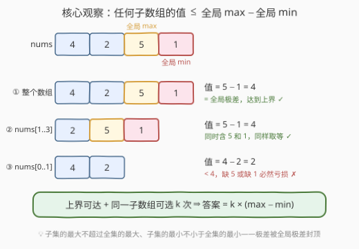
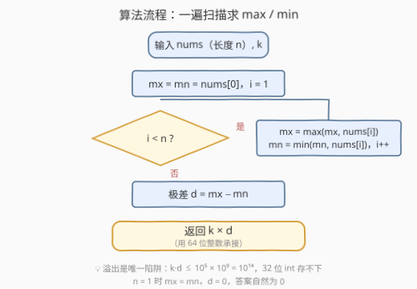

# 最大子数组总值I

- **题目名称**：最大子数组总值I
- **链接**：[3689. 最大子数组总值 I](https://leetcode.cn/problems/maximum-total-subarray-value-i/)
- **难度**：中等
- **标签**：贪心、数组

## 1. 题目概述

给定一个长度为 $n$ 的整数数组 `nums` 和一个整数 $k$。

你必须从 `nums` 中选择**恰好 $k$ 个**非空子数组 `nums[l..r]`。子数组可以重叠，**同一个子数组（相同的 $l$ 和 $r$）可以被选择超过一次**。

子数组 `nums[l..r]` 的**值**定义为 $\max(\text{nums}[l..r]) - \min(\text{nums}[l..r])$。

**总值**是所有被选子数组的**值**之和。返回你能实现的**最大**可能总值。

**示例 1**：

```text
输入：nums = [1,3,2], k = 2
输出：4
解释：选 nums[0..1] = [1,3]，值为 3 - 1 = 2；
     再选 nums[0..2] = [1,3,2]，值仍为 3 - 1 = 2。
     总和为 2 + 2 = 4。
```

**示例 2**：

```text
输入：nums = [4,2,5,1], k = 3
输出：12
解释：选 nums[0..3]、nums[1..3]、nums[2..3]，三个子数组都同时含 5 和 1，
     值均为 5 - 1 = 4。总和为 4 + 4 + 4 = 12。
```

**约束条件**：

- $1 \le n = \text{nums.length} \le 5 \times 10^4$
- $0 \le \text{nums[i]} \le 10^9$
- $1 \le k \le 10^5$

> 💡 **审题关键**：① 子数组可重叠、**同一个子数组可重复选**——"恰好 $k$ 个"的约束形同虚设，把最优子数组复制 $k$ 遍即可；② 子数组的**值**只取决于其内部的最大值与最小值，与长度、位置无关；③ 数值范围要警惕：$k \times (\max - \min)$ 最高约 $10^5 \times 10^9 = 10^{14}$，超出 32 位整数，C++/Java 必须 64 位承接。

---

## 2. 解题思路

### 2.1 暴力思路

最朴素的做法是**枚举所有子数组再组合**：共有 $\binom{n+1}{2} \approx \frac{n^2}{2}$ 个子数组，先对每个子数组花 $O(n)$ 或 $O(1)$（借助预处理）求出 $\max - \min$，再从中**可重复地**选 $k$ 个使总和最大。选择这一步很简单——既然可重复，直接把值最大的那个选 $k$ 遍；瓶颈在于候选集本身就有 $O(n^2) \approx 1.25 \times 10^9$ 个，逐个求值就已经超时。

但暴力的尽头已经暗示了答案：**既然"可重复选"意味着最终只会用值最大的那个子数组，那问题就坍缩为"哪个子数组的值最大"**——这不需要枚举，一条不等式就能封顶。

### 2.2 核心观察：全局极差是每个子数组值的上界



把观察串成一条链：

- **观察一（子集极值被全集封顶）**：任何子数组是全集的子集，故 $\max(\text{nums}[l..r]) \le \max(\text{nums})$ 且 $\min(\text{nums}[l..r]) \ge \min(\text{nums})$，于是**任何**子数组的值
  $$\max(\text{nums}[l..r]) - \min(\text{nums}[l..r]) \le \max(\text{nums}) - \min(\text{nums}) = D$$
  其中 $D$ 是全局极差；
- **观察二（上界可达）**：子数组取**整个数组** `nums[0..n-1]` 时，最大值、最小值就是全局最大、最小值，值恰好等于 $D$——上界不是"贴近"，是**精确取到**；
- **观察三（可重复 ⇒ 直接吃满）**：同一个子数组可选多次，而"恰好 $k$ 个"没有数量上限压力，于是把整个数组连选 $k$ 次，总值恰为 $k \times D$，一步到达理论最大值。

三条观察叠加，答案是闭式一行：

$$\text{ans} = k \times \left(\max(\text{nums}) - \min(\text{nums})\right)$$

> ⚠️ $n = 1$ 时 $\max = \min$，$D = 0$，答案为 $0$——公式自动覆盖，无需特判；真正的"特判"是**溢出**（见 2.3）。

### 2.3 算法流程



| 步骤 | 操作 | 说明 |
|------|------|------|
| ① 初始化 | `mx = mn = nums[0]` | 约束保证 $n \ge 1$，无空数组 |
| ② 扫描 | 遍历更新 `mx`、`mn` | 一遍 $O(n)$ 同时维护两个极值 |
| ③ 求极差 | `d = mx - mn` | $\text{nums[i]} \le 10^9$，差值本身不溢出 |
| ④ 返回 | `k * d` | **必须 `long long`**：$k \cdot d \le 10^{14}$ |

### 2.4 示例演算

| 输入 | $\max$ | $\min$ | 极差 $D$ | 答案 $k \times D$ |
|------|--------|--------|----------|-------------------|
| `nums = [1,3,2], k = 2` | 3 | 1 | 2 | $2 \times 2 = 4$ ✓ |
| `nums = [4,2,5,1], k = 3` | 5 | 1 | 4 | $3 \times 4 = 12$ ✓ |
| `nums = [7], k = 10^5` | 7 | 7 | 0 | $0$（单元素无差值） |

两个官方示例的"选法"其实都不唯一——示例 2 里三个子数组只要**同时圈住 5 和 1**，值全是 4；这正是观察二的体现：取等的子数组有一大片，但值都一样，无需关心具体选哪几个。

---

## 3. 参考代码

### C++

```cpp
class Solution {
public:
    long long maxTotalValue(vector<int>& nums, int k) {
        int mx = nums[0], mn = nums[0];
        for (int x : nums) {                 // ② 一遍扫描维护极值
            mx = max(mx, x);
            mn = min(mn, x);
        }
        return (long long)k * (mx - mn);     // ④ 显式转 64 位，防溢出
    }
};
```

### Python

```python
class Solution:
    def maxTotalValue(self, nums: List[int], k: int) -> int:
        return k * (max(nums) - min(nums))
```

Python 整数任意精度，无溢出之虞，一行收工；`max(nums)`、`min(nums)` 各扫一遍，共 $O(n)$。

---

## 4. 复杂度分析

| 维度 | 复杂度 | 说明 |
|------|--------|------|
| **时间复杂度** | $O(n)$ | 一遍扫描同时求 $\max$ 与 $\min$；$n \le 5 \times 10^4$ 瞬间完成 |
| **空间复杂度** | $O(1)$ | 只维护 `mx`、`mn` 两个变量 |

---

## 5. 扩展：3691 最大子数组总值 II（Hard）

把"同一个子数组可以选超过一次"改成"**k 个子数组必须互不相同**"，就得到本题的 Hard 版 [3691. 最大子数组总值 II](https://leetcode.cn/problems/maximum-total-subarray-value-ii/)——闭式公式当场失效，因为值等于 $D$ 的子数组数量有限，未必够选 $k$ 个。

II 版的正确方向仍是"**优先选同时含全局 max 和全局 min 的子数组**"，只是要数清楚**够不够**：

- 设 $L$ 为「最靠左的全局 max 位置」与「最靠左的全局 min 位置」中的较小者，$R$ 为「最靠右的全局 max 位置」与「最靠右的全局 min 位置」中的较大者，则同时包含全局 max 和 min 的子数组共有 $(L+1) \times (n - R)$ 个（左端点任取 $0..L$，右端点任取 $R..n-1$），每个值都是 $D$；
- 若个数 $\ge k$，答案仍是 $k \times D$（I 版结论在 II 版的存活条件）；
- 否则先用满这批"满分"子数组，再贪心补充**次优**子数组（值第二大的那批），需要按极差从大到小逐层计数/求解，实现复杂度显著上升。

对比记忆：**"可重复"让 I 版退化成一行公式；"不可重复"逼 II 版去数上界子数组的个数**——一字之差，难度从 Medium 跳到 Hard，这也是本题最值得积累的出题套路。

---

## 6. 面试要点

**Q1：「恰好 k 个」听起来很强，为什么实际上毫无约束力？**

> 因为同一个子数组（相同的 $l,r$）允许被选超过一次。可重复选择意味着候选解是"多重集"，最优策略永远是**把值最大的子数组复制 $k$ 遍**，"恰好 $k$ 个"只是规定了复制次数，不构成任何优化阻力。

**Q2：贪心答案 $k \times (\max - \min)$ 的正确性怎么证？**

> 上界 + 构造，两步闭环。上界：子数组的最大值不超过全局最大值、最小值不小于全局最小值，故任何子数组的值 $\le D$（全局极差），$k$ 个的总值 $\le kD$。构造：整个数组作为子数组值恰为 $D$，连选 $k$ 次取到 $kD$。上界与构造重合，即最优。

**Q3：这题最可能 WA / RE 的点在哪？**

> **溢出**。$k \le 10^5$、极差 $\le 10^9$，乘积达 $10^{14}$，远超 `int` 上限 $2.1 \times 10^9$。C++/Java 需 `long long`/`long`，且乘法前先转型（`(long long)k * d`，两个 `int` 相乘再转型已经晚了）。Python 无此问题。

**Q4：为什么不用枚举"值最大"的子数组，比如滑动窗口或单调结构？**

> 不需要"找到"具体子数组，只需要它的值。而值的上界由全局极差一步给出，且整个数组必取等——枚举任何候选都是多余功。识别"问题只问量、不问方案"是本题的考点。

**Q5：如果子数组必须互不相同（3691 II 版），思路怎么迁移？**

> 核心不变：值等于 $D$ 的子数组仍然最优，但数量有限，需先统计同时包含全局 max 与 min 的子数组个数 $(L+1)(n-R)$；够 $k$ 个答案不变，不够则贪心补次优层。I 版结论是 II 版的"充足供给"特例。

> 💡 **一句话总结**：3689 = **全局极差封顶 + 上界可达 + 可重复选**，三件事合成一行 $k \times (\max - \min)$；考场上先把"可重复"圈出来，再警惕 64 位溢出，其余都是纸老虎。

---

## 7. 同类练习题

- [53. 最大子数组和](https://leetcode.cn/problems/maximum-subarray/)：单子数组最优化的经典（Kadane），对比"选一次"与本题"可选 k 次"的自由度差异
- [2016. 增量元素之间的最大差值](https://leetcode.cn/problems/maximum-difference-between-increasing-elements/)：单遍维护 max/min 差值的基本功训练
- [2551. 将石子放入袋子](https://leetcode.cn/problems/put-marbles-in-bags/)：max − min 型贡献拆分 + 排序贪心，"极差思维"的高阶应用
- [1509. 三次操作后最大值与最小值的最小差](https://leetcode.cn/problems/minimum-difference-between-largest-and-smallest-value-in-three-moves/)：反过来调整全局极差，min/max 结构分析的进阶练习
