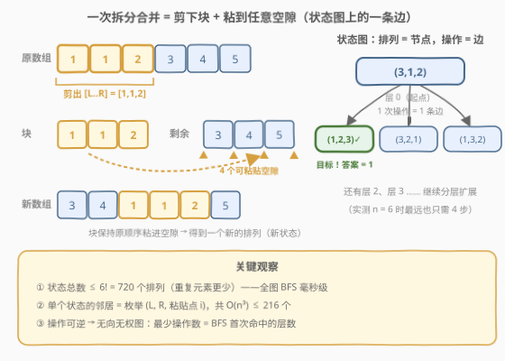
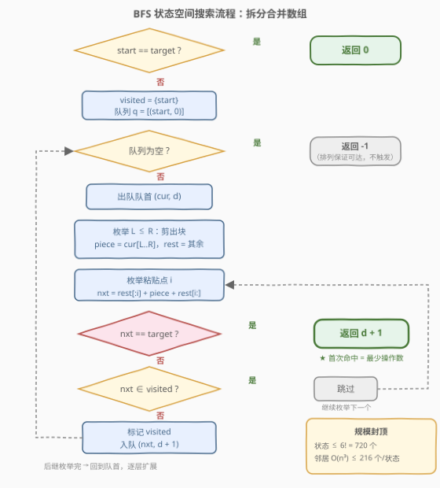

# 拆分合并数组

- **题目名称**：拆分合并数组
- **链接**：[3690. 拆分合并数组](https://leetcode.cn/problems/split-and-merge-array-transformation/)
- **难度**：中等
- **标签**：广度优先搜索（BFS）、哈希表、状态空间搜索

## 1. 题目概述

给你两个长度为 `n` 的整数数组 `nums1` 和 `nums2`。你可以对 `nums1` 执行任意次下述的**拆分合并操作**：

1. 选择一个子数组 `nums1[L..R]`；
2. 将其从数组中移除，留下前缀 `nums1[0..L-1]` 与后缀 `nums1[R+1..n-1]`；
3. 把移除的子数组（**保持原顺序**）重新插入到剩余数组的**任意**位置（任意两个元素之间、最前或最后）。

返回将 `nums1` 转换为 `nums2` 所需的**最少**操作次数。

**示例 1**：

```text
输入：nums1 = [3,1,2], nums2 = [1,2,3]
输出：1
解释：拆出子数组 [3]（L = 0, R = 0），剩余 [1,2]；把 [3] 插到末尾得 [1,2,3]。
```

**示例 2**：

```text
输入：nums1 = [1,1,2,3,4,5], nums2 = [5,4,3,2,1,1]
输出：3
解释：[1,1,2,3,4,5] → [3,4,1,1,2,5] → [3,2,5,4,1,1] → [5,4,3,2,1,1]，共 3 次拆分合并。
```

**约束条件**：

- $2 \le n = \mathrm{nums1.length} = \mathrm{nums2.length} \le 6$
- $-10^5 \le \mathrm{nums1}[i], \mathrm{nums2}[i] \le 10^5$
- `nums2` 是 `nums1` 的一个**排列**（保证可达）。

> 💡 **审题关键**：① $n \le 6$ 是本题最大的提示——**状态空间极小**（至多 $6! = 720$ 个排列）；② 求的是**最少操作次数**，且每次操作代价相同（无权图最短路）——直接联想 **BFS**；③ 操作是**可逆**的：把块从位置 p 剪出插到 q 的逆过程（从 q 剪出插回 p）也是一次合法操作，状态图是无向图；④ `nums2` 是排列保证答案存在，但重复元素会让实际状态数**少于** $6!$（如示例 2 只有 $\frac{6!}{2!} = 360$ 个互异排列）。

---

## 2. 解题思路

### 2.1 暴力思路

最朴素的想法是 DFS 枚举操作序列：每一步枚举 $(L, R)$ 与插入位置，直到变成 `nums2`。但操作序列**没有天然上界**，不去重会无限膨胀；就算用记忆化限制"每种排列只访问一次"，DFS 找到的也不一定是最少次数，还得配合迭代加深才行。

换个视角的"暴力"反而正解：**把整个状态图显式地想出来**。数组的每个排列是图上一个节点，一次拆分合并操作是图上的一条边，问题退化成**无向无权图上起点到终点的最短路**——这正是 BFS 的定义域。

### 2.2 核心观察：数组即节点，操作即边，BFS 按层逼近



**观察一（状态数有上界）**：$n \le 6$，`nums1` 能变成的数组只是这 $n$ 个元素的全排列，互异状态至多 $6! = 720$ 个（有重复元素时更少）。BFS 每个状态只入队一次，总工作量被牢牢封顶。

**观察二（邻居可枚举）**：一个状态的所有后继由三元组 $(L, R, i)$ 决定——剪出块 `cur[L..R]`，拼回剩余数组的第 $i$ 个空隙。$L$ 有 $n$ 种、$R$ 有 $O(n)$ 种、插入点 $i$ 有 $O(n)$ 种，单状态邻居数 $O(n^3) \le 216$。全局转移总数 $\le 720 \times 216 \approx 1.6 \times 10^5$，毫秒级。

**观察三（BFS 层数 = 最少操作数）**：所有操作代价均为 1，图无权；BFS 按"离起点的操作数"分层扩展，**第一次**碰到 `nums2` 时的层数就是答案。实测 $n=6$ 的全部 720 个排列中，任意两排列间的距离最大只有 **4**——BFS 最多展开 5 层就必然出解。

> ⚠️ 一个易忽略的边界：`nums1 == nums2` 时答案是 0 而不是 1，入队前先判等。

### 2.3 算法流程图



| 步骤 | 操作 | 说明 |
|------|------|------|
| ① 判等 | `start == target`？ | 是 → 直接返回 0 |
| ② 初始化 | `visited = {start}`，队列存 `(状态, 层数)` | 状态用 tuple / `vector<int>` 存，可哈希可比较 |
| ③ 出队 | 取出队首 `(cur, d)` | 分层保证 `d` 单调不减 |
| ④ 枚举剪切 | 双重循环 `L ≤ R` | 剪出 `piece = cur[L..R]`，剩余 `rest` |
| ⑤ 枚举粘贴 | `i` 从 0 到 `len(rest)` | `nxt = rest[:i] + piece + rest[i:]` |
| ⑥ 提前判终 | `nxt == target` → 返回 `d + 1` | 生成即查，比"出队再查"早一整层 |
| ⑦ 去重入队 | `nxt ∉ visited` 才标记并入队 | 重复元素会产生相同排列，靠 visited 归并 |

> ⚠️ **细节**：⑥ 中"生成时判终点"比"出队时判终点"更快碰到答案；④⑤ 中 $(L,R,i)$ 存在冗余组合（例如把块原样放回原位得到原状态），无需特判——`visited` 会把无效后继自然过滤掉，代码保持简单。

### 2.4 示例演算

**示例 1：`nums1 = [3,1,2] → nums2 = [1,2,3]`**：

| BFS 层 | 状态 | 说明 |
|--------|------|------|
| 0 | `(3,1,2)` | 起点 |
| 1 | `(1,2,3)` ✓、`(3,2,1)`、`(1,3,2)`、… | 枚举 $(L{=}0,R{=}0,i{=}2)$：剪出 `[3]` 插到 `[1,2]` 末尾即命中目标 |

返回 `0 + 1 = 1` ✓。

**示例 2：`nums1 = [1,1,2,3,4,5] → nums2 = [5,4,3,2,1,1]`**：完全倒置是"最难"的实例之一。BFS 逐层扩展，第 1、2 层均未出现目标（此时最优路径还没铺到），第 3 层生成 `(5,4,3,2,1,1)` 时返回 3 ✓。手动验证一条 3 步路径：

```text
[1,1,2,3,4,5] --剪[1,1,2]插中间--> [3,4,1,1,2,5]
            --剪[4,1,1]插末尾前-->  [3,2,5,4,1,1]
            --剪[3,2]插中间-->      [5,4,3,2,1,1]
```

---

## 3. 参考代码

### C++

```cpp
class Solution {
public:
    int minSplitMerge(vector<int>& nums1, vector<int>& nums2) {
        if (nums1 == nums2) return 0;
        int n = nums1.size();

        set<vector<int>> visited{nums1};          // 已访问状态（≤ 720 个）
        queue<pair<vector<int>, int>> q;
        q.push({nums1, 0});

        while (!q.empty()) {
            auto [cur, d] = q.front();
            q.pop();
            for (int L = 0; L < n; ++L) {
                for (int R = L; R < n; ++R) {
                    vector<int> piece(cur.begin() + L, cur.begin() + R + 1);
                    vector<int> rest(cur.begin(), cur.begin() + L);
                    rest.insert(rest.end(), cur.begin() + R + 1, cur.end());
                    for (int i = 0; i <= (int)rest.size(); ++i) {   // 枚举粘贴点
                        vector<int> nxt = rest;
                        nxt.insert(nxt.begin() + i, piece.begin(), piece.end());
                        if (nxt == nums2) return d + 1;             // 生成即判终
                        if (visited.insert(nxt).second) {
                            q.push({nxt, d + 1});
                        }
                    }
                }
            }
        }
        return -1;  // 本题保证 nums2 是排列，不可达分支不会触发
    }
};
```

### Python

```python
class Solution:
    def minSplitMerge(self, nums1: List[int], nums2: List[int]) -> int:
        start, target = tuple(nums1), tuple(nums2)
        if start == target:
            return 0
        n = len(start)
        visited = {start}
        q = deque([(start, 0)])
        while q:
            cur, d = q.popleft()
            for L in range(n):
                for R in range(L, n):                    # 枚举剪出的块
                    piece = cur[L:R + 1]
                    rest = cur[:L] + cur[R + 1:]
                    for i in range(len(rest) + 1):       # 枚举粘贴点
                        nxt = rest[:i] + piece + rest[i:]
                        if nxt == target:                # 生成即判终
                            return d + 1
                        if nxt not in visited:
                            visited.add(nxt)
                            q.append((nxt, d + 1))
        return -1
```

---

## 4. 复杂度分析

| 维度 | 复杂度 | 说明 |
|------|--------|------|
| **时间复杂度** | $O(S \cdot n^3)$ | $S \le n!$ 为互异状态数（$n=6$ 时 $S \le 720$），单状态枚举 $O(n^3) \le 216$ 个后继，总计约 $1.6 \times 10^5$ 次转移 |
| **空间复杂度** | $O(S \cdot n)$ | `visited` 与队列各存至多 $S$ 个长度为 $n$ 的状态 |

> $n = 6$ 时实测瞬杀。若值域增大不影响复杂度——状态只依赖**排列结构**，与元素绝对值无关；重复元素只会让 $S$ 变小。

---

## 5. 扩展：断点下界与双向 BFS

**断点下界（为什么贪心难做对）**。称相邻位置对 `(cur[i], cur[i+1])` 为**正确相邻**，若它也作为相邻对（同顺序）出现在 `nums2` 中；其余相邻对是**断点**。一次拆分合并恰好破坏 3 条旧邻接边（块首与前驱、块尾与后继、粘贴点两侧），新建 3 条新边，因此**正确相邻数每次至多 +3**。若初始有 $b$ 个断点，则答案 $\ge \lceil b/3 \rceil$。实测（$n = 5, 6$ 全排列）该下界**可采纳但不紧**：最多比真实距离小 2（示例 2 中 $b = 4$，下界 2，真实答案 3）。正因为下界不紧、断点贪心会被卡，小状态空间下 BFS 才是最稳的最优解；而这个 $\lceil b/3 \rceil$ 正好可以在 $n$ 更大时充当 **IDA\*** 的可采纳启发式。

**双向 BFS**。由观察三，操作可逆 ⇒ 状态图是无向图，距离对称：$d(s \to t) = d(t \to s)$（实测 `[5,4,3,2,1,1] → [1,1,2,3,4,5]` 同样是 3）。于是可以交替从两端扩展较小的一侧，把搜索树从 $b^d$ 压到 $2 \cdot b^{d/2}$。本题 $S \le 720$ 用不上，但若 $n$ 放宽到 8~9（$8! = 40320$，$9! \approx 3.6 \times 10^5$）就值得上桌。

**一个有趣的事实**：对 $n = 2 \sim 6$ 全排列做全源 BFS，直径分别为 $1, 2, 3, 3, 4$——即 6 个元素无论多乱，**至多 4 次拆分合并**必能变成任意目标排列。

---

## 6. 面试要点

**Q1：为什么用 BFS 而不是 DP 或贪心？**

> 求的是无权图上的最少操作次数：所有转移代价相等，BFS 第一次到达终点即为最短。DP 需要子问题最优结构，但"中间排列"之间没有可分解的序；贪心的断点启发（每次修复最多断点）没有可采纳性保证（2.2 / 第 5 节的下界不紧），局部最优会错过全局最优。

**Q2：状态空间到底多大？重复元素有什么影响？**

> 至多 $n!$ 个排列，$n = 6$ 时 720。重复元素使互异排列数按多重集计数收缩（如示例 2 只有 $6!/2! = 360$ 个），`visited` 集合会自动把不同 $(L,R,i)$ 导出的相同结果归并，代码无需任何特判。

**Q3：一次操作的后继怎么枚举？共多少个？**

> 三重循环 $(L, R, i)$：剪出 `cur[L..R]`，剩余 `rest`，插入到 `rest` 的第 `i` 个空隙（$0 \le i \le \mathrm{len}(rest)$）。共 $O(n^3) \le 216$ 个组合，其中含冗余（放回原位），靠 `visited` 自然去重即可，不必前置剪枝。

**Q4：为什么操作是可逆的？这个性质有什么用？**

> 把块从空隙 $g_1$ 剪出插入空隙 $g_2$ 的逆操作，就是把同一块从 $g_2$ 剪出插回 $g_1$——仍是合法的拆分合并。因此状态图无向、距离对称。用途：① 支持双向 BFS；② 扩展到"只能向后插"等受限变体时，可逆性是首先需要重新审视的前提。

**Q5：面试官追问 n 放大到 10+ 怎么办？**

> $10! \approx 3.6 \times 10^6$，单向 BFS 状态数尚可但邻居 $O(n^3)$ 使转移近 $10^9$。三板斧：双向 BFS（无向图成立）；IDA\* 配可采纳启发 $\lceil b/3 \rceil$（$b$ 为断点数）；状态编码成全排列的排名（康托展开）配合数组代替哈希集合。再往上就是基因组重排里的 transposition distance 问题——已知是 NP-hard 邻域，别指望多项式精确解。

> 💡 **一句话总结**：3690 = 把"每次操作代价为 1"识别成无权图最短路 + 把"n ≤ 6"识别成状态空间封顶（≤ 6! 个排列）+ BFS 按层扩展、visited 去重、生成即判终。

---

## 7. 同类练习题

- [773. 滑动谜题](https://leetcode.cn/problems/sliding-puzzle/)：BFS 状态空间搜索的母题，棋盘排列即状态，与本题"排列即节点"完全同构
- [752. 打开转盘锁](https://leetcode.cn/problems/open-the-lock/)：最少操作次数 → 隐式图 BFS，练习状态编码与 visited 去重的基本功
- [2059. 转化数字的最小运算数](https://leetcode.cn/problems/minimum-operations-to-convert-number/)：转移代价全为 1 的无权图 BFS，"生成即判终"的提前返回写法
- [864. 获取所有钥匙的最短路径](https://leetcode.cn/problems/shortest-path-to-get-all-keys/)：状态 = 位置 + 钥匙 bitmask，体会"状态不只是一种排列"的泛化
- [1263. 推箱子](https://leetcode.cn/problems/minimum-moves-to-move-a-box-to-their-target-location/)：复合状态（人 + 箱子）BFS，进阶练习最小步数建模
