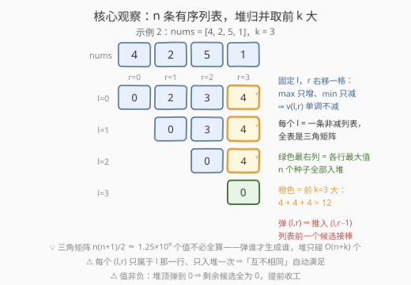
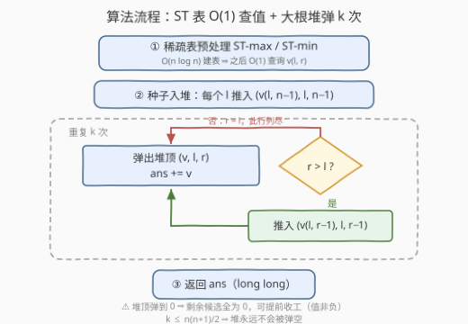

# LeetCode 最大子数组总值II 题解

## 1. 题目概述

- **标题 / 题号**：最大子数组总值II（#3691，hard）
- **链接**：https://leetcode.cn/problems/maximum-total-subarray-value-ii/
- **难度**：困难
- **标签**：贪心、线段树、数组、堆（优先队列）

**题意**：给你一个长度为 $n$ 的整数数组 `nums` 和一个整数 $k$。

你必须从 `nums` 中选择**恰好 $k$ 个互不相同**的子数组 `nums[l..r]`。子数组可以重叠，但**同一个子数组（相同的 $l$ 和 $r$）不能被选择超过一次**。

子数组的**值**定义为 $\max(\text{nums}[l..r]) - \min(\text{nums}[l..r])$。

**总值**是所有被选子数组的**值**之和。返回你能实现的**最大**可能总值。

**示例 1**：

```text
输入：nums = [1,3,2], k = 2
输出：4
解释：选 nums[0..1] = [1,3]，值为 3 - 1 = 2；
     再选 nums[0..2] = [1,3,2]，值仍为 3 - 1 = 2。
     总和为 2 + 2 = 4。
```

**示例 2**：

```text
输入：nums = [4,2,5,1], k = 3
输出：12
解释：选 nums[0..3]、nums[1..3]、nums[2..3]，三个子数组都同时含 5 和 1，
     值均为 5 - 1 = 4。总和为 4 + 4 + 4 = 12。
```

**约束**：

- $1 \le n = \text{nums.length} \le 5 \times 10^4$
- $0 \le \text{nums[i]} \le 10^9$
- $1 \le k \le \min(10^5,\ n(n+1)/2)$

> 💡 **审题关键**：① 与 3689（I 版）唯一的差别是「同一子数组不能重复选」——I 版的一行公式 $k \times (\max - \min)$ 当场失效，因为值等于全局极差的子数组**数量有限**，未必够选 $k$ 个；② 值全非负 +「恰好 $k$ 个」⇒ 答案 = 全部 $\frac{n(n+1)}{2}$ 个子数组值中的**前 $k$ 大之和**；③ 候选多达 $\approx 1.25 \times 10^9$ 个，但 $k \le 10^5$——只要前 $k$ 大，不必全算；④ 总值上界 $10^5 \times 10^9 = 10^{14}$，必须用 `long long`。

## 2. 解题思路

### 2.1 暴力思路

枚举全部 $\binom{n+1}{2} \approx 1.25 \times 10^9$ 个子数组：$l$ 从左到右、$r$ 向右扩时顺路维护 max/min，每个值 $O(1)$ 得到；再排序取前 $k$ 大求和。$n = 5 \times 10^4$ 时光是求值就要 $\sim 10^9$ 次操作，排序更是 $O(n^2 \log n)$，彻底超时。

瓶颈不在「怎么求值」而在「候选太多」：$k \le 10^5 \ll \frac{n^2}{2}$，我们只需要前 $k$ 大。突破口是**单调性**——它能把 $O(n^2)$ 个候选压缩成 $n$ 条有序列表。

### 2.2 核心观察：固定 l 的值随 r 单调不减 → n 条有序列表堆归并取前 k 大



- **观察一（单调性）**：固定 $l$，把 $r$ 右移一格，窗口只会变大：$\max$ 只增不减、$\min$ 只减不增，于是 $v(l, r) \le v(l, r+1)$。因此每个左端点对应一条**非减有序列表** $v(l,l) \le v(l,l+1) \le \cdots \le v(l, n-1)$，整张值表是一个「向右、向下都不减」的三角矩阵；
- **观察二（问题转化）**：答案 = $\frac{n(n+1)}{2}$ 个值中的前 $k$ 大之和 ⇔ **从 $n$ 条有序列表里归并取前 $k$ 大**——373/378 的经典堆套路：每条列表只暴露当前最大值，全局最大者必在堆顶；
- **观察三（O(1) 求值）**：$v(l,r)$ = 区间 $\max$ 减区间 $\min$，用**稀疏表**（ST 表）$O(n \log n)$ 预处理、$O(1)$ 查询（标签里的「线段树」就是这个工具位——纯静态查询，ST 表更轻量）。

堆归并的具体动作：

- **种子**：每条列表的最大值就是最右端 $v(l, n-1)$，把 $n$ 个 $(v(l,n-1),\, l,\, n-1)$ 全部入堆；
- **弹推**：每次弹出堆顶 $(v, l, r)$，累加 $v$；该列表剩下的最大候选是前一个 $v(l, r-1)$，若 $r > l$ 则推入；
- **弹满 $k$ 次**即得前 $k$ 大之和。

**正确性（不变式 + 归纳）**：任意时刻，堆中恰含每条列表「尚未被弹出的最大元素」（初始 = 最右端；弹出 $(l,r)$ 后，该列表的最大未弹出者变为 $(l,r-1)$，恰好被推入），故堆顶永远是全局剩余最大值。归纳可得第 $i$ 次弹出的就是全局第 $i$ 大，弹 $k$ 次恰取前 $k$ 大。

**互异性自动满足**：每个 $(l, r)$ 只属于 $l$ 那一条列表、只会被推入一次、弹出一次，天然不重复、不遗漏——「互不相同的子数组」这个约束零成本满足。

> ⚠️ **提前收工**：值非负，若堆顶弹到 $0$，说明剩余候选全为 $0$，后面全是加 $0$，直接结束；约束 $k \le \frac{n(n+1)}{2}$ 保证堆永远不会被弹空。

### 2.3 算法流程



| 步骤 | 操作 | 说明 |
|------|------|------|
| ① 预处理 | 建 ST-max / ST-min 两张稀疏表 | $O(n \log n)$；之后任意 $v(l,r)$ 均 $O(1)$ |
| ② 种子入堆 | 对每个 $l$ 推入 $(v(l, n-1),\ l,\ n-1)$ | $n$ 条列表各自的最大值 |
| ③ 循环 k 次 | 弹堆顶 $(v, l, r)$，`ans += v` | 堆顶即全局剩余最大值 |
| ④ 回推 | 若 $r > l$，推入 $(v(l, r-1),\ l,\ r-1)$ | 该列表前一个候选接棒 |
| ⑤ 返回 | 输出 `ans` | `long long`，上界 $10^{14}$ |

### 2.4 示例演算

以示例 2 `nums = [4,2,5,1], k = 3` 演算（种子 = 最右列 $v(l,3)$）：

| 步 | 弹出 $(v, l, r)$ | ans | 推入 $(v', l, r-1)$ | 堆中剩余（值） |
|----|------------------|-----|---------------------|----------------|
| 种子 | — | $0$ | — | $4, 4, 4, 0$ |
| 1 | $(4, 0, 3)$ | $4$ | $(3, 0, 2)$ | $4, 4, 3, 0$ |
| 2 | $(4, 1, 3)$ | $8$ | $(3, 1, 2)$ | $4, 3, 3, 0$ |
| 3 | $(4, 2, 3)$ | $12$ | $(0, 2, 2)$ | $3, 3, 0, 0$ |

弹满 $k=3$ 次，返回 $12$ ✓——被选中的三个子数组正是官方解的 `nums[0..3]、nums[1..3]、nums[2..3]`（平值时先弹哪个由实现决定，不影响结果）。

## 3. 参考代码

### C++

```cpp
class Solution {
public:
    long long maxTotalValue(vector<int>& nums, int k) {
        int n = nums.size();
        int LOG = 1;
        while ((1 << LOG) <= n) LOG++;
        vector<vector<int>> mx(LOG, vector<int>(n)), mn(LOG, vector<int>(n));
        for (int i = 0; i < n; i++) mx[0][i] = mn[0][i] = nums[i];
        for (int j = 1; j < LOG; j++) {                // ① ST 表：区间 max/min
            int half = 1 << (j - 1);
            for (int i = 0; i + (1 << j) <= n; i++) {
                mx[j][i] = max(mx[j - 1][i], mx[j - 1][i + half]);
                mn[j][i] = min(mn[j - 1][i], mn[j - 1][i + half]);
            }
        }
        auto val = [&](int l, int r) {                 // O(1) 查 v(l,r)
            int d = 31 - __builtin_clz(r - l + 1);
            return max(mx[d][l], mx[d][r - (1 << d) + 1])
                 - min(mn[d][l], mn[d][r - (1 << d) + 1]);
        };
        priority_queue<tuple<int, int, int>> pq;       // 大根堆 (值, l, r)
        for (int l = 0; l < n; l++)                    // ② 种子：各行最大值
            pq.emplace(val(l, n - 1), l, n - 1);
        long long ans = 0;
        while (k-- > 0 && !pq.empty()) {               // ③ 弹 k 次
            auto [v, l, r] = pq.top(); pq.pop();
            if (v == 0) break;                         // 剩余候选全为 0，提前收工
            ans += v;
            if (r > l)                                 // ④ 回推前一个候选
                pq.emplace(val(l, r - 1), l, r - 1);
        }
        return ans;                                    // ⑤ long long 承接
    }
};
```

### Python

```python
import heapq

class Solution:
    def maxTotalValue(self, nums: List[int], k: int) -> int:
        n = len(nums)
        LOG = 1
        while (1 << LOG) <= n:
            LOG += 1
        mx, mn = [nums[:]], [nums[:]]              # ① ST 表：区间 max / min
        for j in range(1, LOG):
            half, m = 1 << (j - 1), n - (1 << j) + 1
            mx.append([max(mx[-1][i], mx[-1][i + half]) for i in range(m)])
            mn.append([min(mn[-1][i], mn[-1][i + half]) for i in range(m)])

        def val(l: int, r: int) -> int:            # O(1) 查 v(l, r)
            d = (r - l + 1).bit_length() - 1
            return max(mx[d][l], mx[d][r - (1 << d) + 1]) \
                 - min(mn[d][l], mn[d][r - (1 << d) + 1])

        heap = [(-val(l, n - 1), l, n - 1) for l in range(n)]   # ② 种子
        heapq.heapify(heap)                        # 小根堆存负值 = 大根堆
        ans = 0
        for _ in range(k):                         # ③ 弹 k 次
            neg, l, r = heapq.heappop(heap)
            if neg == 0:                           # 堆顶为 0 ⇒ 剩余全 0
                break
            ans -= neg
            if r > l:                              # ④ 回推前一个候选
                heapq.heappush(heap, (-val(l, r - 1), l, r - 1))
        return ans
```

实测：$n = 5 \times 10^4$、$k = 10^5$ 的全随机数据，C++ 约 10ms，Python 约 0.7s，均轻松通过。

## 4. 复杂度分析

| 维度 | 复杂度 | 说明 |
|------|--------|------|
| **时间复杂度** | $O(n \log n + (n + k) \log n)$ | ST 表建表 $O(n \log n)$；堆初始化 $n$ 个种子 + $k$ 次弹推，每次 $O(\log n)$；$n = 5 \times 10^4,\ k = 10^5$ 时约 $2.6 \times 10^6$ 次堆调整 |
| **空间复杂度** | $O(n \log n)$ | 两张 ST 表共 $2 \cdot n \cdot \lceil \log_2 n \rceil \approx 1.6 \times 10^6$ 个 int（约 6.4MB）；堆中至多 $n$ 个元素 |

> 💡 与暴力 $O(n^2)$ 的关系：三角矩阵有 $\frac{n(n+1)}{2}$ 个值，堆**只触碰被弹到的** $O(n + k)$ 个——「弹谁才生成谁」正是这套结构对 $k \ll \frac{n^2}{2}$ 的红利。

## 5. 扩展：特判加速、替代路线与 I/II 版对比

**$O(n)$ 特判「满分子数组够不够」**：任何子数组的值不超过全局极差 $D = \max(\text{nums}) - \min(\text{nums})$，而同时含全局 max 位置和全局 min 位置的子数组值恰为 $D$。这批「满分」子数组的个数可 $O(n)$ 容斥数出：总数 $\frac{n(n+1)}{2}$ 减「不含任何 max 位置」「不含任何 min 位置」的子数组数、加回「两者都不含」的子数组数（避开禁位的子数组只能整段落在被禁位置切出的空隙段内，逐段 $\frac{g(g+1)}{2}$ 求和）。若个数 $\ge k$，答案直接为 $k \times D$，堆都不用建——这正是 3689 结论在 II 版的存活条件；不够时才需要堆逐层下探。⚠️ 注意 3689 题解扩展节给出的 $(L+1)(n-R)$（$L$、$R$ 取 max/min 首末位置的较小/较大者）只是这批子数组个数的**下界**而非精确值（如 `nums = [1,5,1]` 按该式得 1，实际为 3），做「够不够」的判据必须用容斥精确计数。

**替代路线：二分第 k 大值 + 计数**：二分阈值 $x$，统计 $v(l,r) \ge x$ 的子数组个数——固定 $l$ 时 $v$ 随 $r$ 单调，可对每个 $l$ 二分最小可行 $r$，单次计数 $O(n \log n)$，总复杂度 $O(n \log n \log V)$，比堆归并慢一截且边界繁琐；但它与 378 的二分解法同构，面试可作为对照路线口述。

**为什么不用线段树/单调队列**：查询是纯静态的区间 max/min，无任何修改——ST 表 $O(1)$ 查询完胜线段树的 $O(\log n)$；单调队列只支持窗口端点单向滑动，而本题的 $r$ 要在任意 $l$ 处任意收缩，不适用。

**I / II 版对比记忆**：「可重复选」（3689）⇒ 值最大的子数组复制 $k$ 遍，答案 $k \times D$ 一行；「互不相同」（3691）⇒ 满分子数组限量供应，退化为前 $k$ 大问题。一字之差，Medium 变 Hard。

## 6. 面试要点

**Q1：为什么固定 $l$ 时 $v(l, r)$ 随 $r$ 单调不减？**

> 窗口从 $[l, r]$ 扩到 $[l, r+1]$ 是超集关系：$\max$ 只增不减、$\min$ 只减不增，差值只增不减。这条单调性把 $O(n^2)$ 个候选压缩成 $n$ 条有序列表，是整套解法的地基。

**Q2：堆归并取前 $k$ 大的正确性怎么证？**

> 不变式 + 归纳：堆中始终是每条列表「尚未弹出的最大元素」，故堆顶 = 全局剩余最大。初始成立（种子 = 最右端）；弹出 $(l,r)$ 后推入 $(l,r-1)$ 恰好维持不变式。故第 $i$ 次弹出即全局第 $i$ 大。与 373「K 对数字」、378「有序矩阵」同一套证明。

**Q3：「互不相同的子数组」这个约束怎么被满足？**

> 结构性保证：每个 $(l, r)$ 唯一属于左端点 $l$ 那条列表，且从 $(l, n-1)$ 到 $(l, l)$ 每个元素只会被推入、弹出各一次。堆归并遍历的「列表元素」与子数组一一对应，天然不重不漏。

**Q4：为什么选 ST 表而不是线段树？**

> 只有静态区间 max/min 查询、没有任何修改。ST 表 $O(1)$ 查询、代码十来行；线段树每次查询 $O(\log n)$、代码量翻几倍。标签里的「线段树」只是这类 RMQ 工具的泛指——能 $O(1)$ 就别 $O(\log n)$。

**Q5：什么时候可以提前退出？会不会把堆弹空？**

> 值非负 ⇒ 堆顶为 $0$ 时，剩余候选（各列表更靠左的更小元素）全为 $0$，直接收工。弹空不会发生：约束保证 $k \le \frac{n(n+1)}{2}$ = 子数组总数 = 堆中最终出现过的元素总数。

> 💡 **一句话总结**：3691 = **单调性把候选压成 n 条有序列表 + ST 表 O(1) 查值 + 大根堆弹 k 次取前 k 大**；「互不相同」被结构自动满足，$O((n+k) \log n)$ 收工。

## 同类练习题

| # | 题目 | 与本题的关联 |
|---|------|-------------|
| 3689 | [最大子数组总值 I](https://leetcode.cn/problems/maximum-total-subarray-value-i/) | 同一子数组可重复选的 Medium 版，答案 $k \times (\max-\min)$ 一行，对照体会「互不相同」的代价 |
| 373 | [查找和最小的 K 对数字](https://leetcode.cn/problems/find-k-pairs-with-smallest-sums/) | 「n 条有序列表取前 k」堆归并套路的祖师爷，不变式证明同款 |
| 378 | [有序矩阵中第 K 小的元素](https://leetcode.cn/problems/kth-smallest-element-in-a-sorted-matrix/) | 行列皆有序取第 k 小，堆归并与二分计数双解，对应本题扩展节的对照路线 |
| 23 | [合并 K 个升序链表](https://leetcode.cn/problems/merge-k-sorted-lists/) | k 路归并堆的经典载体，「每路只暴露当前最大」思想的源头 |
| 239 | [滑动窗口最大值](https://leetcode.cn/problems/sliding-window-maximum/) | 区间最值的另一经典结构（单调队列），与 ST 表互为补充，理解各自适用边界 |
