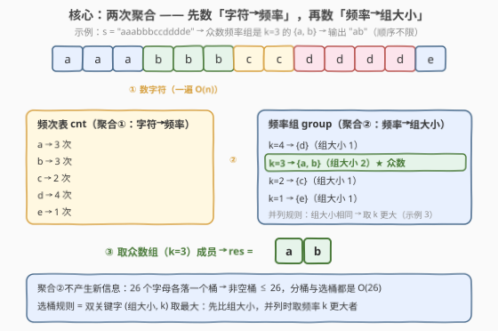
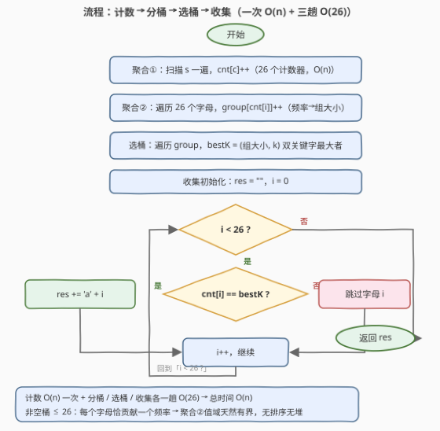

# 众数频率字符

- **题目名称**：众数频率字符
- **链接**：[3692. 众数频率字符](https://leetcode.cn/problems/majority-frequency-characters/)
- **难度**：简单
- **标签**：哈希表、字符串、计数

## 1. 题目概述

**题意**：给定一个由小写英文字母组成的字符串 $s$。对于值 $k$，**频率组**是 $s$ 中**恰好出现 $k$ 次**的字符集合；**众数频率组**是包含**不同字符数量最多**的频率组。返回一个字符串，包含众数频率组中的所有字符（顺序不限）。若两个或多个频率组的组大小并列最大，选择**频率 $k$ 更大**的那个组。

**示例 1**：

```text
输入：s = "aaabbbccdddde"
输出："ab"
解释：a×3、b×3、c×2、d×4、e×1。
      频率组：k=4 → {d}（大小 1），k=3 → {a,b}（大小 2），
              k=2 → {c}（大小 1），k=1 → {e}（大小 1）。
      组大小最大的是 k=3 的 {a, b}，输出 "ab"。
```

**示例 2**：

```text
输入：s = "abcd"
输出："abcd"
解释：四个字符频率都是 1，全部落在 k=1 的组里，组大小 4，直接输出全体。
```

**示例 3**：

```text
输入：s = "pfpfgi"
输出："fp"
解释：p×2、f×2、g×1、i×1。k=2 → {p,f}（大小 2），k=1 → {g,i}（大小 2）。
      组大小并列最大，取频率更大的 k=2，输出 "fp"。
```

**约束条件**：

- $1 \le s.length \le 100$
- $s$ 只包含小写英文字母。

> 💡 **审题关键**：① 频率组是**按频率值分桶**——桶编号是 $k$（频率），桶里装的是「恰好出现 $k$ 次」的**不同字符**，与位置无关；② **组大小 = 桶内不同字符的个数**，不是桶内字符的总出现次数（$k \times$ 字符数是烟雾弹，比较时用不上）；③ 并列打破规则是「组大小相同 → 取 $k$ 更大」（示例 3 专门考察这一点，动笔前先看清方向）；④ 输出**顺序不限**，按任何顺序拼都算对。

---

## 2. 解题思路

### 2.1 暴力思路：枚举每个 k 重扫字符串

枚举候选频率 $k = 1 \dots n$，对每个 $k$ **重新扫描整串**统计每个字符的出现次数，再数出恰好出现 $k$ 次的字符个数，最后在所有 $k$ 里取组大小最大（并列取 $k$ 大）者——单次 $O(n)$、总计 $O(n^2)$。

> 💡 暴力的浪费在于**重复建表**：同一个字符的频率是全局定值，却被每个候选 $k$ 从头重数一遍。$n \le 100$ 时 $O(n^2) = 10^4$ 当然能过，但这组重复劳动在 $n$ 放大后立刻爆炸——频次表只需要建**一次**。

### 2.2 核心观察：两次聚合 —— 先数「字符→频率」，再数「频率→组大小」



**观察一（频次表一次建完）**：小写字母只有 26 个，一遍扫描就把 `cnt[26]` 数完——这是所有字符统计题共同的底座。频率组的信息**全部浓缩在这 26 项频次表里**，后续步骤完全不必回到原串。

**观察二（桶编号 = 频率值，非空桶 ≤ 26）**：所谓「频率组」，就是对频次表做**二次聚合**——把频率值 $\text{cnt}[i]$ 当作桶编号，`group[cnt[i]]++` 一趟完成分桶。关键计数：**每个字母恰好落进一个桶**，所以非空桶至多 26 个。分桶与选桶都只花 $O(26)$，与串长无关——聚合②的值域天然有界，无需排序、无需堆。

**观察三（选桶是双关键字比较）**：在 $\le 26$ 个非空桶里找「组大小最大、并列取 $k$ 更大」的桶，等价于对二元组 $(\text{组大小}, k)$ 取**字典序最大**——一遍扫桶即可。这正是示例 3 的规则落地：$(2, 2) > (2, 1)$，选 $k = 2$。

### 2.3 算法流程图



**文字版步骤**：

| 步骤 | 操作 | 说明 |
|------|------|------|
| ① 聚合字符 | 扫描 $s$，`cnt[c]++` | 26 个计数器，$O(n)$ |
| ② 聚合频率 | 遍历 26 个字母，`group[cnt[i]]++` | 频率→组大小，$O(26)$ |
| ③ 选桶 | 遍历 group，取 $(\text{组大小}, k)$ 最大 → `bestK` | 双关键字，$O(26)$ |
| ④ 收集 | 遍历 26 个字母，`cnt[i] == bestK` 者拼进答案 | 桶成员即答案，$O(26)$ |

### 2.4 示例演算：s = "pfpfgi"（并列打破）

第一遍数出 $p \to 2$，$f \to 2$，$g \to 1$，$i \to 1$。二次分桶并选桶：

| 桶 $k$ | 组成员 | 组大小 | 双关键字 $(\text{大小}, k)$ |
|--------|--------|--------|------------------------------|
| 2 | {p, f} | 2 | $(2, 2)$ ← 最大 |
| 1 | {g, i} | 2 | $(2, 1)$ |

两个桶组大小并列，双关键字比较 $(2,2) > (2,1)$，选 $k = 2$，输出 `"fp"`。

> 💡 两个顺手的自测边界：**全同频**（示例 2 `"abcd"`）：所有字符落同一个桶，输出全串；**全同字符**（`"aaaa"`）：唯一字符频率 4，唯一桶大小 1，输出 `"a"`。单字符输入同理输出自身——$s$ 非空保证桶永远非空，无需空串特判。

---

## 3. 参考代码

### C++

```cpp
class Solution {
public:
    string majorityFrequencyGroup(string s) {
        int cnt[26] = {0};
        for (char c : s) cnt[c - 'a']++;                 // 聚合①：字符 → 频率

        vector<int> group(s.size() + 1, 0);              // 聚合②：频率 → 组大小
        for (int i = 0; i < 26; i++)
            if (cnt[i] > 0) group[cnt[i]]++;

        int bestK = 0, bestSize = 0;                     // 选桶：(组大小, k) 双关键字取最大
        for (int k = 1; k <= (int)s.size(); k++)
            if (group[k] > bestSize || (group[k] == bestSize && k > bestK))
                bestSize = group[k], bestK = k;

        string res;
        for (int i = 0; i < 26; i++)
            if (cnt[i] == bestK) res += char('a' + i);   // 收集：桶成员即答案
        return res;
    }
};
```

> 💡 **写法要点**：
> - **`group` 用长度 $n+1$ 的数组而非哈希表**：频率值域 $[1, n]$ 天然连续，数组下标直接寻址；若追求严格 $O(1)$ 空间可换 `unordered_map`（非空桶 ≤ 26，渐近复杂度不变）。
> - **选桶循环按 $k$ 升序扫**，tie 分支 `k > bestK` 在升序下天然成立，但显式写出双条件能自证正确性——面试白板上这种「不依赖扫描顺序」的写法更稳。
> - 收集按 $i = 0 \dots 25$ 升序拼接，**输出天然是字典序**；本题顺序不限，这只是顺手的确定性。

### Python

```python
class Solution:
    def majorityFrequencyGroup(self, s: str) -> str:
        cnt = Counter(s)                                  # 聚合①：字符 → 频率
        groups = Counter(cnt.values())                    # 聚合②：频率 → 组大小
        best_k = max(groups, key=lambda k: (groups[k], k))  # 选桶：双关键字取最大
        return ''.join(c for c in cnt if cnt[c] == best_k)  # 收集：桶成员即答案
```

> 💡 **写法要点**：
> - **`Counter(cnt.values())`** 一行完成二次聚合——对「频次表的值」再计数，桶编号（频率）自动成为键。
> - **`max(groups, key=lambda k: (groups[k], k))`** 用元组比较一行表达双关键字选桶：Python 比较元组先看第一项（组大小），并列再看第二项（$k$），与题意严丝合缝。
> - 输出顺序不限，`join` 顺序随意；想要确定性的字典序输出，把生成器套一层 `sorted` 即可。

---

## 4. 复杂度分析

| 维度 | 复杂度 | 说明 |
|------|--------|------|
| **时间复杂度** | $O(n)$ | 聚合①扫描全串 $O(n)$；分桶、选桶、收集各 $O(26)$；总计 $O(n + 26) = O(n)$ |
| **空间复杂度** | $O(1)$ | 26 个计数器 + 至多 26 个非空频率桶（C++ 值域数组版为 $O(n)$，$n \le 100$ 恒为常数级；输出缓冲不计入） |

> - 「必须完整读入」决定了 $O(n)$ 是时间下界——本题的最优解就是**一遍计数 + 三趟 26 桶扫**，任何排序（$O(n \log n)$）或堆都是多余的开销。
> - 非空桶 $\le 26$ 是本题最重要的大小保证：它来自「每个字母恰贡献一个频率」的鸽笼观察，使得聚合②的代价与串长**完全解耦**。

---

## 5. 扩展：口径一换，只动比较函数

本题骨架是「频次表 + 按频率分桶 + 桶内选优」，所有变体只改**比较口径**与**消费方式**：

- **并列取 $k$ 更小**：把 tie 分支方向反转（Python 版元组写成 `(groups[k], -k)` 即可）；对照 [1636. 按照频率将数组升序排序](https://leetcode.cn/problems/sort-array-by-increasing-frequency/)——那题同频并列时按**数值降序**，打破方向正好相反，适合放一起记。
- **返回组大小而非成员**：收集步骤直接 `return bestSize`，前面全部不动——「统计」与「查询」分离的红利。
- **要求按字典序输出**：C++ 版按 $i$ 升序收集天然满足；Python 版套 `sorted`。
- **字符集放大到 Unicode**：`cnt` 与 `group` 都换成哈希表（`Counter` 天然支持），复杂度变为 $O(n + m)$，$m$ 为不同字符数——桶数上界从 26 变成 $m$，骨架完全不变。
- **进阶追问：能否把聚合②与选桶合并成一趟？** 可以：分桶时顺带维护 `best = (group[k], k)`，每有一个字母入桶就更新一次；但代码把三步写开更贴近思维过程，且各自 $O(26)$ 合并与否渐近相同——面试里先写清楚，再提一句可合并，比一上来就压缩更好。

---

## 6. 面试要点

**Q1：两次聚合分别在聚什么？为什么缺一不可？**

> 聚合①把「字符 → 频率」数清楚（26 项频次表），聚合②把「频率 → 组大小」数清楚（至多 26 个桶）。前者回答「每个字符出现几次」，后者回答「每个频率下有几个不同字符」——题目要的是**组大小**这个二次统计量，只数频率不够，还必须对频次表的**值**再计数一次。

**Q2：并列打破规则怎么一行表达？**

> 把选桶写成二元组 $(\text{组大小}, k)$ 的字典序最大：Python 直接 `max(groups, key=lambda k: (groups[k], k))`；C++ 显式写 `sz > bestSize || (sz == bestSize && k > bestK)`。元组/双关键字比较是处理「主关键字并列看次关键字」的通用武器，比嵌套 if 更不易错。

**Q3：为什么分桶和选桶敢说 $O(26)$？**

> 鸽笼观察：每个字母的频率是唯一确定的，所以 26 个字母**各恰好落进一个桶**，非空桶至多 26 个。桶的编号（频率）可以大到 $n$，但**非空桶的个数**被字符集大小封顶——遍历值域数组是 $O(n)$，遍历非空桶（哈希表键）是 $O(26)$，两者都远小于暴力枚举的代价，选哪个都能过，说清边界即可。

**Q4：有哪些值得自测的边界？**

> ① 全同频（`"abcd"`）：所有字符一个桶，输出全串；② 组大小并列（`"pfpfgi"`）：验证 tie 取 $k$ 大的方向没写反；③ 全同字符（`"aaaa"`）：唯一桶大小 1，输出 `"a"`；④ 单字符：输出自身；⑤ 两个字符、频率一大一小（`"aabb"`：$k{=}2$ 组大小 2 胜过 $k{=}1$ 组大小 0）：非并列的主路径。$s$ 非空由约束保证，无需空串特判。

**Q5：这道「简单题」真正考察什么？**

> **「哈希计数 + 值域分桶」的组合识别**：频次表（一次聚合）是字符统计题的通用底座，而本题的新意在**对频次表的值做二次聚合**——把「按出现次数分组」翻译成 `group[cnt[c]]++` 这一行。认出这个模式后，选桶只是元组比较，收集只是过滤，全题没有一步超出两遍扫描。与 387、451、1941 等题共享同一张频次表，差别只在消费口径——这是「统计—查询分离」家族的又一次换皮。

---

## 7. 同类练习题

- [451. 根据字符出现频率排序](https://leetcode.cn/problems/sort-characters-by-frequency/)：同一张频次表，消费方式从「分桶选优」换成「按频率重排」，桶排序可做到 O(n)
- [1636. 按照频率将数组升序排序](https://leetcode.cn/problems/sort-array-by-increasing-frequency/)：数组版频率分桶排序，并列打破方向与本题相反（同频按值降序），对照记忆
- [1941. 检查是否所有字符出现次数相同](https://leetcode.cn/problems/check-if-all-characters-have-equal-number-of-occurrences/)：判断非空频率桶是否只有一个，本题分桶步骤的纯判定版
- [387. 字符串中的第一个唯一字符](https://leetcode.cn/problems/first-unique-character-in-a-string/)：固定查 $k=1$ 的桶再取最早出现位置，频次表的单桶查询
- [3662. 按频率筛选字符](https://leetcode.cn/problems/filter-characters-by-frequency/)：同族「频次表 + 频率口径判定」，把本题的「选桶」换成「按阈值逐字符过滤」（本仓库已有题解）
