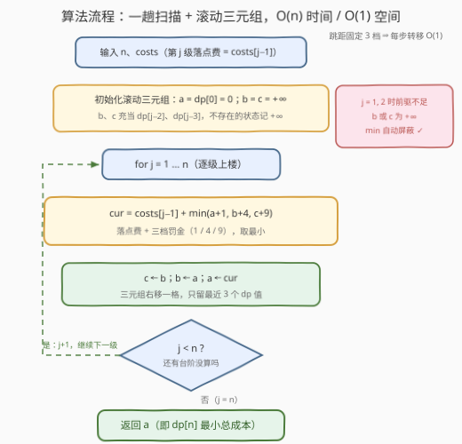

# 爬楼梯II

- **题目名称**：爬楼梯II
- **链接**：[3693. 爬楼梯II](https://leetcode.cn/problems/climbing-stairs-ii/)
- **难度**：中等
- **标签**：动态规划、数组

## 1. 题目概述

**题意**：你正在爬一个有 $n+1$ 级台阶的楼梯，台阶编号 $0$ 到 $n$。给定长度为 $n$、**下标从 1 开始**的整数数组 `costs`，其中 `costs[i]` 是第 $i$ 级台阶的「落点费」。从第 $i$ 级台阶你**只能**跳到第 $i+1$、$i+2$ 或 $i+3$ 级；从 $i$ 跳到 $j$ 的费用定义为

$$\text{cost}(i \to j) = \text{costs}[j] + (j-i)^2$$

从第 $0$ 级出发（初始 `cost = 0`），求到达第 $n$ 级的**最小总费用**。

**示例 1**：

```text
输入：n = 4, costs = [1,2,3,4]
输出：13
解释：最优路径 0 → 1 → 2 → 4
      0→1: costs[1] + 1² = 2；1→2: costs[2] + 1² = 3；2→4: costs[4] + 2² = 8
```

**示例 2**：

```text
输入：n = 4, costs = [5,1,6,2]
输出：11
解释：最优路径 0 → 2 → 4
      0→2: costs[2] + 2² = 1 + 4 = 5；2→4: costs[4] + 2² = 2 + 4 = 6
```

**示例 3**：

```text
输入：n = 3, costs = [9,8,3]
输出：12
解释：直接 0 → 3：costs[3] + 3² = 3 + 9 = 12
```

**约束条件**：

- $1 \le n = \text{costs.length} \le 10^5$
- $1 \le \text{costs}[i] \le 10^4$

> 💡 **审题关键**：① 费用记在**落点**头上——`costs[j]` 只与落在哪一级有关，与从哪级跳来无关；② 罚金 $(j-i)^2$ 随跳距**平方**增长（跳 1 级罚 1、2 级罚 4、3 级罚 9），跨大步贵但不一定亏——落点费可能便宜得多；③ `costs` 是**下标从 1 开始**的数组，而函数签名里传进来的是常规 0 基数组，代码中第 $j$ 级的落点费要取 `costs[j-1]`，别对着示例算错钱。

---

## 2. 解题思路

### 2.1 暴力思路：枚举路径 / 逐跳贪心（都会翻车）

**枚举所有路径**：每一级至多有 3 个分支，路径数按三阶 Fibonacci（tribonacci）速度指数增长，$n = 10^5$ 时是天文数字，必然爆炸。

**逐跳贪心**（每步都选当前最便宜的一跳）：用示例 1 试一下——贪心全程只跳 1 级（每步罚金最少），路径 $0 \to 1 \to 2 \to 3 \to 4$，总费用 $2+3+4+5 = 14$；而最优解是 $0 \to 1 \to 2 \to 4$，靠一步 2 级跳跨过第 3 级，总费用 $13$。**省罚金会多付落点费**，局部最优推不出全局最优——这是必须用 DP 的信号。

### 2.2 核心观察：线性 DP，只依赖前 3 个状态

![核心观察：跳距只有 1/2/3，dp[j] 只依赖前 3 个状态](../images/p3693_stairs_dp_concept.svg)

把一跳的费用拆成两部分：

- **落点费** `costs[j]`：只由落点 $j$ 决定，与从哪跳来**无关**；
- **距离罚金** $(j-i)^2$：只由最后一步的跳距决定，只有 $1$、$4$、$9$ 三档。

设 $dp[j]$ 为到达第 $j$ 级的最小总费用。任何到达 $j$ 的方案，最后一步必然从 $j-1$、$j-2$、$j-3$ 三者之一起跳，于是：

$$dp[j] = \text{costs}[j] + \min\big(dp[j-1]+1,\; dp[j-2]+4,\; dp[j-3]+9\big)$$

- $dp[0] = 0$（起点免费），答案即 $dp[n]$；
- 落点费与来源无关，所以能提到 $\min$ 外面——三项候选只差罚金；
- **跳距被题目限死在 $\{1,2,3\}$**，每个状态只有 $O(1)$ 个转移，总复杂度 $O(n)$；
- $j = 1, 2$ 时前驱不足 3 个（$j-2$、$j-3$ 不存在）：把不存在的状态记为 $+\infty$，$\min$ 会自动屏蔽。

> 💡 **一句话**：最优子结构与无后效性都齐了——历史路径的一切影响都被 $dp[i]$ 概括，最后一步的费用只看 $(i, j)$ 两级——这就是最标准的「爬楼梯型」线性 DP。

### 2.3 算法流程：一趟扫描 + 滚动三元组



| 步骤 | 操作 | 说明 |
|------|------|------|
| ① 初始化 | $a = dp[0] = 0$，$b = c = +\infty$ | $a,b,c$ 分别扮演 $dp[j-1], dp[j-2], dp[j-3]$ |
| ② 转移 | $cur = \text{costs}[j-1] + \min(a+1,\, b+4,\, c+9)$ | 注意代码里第 $j$ 级落点费是 `costs[j-1]` |
| ③ 滚动 | $c \leftarrow b,\; b \leftarrow a,\; a \leftarrow cur$ | 三元组右移，只留最近 3 个 dp 值 |
| ④ 循环 | $j$ 从 $1$ 扫到 $n$ | 扫完后 $a$ 即 $dp[n]$ |
| ⑤ 输出 | 返回 $a$ | 无需整个 dp 数组，空间 $O(1)$ |

### 2.4 示例演算

**示例 2**：$n = 4$，`costs = [5,1,6,2]`（第 $j$ 级落点费 = `costs[j-1]`）：

```text
j = 0 : dp[0] = 0（起点）
j = 1 : dp[1] = 5 + min(0+1)                = 6    ← 来自 0（跳 1 级）
j = 2 : dp[2] = 1 + min(6+1, 0+4)           = 5    ← 来自 0（跳 2 级）
j = 3 : dp[3] = 6 + min(5+1, 6+4, 0+9)      = 12   ← 来自 2（跳 1 级）
j = 4 : dp[4] = 2 + min(12+1, 5+4, 6+9)     = 11   ← 来自 2（跳 2 级）
```

倒序回溯最优路径：$4 \leftarrow 2 \leftarrow 0$，即 $0 \to 2 \to 4$，费用 $(1+4) + (2+4) = 11$ ✓。第 2 级落点费只有 1，值得从起点一步罚 4 跳上去；再从 2 一步罚 4 跨过昂贵的第 3 级（落点费 6）直达终点——**罚金换落点费**正是本题决策的全部内容。

---

## 3. 参考代码

### C++

```cpp
class Solution {
  public:
    int climbStairs(int n, vector<int>& costs) {
        const long long INF = 1e18;
        long long a = 0, b = INF, c = INF;          // a=dp[j-1], b=dp[j-2], c=dp[j-3]
        for (int j = 1; j <= n; ++j) {
            long long cur = costs[j - 1]            // 第 j 级落点费（costs 下标从 1 开始）
                          + min({a + 1, b + 4, c + 9});
            c = b; b = a; a = cur;                  // 三元组右移一格
        }
        return a;                                   // a == dp[n]，上界 ~1e9，int 放得下
    }
};
```

> 💡 **写法要点**：
> - `b`、`c` 初值取 $+\infty$（`1e18`）：$j=1,2$ 时前驱不足 3 个，$+\infty$ 加上 4 或 9 仍远小于 `LLONG_MAX`，`min` 自动屏蔽无效转移，无需特判；
> - 答案上界 $\le \sum \text{costs} + n \le 10^5 \times (10^4+1) \approx 1.0 \times 10^9$，贴着 `int` 上限——内部用 `long long` 计算最稳；
> - 若需还原路径，另开 `from[j]` 记录 argmin 来源，倒序回溯即可，空间升为 $O(n)$。

### Python

```python
class Solution:
    def climbStairs(self, n: int, costs: List[int]) -> int:
        a, b, c = 0, inf, inf              # a=dp[j-1], b=dp[j-2], c=dp[j-3]
        for j in range(1, n + 1):
            a, b, c = costs[j - 1] + min(a + 1, b + 4, c + 9), a, b
        return a
```

> 💡 **写法要点**：元组赋值 `a, b, c = 新值, a, b` 一行完成「算新值 + 右移」两件事，天然无临时变量；`inf` 来自 `math`，`inf + 4` 仍是 `inf`，Python 整数无溢出之忧。

---

## 4. 复杂度分析

| 维度 | 复杂度 | 说明 |
|------|--------|------|
| 时间复杂度 | $O(n)$ | 一趟扫描；跳距固定 3 档，每个状态 $O(1)$ 转移 |
| 空间复杂度 | $O(1)$ | 滚动三元组 $a,b,c$；若存 `from[]` 还原路径则 $O(n)$ |

> 与 2.1 的指数枚举相比，加速来自**把「整条路径的决策」拆成「每级一步的决策」**——无后效性保证前缀最优解可被 $dp[i]$ 一个数概括，指数级路径空间坍缩成 $n$ 个状态、每个状态 3 个候选。

---

## 5. 扩展：跳距上限一般化——从单调队列到斜率优化

**变体 A（无罚金版，1696 跳跃游戏 VI 型）**：若跳距 $1..k$ 且无平方罚金，$dp[j] = \text{cost} + \min_{j-k \le i < j} dp[i]$——转移是**定长滑动窗口最小值**，单调队列均摊 $O(n)$。

**变体 B（带平方罚金、$k$ 任意大）**：$dp[j] = \text{costs}[j] + \min_{i<j}\big(dp[i] + (j-i)^2\big)$。罚金随跳距变化，单调队列不再适用；但把 $(j-i)^2 = j^2 - 2ij + i^2$ 展开：

$$dp[i] + (j-i)^2 = \underbrace{(dp[i] + i^2)}_{\text{截距}} \;-\; \underbrace{2i}_{\text{斜率}} \cdot\, j \;+\; j^2$$

对固定 $j$，$j^2$ 是常数，最小化等价于在「斜率 $-2i$、截距 $dp[i]+i^2$」的**直线族**中查询 $x = j$ 处的最小值——**斜率优化（CHT）** 登场：$i$ 递增插入（斜率严格递减）、$j$ 递增查询，单调双端队列维护下凸壳，均摊 $O(n)$。本题正是「爬楼梯 → 单调队列 → 斜率优化」这条进阶链的起点。

---

## 6. 面试要点

**Q1：逐跳贪心为什么错？DP 为什么对？**

> 贪心反例即示例 1：全程跳 1 级省罚金得 14，最优 13 靠一步 2 级跳跨过第 3 级。错因是「当前最便宜的一跳」会把后面的落点费负债留给你。DP 成立靠两点：**最优子结构**（到达 $j$ 的最优解必由某个前驱的最优解加一跳构成）与**无后效性**（历史路径的影响被 $dp[i]$ 完全概括——落点费只看落点、罚金只看最后一步跳距）。

**Q2：为什么状态只需「当前在哪一级」，转移只有 3 个？**

> 题目规定从 $i$ 只能跳到 $i+1/2/3$，跳距上限 3 把每个状态的前驱限制在连续 3 个位置；费用结构（落点费 + 跳距平方罚）又恰好只依赖 $(i,j)$ 两端。若规则像 403 青蛙过河那样依赖「上一步跳了多远」，状态就得带上一步长——**状态设计跟着「哪些信息影响未来转移」走**。

**Q3：`costs` 下标从 1 开始，代码里怎么对应？**

> 函数拿到的是 0 基数组：第 $j$ 级落点费 = `costs[j-1]`。用示例 2 自检：跳 $0 \to 2$ 的费用是 `costs[1] + 4 = 5`（不是 `costs[2] + 4 = 10`），总答案 11 才对得上。这是本题最容易白给的地方。

**Q4：$j = 1, 2$ 时前驱不足 3 个，怎么处理最干净？**

> 把 $dp[j-2]$、$dp[j-3]$ 中不存在的初始化为 $+\infty$（滚动变量 $b$、$c$ 初值取 `inf` / `1e18`），$\min$ 自然屏蔽；比写 `if (j >= 2)` 分支更不易错。注意 C++ 的 $+\infty$ 别取 `LLONG_MAX`——它还要参与 `+4`、`+9` 会溢出，取 `1e18` 留余量。

**Q5：数据范围会溢出吗？空间能压到多少？**

> 答案上界 $\le \sum \text{costs} + n \le 10^5 \times (10^4+1) \approx 1.0 \times 10^9$，`int` 勉强够但贴边，C++ 内部用 `long long` 稳妥；Python 无所谓。空间上转移只回看 3 格，三个滚动变量 $O(1)$ 搞定，无需 dp 数组。

> 💡 **一句话总结**：费用 = 落点费（与来源无关，提出 $\min$）+ 跳距平方罚（只有 $1/4/9$ 三档）⇒ $dp[j] = \text{costs}[j] + \min(dp[j-1]+1,\, dp[j-2]+4,\, dp[j-3]+9)$，滚动三元组一趟扫完。

---

## 7. 同类练习题

- [70. 爬楼梯](https://leetcode.cn/problems/climbing-stairs/)：本题「零费用」版——只数路径数，Fibonacci 入门
- [746. 使用最小花费爬楼梯](https://leetcode.cn/problems/min-cost-climbing-stairs/)：费用记在「离开的台阶」上的 1/2 步版，对比费用归属对转移的影响
- [983. 最低票价](https://leetcode.cn/problems/minimum-cost-for-tickets/)：按未来时间窗决策的线性 DP，「区间覆盖付费」与「逐跳付费」互为镜像
- [1696. 跳跃游戏 VI](https://leetcode.cn/problems/jump-game-vi/)：跳距上限 $k$ 的无罚金版，单调队列优化滑动窗口最小值
- [403. 青蛙过河](https://leetcode.cn/problems/frog-jump/)：跳距受「上一步步长」约束的可达性 DP，体会状态必须扩维的场景
