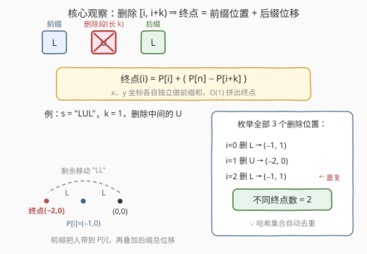
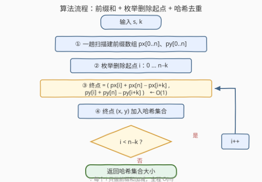

# LeetCode 删除子字符串后不同的终点 题解

## 1. 题目概述

- **标题 / 题号**：删除子字符串后不同的终点（#3694，medium）
- **链接**：https://leetcode.cn/problems/distinct-points-reachable-after-substring-removal/
- **难度**：中等
- **标签**：哈希表、字符串、前缀和、滑动窗口

**题意**：给你一个由字符 `'U'`、`'D'`、`'L'` 和 `'R'` 组成的字符串 `s`，表示在**无限二维笛卡尔网格**上的移动：

- `'U'`：从 $(x, y)$ 移动到 $(x, y+1)$
- `'D'`：从 $(x, y)$ 移动到 $(x, y-1)$
- `'L'`：从 $(x, y)$ 移动到 $(x-1, y)$
- `'R'`：从 $(x, y)$ 移动到 $(x+1, y)$

再给定一个正整数 `k`。你**必须**选择并移除**恰好一个长度为 `k` 的连续子字符串**，然后从坐标 $(0, 0)$ 出发，按顺序执行剩余的移动。

返回可到达的**不同最终坐标的数量**。

**示例 1**：

```text
输入：s = "LUL", k = 1
输出：2
解释：移除长度为 1 的子字符串后，s 可以是 "UL"、"LL" 或 "LU"，
     最终坐标分别为 (-1, 1)、(-2, 0)、(-1, 1)。
     不同的点只有 (-1, 1) 和 (-2, 0)，答案是 2。
```

**示例 2**：

```text
输入：s = "UDLR", k = 4
输出：1
解释：只能整串删空，最终坐标为 (0, 0)，答案为 1。
```

**示例 3**：

```text
输入：s = "UU", k = 1
输出：1
解释：删哪个 'U' 剩下的都是 "U"，终点恒为 (0, 1)，答案为 1。
```

**约束**：

- $1 \le \text{s.length} \le 10^5$
- `s` 只包含 `'U'`、`'D'`、`'L'`、`'R'`
- $1 \le k \le \text{s.length}$

> 💡 **审题关键**：① 删除的是**连续**子串且长度**恰好**为 `k`——删除起点只有 $n-k+1$ 种；② 问的是**不同终点的个数**而非方案数——多个删除位置殊途同归时只数一次；③ 剩余移动顺序 = 前缀接后缀，被删段的位移整体"蒸发"，天然适合前缀和处理。

## 2. 解题思路

### 2.1 暴力思路

枚举全部 $n-k+1$ 个删除起点，每个删完后再从 $(0,0)$ 模拟剩下的 $n-k$ 步移动，统计不同终点：总代价 $O((n-k+1)\cdot n) \approx O(n^2)$。$n = 10^5$ 时约 $10^{10}$ 次操作，必然超时。

瓶颈在于"每换一个删除位置就把全程重走一遍"。但注意：删除起点滑动一格时，路径只是**前缀多了一步、后缀少了一步**，绝大部分行走是重复计算——这正是前缀和的用武之地。

### 2.2 核心观察：前缀坐标 + 前后缀拼接



把三条观察串成一条链：

- **观察一（位移可加）**：每步移动是一个独立的小位移向量，位置 = 位移逐次累加。定义 $P[i] = (px[i],\, py[i])$ 为执行**前 $i$ 步**后所在坐标（$P[0] = (0,0)$），一趟扫描即可建出 $x$、$y$ 两条前缀和数组。
- **观察二（删段 = 拼接）**：删除 $s[i..i+k-1]$ 后实际执行的是 $s[0..i-1]$ 接 $s[i+k..n-1]$——前缀把人带到 $P[i]$，后缀的总位移只取决于它自身，等于 $P[n] - P[i+k]$。于是终点被 $O(1)$ 拼出：

$$\text{终点}(i) = \big(\,px[i] + px[n] - px[i+k],\;\; py[i] + py[n] - py[i+k]\,\big)$$

- **观察三（哈希去重）**：不同删除起点可能拼出同一终点（示例 1 中删第 1 个 `L` 和删最后的 `L` 都到 $(-1,1)$）。把 $O(1)$ 算出的终点丢进**哈希集合**，集合大小即答案。

每个删除位置的计算从 $O(n)$ 重模拟降到 $O(1)$ 公式，整体 $O(n^2) \to O(n)$。

> ⚠️ 边界 $k = n$：只有一种删法（整串删空），终点恒为 $(0,0)$、答案恒为 1。公式自动覆盖——$i$ 只能取 0，终点 $= P[0] + P[n] - P[n] = (0,0)$，无需特判。

### 2.3 算法流程



| 步骤 | 操作 | 说明 |
|------|------|------|
| ① 建前缀 | 一趟扫描建 `px[0..n]`、`py[0..n]` | 即 $x$、$y$ 坐标的前缀和 |
| ② 枚举 | $i$ 从 $0$ 到 $n-k$ | 共 $n-k+1$ 个删除起点 |
| ③ 求终点 | $(px[i]+px[n]-px[i+k],\; py[i]+py[n]-py[i+k])$ | 纯前缀和加减，$O(1)$ |
| ④ 去重 | 终点入哈希集合 | 集合大小即答案 |

### 2.4 示例演算

以示例 1 `s = "LUL", k = 1` 为例。前缀坐标：$P[0]=(0,0)$，$P[1]=(-1,0)$，$P[2]=(-1,1)$，$P[3]=(-2,1)$。

| 删除起点 $i$ | 删除字符 | 剩余串 | 终点 $= P[i] + P[3] - P[i+1]$ | 说明 |
|---|---|---|---|---|
| 0 | `'L'` | `"UL"` | $(0,0)+(-2,1)-(-1,0) = (-1,1)$ | — |
| 1 | `'U'` | `"LL"` | $(-1,0)+(-2,1)-(-1,1) = (-2,0)$ | — |
| 2 | `'L'` | `"LU"` | $(-1,1)+(-2,1)-(-2,1) = (-1,1)$ | 与 $i=0$ 重复 |

哈希集合 $\{(-1,1),\,(-2,0)\}$，大小 2，与示例一致。示例 3 中两个删除位置的终点均为 $(0,1)$，集合大小 1，同样吻合。

## 3. 参考代码

### C++

```cpp
class Solution {
public:
    int distinctPoints(string s, int k) {
        int n = s.size();
        vector<int> px(n + 1), py(n + 1);              // ① 前缀坐标，px[0]=py[0]=0
        for (int i = 0; i < n; i++) {
            px[i + 1] = px[i] + (s[i] == 'L' ? -1 : s[i] == 'R');
            py[i + 1] = py[i] + (s[i] == 'D' ? -1 : s[i] == 'U');
        }
        unordered_set<long long> seen;                 // ④ 哈希集合去重
        long long m = 2LL * n + 1;
        for (int i = 0; i + k <= n; i++) {             // ② 枚举删除起点
            long long x = px[i] + px[n] - px[i + k];   // ③ O(1) 拼终点
            long long y = py[i] + py[n] - py[i + k];
            seen.insert((x + n) * m + (y + n));        // 坐标编码成一个整数
        }
        return seen.size();
    }
};
```

坐标范围 $|x|,|y| \le n \le 10^5$，偏移后用 $(x+n)\cdot(2n+1)+(y+n)$ 编码成单个 `long long`（非负且无碰撞），免去为 `pair` 自定义哈希的麻烦。

### Python

```python
class Solution:
    def distinctPoints(self, s: str, k: int) -> int:
        n = len(s)
        px = [0] * (n + 1)                     # ① x 坐标前缀和
        py = [0] * (n + 1)                     #    y 坐标前缀和
        for i, c in enumerate(s):
            px[i + 1] = px[i] + (c == 'R') - (c == 'L')
            py[i + 1] = py[i] + (c == 'U') - (c == 'D')
        ends = set()                           # ④ 哈希集合去重
        for i in range(n - k + 1):             # ② 枚举删除起点
            ends.add((px[i] + px[n] - px[i + k],   # ③ O(1) 拼终点
                      py[i] + py[n] - py[i + k]))
        return len(ends)
```

Python 元组可直接入 `set`，无需坐标编码。

## 4. 复杂度分析

| 维度 | 复杂度 | 说明 |
|------|--------|------|
| **时间复杂度** | $O(n)$ | 建前缀和一趟 $O(n)$；枚举 $n-k+1$ 个删除起点，每个 $O(1)$ |
| **空间复杂度** | $O(n)$ | 前缀和数组 $O(n)$ + 哈希集合至多存 $n-k+1$ 个终点 |

## 5. 扩展：滑动窗口增量递推（省掉前缀数组）

标签里的 Sliding Window 并非虚设——把终点公式对 $i$ 做**差分**：

$$\text{终点}(i+1) - \text{终点}(i) = \text{move}(s[i]) - \text{move}(s[i+k])$$

即删除窗口右滑一格时，终点位移 = **新进入前缀的那步 − 新移出窗口的那步**（向量相减）。于是连前缀数组都可以不建：

1. 先模拟尾部 $s[k..n-1]$ 得到 $\text{终点}(0)$；
2. $i$ 从 0 递推到 $n-k$，每步加上 $\text{move}(s[i]) - \text{move}(s[i+k])$，途中把终点入集合。

除答案集合外仅 $O(1)$ 辅助空间。此外若把"恰好删一段长 `k`"改成"删两段"等变体，拼接思想依旧可用，但枚举维度上升（$O(n^2)$ 个组合），需要另找性质剪枝——本题答案恰好锁定在"恰好一段"上，才有干净的线性解。

## 6. 面试要点

**Q1：为什么删除 $[i, i+k)$ 后的终点能 $O(1)$ 表示？**

> 剩余路径 = 前缀 $s[0..i-1]$ 拼后缀 $s[i+k..n-1]$。前缀把人带到 $P[i]$；后缀的位移只取决于其自身，等于 $P[n] - P[i+k]$。两段位移向量相加即终点，$x$、$y$ 独立计算，均为前缀和的加减。

**Q2：C++ 里哈希集合存 `pair<int,int>` 行不行？**

> `std::unordered_set` 没有为 `pair` 提供默认哈希，须自定义 hash 或改用 `std::set`（$O(n\log n)$）。更省事的做法是坐标编码：$|x|,|y| \le n$，$(x+n)\cdot(2n+1)+(y+n)$ 落在 $[0,(2n+1)^2)$ 内，$n=10^5$ 时约 $4\times10^{10}$，`long long` 安全承载。Python 直接存元组即可。

**Q3：$k = n$ 时算法还成立吗？**

> 成立。$i$ 只能取 0，终点 $= P[0] + P[n] - P[n] = (0,0)$，答案恒为 1（示例 2）。这是公式的自然边界，无需 if 特判——好公式应当能吞掉边界。

**Q4：暴力慢在哪？前缀和省掉了什么？**

> 暴力对每个删除起点重模拟剩余 $n-k$ 步，$O(n^2)$；而删除起点滑动时路径绝大部分不变，前缀和把"任意前缀的累计位移"预处理成 $O(1)$ 查询，重复行走被彻底消除。这与和为 K 的子数组、接雨水是同一个"预处理前缀、查询 O(1)"范式。

**Q5：能把前缀数组也省掉吗？**

> 能，用差分递推：$\text{终点}(i+1) = \text{终点}(i) + \text{move}(s[i]) - \text{move}(s[i+k])$，即窗口右滑时"进来一步、出去一步"的向量差。先模拟尾部得 $\text{终点}(0)$ 再逐格递推，除答案集合外 $O(1)$ 空间（见第 5 节）。

> 💡 **一句话总结**：3694 = **前缀坐标 + 拼接公式 + 哈希去重**；把"删一段再走全程"翻译成 $P[i] + P[n] - P[i+k]$，$O(n^2)$ 暴力坍缩成 $O(n)$ 一趟扫描。

## 同类练习题

| # | 题目 | 与本题的关联 |
|---|------|-------------|
| 1658 | [将 x 减到 0 的最小操作数](https://leetcode.cn/problems/minimum-operations-to-reduce-x-to-zero/) | 本题删中间留两端，它删两端留中间（正难则反转化为最长中间子数组），互为对偶的前后缀拼接 |
| 974 | [和可被 K 整除的子数组](https://leetcode.cn/problems/subarray-sums-divisible-by-k/) | 前缀和 + 哈希表的经典组合，"区间量 = 前缀量之差"的基础训练 |
| 560 | [和为 K 的子数组](https://leetcode.cn/problems/subarray-sum-equals-k/) | 前缀和 + 哈希表计数，同为本题的底层范式 |
| 874 | [模拟行走机器人](https://leetcode.cn/problems/walking-robot-simulation/) | 同为 U/D/L/R 网格移动 + 哈希结构，终点/障碍判重的姊妹题 |
| 238 | [除自身以外数组的乘积](https://leetcode.cn/problems/product-of-array-except-self/) | 前缀 × 后缀分解思想的另一形态，"拼前后缀"的乘法版 |
