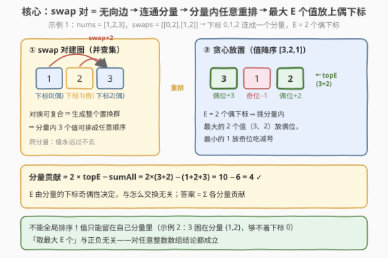
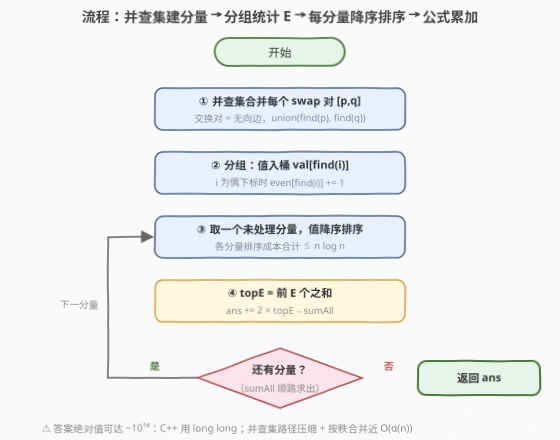

# LeetCode 交换元素后的最大交替和 题解

## 1. 题目概述

- **标题 / 题号**：交换元素后的最大交替和（#3695，hard）
- **链接**：https://leetcode.cn/problems/maximize-alternating-sum-using-swaps/
- **难度**：困难
- **标签**：贪心、并查集、数组、排序

**题意**：给你一个整数数组 `nums`。定义 `nums` 的**交替和**为：偶数下标元素**相加**、奇数下标元素**相减**得到的值，即 $\text{nums}[0] - \text{nums}[1] + \text{nums}[2] - \text{nums}[3] + \cdots$。

再给你一个二维整数数组 `swaps`，其中 `swaps[i] = [pi, qi]`。对于每对 `[pi, qi]`，你可以交换下标 `pi` 和 `qi` 处的元素，交换可进行**任意次数、任意顺序**。

返回 `nums` 可能达到的**最大交替和**。

**示例 1**：

```text
输入：nums = [1,2,3], swaps = [[0,2],[1,2]]
输出：4
解释：交换 3 次（0↔2、1↔2、0↔2）得到 nums = [2,1,3]，
     交替和 = 2 − 1 + 3 = 4。得到 [3,1,2] 同样为 4。
```

**示例 2**：

```text
输入：nums = [1,2,3], swaps = [[1,2]]
输出：2
解释：下标 0 与谁都不连通，3 再大也过不去，不动即为最优。
```

**示例 3**：

```text
输入：nums = [1,1000000000,1,1000000000,1,1000000000], swaps = []
输出：-2999999997
解释：没有任何交换可用，交替和 = 3 − 3×10⁹ = −2999999997。
```

**约束**：

- $2 \le \text{nums.length} \le 10^5$
- $1 \le \text{nums[i]} \le 10^9$
- $0 \le \text{swaps.length} \le 10^5$
- $0 \le p_i < q_i \le \text{nums.length} - 1$，且 $[p_i, q_i]$ 互不相同

> 💡 **审题关键**：① 「任意次数、任意顺序」意味着可达位置只由交换对的**连通关系**决定，与具体执行顺序无关——这是并查集建模的信号；② 溢出警戒：$n \times \max(\text{nums}) \approx 10^{14}$，答案绝对值可达 $10^{14}$ 量级，C++ 必须 `long long`（好在返回类型已是 `long long`）；③ $p_i < q_i$ 且对不重复只是输入规范，不影响建模。

## 2. 解题思路

### 2.1 暴力思路

把每个 `swap` 对当成一次可选操作，从初始数组出发 BFS 所有可达状态：状态是整个数组，分支因子高达 $\vert\text{swaps}\vert$，状态空间天文数字。退一步，若已意识到「只有同分量内的元素能互换」，也可以对每个大小为 $c$ 的连通分量枚举全部 $c!$ 种内部排布——总方案数 $\prod c_i!$，分量一大立即爆炸。

瓶颈在于缺少对「哪些位置可以互换」的**等价刻画**——刻画清楚了，根本不需要枚举排布。

### 2.2 核心观察：连通分量内自由重排 + 最大 E 个值放上偶下标



- **观察一（可达性 = 连通性）**：把每对 `[p, q]` 看作无向边，全部下标被切成若干**连通分量**。代数上，对换的复合可以生成分量内下标集上的**任意置换**（对换生成对称群），因此同分量内的元素能以任意顺序重排；反之，跨分量的元素一步也过不去。可达状态恰好是「每个分量内部任意排列」的全体。
- **观察二（E 是分量固有属性）**：分量对交替和的贡献 $= \sum_{\text{偶下标}} v - \sum_{\text{奇下标}} v$。分量内偶下标的个数 $E$ 只由「哪些下标连通」决定，与元素怎么排**无关**——不管怎么换，永远恰有 $E$ 个值坐在加号位上。
- **观察三（分量内贪心）**：设分量总和为 $\text{sumAll}$、放到偶下标的 $E$ 个值之和为 $\text{topE}$，则贡献
  $$\text{topE} - (\text{sumAll} - \text{topE}) = 2 \cdot \text{topE} - \text{sumAll}.$$
  $\text{sumAll}$ 是常量，最大化贡献 $\iff$ 最大化 $\text{topE}$ $\iff$ 把分量内**最大的 $E$ 个值**放到偶下标，最小的留在奇下标吃减号。

各分量互不干扰，**总答案 = 各分量贡献之和**，每个分量独立贪心即可。

> ⚠️ **不能全局排序**：值只能在本分量内移动，$E$ 也是分量各自的属性。反例即示例 2——全局看该把 3 放到偶下标 0，但下标 0 与谁都不连通，3 被困在分量 $\{1,2\}$ 里，只能去偶下标 2。

> 💡 「取最大 $E$ 个」这一步与元素正负无关（选前 $E$ 大必然最大化 $\text{topE}$），本题约束 $1 \le \text{nums[i]}$ 只是让题目更直观；结论对任意整数数组都成立。

### 2.3 算法流程



| 步骤 | 操作 | 说明 |
|------|------|------|
| ① 建并查集 | 对每对 `[p, q]` 执行 `union(find(p), find(q))` | 交换对 = 无向边，近 $O((n+m)\,\alpha(n))$ |
| ② 分组统计 | 遍历 $i$：`val[find(i)].append(nums[i])`；$i$ 为偶下标则 `even[find(i)]++` | 一次线性扫描同时收集「值集合」与「E」 |
| ③ 分量排序 | 每个非空分量的值降序排序 | $\sum c_i \log c_i \le n \log n$ |
| ④ 公式累加 | `ans += 2 * topE - sumAll` | `topE` = 前 `even[r]` 个值之和，`sumAll` 顺路求出 |
| ⑤ 返回 | 输出 `ans` | `long long` 承接，绝对值至多约 $10^{14}$ |

### 2.4 示例演算

**示例 1** `nums = [1,2,3], swaps = [[0,2],[1,2]]`：

| 分量（下标） | E（偶下标数） | 值降序 | topE | sumAll | 贡献 $2 \cdot \text{topE} - \text{sumAll}$ |
|-------------|--------------|--------|------|--------|-------------------------------------------|
| $\{0,1,2\}$ | 2（下标 0、2） | 3, 2, 1 | $3+2=5$ | $6$ | $10 - 6 = 4$ |

答案 $4$ ✓（贪心方案正是题面给出的 $[3,1,2]$ / $[2,1,3]$——最大的 3、2 占偶位，1 吃减号）。

**示例 2** `nums = [1,2,3], swaps = [[1,2]]`：

| 分量（下标） | E | 值降序 | topE | sumAll | 贡献 |
|-------------|---|--------|------|--------|------|
| $\{0\}$     | 1 | 1      | 1    | 1      | $2-1 = 1$ |
| $\{1,2\}$   | 1（下标 2） | 3, 2 | 3 | 5 | $6-5 = 1$ |

答案 $1 + 1 = 2$ ✓。

**示例 3** 无交换：每个下标自成分量，偶下标贡献 $2v - v = v$，奇下标贡献 $-v$，合计 $3 - 3 \times 10^9 = -2999999997$ ✓。

## 3. 参考代码

### C++

```cpp
class Solution {
    vector<int> fa;
    int find(int x) {                          // 路径压缩
        while (fa[x] != x) fa[x] = fa[fa[x]], x = fa[x];
        return x;
    }
public:
    long long maxAlternatingSum(vector<int>& nums, vector<vector<int>>& swaps) {
        int n = nums.size();
        fa.resize(n);
        iota(fa.begin(), fa.end(), 0);
        for (auto& s : swaps) {                // ① 交换对 = 无向边
            int a = find(s[0]), b = find(s[1]);
            if (a != b) fa[a] = b;
        }
        vector<vector<int>> val(n);
        vector<int> even(n, 0);
        for (int i = 0; i < n; i++) {          // ② 分组 + 统计偶下标个数 E
            int r = find(i);
            val[r].push_back(nums[i]);
            if ((i & 1) == 0) even[r]++;
        }
        long long ans = 0;
        for (int r = 0; r < n; r++) {          // ③④ 每分量独立贪心
            if (val[r].empty()) continue;
            sort(val[r].rbegin(), val[r].rend());
            long long sumAll = 0, topE = 0;
            for (int v : val[r]) sumAll += v;
            for (int i = 0; i < even[r]; i++) topE += val[r][i];
            ans += 2 * topE - sumAll;          // 贡献 = 2·topE − sumAll
        }
        return ans;                            // ⑤ long long 承接
    }
};
```

### Python

```python
class Solution:
    def maxAlternatingSum(self, nums: List[int], swaps: List[List[int]]) -> int:
        n = len(nums)
        fa = list(range(n))

        def find(x):                           # 路径压缩
            while fa[x] != x:
                fa[x] = fa[fa[x]]
                x = fa[x]
            return x

        for p, q in swaps:                     # ① 交换对 = 无向边
            fa[find(p)] = find(q)

        val, even = defaultdict(list), defaultdict(int)
        for i, x in enumerate(nums):           # ② 分组 + 统计 E
            r = find(i)
            val[r].append(x)
            if i % 2 == 0:
                even[r] += 1

        ans = 0
        for r, vs in val.items():              # ③④ 每分量独立贪心
            vs.sort(reverse=True)
            top_e = sum(vs[:even[r]])
            ans += 2 * top_e - sum(vs)         # 贡献 = 2·topE − sumAll
        return ans
```

## 4. 复杂度分析

| 维度 | 复杂度 | 说明 |
|------|--------|------|
| **时间复杂度** | $O((n + m)\,\alpha(n) + n \log n)$ | 并查集合并 $m$ 对近 $O(\alpha(n))$/次；分组线性扫描；各分量排序总成本 $\sum c_i \log c_i \le n \log n$。$n, m \le 10^5$ 时约 $2 \times 10^6$ 量级操作 |
| **空间复杂度** | $O(n)$ | 并查集数组、各分量的值桶（元素总数恰为 $n$）、偶下标计数数组 |

> 💡 排序没有白做的：它只发生在各分量内部——把「哪些值进加号位」这个组合选择，压缩成「降序取前 $E$ 个」的一次切分。

## 5. 扩展：建模的一般化与近亲题

**「贡献式」代数变形**：$2 \cdot \text{topE} - \text{sumAll}$ 这一步把「选 $E$ 个放加号位」的目标从「和差混合」化成「单侧最大化」，是处理带符号分配问题的常用手法；同样的变形在「最大化 pairwise 差值之和」「环形数组最大子段和」等题里反复出现。

**结论不依赖正值约束**：即便 $\text{nums[i]}$ 可为负，「前 $E$ 大之和」依然是 $\text{topE}$ 的最大值（排序不变量），贪心与公式原样成立。这提示面试中若被追问「值可负怎么办」，答案是**代码一行不用改**。

**swap 建模三件套**（同一棵并查集，三种问法）：

| 问法 | 代表题 | 分量内做什么 |
|------|--------|--------------|
| 最大化带符号收益 | 本题 3695 | 最大 $E$ 个放偶下标 |
| 最小化失配 | 1722 最小汉明距离 | 值做桶匹配，能配对的不贡献距离 |
| 字典序最小 | 1202 交换字符串中的元素 | 最小字符从前往后放 |

**为什么不是置换环**：765「情侣牵手」、2471「逐层排序」关心的是**最少交换次数**（环长 − 1 之和），需要环结构；本题只问「能排成什么」，连通性（分量）这一层信息就足够，无需真的执行交换。

## 6. 面试要点

**Q1：为什么「任意次数、任意顺序的交换」等价于「连通分量内任意重排」？**

> 必要性：一次交换只发生在有边相连的下标间，元素永远出不了自己的连通分量。充分性：设分量内有 $c$ 个下标，给定任意目标排列，逐位归位（把目标位置的元素换过来）至多用 $c-1$ 次分量内的交换即可完成——对换可生成对称群 $S_c$ 的全部元素。两端合起来，可达状态集 = 各分量内部排列的笛卡尔积。

**Q2：为什么每个分量可以独立贪心？贡献为什么是 $2 \cdot \text{topE} - \text{sumAll}$？**

> 分量间的元素永不流动，总交替和按分量拆成互不影响的部分和，各自取最大即全局最大。分量内偶下标个数 $E$ 固定，设放进偶下标的值之和为 $x$，贡献 $= x - (\text{sumAll} - x) = 2x - \text{sumAll}$，只随 $x$ 线性增长，故取 $x = $ 前 $E$ 大值之和。

**Q3：直接把全局最大的一批值放到偶下标，为什么错？**

> 忽略了连通约束。示例 2 中 3 是全局前 2 大，但它困在分量 $\{1,2\}$ 里，去不了偶下标 0；硬按全局贪心会算出不可达的 4，而正确答案是 2。$E$ 是「分量内偶下标的个数」，随分量不同而不同。

**Q4：实现上有哪些细节容易翻车？**

> ① 答案与中间和用 `long long`（Python 天然大整数无碍）；② `even[r]` 要按**下标** $i$ 的奇偶计数，别误用「值排序后的位置」；③ 先全部 union 再统一 `find` 分组（顺序 find 也对，但必须用同一个 `find` 的返回值归桶）；④ `swaps` 为空时每个下标自成分量，代码路径天然覆盖，无需特判。

**Q5：和 1722「最小汉明距离」是什么关系？**

> 完全同一套建模：swap 对建并查集、分量内自由重排。差别只在分量内的目标函数——1722 要「最小化错位个数」（桶匹配），本题要「最大化带符号和」（排序取前 $E$ 大）。面试里这两题互为对照，能一起讲清「连通性 ⇒ 任意重排」这个公共地基即可。

> 💡 **一句话总结**：3695 = **swap 对建并查集 + 分量内自由重排 + 最大 $E$ 个值放偶下标 + 贡献式 $2 \cdot \text{topE} - \text{sumAll}$**，$O(n \log n)$ 收工。

## 同类练习题

| # | 题目 | 与本题的关联 |
|---|------|-------------|
| 1202 | [交换字符串中的元素](https://leetcode.cn/problems/smallest-string-with-swaps/) | 同一棵并查集、同一个「分量内任意重排」地基，目标换成字典序最小，练熟建模 |
| 1722 | [交换操作后的最小汉明距离](https://leetcode.cn/problems/minimize-hamming-distance-after-swap-operations/) | 本题的对偶——同款建模求「最小」失配，分量内改用桶匹配 |
| 1998 | [数组的最大公因数排序](https://leetcode.cn/problems/gcd-sort-of-an-array/) | 并查集连通 + 分量内排序的综合体（连边靠 gcd 共享质因子），DSU 建模进阶 |
| 765 | [情侣牵手](https://leetcode.cn/problems/couples-holding-hands/) | 交换类问题的另一派——置换环求最少交换次数，与本题「只问可达性不问次数」互为补充 |
| 2471 | [逐层排序二叉树所需的最少操作数目](https://leetcode.cn/problems/minimum-number-of-operations-to-sort-a-binary-tree-by-level/) | 置换环最小交换次数的直接练习，巩固「环长 − 1」结论 |
