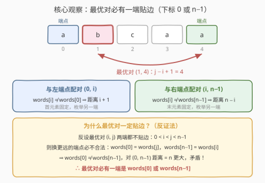
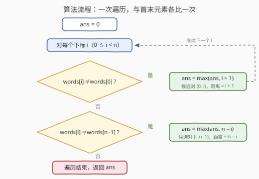

# LeetCode 不同单词间的最大距离I 题解

## 1. 题目概述

- **标题 / 题号**：不同单词间的最大距离I（#3696，easy）
- **链接**：https://leetcode.cn/problems/maximum-distance-between-unequal-words-in-array-i/
- **难度**：简单
- **标签**：数组、字符串

> ⚠️ 本题为 LeetCode 付费题，题意描述根据官方示例用例与 hints 重建，可能与官方题面有出入。

**题意**：给你一个字符串数组 `words`。找到两个**不同**下标 $i < j$ 之间的**最大距离**，且满足以下条件：

- $\text{words}[i] \ne \text{words}[j]$，并且
- 距离定义为 $j - i + 1$。

返回所有满足条件的下标对中最大的距离。如果不存在有效的下标对，返回 `0`。

**示例 1**：

```text
输入：words = ["leetcode","leetcode","codeforces"]
输出：3
解释：words[0] 和 words[2] 不相等，它们的距离为 2 - 0 + 1 = 3。
```

**示例 2**：

```text
输入：words = ["a","b","c","a","a"]
输出：4
解释：words[1] 和 words[4] 不相等，它们的距离为 4 - 1 + 1 = 4。
```

**示例 3**：

```text
输入：words = ["z","z","z"]
输出：0
解释：所有单词都相等，不存在合法下标对，返回 0。
```

**约束**：

- $1 \le \text{words.length} \le 100$
- $1 \le \text{words}[i].\text{length} \le 10$
- `words[i]` 由小写英文字母组成

> 💡 **审题关键**：① 距离是 $j - i + 1$（跨度再加一，即两点覆盖的格子数），不是常见的 $j - i$——示例 1 中对 $(0,2)$ 的答案是 3 而非 2；② 比较的是**整个字符串**是否相等，不是长度；③ 全部单词相同时返回 0，天然对应答案初始化为 0，无需特判。

## 2. 解题思路

### 2.1 暴力思路

枚举所有下标对 $(i, j)$（$i < j$），若两词不等则用 $j - i + 1$ 更新答案：

```python
class Solution:
    def maxDistance(self, words: List[str]) -> int:
        n, ans = len(words), 0
        for i in range(n):
            for j in range(i + 1, n):
                if words[i] != words[j]:
                    ans = max(ans, j - i + 1)
        return ans
```

$n \le 100$ 时下标对至多 $\binom{100}{2} = 4950$ 个，每次比较至多 10 个字符，总代价约 $5 \times 10^4$，轻松通过——官方 hint 也直说 "Use bruteforce"。但若数据范围放大（见第 5 节的 3706 II 版），$O(n^2)$ 立刻失效，值得提前想好线性做法。

### 2.2 核心观察：最优对必有一端贴边



**结论**：距离最大的合法对 $(i, j)$ 中，$i = 0$ 或 $j = n - 1$ 至少成立一个——最优对一定"贴着数组的一端"。

**反证**：假设最优对 $(i, j)$ 两端都不贴边，即 $0 < i < j < n - 1$：

- 把左端换成下标 $0$ 距离更大（$j + 1 > j - i + 1$），而 $(0, j)$ 偏偏不合法，只能是 $\text{words}[0] = \text{words}[j]$；
- 同理把右端换成 $n - 1$ 距离更大（$n - i > j - i + 1$），只能 $\text{words}[n-1] = \text{words}[i]$；
- 两式相连：$\text{words}[0] = \text{words}[j] \ne \text{words}[i] = \text{words}[n-1]$，于是 $(0,\, n-1)$ 合法且距离为 $n$，比 $j - i + 1$ 更大，与"最优"矛盾。

于是只需一趟遍历，让每个 $\text{words}[i]$ 与**首元素**和**末元素**各比一次：

- 若 $\text{words}[i] \ne \text{words}[0]$：候选对 $(0, i)$，距离 $= i - 0 + 1 = i + 1$；
- 若 $\text{words}[i] \ne \text{words}[n-1]$：候选对 $(i, n-1)$，距离 $= (n-1) - i + 1 = n - i$。

两个方向取最大即为答案，$O(n^2)$ 坍缩为 $O(n)$。

> ⚠️ **边界自动成立**：$i = 0$ 时第一个比较是自身比较必为假，不会产生 $(0, 0)$ 这种非法对；$n = 1$ 时两个比较全为假，答案保持 0；对 $(0, n-1)$ 被两个分支共同覆盖。全程无需任何特判。

### 2.3 算法流程



| 步骤 | 操作 | 说明 |
|------|------|------|
| ① 初始化 | `ans = 0` | 全同数组直接返回 0 |
| ② 遍历 | $i$ 从 $0$ 到 $n-1$ | 一趟扫描 |
| ③ 比首 | $\text{words}[i] \ne \text{words}[0]$ 则 $\text{ans} = \max(\text{ans},\, i + 1)$ | 候选对 $(0, i)$ |
| ④ 比末 | $\text{words}[i] \ne \text{words}[n-1]$ 则 $\text{ans} = \max(\text{ans},\, n - i)$ | 候选对 $(i, n-1)$ |
| ⑤ 返回 | `ans` | 两个方向的候选最大值 |

### 2.4 示例演算

以示例 2 `words = ["a","b","c","a","a"]`（$n = 5$）为例，首元素、末元素都是 `"a"`：

| $i$ | $\text{words}[i]$ | 与首 `"a"` 比 | 候选 $i+1$ | 与末 `"a"` 比 | 候选 $n-i$ | `ans` |
|---|---|---|---|---|---|---|
| 0 | `a` | 相同 | — | 相同 | — | 0 |
| 1 | `b` | **不同** | 2 | **不同** | **4** | 4 |
| 2 | `c` | **不同** | 3 | **不同** | 3 | 4 |
| 3 | `a` | 相同 | — | 相同 | — | 4 |
| 4 | `a` | 相同 | — | 相同 | — | 4 |

$i = 1$ 时通过"与末元素比"拿到候选对 $(1, 4)$、距离 $4 - 1 + 1 = 4$，即最终答案，与示例一致。

## 3. 参考代码

### C++

```cpp
class Solution {
public:
    int maxDistance(vector<string>& words) {
        int n = words.size();
        int ans = 0;
        for (int i = 0; i < n; i++) {
            if (words[i] != words[0]) ans = max(ans, i + 1);       // 候选对 (0, i)
            if (words[i] != words[n - 1]) ans = max(ans, n - i);   // 候选对 (i, n-1)
        }
        return ans;
    }
};
```

### Python

```python
class Solution:
    def maxDistance(self, words: List[str]) -> int:
        n = len(words)
        ans = 0
        for i, w in enumerate(words):
            if w != words[0]:
                ans = max(ans, i + 1)        # 候选对 (0, i)
            if w != words[-1]:
                ans = max(ans, n - i)        # 候选对 (i, n-1)
        return ans
```

## 4. 复杂度分析

| 维度 | 复杂度 | 说明 |
|------|--------|------|
| **时间复杂度** | $O(n \cdot L)$ | 一趟遍历，每个 $i$ 与首、末元素各比较一次，$L \le 10$ 为单词长度 |
| **空间复杂度** | $O(1)$ | 只使用常数个变量 |

对比暴力 $O(n^2 L)$：$n = 100$ 时两者都绰绰有余，但把 $n$ 放大到 $10^5$（II 版规模）时只有 $O(n)$ 能活。

## 5. 扩展：II 版与「距离对」家族

**[3706. 不同单词间的最大距离 II](https://leetcode.cn/problems/maximum-distance-between-unequal-words-in-array-ii/)**（同为付费题）是同系列的加强版，官方 hints 指向的正是本文的贴边观察——固定首单词找最右边的异词、固定末单词找最左边的异词。数据范围放大后 $O(n^2)$ 暴力失效，本文的一次遍历可直接迁移。

本题也属于"最大距离对"家族，各家比较条件不同、套路各异：

- [962. 最大宽度坡](https://leetcode.cn/problems/maximum-width-ramp/)：条件是 $A[i] \le A[j]$，贴边结论失效，须单调栈维护候选左端点；
- [1855. 下标对中的最大距离](https://leetcode.cn/problems/maximum-distance-between-a-pair-of-values/)：两个有序数组间取下标对，双指针从尾部同步收缩；
- [624. 数组列表中的最大距离](https://leetcode.cn/problems/maximum-distance-in-arrays/)：多个数组间取数的最值差，一趟维护全局最小/最大。

## 6. 面试要点

**Q1：本题最容易踩的坑是什么？**

> 距离定义是 $j - i + 1$ 而非 $j - i$。示例 1 中对 $(0, 2)$ 的距离是 3 不是 2。一次遍历写法里 $(0, i)$ 的距离 $i + 1$、$(i, n-1)$ 的距离 $n - i$，都源于这条定义，多退一位就是全盘皆错。

**Q2：为什么最优对一定贴边？**

> 反证：若最优对 $(i, j)$ 满足 $0 < i < j < n-1$，由最优性 $(0, j)$、$(i, n-1)$ 都不合法，得 $\text{words}[0] = \text{words}[j]$、$\text{words}[n-1] = \text{words}[i]$，进而 $\text{words}[0] \ne \text{words}[n-1]$，$(0, n-1)$ 距离 $n$ 更大，矛盾。

**Q3：所有单词都相同时返回什么？需要特判吗？**

> 返回 0。`ans` 初始化为 0，所有比较都为假时自然返回 0，$n = 1$ 时同理——好的初始化应当能吞掉边界，全程无需 if 特判。

**Q4：把条件从"不等"换成"不超过"（962 最大宽度坡），贴边结论还成立吗？**

> 不成立。反例 $A = [5, 3, 4, 1]$：唯一合法对是内部的 $(1, 2)$，两端都不贴边。本题的证明链条依赖"$\ne$ 的传递"（$\text{words}[0] = \text{words}[j]$ 且 $\text{words}[j] \ne \text{words}[i]$ 推出 $\text{words}[0] \ne \text{words}[i]$），$\le$ 没有这种互补对称性，962 须另起单调栈/双指针的炉灶。

**Q5：一次遍历里，为什么每个 $i$ 只需与首、末两个元素比较？**

> 由贴边结论，最优对形如 $(0, j)$ 或 $(i, n-1)$。枚举另一端的所有可能：对每个 $i$ 检查 $(0, i)$ 与 $(i, n-1)$ 是否合法并取距离，恰好覆盖全部候选对（$(0, n-1)$ 被覆盖两次，无害）。

> 💡 **一句话总结**：3696 = **两端各比一次**；"不等"条件 + 反证法证明最优对必贴边，$O(n^2)$ 暴力坍缩成 $O(n)$ 一趟扫描。

## 同类练习题

| # | 题目 | 与本题的关联 |
|---|------|-------------|
| 3706 | [不同单词间的最大距离 II](https://leetcode.cn/problems/maximum-distance-between-unequal-words-in-array-ii/) | 同系列加强版，hints 正是"固定首/末单词找最远异词"的贴边观察 |
| 962 | [最大宽度坡](https://leetcode.cn/problems/maximum-width-ramp/)（[站内题解](../0901-1000/962_最大宽度坡.md)） | 同求最大 $j - i$，条件换成 $A[i] \le A[j]$，贴边失效须单调栈 |
| 1855 | [下标对中的最大距离](https://leetcode.cn/problems/maximum-distance-between-a-pair-of-values/)（[站内题解](../1801-1900/1855_下标对中的最大距离.md)） | 双有序数组的最大下标对距离，双指针经典 |
| 624 | [数组列表中的最大距离](https://leetcode.cn/problems/maximum-distance-in-arrays/)（[站内题解](../0601-0700/624_数组列表中的最大距离.md)） | 多数组取数的最值差，全局 min/max 一趟维护 |
| 243 | [最短单词距离](https://leetcode.cn/problems/shortest-word-distance/)（[站内题解](../0201-0300/243_最短单词距离.md)） | 单词距离家族的"最短"版，一次遍历维护最近出现位置 |
