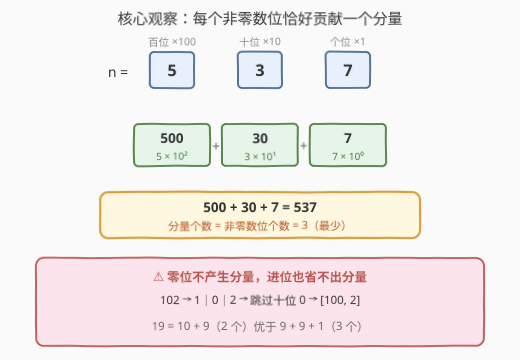
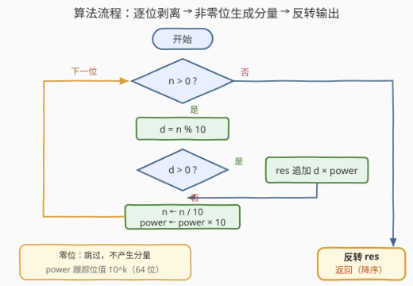

# 计算十进制表示

- **题目名称**：计算十进制表示
- **链接**：[3697. 计算十进制表示](https://leetcode.cn/problems/compute-decimal-representation/)
- **难度**：简单
- **标签**：数组、数学

## 1. 题目概述

题目定义**10 进制分量**：能写成 $d \times 10^k$（$d \in [1,9]$，$k \ge 0$）的正整数——十进制写法中**恰好只含一个非零数字**，后面跟若干个 0。例如 500 = 5×10²、30 = 3×10¹、7 = 7×10⁰ 都是分量；而 537、102、11 含多个非零数字，不是分量。

给定正整数 `n`，请把它表示为**若干个 10 进制分量之和**，且使用的分量个数**最少**。返回这些分量组成的数组，并按分量大小**降序**排列。

**示例 1**：

```text
输入：n = 537
输出：[500,30,7]
解释：537 = 500 + 30 + 7，且无法用少于 3 个分量表示 537。
```

**示例 2**：

```text
输入：n = 102
输出：[100,2]
解释：102 本身不是分量（含两个非零数字），因此需要 2 个分量。
```

**示例 3**：

```text
输入：n = 6
输出：[6]
解释：6 = 6 × 10⁰ 本身就是一个分量。
```

**约束条件**：

- $1 \le n \le 10^9$

> 💡 **审题关键**：① 分量的本质是「一个非零数字 × 10 的幂」，十进制里**只占一个非零位**；② 要最小化的是**分量个数**；③ 输出要求**降序**——从高位往低位生成天然降序，无需排序。

---

## 2. 解题思路

### 2.1 朴素思路

最容易想到的是把分量当成"硬币"：面值集合为 $\{d \times 10^k\}$ 共 90 种，做最少硬币 DP 或从大面值贪心搜。但 $n$ 高达 $10^9$，DP 状态空间直接爆炸；而且这完全没利用"面值集合恰好是十进制按位结构"这一特性。正确的切入点是观察**分量与数位的天然对应**。

### 2.2 核心观察：每个非零数位恰好贡献一个分量



把三条观察串成一条链：

- **观察一（分量只含一个非零位）**：分量 $d \times 10^k$ 的十进制写法是「数字 $d$ 后跟 $k$ 个 0」，只占一个非零数位。**一个分量无法同时覆盖两个数位**。
- **观察二（按位拆恰好还原）**：把 $n$ 的每个非零数位 $d_k$（位于第 $k$ 位，位值 $10^k$）单独取出，得到分量 $d_k \times 10^k$；全部相加正好还原 $n$。分量个数 = **非零数位的个数**。
- **观察三（这就是最少）**：任何一组分量之和为 $n$ 时，把落在第 $k$ 位上的分量合并成"位和" $s_k$，即 $n = \sum_k s_k \cdot 10^k$；单个分量在某一位最多贡献 9，故位和为 $s_k > 0$ 的数位至少消耗 $\lceil s_k / 9 \rceil \ge 1$ 个分量。若某个 $s_k \ge 10$（相当于靠进位凑数），做替换 $s_k \leftarrow s_k - 10$、$s_{k+1} \leftarrow s_{k+1} + 1$（10 个 $10^k$ 换 1 个 $10^{k+1}$）：本位代价至少降 1（$\lceil s_k/9 \rceil \ge 2$ 而 $\lceil (s_k-10)/9 \rceil \le \lceil s_k/9 \rceil - 1$），高位代价至多升 1，**总代价不增**。反复归一化最终得到 $n$ 的标准数位分解，说明任何方案的分量数都 ≥ 非零数位个数——按位拆取到下界，即为最优。

> ⚠️ **进位不省分量**：如 $19 = 9 + 9 + 1$ 要 3 个分量，反而比按位拆 $10 + 9$ 的 2 个多。任何"凑整进位"的方案都不会更省。

- **观察四（降序免费获得）**：高位分量与低位分量满足 $d \times 10^k \ge 10^k > 9 \times 10^{k-1} \ge d' \times 10^{k'}$（其中 $k' \le k-1$），即**高位分量必然严格大于低位分量**。从高位到低位输出天然降序；若从个位开始收集，最后反转一次即可。

### 2.3 算法流程



| 步骤 | 操作 | 说明 |
|------|------|------|
| ① 剥位 | `d = n % 10`，`n /= 10` | 从个位开始逐位取出 |
| ② 生成 | `d > 0` 时追加 `d * power` | 零位跳过，不产生分量 |
| ③ 升权 | `power *= 10` | 跟踪当前位的位值 $10^k$ |
| ④ 反转 | 收集完 reverse 一次 | 低位→高位收集，反转即降序 |

### 2.4 示例演算

以 `n = 102` 为例（`power` 初始为 1）：

| 轮次 | 当前 n | 末位 d | 生成的分量 | 操作后 n / power |
|---|---|---|---|---|
| 1 | 102 | 2 | 2 × 1 = 2 | 10 / 10 |
| 2 | 10 | 0 | 跳过（零位） | 1 / 100 |
| 3 | 1 | 1 | 1 × 100 = 100 | 0 / 1000 |

收集到 `[2, 100]`，反转为 `[100, 2]`，与示例一致。示例 1 的 537 同理得到 `[7, 30, 500]` → 反转 `[500, 30, 7]`。

---

## 3. 参考代码

### C++

```cpp
class Solution {
public:
    vector<int> decimalRepresentation(int n) {
        vector<int> res;
        long long power = 1;                       // 当前位值 10^k
        while (n > 0) {
            int d = n % 10;                        // ① 剥出末位
            if (d > 0) res.push_back(d * power);   // ② 非零位生成分量
            n /= 10;
            power *= 10;                           // ③ 位值升一档
        }
        reverse(res.begin(), res.end());           // ④ 反转即降序
        return res;
    }
};
```

`power` 用 `long long`：$n = 10^9$ 有 10 位，处理完最高位后 `power` 还会再乘一次 10 达到 $10^{10}$，超出 `int` 范围。分量本身不超过 $10^9$，`int` 装得下。

### Python

```python
class Solution:
    def decimalRepresentation(self, n: int) -> List[int]:
        res, power = [], 1
        while n:
            d = n % 10                      # ① 剥出末位
            if d:
                res.append(d * power)       # ② 非零位生成分量
            n //= 10
            power *= 10                     # ③ 位值升一档
        return res[::-1]                    # ④ 反转即降序
```

也可写成字符串一行版（`enumerate` 从高位遍历，天然降序、无需反转）：

```python
class Solution:
    def decimalRepresentation(self, n: int) -> List[int]:
        s = str(n)
        return [int(c) * 10 ** (len(s) - 1 - i) for i, c in enumerate(s) if c != '0']
```

---

## 4. 复杂度分析

| 维度 | 复杂度 | 说明 |
|------|--------|------|
| **时间复杂度** | $O(\log_{10} n)$ | 循环次数 = 数位个数，$n \le 10^9$ 时至多 10 轮 |
| **空间复杂度** | $O(\log_{10} n)$ | 结果数组长度 ≤ 非零数位个数（不计返回值则 $O(1)$） |

---

## 5. 扩展：推广到 B 进制分量

把分量的定义换成 $d \times B^k$（$1 \le d \le B-1$，$k \ge 0$），结论逐字照搬：**按 B 进制位直拆即最优**，分量个数 = $n$ 的 B 进制表示中非零位的个数。证明完全相同——每个分量只占一个非零位，进位归一化（$B$ 个 $B^k$ 换 1 个 $B^{k+1}$）不增加总代价。实现上把模 10/除 10 换成模 $B$/除 $B$ 即可，504. 七进制数就是这套"逐位剥离"循环的纯进制版。

另一个方向的变体是固定面值表：12. 整数转罗马数字相当于把每个十进制位映射到人为给定的分量表（I/V/X/L/C/D/M 加减组合），本质上仍是"按位值拆解整数"，只是每位的分量表不再自由。

---

## 6. 面试要点

**Q1：为什么按位拆出的分量个数是最少的？**

> 每个分量只含一个非零数位。把任何方案按位合并成位和 $s_k$ 后，每个非零位和至少消耗 $\lceil s_k/9 \rceil \ge 1$ 个分量；进位归一化（10 个 $10^k$ 换 1 个 $10^{k+1}$）不增加总代价，故任何方案都能无损地化归到标准数位分解，分量数 ≥ 非零数位个数。按位拆恰好取到这个下界。

**Q2：输出要求降序，需要排序吗？**

> 不需要。高位分量 $d \times 10^k \ge 10^k > 9 \times 10^{k-1} \ge$ 任何低位分量，位值高一级就严格更大。从高位往低位生成天然降序；从个位收集则最后 reverse 一次，仍是 $O(\log n)$，比排序更省。

**Q3：实现上有什么溢出坑？**

> `power` 必须用 64 位：$n = 10^9$ 时循环里最后一次 `power *= 10` 会到 $10^{10}$，32 位 `int` 溢出。分量值本身 $\le 10^9$（它是 $n$ 的某个数位乘位值），`int` 安全。若用字符串版则无此坑。

**Q4：用"最少硬币"DP 做行不行？**

> 理论可行但完全不必要：面值 90 种、金额上限 $10^9$，DP 时间空间都是十亿级。识别出"分量 ↔ 非零数位一一对应"后，问题从十亿级状态坍缩到 10 轮循环——先找结构，再写代码。

**Q5：零位为什么可以直接跳过？**

> 分量的系数 $d \ge 1$，不存在"零分量"；$n$ 的某个数位是 0，意味着该位不需要任何贡献，位和 $s_k = 0$，代价 0。反之任何把 0 位"凑"出分量的方案（如先放后靠进位抵消）只会增加分量数。

> 💡 **一句话总结**：3697 = **按十进制位直拆**——每个非零数位贡献一个分量 $d \times 10^k$，个数最少、天然降序，模 10/除 10 至多十轮搞定。

---

## 7. 同类练习题

- [12. 整数转罗马数字](https://leetcode.cn/problems/integer-to-roman/)：同为"按位值拆解整数"，只是每位的分量表被人为固定（I/V/X…），本题是其自由版
- [273. 整数转换英文表示](https://leetcode.cn/problems/integer-to-english-words/)：按三位一段拆解数字逐段转英文，位值分解思想的工程化版本
- [504. 七进制数](https://leetcode.cn/problems/base-7/)：模 B/除 B 逐位剥离的直接练习，本题循环体的"纯进制"形态
- [7. 整数反转](https://leetcode.cn/problems/reverse-integer/)：同样的模 10/除 10 逐位处理，附带溢出判断训练
- [258. 各位相加](https://leetcode.cn/problems/add-digits/)：反复对数位求和，数位操作的基础热身
