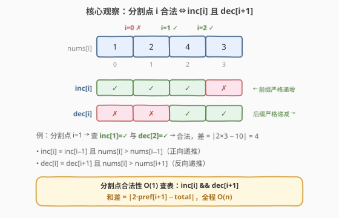
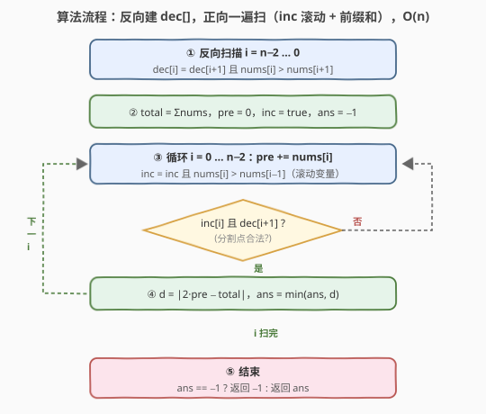

# LeetCode 分割数组得到最小绝对差 题解

## 1. 题目概述

- **标题 / 题号**：分割数组得到最小绝对差（#3698，medium）
- **链接**：https://leetcode.cn/problems/split-array-with-minimum-difference/
- **难度**：中等
- **标签**：数组、前缀和

**题意**：给你一个整数数组 `nums`。将数组**恰好**分成两个子数组 `left` 和 `right`，使得 `left` **严格递增**、`right` **严格递减**。

返回 `left` 与 `right` 的元素和之间**绝对差值的最小可能值**。如果不存在有效的分割方案，则返回 `-1`。

- **子数组**是数组中连续的非空元素序列。
- **严格递增**：每个元素都严格大于其前一个元素（如果存在）。
- **严格递减**：每个元素都严格小于其前一个元素（如果存在）。

**示例 1**：

```text
输入：nums = [1,3,2]
输出：2
解释：
分割为 [1] 和 [3,2]：|1 - 5| = 4
分割为 [1,3] 和 [2]：|4 - 2| = 2   ← 最优
```

**示例 2**：

```text
输入：nums = [1,2,4,3]
输出：4
解释：
分割为 [1] 和 [2,4,3]：右侧不是严格递减，无效
分割为 [1,2] 和 [4,3]：|3 - 7| = 4   ← 最优
分割为 [1,2,4] 和 [3]：|7 - 3| = 4
```

**示例 3**：

```text
输入：nums = [3,1,2]
输出：-1
解释：不存在有效的分割方案。
```

**约束**：

- `2 <= nums.length <= 10^5`
- `1 <= nums[i] <= 10^5`

## 2. 解题思路

### 2.1 暴力思路

枚举分割点 `i`（`left = nums[0..i]`，`right = nums[i+1..n-1]`），对每个分割点线性检查两侧是否严格单调，再计算两边和的差。时间复杂度 `O(n^2)`，在 `n = 10^5` 下会超时。

瓶颈在于「每个分割点都重新检查单调性」——而单调性检查其实可以被**预处理**复用。

### 2.2 核心观察：前后缀布尔数组 + 前缀和



关键是把「分割点是否合法」拆成两个**独立的一维性质**：

> 定义两个布尔数组：
> - `inc[i] = true` 当且仅当前缀子数组 `nums[0..i]` 严格递增
> - `dec[i] = true` 当且仅当后缀子数组 `nums[i..n-1]` 严格递减

二者都能 `O(n)` 递推：

```text
inc[0] = true；inc[i] = inc[i-1] && (nums[i] > nums[i-1])
dec[n-1] = true；dec[i] = dec[i+1] && (nums[i] > nums[i+1])
```

> 💡 **一个分割点 `i`（`0 <= i < n-1`）合法 ⇔ `inc[i] && dec[i+1]`**：左侧恰为 `nums[0..i]`（要求 `inc[i]`），右侧恰为 `nums[i+1..n-1]`（要求 `dec[i+1]`），两个条件完全独立。

合法分割点确定后，和的差值用**前缀和** `O(1)` 求出：

$$\text{diff}(i) = \left|\, 2 \cdot \text{pref}[i+1] - \text{total} \,\right|$$

其中 `pref[i+1] = nums[0] + ... + nums[i]`，`total` 为全体元素之和（因为 `right` 的和等于 `total - pref[i+1]`）。

**时间复杂度**：`O(n)`，**空间复杂度**：`O(n)`。

### 2.3 算法流程图



整体流程：

1. 一次正向扫描递推 `inc[]`；
2. 一次反向扫描递推 `dec[]`；
3. 计算 `total` 与前缀和，枚举每个分割点 `i ∈ [0, n-2]`；
4. 若 `inc[i] && dec[i+1]`，用前缀和 `O(1)` 算差值并更新答案；
5. 若从未遇到合法分割点，返回 `-1`。

三个数组可以边扫边算（`inc` 用一个布尔变量滚动即可），实际只需 `dec` 需要真正存下来。

### 2.4 示例演算

以 `nums = [1,3,2]` 为例：

| i | inc[i] | dec[i] | 分割 | 左和 | 右和 | 差 |
|---|--------|--------|------|------|------|-----|
| 0 | ✅ | ❌ | `[1] \| [3,2]` | 1 | 5 | 4 |
| 1 | ✅ | ✅ | `[1,3] \| [2]` | 4 | 2 | **2** |
| 2 | ❌ | ✅ | —（右空，非法） | — | — | — |

分割点 `i = 1` 合法（`inc[1] && dec[2]`）且差值最小，答案为 `2`。

## 3. 参考代码

### C++

```cpp
class Solution {
  public:
    int minimumDifference(vector<int>& nums) {
        int n = nums.size();

        vector<char> dec(n, 1);
        for (int i = n - 2; i >= 0; i--)
            dec[i] = dec[i + 1] && (nums[i] > nums[i + 1]);

        long long total = 0;
        for (int x : nums) total += x;

        long long best = -1;
        long long pre = 0;
        bool inc = true;
        for (int i = 0; i < n - 1; i++) {
            pre += nums[i];
            if (i > 0) inc = inc && (nums[i] > nums[i - 1]);
            if (inc && dec[i + 1]) {
                long long d = llabs(2 * pre - total);
                best = (best == -1) ? d : min(best, d);
            }
        }
        return (int)best;
    }
};
```

### Python

```python
class Solution:
    def minimumDifference(self, nums: List[int]) -> int:
        n = len(nums)

        dec = [True] * n
        for i in range(n - 2, -1, -1):
            dec[i] = dec[i + 1] and nums[i] > nums[i + 1]

        total = sum(nums)
        best = -1
        pre = 0
        inc = True
        for i in range(n - 1):
            pre += nums[i]
            if i > 0:
                inc = inc and nums[i] > nums[i - 1]
            if inc and dec[i + 1]:
                d = abs(2 * pre - total)
                best = d if best == -1 else min(best, d)
        return best
```

## 4. 复杂度分析

| 维度 | 复杂度 | 说明 |
|------|--------|------|
| 时间复杂度 | O(n) | 正向扫一遍递推 `inc` 与前缀和，反向扫一遍递推 `dec`，再扫一遍枚举分割点 |
| 空间复杂度 | O(n) | `dec` 后缀布尔数组；`inc` 与前缀和均可滚动变量 `O(1)` 维护 |

## 5. 扩展：能否 O(1) 额外空间？

`inc` 与前缀和都可以用滚动变量维护，唯一必须数组化的是 `dec`（反向信息）。若允许**先扫一遍预计算出最优候选**再扫一遍验证，仍需保存 `dec` 的信息——严格 `O(1)` 空间不可行的原因在于：合法分割点集是「前缀递增段 ∩ 后缀递减段的左移」，两个方向的依赖无法在一次单向扫描中同时获得。

不过有一个实用性质：`inc[i]` 一旦为 `false` 就永远为 `false`（后缀不会自救），所以合法分割点的上界是「首个 `inc[i] = false` 的位置之前」；而 `dec[i+1]` 随 `i` 增大单调变松（后缀越短越容易递减），因此**合法分割点构成一个连续区间** `[0, i_max]` 内的子区间，实际实现中可以借此提前剪枝退出。

## 6. 面试要点

1. **为什么合法性判断能 O(1) 完成？**
   - 因为 `left`/`right` 都是**连续**子数组，分割点 `i` 唯一确定两段内容；把「前缀递增」「后缀递减」预处理成布尔数组后，单点查询 `inc[i] && dec[i+1]` 即可。

2. **`inc` 和 `dec` 的递推方程分别是什么？**
   - `inc[i] = inc[i-1] && nums[i] > nums[i-1]`（正向）；`dec[i] = dec[i+1] && nums[i] > nums[i+1]`（反向）。注意两处都是 `>`：递减段的相邻关系是 `nums[i] > nums[i+1]`。

3. **如何避免对每个分割点重复求和？**
   - 用前缀和 `pre`，`right` 的和为 `total - pre`，差值化简为 `|2·pre - total|`，每个分割点 `O(1)`。

4. **何时返回 -1？**
   - 枚举完所有 `n-1` 个分割点都没有一个满足 `inc[i] && dec[i+1]`，例如 `[3,1,2]`：`inc[1]` 已假，`dec[1]` 也假，无解。

5. **数值范围上需要小心什么？**
   - `n ≤ 10^5`、`nums[i] ≤ 10^5`，总和最大 `10^10`，超出 32 位整数范围，C++ 中要用 `long long` 累加。

## 同类练习题

| # | 题目 | 与本题的关联 |
|---|------|-------------|
| 724 | [寻找数组的中心下标](https://leetcode.cn/problems/find-pivot-index/) | 同样是「前缀和 + 分割点合法性」的单向扫描 |
| 238 | [除自身以外数组的乘积](https://leetcode.cn/problems/product-of-array-except-self/) | 前缀 × 后缀双向预处理思想的经典题 |
| 896 | [单调数列](https://leetcode.cn/problems/monotonic-array/) | 严格递增 / 递减判定的最简形态 |
| 1013 | [将数组分成和相等的三个部分](https://leetcode.cn/problems/partition-array-into-three-parts-with-equal-sum/) | 前缀和 + 分割点枚举的变体 |
| 1671 | [得到山形数组的最少删除次数](https://leetcode.cn/problems/minimum-number-of-removals-to-make-mountain-array/) | 前缀递增 + 后缀递减（山形）结构，需 LIS 预处理 |
