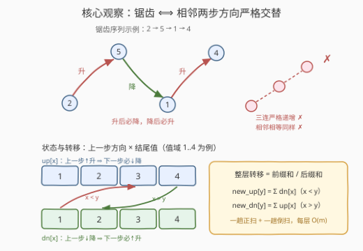
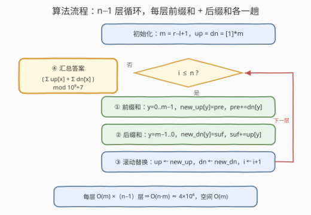

# LeetCode 锯齿形数组的总数I 题解

## 1. 题目概述

- **标题 / 题号**：锯齿形数组的总数I（#3699，hard）
- **链接**：https://leetcode.cn/problems/number-of-zigzag-arrays-i/
- **难度**：困难
- **标签**：动态规划、计数DP、前缀和

**题意**：给定三个整数 $n$、$l$、$r$。长度为 $n$ 的**锯齿形数组**需同时满足：

1. 每个元素的取值范围为 $[l, r]$；
2. 任意**两个相邻**的元素都不相等；
3. 任意**三个连续**的元素不能构成一个**严格递增**或**严格递减**的序列。

返回满足条件的锯齿形数组总数。由于答案可能很大，将结果对 $10^9+7$ 取余数。

**示例 1**：

```text
输入：n = 3, l = 4, r = 5
输出：2
解释：取值范围 [4,5] 内只有 [4,5,4] 和 [5,4,5] 两种
```

**示例 2**：

```text
输入：n = 3, l = 1, r = 3
输出：10
解释：[1,2,1],[1,3,1],[1,3,2],[2,1,2],[2,1,3],[2,3,1],
      [2,3,2],[3,1,2],[3,1,3],[3,2,3]
```

**约束**：

- $3 \le n \le 2000$
- $1 \le l < r \le 2000$（即值域大小 $m = r-l+1 \le 2000$）

> 💡 **审题关键**：① 条件 2 + 条件 3 合起来等价于「**相邻两步的方向必须交替**」——升一步后下一步只能降，降一步后只能升（见 2.2 的推导），这正是「锯齿」的字面含义；② 真正的规模参数是 $n$ 和 $m = r-l+1$，$l$ 本身无关紧要——大小关系不随平移改变，值域可归一化为 $0..m-1$；③ 这是指数量级的**计数**题，不是构造题——朴素 $O(n \cdot m^2)$ 转移是 $8 \times 10^9$ 次运算，必须用前缀和压到 $O(n \cdot m) \approx 4 \times 10^6$。

## 2. 解题思路

### 2.1 暴力思路：枚举所有数组

值域有 $m$ 种取值，全体数组共 $m^n$ 个——$m = n = 2000$ 时是 $2000^{2000}$ 量级的天文数字；即便 DFS 每步只沿锯齿规则延伸，合法序列的**数量本身**就是指数级的，枚举必死。出路是 DP：把「已构造前缀」的全部信息压缩成少量状态，逐层转移计数。

### 2.2 核心观察：方向交替的计数 DP



**第一步：把三条规则拧成一句话。** 记每一步的方向：$a_{i-1} < a_i$ 为「升」，$a_{i-1} > a_i$ 为「降」。

- 条件 2（相邻不等）保证每一步**非升即降**，不存在「平」；
- 若第 $i$ 步是「升」，看第 $i+1$ 步：继续升则 $a_{i-1} < a_i < a_{i+1}$ 三连严格递增（违反条件 3）；平则相邻相等（违反条件 2）——**只能降**。降侧对称：降后只能升。

> 💡 于是「锯齿形数组」⟺ **方向序列严格交替**（↑↓↑↓… 或 ↓↑↓↑… 两种形态）。

**第二步：设计状态。** 前缀能否继续延伸、怎么延伸，只取决于「当前结尾值 $x$」和「上一步方向」两个信息——把它俩做成状态：

- $up[i][x]$：长度为 $i$、以值 $x$ 结尾、**上一步是升**（下一步必须降）的数组个数；
- $dn[i][x]$：长度为 $i$、以值 $x$ 结尾、**上一步是降**（下一步必须升）的数组个数。

**第三步：转移。** 「降后必升」：上一步降到 $x$（$dn$ 态）、下一步升到 $y$，要求 $x < y$；「升后必降」：上一步升到 $x$（$up$ 态）、下一步降到 $y$，要求 $x > y$：

$$up[i+1][y] = \sum_{x<y} dn[i][x], \qquad dn[i+1][y] = \sum_{x>y} up[i][x]$$

**初始化**：长度 1 没有「上一步」，两个方向各记一份虚拟许可 $up[1][x] = dn[1][x] = 1$。这只是**计数口径**——任何长度 2 的数组 $x \to y$（$x \ne y$）恰被一侧统计一次：$x < y$ 计入 $up[2][y]$、$x > y$ 计入 $dn[2][y]$，不会重复。

**答案**：$\sum_x \big(up[n][x] + dn[n][x]\big) \bmod (10^9+7)$。

### 2.3 算法流程：前缀和 / 后缀和逐层转移



转移里的 $\sum_{x<y}$ 与 $\sum_{x>y}$ 正是**前缀和 / 后缀和**——不必对每个终点 $y$ 重扫一遍值域：

| 步骤 | 操作 | 说明 |
|------|------|------|
| ① 归一化 | $m = r-l+1$，值平移到 $0..m-1$ | $l$ 不进状态，只决定 $m$ |
| ② 初始化 | `up = dn = [1] * m` | 长度 1，两种虚拟方向 |
| ③ 正扫前缀和 | `pre=0`；`y=0..m-1`：`new_up[y]=pre`，`pre+=dn[y]` | 得 $new\_up[y]=\sum_{x<y} dn[x]$ |
| ④ 倒扫后缀和 | `suf=0`；`y=m-1..0`：`new_dn[y]=suf`，`suf+=up[y]` | 得 $new\_dn[y]=\sum_{x>y} up[x]$ |
| ⑤ 滚动替换 | `up, dn = new_up, new_dn` | 只留当前层，空间 $O(m)$ |
| ⑥ 循环与求和 | ③④⑤ 共执行 $n-1$ 轮，答案 $\sum(up+dn) \bmod 10^9{+}7$ | 每层 $O(m)$，总计 $O(nm)$ |

### 2.4 示例演算

**示例 2**：$n=3$，$l=1$，$r=3$（$m=3$，值记为 $1,2,3$）：

```text
长度 1 : up = [1, 1, 1]                          dn = [1, 1, 1]
长度 2 : new_up[y] = Σ_{x<y} dn[x] → up = [0, 1, 2]
         new_dn[y] = Σ_{x>y} up[x] → dn = [2, 1, 0]
长度 3 : up = [0, 2, 3]                          dn = [3, 2, 0]
答案   : (0+2+3) + (3+2+0) = 10 ✓
```

顺手验一个直觉：$m=2$ 时（如示例 1），任何层 $\sum up + \sum dn$ 恒为 2——值域只有两个数，锯齿只剩 `ABAB…` 与 `BABA…` 两种形态，与 $n$ 无关。

## 3. 参考代码

### C++

```cpp
class Solution {
  public:
    int zigZagArrays(int n, int l, int r) {
        const int MOD = 1'000'000'007;
        int m = r - l + 1;
        vector<long long> up(m, 1), dn(m, 1);        // 长度 1：两种虚拟方向
        vector<long long> nup(m), ndn(m);
        for (int i = 2; i <= n; ++i) {
            long long pre = 0;                        // pre = Σ dn[x], x < y
            for (int y = 0; y < m; ++y) {
                nup[y] = pre;                         // 先取再累加：严格小于 y
                pre = (pre + dn[y]) % MOD;
            }
            long long suf = 0;                        // suf = Σ up[x], x > y
            for (int y = m - 1; y >= 0; --y) {
                ndn[y] = suf;
                suf = (suf + up[y]) % MOD;
            }
            swap(up, nup);
            swap(dn, ndn);
        }
        long long ans = 0;
        for (int x = 0; x < m; ++x) ans = (ans + up[x] + dn[x]) % MOD;
        return (int)ans;
    }
};
```

> 💡 **写法要点**：
> - 前缀和是「**先取再累加**」——`nup[y]` 要的是严格小于 $y$ 的部分和，$y$ 自己的贡献留给下一个下标；后缀同理镜像；
> - `swap` 复用两个缓冲数组，逐层整体替换零分配；
> - $l$ 只用来算 $m$，全程不参与运算。

### Python

```python
class Solution:
    def zigZagArrays(self, n: int, l: int, r: int) -> int:
        MOD = 10**9 + 7
        m = r - l + 1
        up = [1] * m                # 上一步升 → 下一步必须降
        dn = [1] * m                # 上一步降 → 下一步必须升
        for _ in range(n - 1):
            nup, pre = [0] * m, 0
            for y in range(m):              # new_up[y] = Σ dn[x], x < y
                nup[y] = pre
                pre = (pre + dn[y]) % MOD
            ndn, suf = [0] * m, 0
            for y in range(m - 1, -1, -1):  # new_dn[y] = Σ up[x], x > y
                ndn[y] = suf
                suf = (suf + up[y]) % MOD
            up, dn = nup, ndn
        return (sum(up) + sum(dn)) % MOD
```

> 💡 **写法要点**：约束 $n \ge 3$ 保证循环至少两轮；本题口径在长度 2 起自动归正——若假想 $n=1$，公式给 $2m$ 而真值是 $m$（虚拟方向双计），题目约束恰好绕开这个坑。

## 4. 复杂度分析

| 维度 | 复杂度 | 说明 |
|------|--------|------|
| 时间复杂度 | $O(n \cdot m)$ | $n-1$ 层转移，每层一趟正扫 + 一趟倒扫，各 $O(m)$ |
| 空间复杂度 | $O(m)$ | 滚动数组只保留当前层 `up`/`dn` 与两个缓冲 |

> 对比朴素 $O(n \cdot m^2) = 8 \times 10^9$：前缀和把「每个终点各自重扫一遍左侧/右侧」坍缩成「整层扫一次」——被求和集合随 $y$ 单调变化是能这么压的本质原因，也是计数 DP 的标准提速件。

## 5. 扩展：n 大到 $10^9$ 怎么办——矩阵快速幂

姊妹题 [3700. 锯齿形数组的总数II](https://leetcode.cn/problems/number-of-zigzag-arrays-ii/) 题面完全相同，但 $n \le 10^9$、$m \le 75$：逐层递推在 $n$ 维度爆炸，而 $m$ 大幅缩小——正是**矩阵快速幂**的甜区。

把一整层状态拼成 $2m$ 维列向量 $v_i = \big(up[\cdot],\ dn[\cdot]\big)^{\mathsf T}$，2.2 的转移是**线性**的：$v_{i+1} = T\, v_i$，其中

$$T = \begin{pmatrix} 0 & P \\ S & 0 \end{pmatrix},\qquad P_{y,x} = [\,x < y\,],\quad S_{y,x} = [\,x > y\,]$$

（$P$ 为下三角全 1 矩阵、$S$ 为上三角全 1 矩阵）。于是

$$v_n = T^{\,n-1} v_1,\qquad v_1 = (1, 1, \dots, 1)^{\mathsf T}$$

矩阵规模 $2m \le 150$，快速幂 $\log_2 10^9 \approx 30$ 次矩阵乘法，总量 $\approx 150^3 \times 30 \approx 10^8$ 次乘加——C++ 稳过。同族还有 [3916. 锯齿形数组的总数III](https://leetcode.cn/problems/number-of-zigzag-arrays-iii/)，继续沿「线性递推 + 快速幂」这条线加码。

## 6. 面试要点

**Q1：「相邻不等」+「无三连单调」为什么等价于「方向交替」？**

> 每一步非升即降（相邻不等排除「平」）。若某步是升，下一步若再升则三连严格递增、若平则相邻相等——两种都违规，只剩降；降侧对称。所以方向序列只能是 ↑↓↑↓… 或 ↓↑↓↑…。「锯齿」不是比喻，是充要刻画。

**Q2：状态为什么必须带「上一步方向」，只记结尾值行不行？**

> 不行——无后效性要求状态概括**全部影响未来的信息**。同样以 $x$ 结尾，「刚升上来」只能接更小值、「刚降下来」只能接更大值，合法延伸集合完全相反。丢了方向维，两种历史混进同一个桶，转移就分不清该往大转还是往小转。

**Q3：初始化 up=dn=[1]*m 把每个长度 1 序列计了两遍，为什么最终不重复？**

> 那两份是「延伸许可」而非「实体」：长度 1 的序列下一步可升可降，两种许可各记 1。延伸到长度 2 时，每个 $x \to y$（$x \ne y$）只兑现其中一条许可（$x<y$ 走升、$x>y$ 走降），恰被统计一次。口径从长度 2 起归正；只有 $n=1$ 时公式会双计（$2m$ vs 真值 $m$），本题 $n \ge 3$ 天然规避。

**Q4：前缀和为什么能把一层转移从 $O(m^2)$ 压到 $O(m)$？**

> $new\_up[y] = \sum_{x<y} dn[x]$ 中被求和的集合随 $y$ 增大**单调地**扩一格——这正是前缀和的定义式，一趟正扫每个 $y$ 的答案 $O(1)$ 取出；后缀和镜像处理 $new\_dn$。凡「转移到所有更小/更大位置」型的 DP 都吃这一招，如 1937 扣分后的最大得分用左扫/右扫两趟前缀最值消掉整层内层枚举，结构同源。

**Q5：值域为什么要平移？$l$ 怎么处理？**

> 转移只关心值之间的**大小关系**，平移不改变关系；把 $[l, r]$ 映射到 $0..m-1$ 后下标即值，省去每步减 $l$ 也防下标越界。$l$ 的唯一作用是与 $r$ 一起确定 $m$——面试时主动指出「答案只依赖 $n$ 和 $m$」是审题加分项。

> 💡 **一句话总结**：锯齿 ⟺ 方向严格交替 ⇒ 状态 = (结尾值, 上一步方向)，转移 = 「降后升取更小侧前缀和、升后降取更大侧后缀和」，滚动数组 $O(nm)$ 收工。

## 同类练习题

| # | 题目 | 与本题的关联 |
|---|------|-------------|
| 376 | [摆动序列](https://leetcode.cn/problems/wiggle-subsequence/) | 同一「方向交替」定义下求**最长**摆动子序列——本题约束的最优化镜像 |
| 978 | [最长湍流子数组](https://leetcode.cn/problems/longest-turbulent-subarray/) | 方向交替条件求最长子数组，对比「计数 vs 最长」的状态设计差异 |
| 2222 | [选择建筑物的数目](https://leetcode.cn/problems/number-of-ways-to-select-buildings/) | 数「010/101 交替」子序列个数，同为交替模式计数 |
| 935 | [骑士拨号器](https://leetcode.cn/problems/knight-dialer/) | 状态 = 当前数字的计数 DP，「值域做状态维度」的入门版 |
| 2466 | [统计构造好字符串的方案数](https://leetcode.cn/problems/count-ways-to-build-good-strings/) | 逐位转移 + 取模的计数 DP 基本功 |
