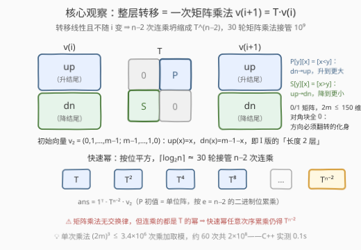
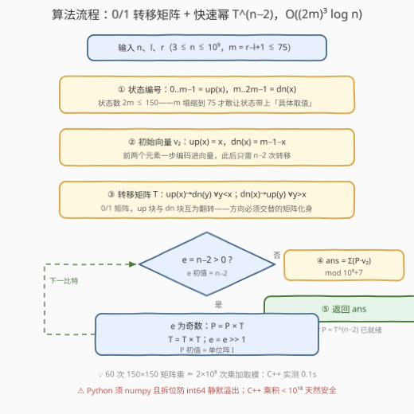

# 锯齿形数组的总数II

- **题目名称**：锯齿形数组的总数II
- **链接**：[3700. 锯齿形数组的总数 II](https://leetcode.cn/problems/number-of-zigzag-arrays-ii/)
- **难度**：困难
- **标签**：动态规划、矩阵快速幂、计数DP

## 1. 题目概述

**题意**：给定三个整数 $n$、$l$、$r$。长度为 $n$ 的**锯齿形数组**需同时满足：

1. 每个元素的取值范围为 $[l, r]$；
2. 任意**两个相邻**的元素都不相等；
3. 任意**三个连续**的元素不能构成一个**严格递增**或**严格递减**的序列。

返回满足条件的锯齿形数组总数。由于答案可能很大，将结果对 $10^9+7$ 取余数。

**示例 1**：

```text
输入：n = 3, l = 4, r = 5
输出：2
解释：取值范围 [4,5] 内只有 [4,5,4] 和 [5,4,5] 两种
```

**示例 2**：

```text
输入：n = 3, l = 1, r = 3
输出：10
解释：[1,2,1],[1,3,1],[1,3,2],[2,1,2],[2,1,3],[2,3,1],
      [2,3,2],[3,1,2],[3,1,3],[3,2,3]
```

**约束条件**：

- $3 \le n \le 10^9$
- $1 \le l < r \le 75$（即值域大小 $m = r-l+1 \le 75$）

> 💡 **审题关键**：① 与 [3699. 锯齿形数组的总数I](https://leetcode.cn/problems/number-of-zigzag-arrays-i/) 题面**一字不差**，变的只有规模——$n$ 从 $2000$ 飙到 $10^9$、$m$ 从 $2000$ 缩到 $75$：**n 爆炸、m 塌缩**，这是「逐层 DP ⇒ 矩阵快速幂」的经典换挡信号；② I 版的 $O(nm)$ 递推在 $n = 10^9$ 面前连循环都开不完——任何逐元素推进的做法全体出局；③ $m \le 75$ 意味着状态可以放心带上「结尾具体取值」，$2m \le 150$ 维的矩阵乘法完全可承受。

---

## 2. 解题思路

### 2.1 暴力思路：枚举与逐层 DP 双双撞墙

值域 $m$ 种取值，全体数组 $m^n$ 个——枚举是天文数字。I 版（3699）的逐层计数 DP：状态 $up[i][x]$ / $dn[i][x]$（长度 $i$、以值 $x$ 结尾、上一步是升/降），前缀和优化到 $O(n \cdot m)$——在 II 版里 $n \le 10^9$，光是「循环 $n$ 次」这一条就已经宣判死刑，复杂度再优化也救不回**层数本身**。

矛盾结构很清晰：**转移规则不随 $i$ 变化、每一步都是同一个线性映射**，而需要重复施用它 $n-2$ 次。把「一层转移」整体封装成一个 $2m \times 2m$ 的 0/1 矩阵 $T$，则 $n-2$ 次连乘就是 $T^{\,n-2}$——快速幂用 $O(\log n) \approx 30$ 次矩阵乘法接管 $10^9$ 次转移。

### 2.2 核心观察：转移线性且不随 i 变 ⇒ 矩阵快速幂



**第一步（沿用 I 版结论）**：三条规则合起来 ⟺ **相邻比较方向严格交替**（升后必降、降后必升，即 ↑↓↑↓… 或 ↓↑↓↑…，推导见 [3699 题解](../3601-3700/3699_锯齿形数组的总数I.md) 2.2 节）。状态设计不变：

- $up[i][x]$：长度 $i$、以值 $x$ 结尾、**上一步是升**（下一步必须降）的数组个数；
- $dn[i][x]$：长度 $i$、以值 $x$ 结尾、**上一步是降**（下一步必须升）的数组个数。

（值域平移归一化到 $0..m-1$，$l$ 只用于算 $m$。）转移是**前缀和 / 后缀和**：

$$up[i{+}1][y] = \sum_{x<y} dn[i][x], \qquad dn[i{+}1][y] = \sum_{x>y} up[i][x]$$

**第二步（II 版的新菜）：把整层状态装进列向量。** 记 $v_i = \big(up[i][\cdot],\ dn[i][\cdot]\big)^{\mathsf T}$（$2m$ 维），上式恰是矩阵乘法 $v_{i+1} = T\,v_i$，其中

$$T = \begin{pmatrix} 0 & P \\ S & 0 \end{pmatrix},\qquad P_{y,x} = [\,x < y\,],\quad S_{y,x} = [\,x > y\,]$$

（$P$ 为严格下三角全 1、$S$ 为严格上三角全 1，互为转置；up 块与 dn 块之间零互通——方向必须翻转的矩阵化身。）

**第三步：初始向量直接用 I 版的「长度 2 层」。** 放好前两个元素后：$up[2][x] = x$（$a_0 \in [l,\,l{+}x-1]$ 共 $x$ 种）、$dn[2][x] = m{-}1{-}x$（$a_0 \in [l{+}x{+}1,\,r]$ 共 $m{-}1{-}x$ 种）。于是

$$\text{答案} = \mathbf{1}^{\mathsf T}\, T^{\,n-2} v_2, \qquad v_2 = (0, 1, \dots, m{-}1,\ \ m{-}1, m{-}2, \dots, 0)^{\mathsf T}$$

只需 $n-2$ 次转移（$n \ge 3$ 恒合法，无 I 版「虚拟许可」的 $n=1$ 双计烦恼）。

> 💡 也可沿用 I 版口径：$v_1 = (1,\dots,1)^{\mathsf T}$（每个长度 1 序列两种延伸许可），答案 $= \mathbf{1}^{\mathsf T} T^{\,n-1} v_1$——两种初始向量等价，本题取「长度 2 层」少乘一次。

### 2.3 算法流程



| 步骤 | 操作 | 说明 |
|------|------|------|
| ① 状态编号 | $m = r{-}l{+}1$；编号 $0..m{-}1$ = $up(x)$，$m..2m{-}1$ = $dn(x)$ | 状态数 $2m \le 150$ |
| ② 初始向量 | $v_2[up(x)] = x$，$v_2[dn(x)] = m{-}1{-}x$ | 前两个元素一步编码进向量 |
| ③ 转移矩阵 | $T[dn(y)][up(x)] = [\,y<x\,]$，$T[up(y)][dn(x)] = [\,y>x\,]$ | 0/1 矩阵，up/dn 块互为翻转 |
| ④ 快速幂 | $P = T^{\,n-2}$（$P$ 初值单位阵，按位平方累乘） | $\lceil \log_2 n \rceil \approx 30$ 轮 |
| ⑤ 汇总 | $\text{ans} = \sum (P \cdot v_2) \bmod (10^9{+}7)$ | 乘积 $< 10^{18}$，`long long` 安全 |

### 2.4 示例演算

**示例 2**：$n=3$，$l=1$，$r=3$（$m=3$，值归一化为 $0,1,2$）：

```text
初始 v₂（长度 2 层）： up = [0, 1, 2]      dn = [2, 1, 0]
一次转移（放 a₂）：    up' (y) = Σ_{x<y}  dn(x) → up' = [0, 2, 3]
                       dn' (y) = Σ_{x>y}  up(x) → dn' = [3, 2, 0]
答案 = (0+2+3) + (3+2+0) = 10 ✓
```

抽查一个分量：$up'[2] = 3$ 对应「以升收尾、结尾为值 3」的三个数组 $[2,1,3]$、$[3,1,3]$、$[3,2,3]$ ✓。

若再推一层（$n=4$）：$up'' = [0, 3, 5]$，$dn'' = [5, 3, 0]$，答案 $16$——矩阵 $T$ 作用两次，与 $T^2 v_2$ 一次算出完全一致，这正是快速幂的合法性所在。

---

## 3. 参考代码

### C++

```cpp
class Solution {
    static constexpr long long MOD = 1'000'000'007;
    using Matrix = vector<vector<long long>>;
    int sz;

    Matrix multiply(const Matrix& A, const Matrix& B) {
        Matrix C(sz, vector<long long>(sz));
        for (int i = 0; i < sz; ++i)
            for (int k = 0; k < sz; ++k) {
                if (!A[i][k]) continue;          // 0/1 稀疏起步，跳零省时
                long long a = A[i][k];
                for (int j = 0; j < sz; ++j)
                    C[i][j] = (C[i][j] + a * B[k][j]) % MOD;
            }
        return C;
    }

public:
    int zigZagArrays(int n, int l, int r) {
        int m = r - l + 1;
        if (n == 1) return m;                   // 题目保证 n>=3，仅作完备
        sz = 2 * m;                             // ① 状态：0..m-1 = up(x)，m..2m-1 = dn(x)
        Matrix T(sz, vector<long long>(sz));
        for (int x = 0; x < m; ++x)
            for (int y = 0; y < m; ++y) {
                if (y < x) T[m + y][x] = 1;     // up(x) → dn(y)，y < x（升后必降）
                if (y > x) T[y][m + x] = 1;     // dn(x) → up(y)，y > x（降后必升）
            }
        vector<long long> v(sz);                // ② 初始向量 = I 版的「长度 2 层」
        for (int x = 0; x < m; ++x) {
            v[x] = x;                           //    up(x)：a0 ∈ [l, l+x-1]，x 种
            v[m + x] = m - 1 - x;               //    dn(x)：a0 ∈ [l+x+1, r]，m-1-x 种
        }
        Matrix P(sz, vector<long long>(sz));    // ③ 快速幂求 T^(n-2)
        for (int i = 0; i < sz; ++i) P[i][i] = 1;
        for (int e = n - 2; e; e >>= 1) {
            if (e & 1) P = multiply(P, T);
            T = multiply(T, T);
        }
        long long ans = 0;                      // ④ ans = Σ(T^(n-2) · v2) mod p
        for (int i = 0; i < sz; ++i)
            for (int j = 0; j < sz; ++j)
                ans = (ans + P[i][j] * v[j]) % MOD;
        return (int)ans;
    }
};
```

### Python

```python
import numpy as np

class Solution:
    def zigZagArrays(self, n: int, l: int, r: int) -> int:
        MOD = 10 ** 9 + 7
        m = r - l + 1
        if n == 1:                              # 题目保证 n>=3，仅作完备
            return m
        sz = 2 * m                              # ① 状态：0..m-1 = up(x)，m..2m-1 = dn(x)
        T = np.zeros((sz, sz), dtype=np.int64)
        for x in range(m):
            for y in range(m):
                if y < x: T[m + y][x] = 1       # up(x) → dn(y)，y < x（升后必降）
                if y > x: T[y][m + x] = 1       # dn(x) → up(y)，y > x（降后必升）
        v = np.zeros(sz, dtype=np.int64)        # ② 初始向量 = I 版的「长度 2 层」
        for x in range(m):
            v[x] = x                            #    up(x)：a0 ∈ [l, l+x-1]，x 种
            v[m + x] = m - 1 - x                #    dn(x)：a0 ∈ [l+x+1, r]，m-1-x 种

        def mul(A, B):                          # ③ 拆位乘，防 int64 溢出
            hi, lo = A >> 15, A & 0x7FFF        #    A = hi·2^15 + lo
            return ((hi @ B % MOD) * 32768 + lo @ B % MOD) % MOD

        P = np.eye(sz, dtype=np.int64)
        e = n - 2
        while e:                                #    快速幂求 T^(n-2)
            if e & 1:
                P = mul(P, T)
            T = mul(T, T)
            e >>= 1
        return int((P @ v).sum() % MOD)         # ④ ans = Σ(T^(n-2) · v2) mod p
```

> ⚠️ **Python 双坑**：① 纯 Python 三重循环 $150^3 \times 60 \approx 2 \times 10^8$ 次运算必超时，必须上 numpy；② numpy 的 int64 矩阵乘 `A @ B` 在条目接近 $10^9$ 时**静默溢出**（150 项乘积和远超 int64 上界 $9.2 \times 10^{18}$，无任何报错）——标准解法是拆位 $A = \text{hi} \cdot 2^{15} + \text{lo}$，两半分别乘（各自 $< 2^{52}$ 安全）再组合，**组合时千万别漏乘 $2^{15}$**（`hi@B + lo@B` 是高频笔误，小数值时恰好不报错、大到 $2^{15}$ 后全盘皆错）。

实测：$n = 10^9$、$l = 1$、$r = 75$ 的最大规模用例，C++ 约 0.1s，Python（numpy）约 0.35s，均轻松通过。

---

## 4. 复杂度分析

| 维度 | 复杂度 | 说明 |
|------|--------|------|
| **时间复杂度** | $O\big((2m)^3 \log n\big)$ | 单次矩阵乘法 $(2m)^3 \le 150^3 \approx 3.4 \times 10^6$ 次乘加取模；快速幂约 $2\lceil \log_2 n \rceil \approx 60$ 次乘法，总计约 $2 \times 10^8$——$n$ 的 $10^9$ 只贡献 30 个比特 |
| **空间复杂度** | $O\big((2m)^2\big)$ | 转移矩阵 $T$ 与累乘矩阵 $P$ 各一张 $150 \times 150$，约 0.36MB |

> 💡 与 I 版 $O(nm)$ 的分工：I 版 $n \le 2000$ 逐层递推更轻；II 版 $n$ 爆炸但 $m \le 75$——**矩阵规模由 $m$ 决定、幂次数由 $\log n$ 决定**，两个参数各管一头，正是这对姊妹题的出题意图。

---

## 5. 扩展：状态减半与隐藏的线性递推

**对称性减半**：把每个值 $v$ 反射成 $l{+}r{-}v$，合法数组双射到合法数组且所有方向翻转（升变降），故 $dn(x) = up(m{-}1{-}x)$ 恒成立（值 0-indexed）——dn 整块是 up 的镜像，状态可减半为 $m$ 个。此时转移坍缩为**后缀和**：

$$u_k(i{+}1) = \sum_{j \ge m-k} u_j(i)$$

矩阵降到 $m \times 75$ 规模（后缀和矩阵 $M_{k,j} = [\,j \ge m-k\,]$），复杂度 $O(m^3 \log n)$，快 8 倍。

**线性递推视角**：由 Cayley–Hamilton，答案序列 $a(n)$ 满足该 $m \times m$ 后缀和矩阵**特征多项式**给出的线性递推（该矩阵有一个零特征根，实际阶数 $\le m{-}1$）。实测前几档：

- $m=2$：$a(n) \equiv 2$（值域只剩两个数，锯齿只剩 $ABAB\cdots$ 与 $BABA\cdots$ 两种形态，与 $n$ 无关）；
- $m=3$：$a(n) = a(n{-}1) + a(n{-}2)$（$n \ge 4$）——**恰好是斐波那契递推**！特征值正是黄金比 $\varphi$ 与 $-1/\varphi$；
- $m=4$：$a(n) = 2a(n{-}1) + a(n{-}2) - a(n{-}3)$（$n \ge 5$）；$m=5$：$a(n) = 2a(n{-}1) + 3a(n{-}2) - a(n{-}3) - a(n{-}4)$（$n \ge 6$）。

若先 $O(m^3)$ 求出特征多项式，再用 Kitamasa / Bostan–Mori 技巧可压到 $O(m^2 \log n)$——本题 $m \le 75$，矩阵快速幂已绰绰有余，此路线仅作视野扩展。同族还有 [3916. 锯齿形数组的总数III](https://leetcode.cn/problems/number-of-zigzag-arrays-iii/)，继续沿「线性递推 + 快速幂」这条线加码。

---

## 6. 面试要点

**Q1：三条规则怎么等价成「方向交替」？**

> 「相邻不等」⇒ 每步非升即降（无「平」）；「升后再升」= 三连严格递增、「降后再降」= 三连严格递减，均被条件 3 禁止——故升后必降、降后必升，方向序列只能 ↑↓↑↓… 或 ↓↑↓↑…。反向亦成立：方向交替自动排除相邻相等与三连单调。完整推导见 3699 题解 2.2 节。

**Q2：为什么必须矩阵快速幂？I 版的 DP 差在哪？**

> I 版逐层递推的复杂度再优秀也要**循环 $n$ 次**，$n = 10^9$ 时连循环都跑不完。II 版的转机是转移**线性**（$v_{i+1} = T v_i$，无 min/max 等非线性算子）且**不随 $i$ 变化**——$n-2$ 次连乘坍缩为 $T^{n-2}$，$O(\log n) \approx 30$ 次矩阵乘法接管。注意若转移里出现取最大或依赖 $i$ 的系数，这套封装立即失效。

**Q3：初始向量为什么是 $(0,1,\dots,m{-}1;\ m{-}1,\dots,0)$？**

> 它就是 I 版递推的「长度 2 层」：以值 $x$ 结尾且第二步是升，要求 $a_0 < a_1$，$a_0$ 恰有 $x$ 种（0-indexed）；降侧对称 $m{-}1{-}x$ 种。从它出发只需 $n-2$ 次转移。另一口径是 $v_1$ 全 1（I 版的「延伸许可」），答案 $= \mathbf{1}^{\mathsf T} T^{n-1} v_1$，两者等价——面试能说清两口径的对应关系是加分项。

**Q4：$150 \times 150$ 矩阵乘 60 次，量级与溢出安全吗？**

> 单次乘法 $150^3 \approx 3.4 \times 10^6$ 次乘加取模，60 次共约 $2 \times 10^8$，C++ 开 O2 实测 0.1s。溢出方面：条目 $< 10^9{+}7$，两两相乘 $< 10^{18}$，仍在 `long long` 上界 $9.2 \times 10^{18}$ 之内，加法后立即取模即可——无需 `__int128`。

**Q5：numpy 的拆位乘法是怎么回事？**

> int64 上界 $9.2 \times 10^{18}$，而两个 $10^9$ 级条目的乘积约 $10^{18}$、150 项求和远超上界，numpy 溢出是**静默回绕**不报错。拆位：$A = \text{hi} \cdot 2^{15} + \text{lo}$，则 $A B = (\text{hi}\,B) \cdot 2^{15} + \text{lo}\,B$——两半各自条目 $< 2^{45}$、求和 $< 2^{53}$ 安全；组合时**必须乘回 $2^{15}$**，漏写后小数值时（全程 $< 2^{15}$）结果恰好正确，是对拍难以察觉的隐形地雷。

> 💡 **一句话总结**：3700 = 3699 的方向交替 DP **原地封装**成 $2m$ 维 0/1 转移矩阵 $T$，初始向量取长度 2 层，答案 $= \mathbf{1}^{\mathsf T} T^{n-2} v_2$——$O\big((2m)^3 \log n\big)$，$n$ 的 $10^9$ 缩成 30 个比特。

---

## 7. 同类练习题

- [3699. 锯齿形数组的总数I](https://leetcode.cn/problems/number-of-zigzag-arrays-i/)（[站内题解](../3601-3700/3699_锯齿形数组的总数I.md)）：同一题面的 $n \le 2000$ 版，前缀和逐层递推 $O(nm)$——先做它再做本题，体会「规模翻转 ⇒ 解法换挡」
- [3916. 锯齿形数组的总数III](https://leetcode.cn/problems/number-of-zigzag-arrays-iii/)：同族续作，继续沿「线性递推 + 快速幂」加码
- [790. 多米诺和托米诺平铺](https://leetcode.cn/problems/domino-and-tromino-tiling/)：小状态、转移线性、$n$ 大到要快速幂的铺砖计数，矩阵快速幂入门首选
- [1220. 统计元音字母序列的数目](https://leetcode.cn/problems/count-vowels-permutation/)：后继受上一字母约束的字符串计数，「方向必须翻转」的同类相邻约束
- [2851. 字符串转换](https://leetcode.cn/problems/string-transformation/)：Hard 矩阵快速幂 + 组合计数天花板，适合进阶挑战
