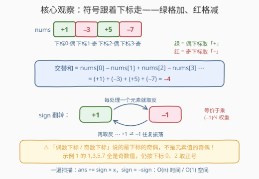
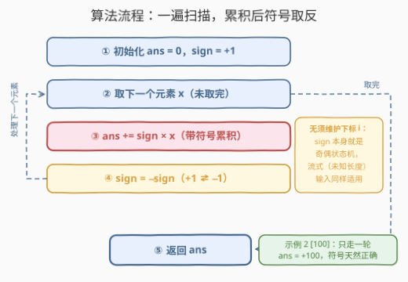

# 计算交替和

- **题目名称**：计算交替和
- **链接**：[3701. 计算交替和](https://leetcode.cn/problems/compute-alternating-sum/)
- **难度**：简单
- **标签**：数组、模拟

## 1. 题目概述

**题意**：给定一个整数数组 `nums`，其**交替和**定义为：**偶数下标**位置的元素**相加**，再**减去****奇数下标**位置的元素，即 `nums[0] - nums[1] + nums[2] - nums[3] ⋯`。返回 `nums` 的交替和。

**示例 1**：

```text
输入：nums = [1,3,5,7]
输出：-4
解释：偶数下标元素为 nums[0]=1、nums[2]=5；奇数下标元素为 nums[1]=3、nums[3]=7。
      交替和 = 1 - 3 + 5 - 7 = -4。
```

**示例 2**：

```text
输入：nums = [100]
输出：100
解释：唯一的偶数下标元素是 nums[0]=100，没有奇数下标元素，交替和 = 100。
```

**约束条件**：

- $1 \le \mathrm{nums.length} \le 100$
- $1 \le \mathrm{nums}[i] \le 100$

> 💡 **审题关键**：① 题面说的「偶数下标 / 奇数下标」指的是**下标**的奇偶，与**元素值**的奇偶毫无关系——示例 1 的四个元素全是奇数值，照样按下标 $0,2$ 取正、$1,3$ 取负；② 符号序列固定从下标 $0$（偶，正号）开始逐项交替；③ 约束保证数组非空，无须处理空数组的边界。

---

## 2. 解题思路

### 2.1 朴素思路：按下标分组求和再相减

最直白的做法分两个累积器：一轮（或两轮）循环把偶数下标元素累进 `sumEven`、奇数下标元素累进 `sumOdd`，最后返回 `sumEven - sumOdd`；或等价地，按下标判断 `i % 2 == 0` 把每项乘上 $\pm 1$ 加进答案。

这当然正确，但**每个元素都要现场算一次奇偶**，且两个累积器略显臃肿。注意到符号序列 $+,-,+,-,\cdots$ 是**周期为 2 的固定振荡**，无须每次重新判断——「奇偶状态」本身可以作为一个变量被**携带**。

### 2.2 核心观察：符号只由下标奇偶决定，sign 逐项翻转



两个关键性质让一遍扫描 + 单累积器成为可能：

- **符号序列固定**：下标 $i$ 的符号恰为 $(-1)^i$——起手必为 $+1$（下标 $0$ 是偶数），之后每处理一个元素取反一次。于是维护一个符号变量 `sign`，循环体只做两件事：`ans += sign * x` 与 `sign = -sign`，**全程无须出现下标**。
- **单元素数组天然正确**：示例 2 的 `[100]` 只走一轮，`ans = 0 + (+1)×100 = 100`，"没有奇数下标元素"的分支被起手符号天然吸收，零特判。

顺带一提，`sign = -sign` 的本质是把「乘 $(-1)$ 的幂」这个指数运算 amortize 成了「乘一次 $-1$」：归纳可知第 $i$ 轮循环里 `sign` 恒等于 $(-1)^i$，与逐项计算 `(-1)**i` 完全等价，但每步只花一次乘法。

> ⚠️ **别审错题**：若误把「偶数下标」读成「偶数元素」，示例 1 的 $1,3,5,7$ 全是奇数值，会算成 $-1-3-5-7=-16$，与正确答案 $-4$ 南辕北辙。这是本题唯一值得设防的坑。

### 2.3 算法流程：一遍扫描，累积后符号取反



| 步骤 | 操作 | 说明 |
|------|------|------|
| ① 初始化 | `ans = 0`，`sign = +1` | 下标 0 为偶 ⇒ 起手正号 |
| ② 取元素 | 依次取 $x \in \mathrm{nums}$ | 只前进，不回看 |
| ③ 累积 | `ans += sign × x` | 带符号权重累进答案 |
| ④ 取反 | `sign = −sign` | 奇偶状态机翻转：$+1 \Leftrightarrow -1$ |
| ⑤ 返回 | 扫描结束返回 `ans` | 单元素数组只走一轮，同样正确 |

由于 `sign` 本身就是状态机，循环体**不依赖下标**——即使输入是只能逐个读出的流（事先不知长度），算法照样成立。

### 2.4 示例演算

**示例 1：`nums = [1,3,5,7]`**

```text
ans = 0, sign = +1
x=1：ans = 0 + (+1)×1 =  1，sign → −1
x=3：ans = 1 + (−1)×3 = −2，sign → +1
x=5：ans = −2 + (+1)×5 = 3，sign → −1
x=7：ans = 3 + (−1)×7 = −4，sign → +1
返回 −4 ✓
```

**示例 2：`nums = [100]`**——只走一轮，`ans = 0 + (+1)×100 = 100`，返回 `100` ✓。

---

## 3. 参考代码

### C++

```cpp
class Solution {
public:
    int alternatingSum(vector<int>& nums) {
        int ans = 0, sign = 1;          // 下标 0 为偶 ⇒ 起手 +1
        for (int x : nums) {
            ans += sign * x;            // 带符号累积
            sign = -sign;               // 翻转：+1 ⇄ −1
        }
        return ans;
    }
};
```

### Python

```python
class Solution:
    def alternatingSum(self, nums: List[int]) -> int:
        ans, sign = 0, 1                # 下标 0 为偶 ⇒ 起手 +1
        for x in nums:
            ans += sign * x             # 带符号累积
            sign = -sign                # 翻转：+1 ⇄ −1
        return ans
```

> 💡 **写法要点**：不要在循环里写 `if i % 2 == 0: ans += x else: ans -= x`——能对，但把奇偶判断摊给每个元素。`sign` 翻转把奇偶状态收进一个变量，代码更短，也顺便脱离了对下标的依赖。

---

## 4. 复杂度分析

| 维度 | 复杂度 | 说明 |
|------|--------|------|
| **时间复杂度** | $O(n)$ | 一遍扫描，每个元素一次乘法、一次加法、一次取反 |
| **空间复杂度** | $O(1)$ | 只用一个累积器 `ans` 和一个符号变量 `sign` |

---

## 5. 扩展：霍纳法则——交替和 = 多项式在 $x = -1$ 处的取值

把 `nums` 看作多项式 $P(x) = \mathrm{nums}[0] + \mathrm{nums}[1]x + \mathrm{nums}[2]x^2 + \cdots$ 的系数表，则**交替和恰是 $P(-1)$**。用**霍纳法则（Horner's rule）**从最高次系数倒着折叠：

```python
class Solution:
    def alternatingSum(self, nums: List[int]) -> int:
        ans = 0
        for x in reversed(nums):        # 从 nums[n-1] 折到 nums[0]
            ans = ans * (-1) + x        # ans_new = ans·x + a_i，x = −1
        return ans
```

以 `[1,3,5,7]` 演算：$7 \to 7\times(-1)+5=-2 \to (-2)\times(-1)+3=5 \to 5\times(-1)+1=-4$ ✓。同是 $O(n)/O(1)$，视角却完全不同——正着做是「逐项配符号」，倒着做是「多项式求值」，二者在 $x=-1$ 处殊途同归。

**一行写法**：Python 里也可 `sum((-1) ** i * x for i, x in enumerate(nums))`，直接复刻定义式 $(-1)^i$，可读性优先时够用，性能上多了一次幂运算。

**区间交替和（更难版本的预告）**：若题目升级为「多次查询任意区间 $[l, r]$ 的交替和（符号仍从 $+,-,+,-\cdots$ 起）」，标准做法是预处理前缀交替和 $\mathrm{pre}[i] = \sum_{k < i} (-1)^k\,\mathrm{nums}[k]$，则

$$
\text{区间交替和} = (-1)^{l} \cdot \bigl(\mathrm{pre}[r+1] - \mathrm{pre}[l]\bigr)
$$

即先做差、再按**左端点 $l$ 的奇偶**决定是否整体变号——一次 $O(n)$ 预处理，每次查询 $O(1)$。

---

## 6. 面试要点

**Q1：用 `sign` 翻转和用 `i % 2` 判断，有什么实质区别？**

> 结果完全等价，因为第 $i$ 轮的 `sign` 恒等于 $(-1)^i$（归纳可证）。实质区别在于：`sign` 翻转把奇偶状态**存进变量**，循环体不依赖下标——对 `for x in nums` 这类无下标迭代、甚至流式输入（事先不知长度）同样适用，还省掉每个元素一次取模。

**Q2：本题最容易踩的坑是什么？**

> 把「偶数**下标**」误读成「偶数**元素**」。示例 1 的 $1,3,5,7$ 全是奇数值，按元素奇偶算会得 $-16$ 而非 $-4$。题面里「位置」二字是关键词——奇偶说的是**位置**，不是**值**。

**Q3：单元素数组需要特判吗？**

> 不需要。下标 $0$ 是偶数 ⇒ `sign` 起手 $+1$，唯一元素直接以正号累进，`[100]` 自然返回 $100$。约束又保证数组非空，连"空数组返回 $0$"的分支都没有——初始值 `ans = 0` 本身就兜住了。

**Q4：为什么交替和可以看成多项式在 $x=-1$ 的取值？霍纳写法为什么对？**

> 交替和 $= \sum (-1)^i\,\mathrm{nums}[i] = P(-1)$，其中 $P$ 以 `nums` 为系数。霍纳法则利用 $P(x) = a_0 + x(a_1 + x(a_2 + \cdots))$ 的嵌套结构，从最内层（最高次）往外折叠，每步一次乘法一次加法，代入 $x=-1$ 后乘法恰好实现「符号交替」。

**Q5：若要频繁查询任意区间的交替和，怎么做？**

> 预处理前缀交替和 $\mathrm{pre}$，查询 $[l, r]$ 时先做差 $\mathrm{pre}[r+1] - \mathrm{pre}[l]$，再按左端点奇偶乘上 $(-1)^l$ 校正符号（见第 5 节公式）。这是「一遍扫描」到「前缀和 + O(1) 查询」的经典升级路径，与 303 题的普通前缀和同源。

> 💡 **一句话总结**：3701 = `ans += sign*x; sign = -sign` 的一遍扫描，起手 $+1$ 吸收一切边界，$O(n)$ / $O(1)$ 收工；坑只有一个——奇偶说的是下标，不是元素值。

---

## 7. 同类练习题

- [1486. 数组异或操作](https://leetcode.cn/problems/xor-operation-in-an-array/)：同款「一遍循环 + 单累积器」骨架，累积运算换成 `^`，对照体会有无符号权重的差别
- [1588. 所有奇数长度子数组的和](https://leetcode.cn/problems/sum-of-all-odd-length-subarrays/)：按下标奇偶做贡献计数，是交替思想在计数场景的进阶应用
- [303. 区域和检索 - 数组不可变](https://leetcode.cn/problems/range-sum-query-immutable/)：前缀和基本功，对应第 5 节「区间交替和」的预处理思路
- [2574. 左右元素和的差](https://leetcode.cn/problems/left-and-right-sum-differences/)：一遍扫描同时维护两个方向的累积器，体会累积器的设计自由度
- [1720. 解码异或后的数组](https://leetcode.cn/problems/decode-xored-array/)：利用累积运算的可逆性还原数组，与本题同为「数组 + 模拟」的签到题练手
