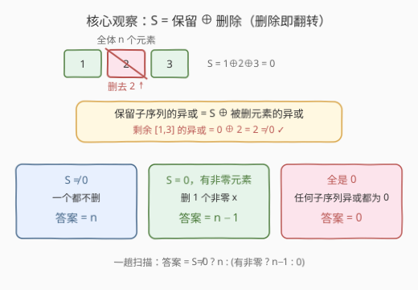
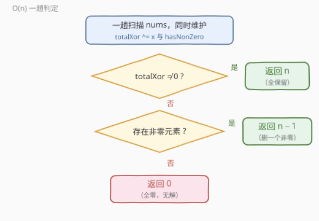

# 按位异或非零的最长子序列

- **题目名称**：按位异或非零的最长子序列
- **链接**：[3702. 按位异或非零的最长子序列](https://leetcode.cn/problems/longest-subsequence-with-non-zero-bitwise-xor/)
- **难度**：中等
- **标签**：位运算、数组、贪心

## 1. 题目概述

**题意**：给定一个整数数组 $nums$，返回其中**按位异或（XOR）计算结果非零**的**最长子序列**的长度。若不存在这样的子序列，返回 $0$。

**子序列**是一个**非空**数组，可以通过从原数组中删除一些或不删除任何元素（不改变剩余元素的顺序）派生而来。

**示例 1**：

```text
输入：nums = [1,2,3]
输出：2
解释：最长子序列之一是 [2,3]，按位异或为 2 XOR 3 = 1，非零。
```

**示例 2**：

```text
输入：nums = [2,3,4]
输出：3
解释：最长子序列是 [2,3,4]，按位异或为 2 XOR 3 XOR 4 = 5，非零。
```

**约束条件**：

- $1 \le nums.length \le 10^5$
- $0 \le nums[i] \le 10^9$

> 💡 **审题关键**：① 「最长子序列」=「**删掉的元素最少**」——题目求长度，等价于问**最少删几个元素**能让剩余部分的异或非零；② 子序列的异或值与**顺序无关**（异或满足交换律），所以唯一的决策只有「删谁」；③ 全零数组是无解的兜底情形——任何子序列的异或都是 $0$，这正是返回 $0$ 分支的来源。

---

## 2. 解题思路

### 2.1 暴力思路：枚举子序列

最直接的想法是枚举所有 $2^n$ 个子序列，逐个求异或、判断非零、取最长——$O(2^n \cdot n)$ 在 $n \le 10^5$ 下是天方夜谭。稍微收敛一点：既然求「最长」，可以按长度从 $n$ 到 $1$ 依次枚举组合并验证，但最坏仍是组合数级别。

> 💡 暴力的浪费在于**把「删了什么」当成独立决策**。事实上全体元素的异或 $S$ 一趟就能算出来，而「删除」对异或的影响可以用一条代数恒等式精确描述——突破口是异或的**自消性** $x \oplus x = 0$ 与**结合律**。

### 2.2 核心观察：整体异或 S + 「删除即翻转」



**恒等式**：全体元素划分成「保留」和「删除」两个互斥集合，由异或的结合律与交换律：

$$\underbrace{S}_{\text{全体异或}} = \underbrace{X_{\text{保留}}}_{\text{保留子序列异或}} \oplus \underbrace{X_{\text{删除}}}_{\text{被删元素异或}} \quad\Longrightarrow\quad X_{\text{保留}} = S \oplus X_{\text{删除}}$$

也就是说，**删掉一个异或为 $t$ 的集合，等价于把整体异或 $S$ 翻转成 $S \oplus t$**。于是按 $S$ 的取值分三种情况：

**情况一（$S \ne 0$）**：一个都不删，$X_{\text{保留}} = S \ne 0$，答案就是 $n$。长度不可能超过 $n$，这已是上界。

**情况二（$S = 0$ 且存在非零元素）**：删 $0$ 个不行（异或恰为 $0$）；删一个值为 $0$ 的元素也不行（$S \oplus 0 = 0$）；而**删一个非零元素 $x$ 恰好使剩余异或变成 $0 \oplus x = x \ne 0$**。所以答案恰为 $n - 1$——删 $1$ 个是「删 $0$ 个不可行」之下的最小代价。

**情况三（$S = 0$ 且全是 $0$）**：任何子序列的异或都是 $0$，无解，返回 $0$。

> ⚠️ **非空性自动满足**：情况二中删除后剩 $n-1$ 个元素，会不会删空？不会——若数组恰有一个非零元素 $x$（其余全 $0$），则 $S = x \ne 0$，与 $S = 0$ 矛盾。所以 $S = 0$ 且存在非零元素时，非零元素至少有两个，$n \ge 2$，$n - 1 \ge 1$。情况三中删到只剩一个 $0$ 也是异或 $0$，全情形覆盖。

> 💡 **一句话结论**：答案 $= S \ne 0 \,?\, n : (\text{存在非零} \,?\, n-1 : 0)$。

### 2.3 算法流程图



**文字版步骤**：

| 步骤 | 操作 | 说明 |
|------|------|------|
| ① 一趟扫描 | `totalXor ^= x`，`hasNonZero |= (x != 0)` | 两个变量同时维护，$O(n)$ |
| ② 判整体 | `totalXor != 0` → 返回 $n$ | 全保留即最优 |
| ③ 判非零 | `hasNonZero` 为真 → 返回 $n-1$，否则返回 $0$ | 删一个非零元素 / 全零无解 |

### 2.4 示例演算

| 输入 | 全体异或 $S$ | 判定分支 | 答案 |
|------|--------------|----------|------|
| `[1,2,3]` | $1 \oplus 2 \oplus 3 = 0$ | $S=0$、有非零 → 删一个非零（如 $2$），剩余 $1 \oplus 3 = 2 \ne 0$ | $2$ |
| `[2,3,4]` | $2 \oplus 3 \oplus 4 = 5$ | $S \ne 0$ → 全保留 | $3$ |
| `[0,0,0]` | $0$ | 全零无解 | $0$ |
| `[7]` | $7$ | $S \ne 0$ → 全保留 | $1$ |
| `[0]` | $0$ | 全零无解 | $0$ |

> 💡 两个单元素边界值得自测：`[7]` 走 $S \ne 0$ 分支返回 $1$；`[0]` 落入全零分支返回 $0$——它们恰好是「答案取值 $1$ 与 $0$」的最小载体。

---

## 3. 参考代码

### C++

```cpp
class Solution {
public:
    int longestSubsequence(vector<int>& nums) {
        int totalXor = 0;
        bool hasNonZero = false;
        for (int x : nums) {
            totalXor ^= x;                 // 全体异或 S
            if (x != 0) hasNonZero = true; // 是否存在非零元素
        }
        if (totalXor != 0) return (int)nums.size();       // 情况一：全保留
        return hasNonZero ? (int)nums.size() - 1 : 0;     // 情况二 / 三
    }
};
```

> 💡 **写法要点**：
> - **两个统计量一趟算完**：`totalXor` 与 `hasNonZero` 互不依赖，写在同一个循环里，无需两遍扫描。
> - $0 \le nums[i] \le 10^9$ 在 `int` 范围内（$< 2^{31}$），异或结果不会溢出，无需 `long long`。
> - `hasNonZero` 也可换成 `maxElement > 0` 的判断（`*max_element` 版），语义等价；循环版省一趟且不打乱流式读入。

### Python

```python
class Solution:
    def longestSubsequence(self, nums: List[int]) -> int:
        total = 0
        has_non_zero = False
        for x in nums:
            total ^= x
            if x:
                has_non_zero = True
        if total:
            return len(nums)
        return len(nums) - 1 if has_non_zero else 0
```

> 💡 **写法要点**：
> - 想压行可用 `total = reduce(xor, nums)`（`from functools import reduce; from operator import xor`）一趟求整体异或，再用 `any(nums)` 判非零——语义相同，但两趟遍历且可读性略降，面试里显式循环更稳。
> - `if x:` 利用整数真值（$0$ 为假）判断非零，是位运算题里的惯用简写。

---

## 4. 复杂度分析

| 维度 | 复杂度 | 说明 |
|------|--------|------|
| **时间复杂度** | $O(n)$ | 一趟扫描同时维护两个统计量；分支判定 $O(1)$ |
| **空间复杂度** | $O(1)$ | 仅两个标量变量，与 $n$ 无关 |

> - 「必须完整读入才能确定 $S$」决定了 $O(n)$ 是时间下界——本题的最优解就是**一趟扫描 + 三分支判定**，无需排序、哈希或线性基。
> - 对比一个常见误区：试图用**线性基**求「最大异或子序列」是另一道题（且是最长**异或值最大化**问题）；本题只要非零判定，整体异或一个数就够，杀鸡不用牛刀。

---

## 5. 扩展：口径一换，骨架不变

本题骨架是「整体异或 $S$ + 删除翻转恒等式」，若干变体只改判定口径：

- **目标值版本（异或恰为 $k$）**：由恒等式，需要被删集合的异或 $X_{\text{删除}} = S \oplus k$。若 $S = k$ 则一个不删（答案 $n$）；若数组中**恰有值为 $S \oplus k$ 的元素**则删它一个（答案 $n-1$）；否则一般化的「最少删几个拼出指定异或」不再平凡，需要线性基/DP 讨论——这正是本题与困难题的分水岭。
- **连续子数组版（最长异或非零子数组）**：换用**前缀异或** $P$，子数组异或 $= P[j] \oplus P[i-1]$，非零 ⟺ 两端前缀值不同。判定「最长窗口」用哈希表记录每个前缀值的最早出现位置，与 560、1442 同族——「子序列看整体量、子数组看前缀量」是两条对照的套路。
- **要求输出方案**：返回具体保留的下标集合——分支判定后，情况二任选一个非零元素剔除即可，仍是 $O(n)$；无需回溯搜索。
- **若元素可重复删除/选取**（改成多重集合口径）：恒等式依然成立，但「删一个非零」可能要改成「删奇数次」，口径变化会使答案上界漂移，动笔前先重新推导——位运算题里**口径就是全部**。

---

## 6. 面试要点

**Q1：为什么 $S \ne 0$ 时答案恰好是 $n$？**

> 长度上界显然是 $n$；而全保留时异或就是 $S \ne 0$，且 $n \ge 1$ 保证子序列非空——上界被取到，答案即 $n$。先说上界再构造取等，是这类「最优值」问题最稳的论证顺序。

**Q2：$S = 0$ 时为什么删一个非零元素就是最优？怎么保证不会删空？**

> 三层论证：删 $0$ 个异或为 $0$ 不可行；删一个 $0$ 值元素不改变异或；删一个非零 $x$ 使异或变为 $x \ne 0$ 可行——「删 1 个」是可行解的最小删除数，故答案 $n-1$。非空性：若数组只有一个非零元素则 $S \ne 0$，与前提矛盾，所以非零元素至少两个，删一必剩至少一个。

**Q3：全零数组为什么返回 0？边界 `[0]`、`[7]` 各走哪条分支？**

> 全零时任何子序列异或都是 $0$，题目规定无解返回 $0$。`[0]`：$S=0$ 且无非零 → $0$；`[7]`：$S=7 \ne 0$ → $1$。两个单元素用例覆盖了答案为 $0$ 和 $1$ 的最小情形，值得在白板上先过一遍。

**Q4：这题需要线性基或 DP 吗？为什么一趟扫描就够？**

> 不需要。线性基解决的是「选任意子集使异或值最大/判定可达值」，是指数级决策空间的压缩；本题只要「非零」这一布尔判定，而删除的影响被恒等式 $X_{\text{保留}} = S \oplus X_{\text{删除}}$ 完全刻画——候选删除集合只需考虑「空集」和「单个非零元素」两种，决策空间坍缩成两个标量。识别「整体量足够」是位运算优化的关键嗅觉。

**Q5：这道题真正考察什么？**

> **两步翻译**：先把「最长子序列」翻译成「最少删除」（长度最大化 ⟺ 删除数最小化）；再用异或代数把「删除的影响」翻译成「整体异或的翻转」。两步都到位后，代码只剩一趟扫描加三分支。它与 1863、2527 等题共享同一信念——异或的整体结构（自消、交换、结合）往往能把看似指数级的子集问题坍缩成一个全局统计量。

---

## 7. 同类练习题

- [1863. 找出所有子集异或总和再求和](https://leetcode.cn/problems/sum-of-all-subset-xor-totals/)：子集异或的枚举入门，体会每个元素对子集异或值的贡献规律
- [1442. 形成两个异或相等数组的三元组数目](https://leetcode.cn/problems/count-triplets-that-can-form-two-arrays-of-equal-xor/)：同一条「异或抵消」观察——两段异或相等 ⟺ 中间段异或为 0
- [2527. 查询数组异或美丽值](https://leetcode.cn/problems/find-xor-beauty-of-array/)：复杂三元表达式坍缩为全体异或的另一例「整体量打天下」
- [1734. 解码异或后的排列](https://leetcode.cn/problems/decode-xored-permutation/)：利用「全体异或已知」反推每个元素，整体异或技巧的反向使用
- [1310. 子数组异或查询](https://leetcode.cn/problems/xor-queries-of-a-subarray/)：前缀异或处理连续子数组，与本题的子序列口径形成对照
