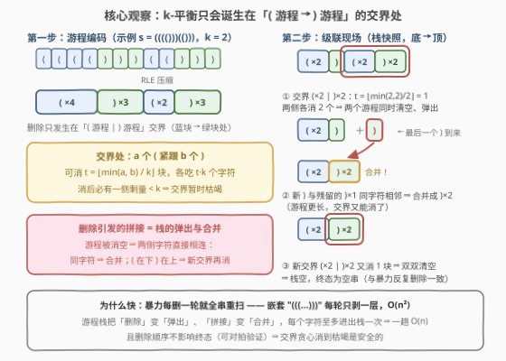
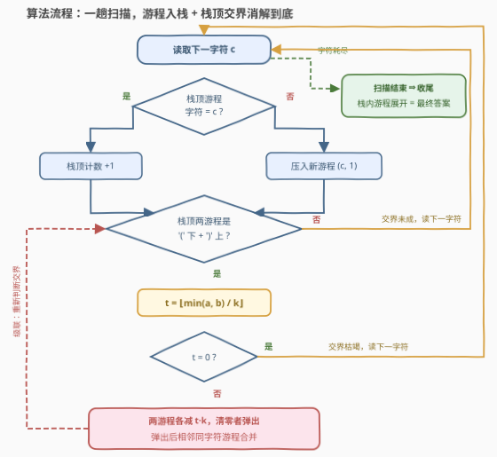

# 移除K-平衡子字符串

- **题目名称**：移除K-平衡子字符串
- **链接**：[3703. 移除K-平衡子字符串](https://leetcode.cn/problems/remove-k-balanced-substrings/)
- **难度**：中等
- **标签**：栈、字符串、模拟

## 1. 题目概述

**题意**：给定一个只包含 `(` 和 `)` 的字符串 $s$ 与整数 $k$。若一个字符串**恰好**是 $k$ 个连续的 `(` 后面跟着 $k$ 个连续的 `)`，即 `'(' * k + ')' * k`，则称它是 **k-平衡** 的（例如 $k=3$ 时 `"((()))"` 是 k-平衡的）。要求**重复**执行以下操作直到 $s$ 中不存在 k-平衡子串为止：移除 $s$ 中所有**互不重叠**的 k-平衡子串，将剩余部分拼接起来。返回最终的字符串。

**示例 1**：

```text
输入：s = "(())", k = 1
输出：""
解释：k-平衡子串是 "()"："(())" → "()" → ""。
```

**示例 2**：

```text
输入：s = "(()(", k = 1
输出："(("
解释：移除一处 "()" 后剩 "(("，不再含 "()"。
```

**示例 3**：

```text
输入：s = "((()))()()()", k = 3
输出："()()()"
解释：k-平衡子串是 "((()))"，移除后剩 "()()()"，其中不含 "((()))"。
```

**约束条件**：

- $2 \le s.length \le 10^5$
- $s$ 仅由 `(` 和 `)` 组成
- $1 \le k \le s.length / 2$

> 💡 **审题关键**：① k-平衡是「平铺」的而不是「嵌套」的——模式就是一段 `(` 直连一段 `)`，$k=3$ 时 `"((()))"` 合法，而 `"()(())"` 不是（不满足「连续 $k$ 个 `(` 接连续 $k$ 个 `)`」）；② 删除后左右拼接可能拼出**新的** k-平衡子串，必须级联删到不能删为止；③ 题目要求返回「最终字符串」而非某种删除方案的结果，暗示**终态与删除顺序无关**——这是后文贪心正确性的靠山。

---

## 2. 解题思路

### 2.1 暴力思路：反复全串扫描

直接模拟题面：每轮从头扫描，找出所有互不重叠的 `'(' * k + ')' * k` 出现并一次性删除，拼接后进入下一轮，直到找不到为止。每轮 $O(n)$，但嵌套形如 `"((((…))))"`（$k=1$）的串每轮只能剥掉一层，共 $O(n/k)$ 轮，总代价 $O(n^2/k)$；$n = 10^5$ 时约 $10^{10}$ 量级字符操作，必然超时。

> 💡 暴力的浪费在于：一次删除只影响删除点附近的**局部结构**，却要为它重扫全串；而「删除后拼接出的新交界」这个增量信息，本可以在删除发生的瞬间就地维护。

### 2.2 核心观察：游程栈 + 交界消块



**观察一：k-平衡子串只会诞生在「`(` 游程 → `)` 游程」的交界处。** 模式 `'(' * k + ')' * k` 本身就是「一段 `(` 游程 + 一段 `)` 游程」，因此它的任何一次出现，必然由某个 `(` 连续段的**尾部 $k$ 个**与紧随其后的 `)` 连续段的**头部 $k$ 个**拼成——完全落在单一游程内部不可能（单游程只有一种字符）。于是把 $s$ 做**游程编码**（run-length encoding，连续相同字符压成一个「字符 + 长度」二元组）后，删除问题变成游程序列上的局部问题：**所有候选删除点只有「蓝块→绿块」的交界**。

**观察二：交界处可以一次消到底。** 设交界左侧是 $a$ 个 `(`、右侧是 $b$ 个 `)`，则能消的块数为

$$t = \left\lfloor \frac{\min(a, b)}{k} \right\rfloor$$

即两侧各删去 $t \cdot k$ 个字符（等价于逐个删掉 $t$ 个 k-平衡块）。消完后 $\min(a - tk,\; b - tk) < k$ 必然成立，该交界**暂时枯竭**。

**观察三：级联效果 = 栈的弹出与合并。** 某个游程被消空后，它两侧的字符在真实串中直接相邻：若同为 `)` 则连成一个**更长的游程**（合并）；若拼出「`(` 游程在下、`)` 游程在上」的新交界则**继续消**。题面里「重复移除直到不存在」的全部级联，都被这一条规则覆盖——这正是经典括号匹配栈的推广形态：**栈里存的不再是单个字符，而是游程**。

**贪心为什么安全**：本题的重写规则只有一条（`'(' * k + ')' * k → ε`），且每次删除长度严格变短（必然终止）；终态与删除顺序无关（重写系统是合流的，题目要求返回唯一「最终字符串」也印证了这一点）。因此「每个交界消到枯竭」的贪心不会出错。工程上可用随机小串对拍验证：最左优先、最右优先、每轮成批删三种策略的终态完全一致。

### 2.3 算法流程图



**文字版步骤**：

| 步骤 | 操作 | 说明 |
|------|------|------|
| ① 逐字符扫描 | 栈顶游程同字符 → 计数 $+1$；否则压入新游程 $(c, 1)$ | 栈内始终是当前前缀的游程序列 |
| ② 交界判断 | 栈顶两游程构成「`(` 下 `)` 上」→ $t = \lfloor \min(a,b)/k \rfloor$ | 只有 `)` 入栈才可能触发新交界 |
| ③ 消块 | 两游程各减 $t \cdot k$；清零的游程弹出 | 「弹出」即「删除后拼接」 |
| ④ 合并级联 | 弹出后相邻同字符游程合并；回到 ② | 新交界继续消，直到 $t = 0$ |
| ⑤ 收尾 | 扫描结束，栈内游程按序展开即答案 | 栈本身就是残串的游程表示 |

### 2.4 示例演算

| 输入 | $k$ | 游程化 | 消解过程 | 输出 |
|------|-----|--------|----------|------|
| `"(())"` | 1 | `(×2, )×2` | 交界 $\lfloor\min(2,2)/1\rfloor = 2$ 块全消 | `""` |
| `"(()("` | 1 | `(×2, )×1, (×1` | 交界 $\lfloor\min(2,1)/1\rfloor=1$ → 消 1 对剩 `(×1`；新 `(` 并入 → `(×2` | `"(("` |
| `"((()))()()()"` | 3 | `(×3, )×3, (×1, )×1, (×1, )×1` | 交界① $\lfloor\min(3,3)/3\rfloor=1$ 全消；后两个交界 $\lfloor\min(1,1)/3\rfloor=0$ 枯竭 | `"()()()"` |
| `"(((()))(()))"` | 2 | `(×4, )×3, (×2, )×3` | 消 → 清空弹出 → 同字符合并 → 新交界再消（见 2.2 图级联三连） | `""` |

第四行就是 2.2 插图里的级联现场：中间 `(×2` 与 `)×2` 消空弹出后，最后到来的 `)` 与残留 `)×1` 合并成 `)×2`，恰好又能与 `(×2` 消掉最后一块。

---

## 3. 参考代码

### C++

```cpp
class Solution {
public:
    string removeSubstring(string s, int k) {
        vector<pair<char, int>> st;                 // 游程栈：(字符, 连续长度)
        for (char c : s) {
            if (!st.empty() && st.back().first == c) {
                st.back().second++;                 // 栈顶同字符：游程变长
            } else {
                st.emplace_back(c, 1);              // 新游程入栈
            }
            // 消解：栈顶两游程构成「'(' 在下、')' 在上」的交界
            while (st.size() >= 2 &&
                   st[st.size() - 2].first == '(' && st.back().first == ')') {
                int a = st[st.size() - 2].second, b = st.back().second;
                int t = min(a, b) / k;              // 交界处能消的块数
                if (t == 0) break;                  // 交界枯竭
                st.pop_back();                      // 弹出 ')' 游程
                st.pop_back();                      // 弹出 '(' 游程
                a -= t * k;
                b -= t * k;
                if (a > 0) st.emplace_back('(', a); // '(' 剩余压回（下方必为 ')' 游程或空）
                if (b > 0) {                        // ')' 剩余：可能与下方 ')' 游程合并
                    if (!st.empty() && st.back().first == ')') st.back().second += b;
                    else st.emplace_back(')', b);
                }
            }
        }
        string ans;
        for (auto [c, len] : st) ans.append(len, c);
        return ans;
    }
};
```

> 💡 **写法要点**：
> - 消解循环只在读到 `)` 时才可能真正执行（新 `(` 只会延长栈顶 `(` 游程，造不出「`(` 下 `)` 上」的交界），但统一在每个字符后调用也无妨——`t = 0` 时立刻 `break`，只多一次 $O(1)$ 判断。
> - 弹出清零游程后**必须考虑同字符合并**：漏掉合并会用错游程长度、少消块（反例见面试 Q4）。
> - 压回 `(` 剩余时不必做合并检查：栈内相邻游程字符必不同（压栈时已保证），`(` 游程下方只能是 `)` 游程或栈底。

### Python

```python
class Solution:
    def removeSubstring(self, s: str, k: int) -> str:
        st = []  # 游程栈：[字符, 连续长度]
        for c in s:
            if st and st[-1][0] == c:
                st[-1][1] += 1              # 栈顶同字符：游程变长
            else:
                st.append([c, 1])           # 新游程入栈
            # 消解：栈顶两游程构成「'(' 在下、')' 在上」的交界
            while len(st) >= 2 and st[-2][0] == '(' and st[-1][0] == ')':
                a, b = st[-2][1], st[-1][1]
                t = min(a, b) // k          # 交界处能消的块数
                if t == 0:
                    break                   # 交界枯竭
                st.pop()                    # 弹出 ')' 游程
                st.pop()                    # 弹出 '(' 游程
                a, b = a - t * k, b - t * k
                if a:
                    st.append(['(', a])
                if b:                       # ')' 剩余：可能与下方 ')' 游程合并
                    if st and st[-1][0] == ')':
                        st[-1][1] += b
                    else:
                        st.append([')', b])
        return ''.join(c * n for c, n in st)
```

> 💡 **写法要点**：
> - 列表项用 `[char, cnt]` 而非元组，避免「修改计数」时重建元素。
> - 收尾 `''.join(c * n ...)` 按游程批量展开，比逐字符拼接高效；总长就是答案长度。

---

## 4. 复杂度分析

| 维度 | 复杂度 | 说明 |
|------|--------|------|
| **时间复杂度** | $O(n)$ | 每个字符至多随游程一进一出；消解循环每轮要么净删 $\ge 2k$ 个字符（总量 $\le n$），要么弹出一个游程（总量 $\le$ 压入量 $\le n$），均摊线性 |
| **空间复杂度** | $O(n)$ | 游程栈最坏 $n$ 个游程（如 `"()()()…"`），输出串本身 $O(n)$ |

> - 关键在于「删除后重扫」被彻底消灭：删除 = 弹出、拼接 = 合并，都是栈上的 $O(1)$ 局部操作；这正是暴力 $O(n^2/k)$ 与栈解 $O(n)$ 的分水岭。

---

## 5. 扩展：同一骨架的家族题

- **$k = 1$ 的退化**：模式变成 `"()"`，本题退化为「反复删除相邻配对括号」，栈解退化为最经典的配对消除（遇 `)` 且栈顶是 `(` 则弹），残串即所有配不掉的字符按序排列——与 [1047](https://leetcode.cn/problems/remove-all-adjacent-duplicates-in-string/) 完全同构。
- **与 1209 的镜像**：[1209](https://leetcode.cn/problems/remove-all-adjacent-duplicates-in-string-ii/) 删除「连续 $k$ 个**相同**字符」，用「栈 + 计数」维护同字符游程；本题删除「$k$ 个 `(` 接 $k$ 个 `)`」，用「游程栈 + 交界消块」。两者都是「删除-拼接」重写系统 + 栈式增量模拟，只是消的模式不同。
- **模式变成任意固定串**（如 [1910](https://leetcode.cn/problems/remove-all-occurrences-of-a-substring/)）：模式内部不再是单字符游程，游程化解法失效，改用「字符栈 + 栈顶后缀匹配（KMP）」——栈顶随时维持「恰为模式前缀的最长后缀」。本题模式的「单字符游程 + 左右对称」正是游程解法的适用边界。
- **统计口径变体**：若追问「总共删了多少块 / 删完时总块数」，消解循环里给计数器累加 $t$ 即可，骨架完全不动。

---

## 6. 面试要点

**Q1：为什么 k-平衡子串必然横跨「`(` 游程 → `)` 游程」的交界？**

> 模式 `'(' * k + ')' * k` 含两种字符且各自连续，因此它的任何一次出现都由「某个 `(` 连续段的尾部 $k$ 个 + 紧随其后的 `)` 连续段的头部 $k$ 个」组成；完全落在单一游程内不可能（单游程只有一种字符）。游程化之后，全部候选删除点只剩游程序列中的 (|) 交界——这是把 $O(n)$ 字符级问题压成游程级局部问题的前提。

**Q2：交界处为什么恰好能消 $\lfloor \min(a,b)/k \rfloor$ 块？**

> 每消一块吃掉 $k$ 个 `(` 和 $k$ 个 `)`，块数同时受两侧供给约束：`(` 侧至多 $\lfloor a/k \rfloor$ 块、`)` 侧至多 $\lfloor b/k \rfloor$ 块，取短板 $\min$；又因每删一块两侧仍相邻（拼接后还是「`(` 直连 `)`」），逐块删即可把这个上界取满。消完后 $\min(a - tk, b - tk) < k$，交界枯竭。

**Q3：贪心「每个交界消到枯竭」为什么安全？换个删除顺序结果会不同吗？**

> 不会。重写系统只有一条规则 `'(' * k + ')' * k → ε`，且每步长度严格递减（终止性）；直观上，删除只会让原本相距更远的字符变得相邻，不会让已有的可删块永久消失。题目本身要求返回「最终字符串」，也说明出题人保证了终态唯一。稳妥起见可用随机小串 + 三种删除策略（最左优先 / 最右优先 / 每轮成批删）对拍，终态完全一致。

**Q4：消解后为什么要做「同字符合并」？不合并会怎样？**

> 游程被消空弹出后，它两侧的字符在真实串中直接相邻：若同为 `)` 则连成一个更长的 `)` 游程，后续交界能消多少块取决于**合并后**的长度。反例：`s = "(((()))(()))"`，$k=2$——中段 `(×2` 与 `)×2` 消空弹出后，右侧新来的 `)` 必须与残留 `)×1` 合并成 `)×2`，才能与 `(×2` 消掉最后一块；漏掉合并会错误地剩下 `")"`。

**Q5：复杂度为什么是 $O(n)$ 而不是 $O(n^2)$？**

> 均摊论证：每个字符入栈一次、至多随游程弹出一次；消解 `while` 的每一轮要么从两个游程里净删 $\ge 2k$ 个字符（全串总删除量 $\le n$），要么弹出一个游程（总弹出 $\le$ 总压入 $\le n$）。两个 $n$ 摊住全部循环轮次，整体 $O(n)$；空间是显式的游程栈，最坏 $O(n)$。

---

## 7. 同类练习题

- [1047. 删除字符串中的所有相邻重复项](https://leetcode.cn/problems/remove-all-adjacent-duplicates-in-string/)：栈式「删除-拼接」入门版，本题 $k=1$ 时与它同构
- [1209. 删除字符串中的所有相邻重复项 II](https://leetcode.cn/problems/remove-all-adjacent-duplicates-in-string-ii/)：同款「栈 + 计数」游程消解，消的是同字符连续 $k$ 个，与本题互为镜像
- [1910. 删除一个字符串中所有出现的给定子字符串](https://leetcode.cn/problems/remove-all-occurrences-of-a-substring/)：模式为任意固定串的版本，游程化失效，改用「字符栈 + KMP 栈顶匹配」
- [32. 最长有效括号](https://leetcode.cn/problems/longest-valid-parentheses/)：括号配对的另一经典问法，栈/DP 双解可对照
- [1249. 移除无效的括号](https://leetcode.cn/problems/minimum-remove-to-make-valid-parentheses/)：一遍栈扫描判定哪些括号配不上对，与本题「残栈展开即答案」收尾同款
