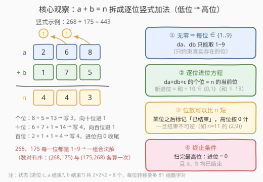
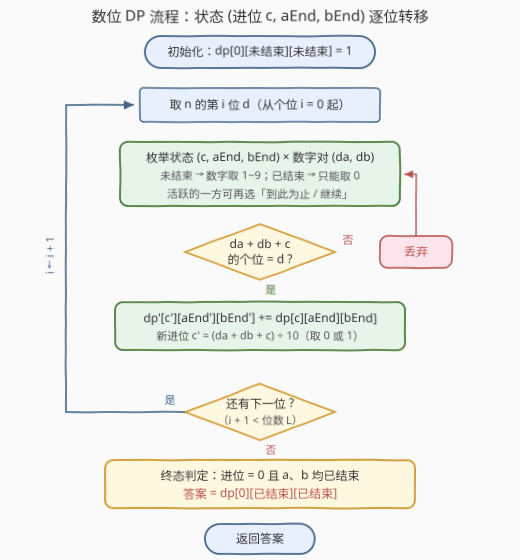

# 统计和为N的无零数对

- **题目名称**：统计和为N的无零数对
- **链接**：[3704. Count No-Zero Pairs That Sum to N](https://leetcode.cn/problems/count-no-zero-pairs-that-sum-to-n/)
- **难度**：困难
- **标签**：数学、动态规划、数位 DP

## 1. 题目概述

**无零整数**：十进制表示中**不包含数字 0** 的**正整数**（如 $1 \sim 9$、$11$、$123$）。

给定整数 `n`，统计满足以下条件的数对 `(a, b)` 的数量：

- `a`、`b` 都是无零整数（每一位都是 1~9）；
- `a + b = n`。

**示例 1**：

```text
输入：n = 2
输出：1
解释：唯一的数对是 (1, 1)。
```

**示例 2**：

```text
输入：n = 3
输出：2
解释：数对有 (1, 2) 和 (2, 1)。
```

**示例 3**：

```text
输入：n = 11
输出：8
解释：数对有 (2, 9)、(3, 8)、(4, 7)、(5, 6)、(6, 5)、(7, 4)、(8, 3)、(9, 2)。
(1, 10) 和 (10, 1) 不满足条件，因为 10 包含数字 0。
```

**约束条件**：

- $2 \le n \le 10^{15}$

> 💡 **审题关键**：① 数对**有序**——示例 2 中 $(1,2)$ 与 $(2,1)$ 各计一次；② 无零整数首先是**正整数**，$a, b \ge 1$，个位必然存在且非 0；③ $n \le 10^{15}$ 至多 16 位，答案上限约 $n - 1 < 10^{15}$，C++ 全程 `long long`；④ $a$、$b$ 的**位数可以不同**、也可以比 $n$ 短（如 $n=11$ 的 $(2,9)$）——这是状态设计的核心难点。

---

## 2. 解题思路

### 2.1 暴力思路：枚举 a，验证 a 与 n − a

枚举 $a \in [1, n-1]$，令 $b = n - a$，检查两者的十进制表示都不含 0：

```python
ans = sum(1 for a in range(1, n) if '0' not in str(a) and '0' not in str(n - a))
```

正确性没有问题，但复杂度 $O(n \log n)$——$n = 10^{15}$ 时需要千万亿次检查，完全不可行。瓶颈在于：**「a 无零」与「n − a 无零」两个约束通过等式 $a + b = n$ 耦合在同一数对上**，无法各自独立统计后组合（$b$ 由 $a$ 唯一确定，并不自由）。

> 💡 「多个约束耦合在同一等式上」的计数题，标准出路是**数位 DP**：把 $a + b = n$ 拆成逐位竖式加法，从低位到高位同时决定 $a$、$b$ 的每一位。

### 2.2 核心观察：数位 DP——进位 + 结束标志



**观察一：竖式加法天然逐位分解，进位只有 0/1 两种。** 把 $a + b = n$ 写成竖式，第 $i$ 位满足

$$d_a + d_b + c \equiv n_i \pmod{10}, \qquad c' = \left\lfloor \frac{d_a + d_b + c}{10} \right\rfloor$$

由于 $d_a, d_b \le 9$、$c \le 1$，和不超过 19，**新进位 $c'$ 只取 0 或 1**。从个位（$c_0 = 0$）逐位向高位推进，每一位只依赖「当前位数字 + 进位」——注意方向是**低位 → 高位**：加法的进位由低位产生、流向高位，顺着信息流向 DP 才无后效性。

**观察二：「无零」翻译成数位语言：真实存在的每一位 $d \in \{1, \dots, 9\}$。** $a$、$b$ 的位数可能比 $n$ 短（如 $n=11$ 的解 $(2,9)$，两个个位数）。短的那个数在高位上「没有数字」——这些位置按 0 参与加法，但它们**不是**该数的数字 0（$a=2$ 并不含 0）。于是为每个数引入**结束标志** `end`：

- `end = false`：当前位仍有数字，$d \in \{1, \dots, 9\}$；处理完本位后可自由选择「继续」或「到此为止」；
- `end = true`：已到头，本位起一律按 0 计，且**不可逆**（位数一旦确定不会再变长）。

初始（个位）两者均为未结束——$a, b \ge 1$ 至少有一位，个位必非 0。

**观察三：终止条件 = 进位归零 + 双双结束。** 处理完 $n$ 的最高位（第 $L-1$ 位）后要求：

1. 进位 $c_L = 0$——否则 $a + b = n + 10^L$，和多出一位；
2. $a$、$b$ 均已结束——否则某个数还有第 $L$ 位及以上的数字，$\ge 10^L > n$，矛盾。

**状态设计**：$dp[c][aEnd][bEnd]$ = 处理完当前位、进位为 $c$、$a/b$ 结束状态给定时的方案数。状态数 $2 \times 2 \times 2 = 8$，每步转移枚举至多 $9 \times 9$ 组数字对——$L \le 16$ 位，总运算量不足 $10^5$，$10^{15}$ 的 $n$ 瞬间出解。

> 💡 一句话：**顺着进位方向（低位 → 高位）做数位 DP，状态 (进位, a 结束?, b 结束?)，逐位枚举 $d_a, d_b$ 使 $(d_a + d_b + c) \bmod 10 = n_i$，终态取 $dp[0][已结束][已结束]$。**

### 2.3 算法流程图



**逻辑执行步骤**：

| 步骤 | 操作 | 说明 |
|------|------|------|
| ① 拆位 | 把 `n` 的各位从低到高存入 `dig[]` | DP 沿进位方向（个位 → 最高位）推进 |
| ② 初始化 | `dp[0][F][F] = 1`（F = 未结束） | 个位处 a、b 必有数字（$a, b \ge 1$） |
| ③ 枚举 | 对每个状态枚举 $d_a, d_b$ 及新的结束标志 | 活跃方数字取 1~9；已结束方只能取 0；活跃方还可选「到此为止」 |
| ④ 转移 | $(d_a + d_b + c) \bmod 10 = d$ 时累加到新状态 | 新进位 $c' = \lfloor (d_a + d_b + c) / 10 \rfloor \in \{0, 1\}$ |
| ⑤ 推进 | `i` 右移一位，重复 ③④ 直到扫完所有位 | 滚动数组：`dp` → `ndp` |
| ⑥ 终态 | 答案 = `dp[0][T][T]`（进位 0 且双双结束） | 其余终态（残留进位 / 未结束）全部非法 |

> ⚠️ 最容易漏的是终态里的「**双双结束**」：若扫完最高位后 `aEnd = false`，意味着 $a$ 还有第 $L$ 位及以上的数字，$a \ge 10^L > n$，这样的「方案」没有对应的合法数对，必须排除。

### 2.4 示例演算

**示例：n = 11（L = 2，dig = [1, 1]，答案 8）**

初始 `dp[0][F][F] = 1`。

**第 0 位（个位，d = 1）**：要求 $d_a + d_b + 0 \equiv 1 \pmod{10}$，而 $d_a + d_b \in [2, 18]$，只能取 $d_a + d_b = 11$（进位 1）：$(2,9), (3,8), \dots, (9,2)$ 共 **8 组**。个位后 $a$、$b$ 各自可选「结束 / 继续」，这些分支连同 8 组数字对一起存入各状态。

**第 1 位（十位，d = 1）**：要求 $d_a + d_b + 1 \equiv 1 \pmod{10}$，且终态进位为 0、双双结束。$(d_a + d_b + 1) \in \{1, 11\}$：取 11 则终态进位 1，非法；取 1 则 $d_a = d_b = 0$——**两者都必须已在个位后结束**，即 $a$、$b$ 都是个位数。

终态 `dp[0][T][T]` 恰好收留个位和为 11 的那 8 组 → **答案 8** ✓。个位后「选继续」的所有分支在十位无路可走（两数都成两位数则 $a + b \ge 22 > 11$），自然归零。

**再验证 n = 3**：个位 $d_a + d_b = 3$（进位须为 0，否则终态进位 1 非法）：$(1,2), (2,1)$ → **答案 2** ✓；n = 2 时仅 $(1,1)$ → **答案 1** ✓。

---

## 3. 参考代码

### C++

```cpp
class Solution {
public:
    long long countNoZeroPairs(long long n) {
        vector<int> dig;
        for (long long x = n; x > 0; x /= 10) dig.push_back(int(x % 10));

        // dp[carry][aEnd][bEnd]：处理完当前位后的方案数
        long long dp[2][2][2] = {};
        dp[0][0][0] = 1;

        for (int d : dig) {
            long long nd[2][2][2] = {};
            for (int c = 0; c < 2; ++c)
            for (int ae = 0; ae < 2; ++ae)
            for (int be = 0; be < 2; ++be) {
                if (dp[c][ae][be] == 0) continue;
                for (int na = ae; na < 2; ++na) {       // a 的下一个结束标志
                    for (int nb = be; nb < 2; ++nb) {   // b 的下一个结束标志
                        int daLo = ae ? 0 : 1, daHi = ae ? 0 : 9;
                        int dbLo = be ? 0 : 1, dbHi = be ? 0 : 9;
                        for (int da = daLo; da <= daHi; ++da)
                        for (int db = dbLo; db <= dbHi; ++db) {
                            int s = da + db + c;
                            if (s % 10 != d) continue;
                            nd[s / 10][na][nb] += dp[c][ae][be];
                        }
                    }
                }
            }
            memcpy(dp, nd, sizeof dp);
        }
        return dp[0][1][1];
    }
};
```

> 💡 **写法要点**：
> - `for (int na = ae; na < 2; ++na)`：已结束（`ae=1`）时只能保持结束；未结束时「继续 / 结束」两种都枚举——一行写尽结束标志的转移合法性。
> - `daLo/daHi`：活跃方数字取 1~9，已结束方只能取 0。
> - 滚动数组 `dp → nd`，答案取终态 `dp[0][1][1]`（进位 0 且双双结束）。
> - 最坏约 $16 \times 8 \times 4 \times 81 \approx 4 \times 10^4$ 次加法；方案数上限约 $n - 1 < 10^{15}$，`long long` 足够。

### Python

```python
class Solution:
    def countNoZeroPairs(self, n: int) -> int:
        dig = []
        x = n
        while x:
            dig.append(x % 10)
            x //= 10

        dp = {(0, False, False): 1}
        for d in dig:
            nd = {}
            for (c, ae, be), cnt in dp.items():
                a_opts = [(0, True)] if ae else \
                    [(da, na) for da in range(1, 10) for na in (False, True)]
                b_opts = [(0, True)] if be else \
                    [(db, nb) for db in range(1, 10) for nb in (False, True)]
                for da, na in a_opts:
                    for db, nb in b_opts:
                        s = da + db + c
                        if s % 10 != d:
                            continue
                        key = (s // 10, na, nb)
                        nd[key] = nd.get(key, 0) + cnt
            dp = nd
        return dp.get((0, True, True), 0)
```

> 💡 **写法要点**：
> - `a_opts` 一次性展开「数字 × 下一步结束标志」的全部组合（活跃时 $9 \times 2 = 18$ 项，结束后仅 1 项），转移双层循环直译状态方程。
> - 字典只存 8 个状态，天然跳过零值状态；Python 整数无限宽，无需操心溢出。
> - 拆位用 `x % 10` / `x //= 10`，得到的 `dig` 恰好按「个位在前」排列，与 DP 推进方向一致。

---

## 4. 复杂度分析

| 维度 | 复杂度 | 说明 |
|------|--------|------|
| **时间复杂度** | $O(\log n)$ | 位数 $L \le 16$；每位 8 个状态 × 至多 $4 \times 81$ 组转移，总量约 $4 \times 10^4$ 次基本运算 |
| **空间复杂度** | $O(1)$ | 状态数恒为 8，滚动数组两份；拆出的数位 $O(\log n)$ 可忽略 |

> - 复杂度只与**位数**有关、与 $n$ 的数值无关——这是数位 DP 的标志：$n = 10^{15}$ 与 $n = 10^9$ 的运行时间几乎相同。
> - 对比暴力 $O(n)$：$10^{15}$ 次运算按每秒 $10^9$ 次也要十来天，而数位 DP 不足 $10^5$ 次运算。

---

## 5. 扩展：双序列数位 DP 的一般骨架

**为什么必须从低位往高位 DP？** 加法的进位由低位产生、流向高位——低位先处理时进位已知，转移无后效性；若从高位出发，高位转移依赖尚未确定的低位进位，状态不充分（除非改成记忆化搜索，把进位并进返回值维度，本质上仍是同一套方向）。规律：**DP 方向永远顺着信息流向**。

**约束单边化的变体。** 若只要求 $a$ 无零（$b$ 任意），答案退化为 $f(n-1)$——$[1, n-1]$ 内无零数的个数，单序列数位 DP 一趟即出。本题的难点恰在**两个约束经 $a + b = n$ 耦合**，才需要把 $d_a, d_b$ 放进同一张 DP 表同步转移。

**k 元组的推广。** 统计无零的有序 $k$ 元组 $(a_1, \dots, a_k)$ 使 $\sum a_i = n$：进位范围扩为 $[0, k-1]$（和 $\le 9k + k - 1$），结束标志增至 $k$ 个，复杂度 $O(L \cdot k \cdot 2^k \cdot 9^k)$——$k$ 很小时依然可行。这正是各类「带进位的数位 DP」通用骨架。

**一个粗略的量级校验。** 不超过 $10^{15}$ 的无零数共 $\sum_{k=1}^{15} 9^k = (9^{16} - 9)/8 \approx 2.3 \times 10^{14}$ 个。若把「$a$ 均匀落在无零数中」当近似，答案 $\approx f(n-1)^2 / n \approx 5.4 \times 10^{13}$，与精确值 $50891681057058 \approx 5.1 \times 10^{13}$ 同量级——写完 DP 后用这类启发式估算抽查量级，是防手滑的好习惯。

---

## 6. 面试要点

**Q1：为什么 DP 方向必须从低位到高位？**

> 进位由低位产生、流向高位。低位 → 高位时，处理第 $i$ 位时进位已确定，转移无后效性；反方向则高位转移依赖尚未确定的低位进位，无法直接递推。一般原则：**谁产生信息，谁先被枚举**——DP 维度顺着依赖方向铺开。

**Q2：结束标志为什么必须「不可逆」？漏掉会怎样？**

> 「$a$ 是 $k$ 位数」意味着第 $0 \sim k-1$ 位非零、第 $k$ 位起不存在数字。若允许「结束后复活」（高位再补数字），同一个数会被重复计数（$a=5$ 既被数成一位数形态又被数成带前导零的更长形态），还会引入含前导零的非法表示。不可逆 = 每个正整数的位数唯一确定，计数一一对应。

**Q3：终态为什么要求进位为 0 且双双结束？**

> 进位为 1 ⇒ $a + b = n + 10^L \ne n$；未结束 ⇒ 该数 $\ge 10^L > n \ge a + b$，自相矛盾。两个条件分别封死「和多出一位」与「某个加数比 $n$ 还大」两类非法出口，缺一不可。

**Q4：状态里为什么不需要记录「处理到第几位」？**

> 每一位的转移结构完全相同，只有目标数字 $d$ 不同——迭代写法逐位滚动，位数只体现在循环次数上，天然省掉这一维。若写成自顶向下的记忆化搜索，`i` 会出现在状态里，但答案等价；位数为 16 时两种写法性能无差别。

**Q5：本题与「统计 $[1, x]$ 内满足性质的数」的单序列数位 DP 有何本质区别？**

> 单序列数位 DP（如 233、902）沿「上界 tight」逐位贴着 $x$ 走；本题 $a$、$b$ 没有各自的上界——它们由和 $n$ 耦合，取而代之的是**进位维度**与**结束标志**。共同点：都把「整数的性质」翻译成「逐位局部约束 + 少量跨位状态」，状态设计永远服务于让跨位依赖最小化。

> 💡 **一句话总结**：3704 = 竖式加法拆位 + 进位 DP + 结束标志处理变长操作数 + 终态双重校验。带走的三个关键：低位起手顺着进位、结束不可逆、终态查「进位 0 且双双结束」。

---

## 7. 同类练习题

- [1317. 将整数转换为两个无零数字的和](https://leetcode.cn/problems/convert-integer-to-the-sum-of-two-no-zero-integers/)：同一「无零数 + a + b = n」设定，但只需求任意一组解（构造），本题是其计数加强版
- [600. 不含连续 1 的非负整数](https://leetcode.cn/problems/non-negative-integers-without-consecutive-ones/)：单序列数位 DP 入门，体会「逐位 + 跨位约束状态」的基本骨架
- [902. 最大为 N 的数字组合](https://leetcode.cn/problems/numbers-at-most-n-given-digit-set/)：每位可选数字受集合限制，与「每位 ∈ {1..9}」同型
- [1012. 至少有 1 位重复的数字](https://leetcode.cn/problems/numbers-with-repeated-digits/)：正难则反 + 数位 DP 计数，训练逐位约束下的补集转化
- [2376. 统计特殊整数](https://leetcode.cn/problems/count-special-integers/)：数位 DP 综合（前导零 + 已用数字集合），进阶巩固
