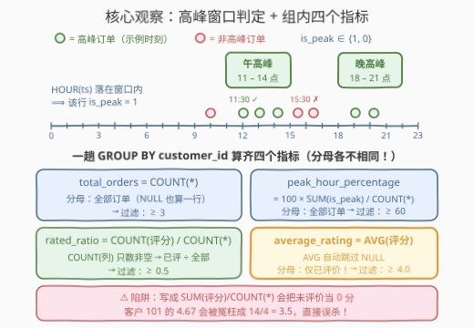
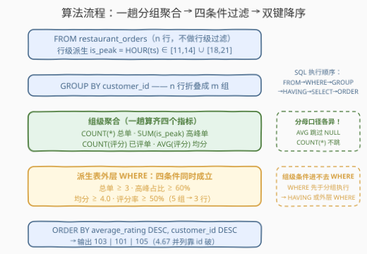

# LeetCode 寻找黄金时段客户 题解

## 1. 题目概述

- **标题 / 题号**：寻找黄金时段客户（#3705，medium）
- **链接**：https://leetcode.cn/problems/find-golden-hour-customers/
- **难度**：中等
- **标签**：数据库、SQL、`GROUP BY` + `HAVING`、条件聚合、NULL 的聚合语义、时间函数

**表结构**：`restaurant_orders`

| 列名 | 类型 |
|------|------|
| order_id | int |
| customer_id | int |
| order_timestamp | datetime |
| order_amount | decimal |
| payment_method | varchar |
| order_rating | int |

- `order_id` 是这张表的主键。
- `payment_method` 取值为 `cash`、`card` 或 `app`。
- `order_rating` 在 1 到 5 之间（5 最佳），**没有评分则为 NULL**。
- `order_timestamp` 同时包含日期和时间。

**目标**：找出**黄金时段客户**——同时满足以下**全部四个条件**的客户：

1. 下单**至少 3 笔**；
2. **至少 60%** 的订单落在**高峰时段**（`11:00 - 14:00` 或 `18:00 - 21:00`）内；
3. **已评价订单**的平均评分**至少 4.0**（保留 2 位小数）；
4. **至少 50%** 的订单已有评分。

**输出**四列 `customer_id, total_orders, peak_hour_percentage, average_rating`，按 `average_rating` **降序**、再按 `customer_id` **降序**排序。

**示例**（节选输入，完整数据见官方题面）：

```text
输入：restaurant_orders 表
+----------+-------------+---------------------+----------------+--------------+
| order_id | customer_id | order_timestamp     | order_rating    | ...          |
+----------+-------------+---------------------+----------------+--------------+
| 1        | 101         | 2024-03-01 12:30:00 | 5              | ...          |
| 4        | 101         | 2024-03-04 20:30:00 | NULL           | ...          |
| 8        | 103         | 2024-03-01 19:00:00 | 5              | ...          |
| 11       | 104         | 2024-03-01 10:00:00 | 3              | ...          |
| ...      | ...         | ...                 | ...            | ...          |
+----------+-------------+---------------------+----------------+--------------+

输出：
+-------------+--------------+----------------------+----------------+
| customer_id | total_orders | peak_hour_percentage | average_rating |
+-------------+--------------+----------------------+----------------+
| 103         | 3            | 100                  | 4.67           |
| 101         | 4            | 100                  | 4.67           |
| 105         | 3            | 100                  | 4.33           |
+-------------+--------------+----------------------+----------------+
```

> 💡 **审题关键**：
> ① 平均评分的**分母是「已评价订单数」**而非总订单数——`AVG` 恰好自动忽略 NULL，口径天然吻合；
> ② 「评分率 ≥ 50%」与「平均分 ≥ 4.0」是**两个独立条件**：只评 1 笔打 5 星的客户（评分率 1/n < 50%）同样出局；
> ③ 高峰判定是**行级布尔**：小时落在两个窗口之一即高峰（本篇采用 `HOUR ∈ [11,14] ∪ [18,21]` 口径，边界讨论见第 5 节）；
> ④ 排序是**双键降序**：103 与 101 平均分同为 4.67，靠第二键 `customer_id` 降序让 103 在前——漏写第二键必 WA。

## 2. 解题思路

### 2.1 暴力思路：四个条件四个子查询？

最直接的写法是每个条件各写一个 `GROUP BY` 子查询（各自筛出合格客户集），再逐个 `JOIN` 取交集。正确性没问题，但同一张表扫四遍、`GROUP BY customer_id` 重复四次、表达式维护成本高——四个条件的**载体其实是同一批组级统计量**，天然共享同一次分组。

另一个直觉歧途是**先过滤再聚合**：比如先 `WHERE order_rating IS NOT NULL` 再分组算平均分——这会把未评价的行从**所有**指标里踢掉，`total_orders` 和 `peak_hour_percentage` 的分母就错了。教训：**过滤发生在组级、而 NULL 的取舍发生在聚合函数内部**，两者不能混为一谈。

### 2.2 核心观察：条件聚合——一趟分组算齐四个组级指标



**观察一：四个条件全是「组级」指标，一趟 `GROUP BY customer_id` 全部产出。**

| 指标 | 聚合表达式 | 分母口径 |
|------|-----------|---------|
| total_orders | `COUNT(*)` | 全部订单（含未评价） |
| peak_hour_percentage | `100 × SUM(is_peak) / COUNT(*)` | 全部订单 |
| average_rating | `AVG(order_rating)` | **仅已评价订单**（NULL 自动跳过） |
| rated_ratio | `COUNT(order_rating) / COUNT(*)` | 已评价 ÷ 全部 |

**观察二：NULL 的三副面孔是本题的真正考点。** SQL 聚合函数对 NULL 的处理分两派：

- `COUNT(*)` 数**行**，NULL 也算一行；
- `AVG / SUM / MIN / MAX / COUNT(col)` 对**列**聚合，**全部忽略 NULL**。

于是「已评价订单的平均分」不需要任何 `WHERE` 预处理——`AVG(order_rating)` 的分母自动只剩非空行；「评分率」用 `COUNT(order_rating)`（非空计数）除以 `COUNT(*)`。反过来，若手滑写成 `SUM(order_rating) / COUNT(*)`，未评价会被当成 **0 分**拉低均值：客户 101 会从 $(5+4+5)/3 = 4.67$ 被冤枉成 $14/4 = 3.5$，直接误杀。

**观察三：高峰判定是行级布尔，`SUM` 一举计数。** `HOUR(order_timestamp) BETWEEN 11 AND 14 OR HOUR(order_timestamp) BETWEEN 18 AND 21` 在 MySQL 里返回 1/0，组内 `SUM` 即高峰订单数——这就是**条件聚合**：把「满足条件的行」翻译成 0/1 参与求和，避免为每个条件单独过滤一遍。跨数据库时换成标准写法 `SUM(CASE WHEN … THEN 1 ELSE 0 END)`。

> 💡 一句话：**行级算布尔 → 组级做聚合（四指标一次算齐）→ 外层 WHERE 套四个阈值 → 双键降序收尾。**

### 2.3 算法流程图



**逻辑执行步骤**：

| 步骤 | 操作 | 说明 |
|------|------|------|
| ① FROM | 读入 `restaurant_orders` 全部 n 行 | 无行级过滤——NULL 的取舍交给聚合函数 |
| ② 行级派生 | 对每行计算高峰布尔 | `HOUR(order_timestamp) ∈ [11,14] ∪ [18,21]` |
| ③ GROUP BY | 按 `customer_id` 折叠成 m 组 | 每组对应一个客户的全部订单 |
| ④ 组级聚合 | `COUNT(*)` / `SUM(is_peak)` / `COUNT(rating)` / `AVG(rating)` | 四个指标的分母口径各不相同（见 2.2 表） |
| ⑤ 外层过滤 | 四条件同时成立 | `≥3`、`≥60`、`≥4.0`、`≥0.5`，写派生表外层 `WHERE`（或 `HAVING`） |
| ⑥ ORDER BY | `average_rating DESC, customer_id DESC` | 双键降序，输出四列 |

> ⚠️ 聚合结果的过滤**不能写 `WHERE`**：`WHERE` 在 `GROUP BY` 之前逐行执行，此时「每个客户共几单、平均几分」尚不存在；组级谓词要么写 `HAVING`，要么包一层派生表在外层 `WHERE`（推荐后者，理由见 3 节解法对比）。

### 2.4 示例演算

对示例中 5 个客户逐一套用四个指标：

| customer | total_orders | 高峰单数 | peak_hour_percentage | 评分率 | average_rating | 判定 |
|----------|-------------|---------|----------------------|--------|----------------|------|
| 101 | 4 | 4（12:30/19:15/13:45/20:30 全命中） | 100 | 3/4 = 75% | $(5+4+5)/3 = 4.67$ | ✅ |
| 102 | 3 | 2（11:30/12:00 命中，15:30 不在） | 66.67 | 2/3 ≈ 66.67% | $(4+3)/2 = 3.50$ | ❌ 均值 < 4.0 |
| 103 | 3 | 3（19:00/20:45/18:30 全命中） | 100 | 3/3 = 100% | $(5+4+5)/3 = 4.67$ | ✅ |
| 104 | 3 | 0（10:00/09:30/16:00 全落空） | 0 | 3/3 = 100% | $(3+2+3)/3 = 2.67$ | ❌ 高峰占比 < 60% |
| 105 | 3 | 3（12:15/13:00/11:45 全命中） | 100 | 3/3 = 100% | $(4+5+4)/3 = 4.33$ | ✅ |

三个合格客户排序：103 与 101 平均分并列 4.67，按 `customer_id` 降序 103 在前；105 的 4.33 垫底 → 输出 `103, 101, 105`，与官方一致 ✓。注意 102 与 104 告负的原因**各不相同**：102 的高峰占比（66.67%）、评分率（66.67%）双双过关，却倒在均值 3.50 上；104 评分率 100%，却因高峰占比为 0% 出局（均值 2.67 同样不达标）——四个条件彼此独立、缺一不可。

## 3. 参考代码

### MySQL（解法 A：派生表聚合 + 外层过滤，推荐）

```sql
# Write your MySQL query statement below
SELECT customer_id, total_orders, peak_hour_percentage, average_rating
FROM (
    SELECT customer_id,
           COUNT(*) AS total_orders,
           ROUND(100 * SUM(HOUR(order_timestamp) BETWEEN 11 AND 14
                            OR HOUR(order_timestamp) BETWEEN 18 AND 21) / COUNT(*), 2)
               AS peak_hour_percentage,
           ROUND(AVG(order_rating), 2) AS average_rating,
           COUNT(order_rating) / COUNT(*) AS rated_ratio
    FROM restaurant_orders
    GROUP BY customer_id
) t
WHERE total_orders >= 3
  AND peak_hour_percentage >= 60
  AND average_rating >= 4.0
  AND rated_ratio >= 0.5
ORDER BY average_rating DESC, customer_id DESC;
```

> 💡 **写法要点**：
> - 四个指标在子查询里**一次算齐**，外层 `WHERE` 只做阈值判断——每个聚合表达式只出现一处；
> - `rated_ratio` 是辅助列，外层过滤后不进 `SELECT` 清单，输出列恰好四列；
> - 两个 `ROUND(..., 2)` 与输出格式对齐；过滤建立在**舍入后的值**上（见 5 节讨论）；
> - 客户若全部订单未评分，`AVG` 返回 NULL，`NULL >= 4.0` 为 NULL（视同不成立）自然出局，且其评分率必然 < 50% 先被拦下——无 NULL 特判必要。

### MySQL（解法 B：`GROUP BY` + `HAVING` 一趟写完）

```sql
# Write your MySQL query statement below
SELECT customer_id,
       COUNT(*) AS total_orders,
       ROUND(100 * SUM(HOUR(order_timestamp) BETWEEN 11 AND 14
                        OR HOUR(order_timestamp) BETWEEN 18 AND 21) / COUNT(*), 2)
           AS peak_hour_percentage,
       ROUND(AVG(order_rating), 2) AS average_rating
FROM restaurant_orders
GROUP BY customer_id
HAVING COUNT(*) >= 3
   AND 100 * SUM(HOUR(order_timestamp) BETWEEN 11 AND 14
                  OR HOUR(order_timestamp) BETWEEN 18 AND 21) / COUNT(*) >= 60
   AND ROUND(AVG(order_rating), 2) >= 4.0
   AND COUNT(order_rating) / COUNT(*) >= 0.5
ORDER BY average_rating DESC, customer_id DESC;
```

> 💡 **A vs B**：`HAVING` 在标准 SQL 里不能引用 `SELECT` 别名，`peak_hour_percentage`、`average_rating` 等长表达式只能在 `HAVING` 里**原样重复**——四个条件重复四段，改口径要改两处。MySQL 的方言扩展确实允许 `HAVING total_orders >= 3` 这类别名写法，但换 PostgreSQL / SQL Server 立刻报错。解法 A 把「算」与「滤」分层，可读、可移植，是首选。

### Pandas

```python
import pandas as pd

def find_golden_hour_customers(restaurant_orders: pd.DataFrame) -> pd.DataFrame:
    df = restaurant_orders.copy()
    h = pd.to_datetime(df['order_timestamp']).dt.hour
    df['is_peak'] = h.between(11, 14) | h.between(18, 21)

    agg = df.groupby('customer_id', as_index=False).agg(
        total_orders=('order_id', 'size'),
        peak_orders=('is_peak', 'sum'),
        rated_orders=('order_rating', 'count'),
        average_rating=('order_rating', 'mean'),
    )
    agg['peak_hour_percentage'] = (100 * agg['peak_orders'] / agg['total_orders']).round(2)
    agg['average_rating'] = agg['average_rating'].round(2)

    mask = (
        (agg['total_orders'] >= 3)
        & (agg['peak_hour_percentage'] >= 60)
        & (agg['average_rating'] >= 4.0)
        & (agg['rated_orders'] / agg['total_orders'] >= 0.5)
    )
    ans = agg.loc[mask, ['customer_id', 'total_orders', 'peak_hour_percentage', 'average_rating']]
    return ans.sort_values(
        ['average_rating', 'customer_id'], ascending=[False, False]
    ).reset_index(drop=True)
```

> 💡 **写法要点**：
> - `dt.hour` 取小时，`between(11, 14)` **双端闭区间**，与 SQL 版 `BETWEEN 11 AND 14` 口径一致；
> - `('order_rating', 'count')` 与 SQL 的 `COUNT(col)` 同义——只数非空；`'mean'` 同样自动跳过 NaN；
> - 分组键用 `as_index=False` 直接落成普通列，省掉 `reset_index`；返回前 `reset_index(drop=True)` 让行号从 0 连续。

## 4. 复杂度分析

| 维度 | 复杂度 | 说明 |
|------|--------|------|
| **时间复杂度** | $O(n)$ | 单趟扫描 n 行订单：每行做一次 `HOUR` 提取与布尔判定 $O(1)$，分组聚合均摊 $O(1)$；无排序瓶颈前的哈希分组总量线性 |
| **空间复杂度** | $O(m)$ | 派生表物化 m 个客户（$m \le n$）的统计行；实际订单数远大于客户数时可视为远小于 n |

> - 最终 `ORDER BY` 只对**通过过滤的少量行**（≤ m 行）排序，$O(k \log k)$，k 为合格客户数；
> - 对比暴力「四条件四子查询」：时间 $O(4n)$ 常数级劣化之外，更要命的是表达式重复带来的维护成本——复杂度优势是次要的，**组织方式**才是本题的核心收益。

## 5. 扩展：高峰窗口的边界口径与跨库移植

**三种高峰窗口口径。** 题面写 `11:00 - 14:00`，但示例数据不含 14 点、21 点的订单，无法从示例反推官方口径。三种读法：

| 口径 | 判定写法（MySQL） | 语义 |
|------|------------------|------|
| 本篇：小时闭区间 | `HOUR(ts) BETWEEN 11 AND 14` | 11:00–14:59 内的任意时刻都算（对区间文字的直译） |
| 左闭右开 | `HOUR(ts) IN (11, 12, 13)` | 严格 $[11{:}00, 14{:}00)$，14 点起的订单不算 |
| 秒级闭区间 | `TIME(ts) BETWEEN '11:00:00' AND '14:00:00'` | 仅 $[11{:}00, 14{:}00]$ 整段含端点，14:00:01 起不算 |

若提交后仅个别用例 WA 且怀疑与边界时刻有关，在三种口径间切换重试即可——三种写法只差一个谓词。工程上更推荐**秒级闭区间**（语义最精确），竞赛刷题则跟随判题器口径。

**跨库移植清单：**

- `HOUR(ts)` 是 MySQL 函数；PostgreSQL 用 `EXTRACT(HOUR FROM ts)`，SQL Server 用 `DATEPART(HOUR, ts)`；
- `SUM(布尔)` 仅 MySQL 可用（布尔即 1/0）；PostgreSQL 的 `SUM(boolean)` 直接报错，需 `SUM(CASE WHEN … THEN 1 ELSE 0 END)` 或 `SUM(cond::int)`；
- **整数除法陷阱**：PostgreSQL / SQL Server 里 `100 * 2 / 3 = 66`（整除截断），`COUNT(col) / COUNT(*)` 恒为 0！必须写成 `100.0 * … / …` 让一边先变数值型——MySQL 的 `/` 本身就是小数除法，无此坑但换库必炸。

**舍入时机。** 「先舍入再比较」还是「先比较再舍入」在极端边界会分歧：原始占比 59.996% 舍入后为 60.00%，前者放行、后者拦截。本篇与输出列保持一致采用「先舍入后比较」；若判题器口径相反，把 `WHERE` 里的 `ROUND` 列换回原始表达式即可。

## 6. 面试要点

**Q1：为什么 `SUM(条件表达式)` 能数出高峰订单数？**

> MySQL 中布尔表达式返回 1/0（操作数为 NULL 时甚至返回 NULL，`SUM` 会跳过），组内求和即「满足条件的行数」。这是**条件聚合**的基础手法，标准替代是 `SUM(CASE WHEN cond THEN 1 ELSE 0 END)`，跨库一律可用；另一个高频替代是 `COUNT(cond OR NULL)`——条件为假时表达式为 NULL 被 `COUNT` 跳过。

**Q2：`AVG(order_rating)` 的分母是谁？`COUNT(*)` 与 `COUNT(order_rating)` 差在哪？**

> `AVG` / `SUM` / `MIN` / `MAX` / `COUNT(列)` 聚合时**全部忽略 NULL**，只有 `COUNT(*)` 数物理行。因此 `AVG(order_rating)` 的分母自动是「已评价订单数」——恰好是题目要的口径；评分率 = `COUNT(order_rating) / COUNT(*)`。本题最隐蔽的 bug 就是把均值写成 `SUM/COUNT(*)`，等于默认未评价得 0 分。

**Q3：四个过滤条件为什么不能写在 `WHERE`？`WHERE` 和 `HAVING` 怎么分工？**

> SQL 逻辑执行顺序为 `FROM → WHERE → GROUP BY → HAVING → SELECT → ORDER BY`。`WHERE` 在分组前逐行执行，「某客户共几单、平均几分」这类**组级**值尚不存在；组级谓词必须写 `HAVING`（或经派生表在外层 `WHERE`）。行级事实（如 `payment_method = 'app'`）才归 `WHERE`——写错位置要么报错，要么语义悄悄改变。

**Q4：派生表过滤与 `HAVING` 直写，工程上怎么选？**

> 标准 SQL 的 `HAVING` 不能引用 `SELECT` 别名，四个指标的长聚合式要在 `HAVING` 里全部重复一遍，可读性与可维护性双输；MySQL 虽有别名扩展但不移植。派生表方案「子查询算指标、外层做过滤」，每个表达式只写一次，还能把 `rated_ratio` 这类辅助列藏在中间层。生产 SQL 里这个分层几乎是默认选择。

**Q5：示例输出里 103 为什么排在 101 前面？**

> 两者 `average_rating` 同为 4.67，触发第二排序键 `customer_id DESC`——103 > 101。多键排序的每一键方向都要显式声明：本题两个键**都是降序**，漏掉第二键时并列行的顺序由引擎随机决定，判题必 WA；这与「先按 A 升、再按 B 降」的混合方向题是同一考点。

> 💡 **一句话总结**：3705 = 条件聚合 + NULL 三副面孔 + 组级过滤的分层组织。带走三件事：布尔求和数行数、`AVG`/`COUNT(col)` 的分母天生忽略 NULL、组级条件进 `HAVING` 或派生表外层 `WHERE`。

## 同类练习题

| # | 题目 | 与本题的关联 |
|---|------|-------------|
| 1211 | [查询结果的质量和占比](https://leetcode.cn/problems/queries-quality-and-percentage/)（[题解](../1201-1300/1211_查询结果的质量和占比.md)） | 同款「行级布尔 → 组内 `SUM` 计数 → `ROUND(x, 2)` 百分比」模板，`poor_query_percentage` 就是本题 `peak_hour_percentage` 的迷你版 |
| 1934 | [确认率](https://leetcode.cn/problems/confirmation-rate/)（[题解](../1901-2000/1934_确认率.md)） | `AVG` + `IFNULL` 的 NULL 语义进阶——LEFT JOIN 产生的 NULL 行须兜底成 0 再求均值，与本题「`AVG` 自动跳过 NULL」互为正反两面 |
| 550 | [游戏玩法分析 IV](https://leetcode.cn/problems/game-play-analysis-iv/)（[题解](../0501-0600/550_游戏玩法分析IV.md)） | **分母口径**母题——留存率 = 首日登录且次日登录的人数 ÷ **全部**玩家，训练「谁当分母」的敏感度，本题四个指标四种分母是同款考点 |
| 1633 | [各赛事的用户注册率](https://leetcode.cn/problems/percentage-of-users-attended-a-contest/)（[题解](../1601-1700/1633_各赛事的用户注册率.md)） | `COUNT(col) / COUNT(*)` 双计数相除的百分比入门——本题「评分率」的直接前置 |
| 1511 | [消费者下单频率 🔒](https://leetcode.cn/problems/customer-order-frequency/)（[题解](../1501-1600/1511_消费者下单频率.md)） | 同为「客户维度多条件复合筛选」——金额与次数双阈值 `AND` 起来，与本题四条件的组织方式同构 |
