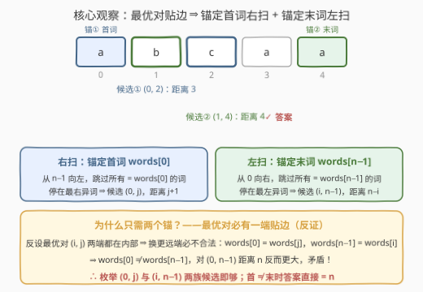
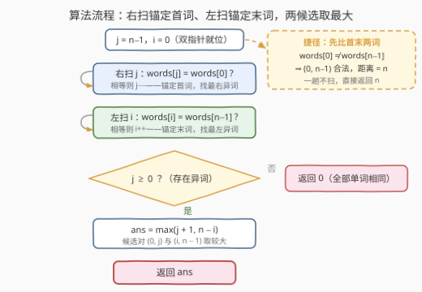

# 不同单词间的最大距离II

- **题目名称**：不同单词间的最大距离II
- **链接**：[3706. 不同单词间的最大距离 II](https://leetcode.cn/problems/maximum-distance-between-unequal-words-in-array-ii/)
- **难度**：中等
- **标签**：数组、字符串、双指针

## 1. 题目概述

> ⚠️ 本题为 LeetCode 付费题，题意描述根据官方示例用例与 hints 重建，可能与官方题面有出入。

给你一个字符串数组 `words`。找到两个**不同**下标 $i < j$ 之间的**最大距离**，且满足以下条件：

- $\text{words}[i] \ne \text{words}[j]$，并且
- 距离定义为 $j - i + 1$。

返回所有满足条件的下标对中最大的距离。如果不存在有效的下标对，返回 `0`。

本题与 [3696. 不同单词间的最大距离 I](../3601-3700/3696_不同单词间的最大距离I.md) **完全同题面、同示例**，唯一区别是数据规模：I 版 $n \le 100$ 放行 $O(n^2)$ 暴力（官方 hint："Use bruteforce"），II 版把规模放大到 $10^5$ 量级，官方 hint 随之换成 "Use two pointers"——必须线性。

**示例 1**：

```text
输入：words = ["leetcode","leetcode","codeforces"]
输出：3
解释：words[0] 和 words[2] 不相等，它们的距离为 2 - 0 + 1 = 3。
```

**示例 2**：

```text
输入：words = ["a","b","c","a","a"]
输出：4
解释：words[1] 和 words[4] 不相等，它们的距离为 4 - 1 + 1 = 4。
```

**示例 3**：

```text
输入：words = ["z","z","z"]
输出：0
解释：所有单词都相等，不存在合法下标对，返回 0。
```

**约束条件**（数量级按 II 版惯例重建，精确边界以官方题面为准）：

- $1 \le \text{words.length} \le 10^5$
- $1 \le \text{words}[i].\text{length} \le 10^5$
- 所有单词的长度之和不超过 $10^5$
- `words[i]` 由小写英文字母组成

> 💡 **审题关键**：① 距离口径继承 I 版：$j - i + 1$（跨度再加一），全同返回 0；② II 版的考点**不在新结论，而在把暴力换成线性**——题面没变，能过的算法变了；③ 官方三条 hints 已把解法和盘托出：双指针、固定首词找最右异词、固定末词找最左异词。

---

## 2. 解题思路

### 2.1 暴力思路：I 版的 O(n²) 在 II 版直接出局

枚举所有下标对 $(i, j)$（$i < j$），两词不等则用 $j - i + 1$ 更新答案：

```python
class Solution:
    def maxDistance(self, words: List[str]) -> int:
        n, ans = len(words), 0
        for i in range(n):
            for j in range(i + 1, n):
                if words[i] != words[j]:
                    ans = max(ans, j - i + 1)
        return ans
```

I 版 $n \le 100$ 时下标对至多 $4950$ 个，轻松通过。II 版 $n = 10^5$ 时下标对达到 $\binom{10^5}{2} \approx 5 \times 10^9$ 个，每个还附带一次字符串比较——远超常规预算，**必然超时**。要砍的不是比较的代价，而是枚举本身。

### 2.2 核心观察：最优对必有一端贴边 ⇒ 两趟指针扫描



**定理**（与 I 版同一条，完整版见 [3696 题解](../3601-3700/3696_不同单词间的最大距离I.md)）：距离最大的合法对 $(i, j)$ 中，$i = 0$ 或 $j = n - 1$ **至少成立一个**。

> 反证速览：设 $0 < i < j < n-1$。由最优性，把左端换成 $0$ 必不合法，只能 $\text{words}[0] = \text{words}[j]$；同理 $\text{words}[n-1] = \text{words}[i]$。两式相连得 $\text{words}[0] \ne \text{words}[n-1]$，于是 $(0, n-1)$ 合法且距离为 $n$，反而更大，矛盾。

于是 $O(n^2)$ 的"枚举两端"坍缩为**两个各扫一趟的半锚定子问题**——恰好对上官方 hints 的后两条：

- **右扫，锚定首词**（hint 2）：$j$ 从 $n-1$ 向左，跳过所有等于 $\text{words}[0]$ 的词，停在最右异词处。若 $j \ge 0$，候选对 $(0, j)$，距离 $= j + 1$；
- **左扫，锚定末词**（hint 3）：$i$ 从 $0$ 向右，跳过所有等于 $\text{words}[n-1]$ 的词，停在最左异词处。若 $i < n$，候选对 $(i, n-1)$，距离 $= n - i$。

两个候选取最大即为答案；两趟都扫穿（没找到异词）说明全同，返回 0。

**免费的捷径**：若 $\text{words}[0] \ne \text{words}[n-1]$，对 $(0, n-1)$ 直接合法，距离 $n$ 已是任何下标对的上界（$j - i + 1 \le n$ 恒成立），一趟都不用扫，直接返回 $n$。反之若 $\text{words}[0] = \text{words}[n-1] = x$，两个锚定条件都坍缩成"找 $\ne x$ 的位置"——左右两个指针从两端**向内收缩**，各停在第一个异词处（紧凑写法见第 5 节）。

### 2.3 算法流程



| 步骤 | 操作 | 说明 |
|------|------|------|
| ① 右扫 | $j$ 从 $n-1$ 向左，跳过所有 $= \text{words}[0]$ 的词 | 锚定首词，停在最右异词 |
| ② 左扫 | $i$ 从 $0$ 向右，跳过所有 $= \text{words}[n-1]$ 的词 | 锚定末词，停在最左异词 |
| ③ 汇总 | $j \ge 0$ ⇒ 候选 $j + 1$；$i < n$ ⇒ 候选 $n - i$ | 各自判存在性 |
| ④ 返回 | 两候选取最大；皆无 ⇒ 0 | 全同数组自然落 0 |

两个指针**碰到第一个异词就停**：异词越靠边，扫得越短；最坏（全同数组）合计也只做 $2n$ 次比较。

### 2.4 示例演算

**示例 2：`words = ["a","b","c","a","a"]`（$n = 5$）**，首词、末词都是 `"a"`：

| 阶段 | 指针移动 | 停靠位置 | 候选对 | 距离 |
|------|---------|---------|--------|------|
| 右扫（锚 `"a"`） | $j$: 4（`a` 跳过）→ 3（`a` 跳过）→ 2 停 | $j = 2$（`"c"`） | $(0, 2)$ | $2 - 0 + 1 = 3$ |
| 左扫（锚 `"a"`） | $i$: 0（`a` 跳过）→ 1 停 | $i = 1$（`"b"`） | $(1, 4)$ | $4 - 1 + 1 = 4$ |
| 汇总 | — | — | — | $\max(3, 4) = 4$ ✓ |

**示例 1**：首词 `"leetcode"` ≠ 末词 `"codeforces"`，直接命中捷径——对 $(0, 2)$ 合法且距离 $3 = n$ 已达上界，返回 3（不走捷径的话，右扫停在 $j=2$、左扫停在 $i=0$，两个候选同为 3，殊途同归）。

**示例 3**：两趟扫描都扫穿整个数组（$j$ 减到 $-1$、$i$ 加到 $5$），没有任何异词，两个候选都不存在，返回 0 ✓。

---

## 3. 参考代码

### C++

```cpp
class Solution {
public:
    int maxDistance(vector<string>& words) {
        int n = words.size();
        int j = n - 1;
        while (j >= 0 && words[j] == words[0]) j--;      // 右扫：锚定首词，找最右异词
        int i = 0;
        while (i < n && words[i] == words[n - 1]) i++;   // 左扫：锚定末词，找最左异词
        int ans = 0;
        if (j >= 0) ans = max(ans, j + 1);               // 候选对 (0, j)，距离 j+1
        if (i < n)  ans = max(ans, n - i);               // 候选对 (i, n-1)，距离 n-i
        return ans;
    }
};
```

### Python

```python
class Solution:
    def maxDistance(self, words: List[str]) -> int:
        n = len(words)
        j = n - 1
        while j >= 0 and words[j] == words[0]:          # 右扫：锚定首词，找最右异词
            j -= 1
        i = 0
        while i < n and words[i] == words[n - 1]:       # 左扫：锚定末词，找最左异词
            i += 1
        ans = 0
        if j >= 0:
            ans = max(ans, j + 1)                       # 候选对 (0, j)，距离 j+1
        if i < n:
            ans = max(ans, n - i)                       # 候选对 (i, n-1)，距离 n-i
        return ans
```

> ⚠️ **两个 while 的"锚"各不相同**：右扫锚的是 $\text{words}[0]$，左扫锚的是 $\text{words}[n-1]$——锚定谁，枚举的就是"以谁为固定一端"的最优对，候选对 $(0, j)$、$(i, n-1)$ 的合法性一目了然。若两个循环都锚 $\text{words}[0]$，首末相同时碰巧等价，首末相异时要靠"右扫必停在 $n-1$"兜底——能对，但论证绕一层（见第 5 节）。

> 💡 **边界自动成立**：$n = 1$ 时首末是同一个单词，右扫从 $j = 0$ 起就比较相等、一路减到 $-1$，左扫同理加到 $n$，两个候选都不存在，返回 0；全同数组同理。`ans` 初始化为 0 吞掉一切边界，全程零特判。

---

## 4. 复杂度分析

| 维度 | 复杂度 | 说明 |
|------|--------|------|
| **时间复杂度** | $O(n \cdot L)$ | 两趟扫描合计至多 $2n$ 次字符串比较，每次 $O(L)$；按总长约束计即 $O(\sum L)$，与读入同阶 |
| **空间复杂度** | $O(1)$ | 只用两个下标与常数个变量 |

对比暴力 $O(n^2 L)$：$n = 10^5$ 时差着 5 个数量级——这正是 II 版存在的意义。

---

## 5. 扩展：提前收尾的紧凑写法

把 2.2 的捷径写进代码，先比首末，再决定要不要扫：

```python
class Solution:
    def maxDistance(self, words: List[str]) -> int:
        n = len(words)
        if words[0] != words[-1]:
            return n                        # (0, n-1) 合法，距离 n 已是上界
        l, r = 0, n - 1
        while l < n and words[l] == words[0]:
            l += 1                          # 双指针向内：找最左异词
        while r >= 0 and words[r] == words[0]:
            r -= 1                          # 双指针向内：找最右异词
        return max(r + 1, n - l) if l < n else 0
```

正确性：首 $\ne$ 末时，右扫必然停在 $j = n-1$、左扫必然停在 $i = 0$，两个候选都是 $n$——提前返回只是把这两趟"白扫"省掉；首 $=$ 末（设为 $x$）时两个锚合一，右扫/左扫找的都是"$\ne x$"的位置，恰好是双指针从两端向内收缩，答案 $= \max(r+1,\, n-l)$，没有异词则返回 0。

至此共三种线性写法：**一次遍历**（I 版的每个 $i$ 与首、末各比一次，恒做 $2n$ 次比较）、**两趟指针**（本文主体，至多 $2n$ 次）、**提前收尾**（上面这个，首末相异的输入只需 1 次比较）。最坏复杂度全部相同，工程上挑顺手的写即可；面试的关键是把贴边定理讲清楚，代码形态是次要的。

---

## 6. 面试要点

**Q1：II 版和 I 版差在哪？出题人的意图是什么？**

> 题面、示例完全一致，唯一区别是数据规模：I 版 $n \le 100$ 放行暴力，II 版放大到 $10^5$ 量级逼出线性解。官方 hints 从 "Use bruteforce" 换成 "Use two pointers" 是出题人亲自指路。这是 LeetCode I/II 对的经典配方：I 题送分建立直觉，II 题用规模逼出思想——**考点是证明，不是编码**。

**Q2：为什么最优对必有一端贴边？现场推一遍。**

> 反证：设最优对 $(i, j)$ 满足 $0 < i < j < n-1$。若 $(0, j)$ 合法则距离 $j + 1$ 更大，矛盾，故 $\text{words}[0] = \text{words}[j]$；同理 $\text{words}[n-1] = \text{words}[i]$。于是 $\text{words}[0] \ne \text{words}[n-1]$，$(0, n-1)$ 合法且距离 $n$ 更大，矛盾。命门是「$\ne$ 的传递性」——条件换成 $\le$（962 最大宽度坡）就不成立，得改用单调栈。

**Q3：两趟扫描的"锚"分别是什么？锚错会怎样？**

> 右扫锚 $\text{words}[0]$（找最右的 $\ne \text{words}[0]$），左扫锚 $\text{words}[n-1]$（找最左的 $\ne \text{words}[n-1]$）。锚定谁，枚举的就是"以谁为固定一端"的最优对。两个循环都锚 $\text{words}[0]$ 也能对（首末相异时右扫必停在 $n-1$，给出距离 $n$ 的候选兜底），但正确性论证多绕一层，不如各锚各的直观。

**Q4：$n = 1$ 或全部单词相同时需要特判吗？**

> 不需要。全同时两趟扫描都扫穿（$j$ 减到 $-1$、$i$ 加到 $n$），两个 if 都不触发，`ans` 保持 0；$n = 1$ 时首末是同一个单词，右扫一步就减穿，同样落 0。好的初始化应当吞掉边界，全程零特判。

**Q5：单词很长时，比较的代价怎么算？**

> 单次字符串比较 $O(L)$，总比较次数至多 $2n + 2$，总时间 $O(n \cdot L)$；若约束按"总长 $\le 10^5$"给出，则整体 $O(\sum L)$，与读入同阶。C++ 按 `vector<string>&` 传引用、用 `==` 比较（长度先判 + 逐位短路）即可，无须手写逐字符比较。

> 💡 **一句话总结**：3706 = 3696 换个数据规模——贴边定理原样继承，$O(n^2)$ 枚举坍缩成"锚定首词右扫 + 锚定末词左扫"两趟指针；首 $\ne$ 末时答案直接就是 $n$。

---

## 7. 同类练习题

- [3696. 不同单词间的最大距离 I](https://leetcode.cn/problems/maximum-distance-between-unequal-words-in-array-i/)（[站内题解](../3601-3700/3696_不同单词间的最大距离I.md)）：同系列原版，$n \le 100$ 可暴力，先写暴力再看本文体会"规模逼出思想"
- [962. 最大宽度坡](https://leetcode.cn/problems/maximum-width-ramp/)（[站内题解](../0901-1000/962_最大宽度坡.md)）：同求最大 $j - i$，条件换成 $A[i] \le A[j]$，贴边失效须单调栈——体会「$\ne$ 传递性」的命门
- [1855. 下标对中的最大距离](https://leetcode.cn/problems/maximum-distance-between-a-pair-of-values/)（[站内题解](../1801-1900/1855_下标对中的最大距离.md)）：双有序数组的最大下标距离，双指针从尾部同步收缩
- [624. 数组列表中的最大距离](https://leetcode.cn/problems/maximum-distance-in-arrays/)（[站内题解](../0601-0700/624_数组列表中的最大距离.md)）：多数组取数的最值差，一趟维护全局 min/max
- [243. 最短单词距离](https://leetcode.cn/problems/shortest-word-distance/)（[站内题解](../0201-0300/243_最短单词距离.md)）：同是单词下标距离，求"最短"而非"最长"，一次遍历维护最近出现位置
