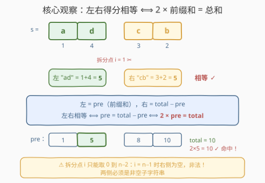
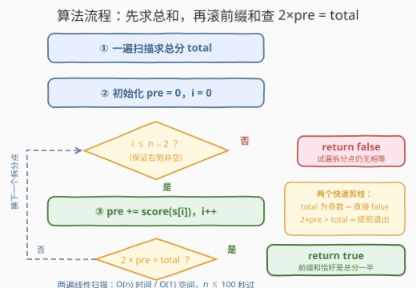

# LeetCode 相等子字符串分数 题解

## 1. 题目概述

- **标题 / 题号**：相等子字符串分数（#3707，easy）
- **链接**：https://leetcode.cn/problems/equal-score-substrings/
- **难度**：简单
- **标签**：字符串、前缀和

**题意**：给定一个由小写英文字母组成的字符串 `s`。定义一个字符串的**得分**为其每个字符在字母表中的位置之和，其中 `'a' = 1`、`'b' = 2`、…、`'z' = 26`。请判断是否存在一个下标 $i$，使得 `s` 能被拆分成两个**非空**子字符串 $s[0..i]$ 与 $s[(i+1)..(n-1)]$，且两者的得分**相等**。存在则返回 `true`，否则返回 `false`。

**示例 1**：

```text
输入：s = "adcb"
输出：true
解释：在 i = 1 处拆分：左 = "ad"，得分 1 + 4 = 5；右 = "cb"，得分 3 + 2 = 5。得分相等。
```

**示例 2**：

```text
输入：s = "bace"
输出：false
解释：任何拆分都无法使左右得分相等。
```

**约束**：

- $2 \le \mathrm{s.length} \le 100$
- `s` 仅由小写英文字母组成

> 💡 **审题关键**：① 拆分点 $i$ 的合法范围是 $0 \le i \le n-2$——$i = n-1$ 时右侧为空串，**非法**，两侧必须非空；② 得分只与字符位置有关（`'a'` 是 1 不是 0，记得 `+1`）；③ 只需判**存在性**，找到任意一个合法拆分点即可立刻返回。

## 2. 解题思路

### 2.1 暴力思路：枚举每个拆分点，两侧分别求和

最直接的做法：枚举拆分点 $i$ 从 $0$ 到 $n-2$，对每个 $i$ 各扫一遍左半和右半，累加字符得分后比较。时间复杂度 $O(n^2)$。

$n \le 100$ 时这甚至能过，但明显亏在每个 $i$ 处都**重复计算**了大量字符的得分——左右两半的和其实都可以从前一个拆分点的结果**增量**推出来。

### 2.2 核心观察：左右相等 ⟺ 2 × 前缀和 = 总和



记 $\mathrm{total}$ 为整个字符串的得分，$\mathrm{pre}$ 为某个拆分点左侧部分的得分（即**前缀和**）。则：

- 左侧得分 $= \mathrm{pre}$
- 右侧得分 $= \mathrm{total} - \mathrm{pre}$（右侧无需单独计算！）

于是「左右相等」等价于：

$$
\mathrm{pre} = \mathrm{total} - \mathrm{pre} \iff \boxed{2 \times \mathrm{pre} = \mathrm{total}}
$$

即：**存在合法拆分点，当且仅当前缀和恰好"路过"总分的一半**。以示例 1 的 `"adcb"` 为例：$\mathrm{total} = 1+4+3+2 = 10$，前缀和依次为 $1, 5, 8, 10$，其中 $5$ 恰为总分一半（$2 \times 5 = 10$），对应拆分点 $i = 1$ ✓。

顺带得到一个**奇偶剪枝**：$2 \times \mathrm{pre}$ 恒为偶数，故 $\mathrm{total}$ 为奇数时直接返回 `false`——示例 2 的 `"bace"` 总分 $2+1+3+5 = 11$ 是奇数，秒判。

> ⚠️ **别越界**：循环枚举的是拆分点 $i \in [0, n-2]$，前缀和只累到 $s[n-2]$ 为止；若把 $s[n-1]$ 也累进去再判，等于允许"右侧为空串"的非法拆分（此时恒有 $2 \times \mathrm{total} = \mathrm{total}$ 不成立，倒不至于误报，但语义已错）。养成好习惯：**边界即语义**。

### 2.3 算法流程：先求总和，再滚前缀和



| 步骤 | 操作 | 说明 |
|------|------|------|
| ① 求总和 | `total = Σ score(s[j])` | 第一遍扫描，每个字符 `c - 'a' + 1` |
| ② 初始化 | `pre = 0`，`i = 0` | 前缀和从 0 起步 |
| ③ 累积 | `pre += score(s[i])`，`i++` | 前缀和向前滚一格，无需回看 |
| ④ 判定 | `2 × pre == total`？ | 是 ⇒ 返回 `true`；否 ⇒ 换下一个拆分点 |
| ⑤ 终止 | `i` 超过 $n-2$ 仍无命中 | 返回 `false` |

整个过程**只前进、不回看**：右侧得分从未被显式计算，它始终以 $\mathrm{total} - \mathrm{pre}$ 的身份被"顺带"求出——这正是前缀和消重复计算的精髓。

### 2.4 示例演算

**示例 1：`s = "adcb"`**（`total = 10`）：

```text
i=0：pre = 1，2×1 = 2 ≠ 10
i=1：pre = 1+4 = 5，2×5 = 10 = total ✓ 返回 true
```

**示例 2：`s = "bace"`**（`total = 11`，奇数）：

```text
i=0：pre = 2，  2×2 = 4  ≠ 11
i=1：pre = 3，  2×3 = 6  ≠ 11
i=2：pre = 6，  2×6 = 12 ≠ 11（且已越过 total，后面只会更大）
拆分点耗尽 ⇒ 返回 false
```

## 3. 参考代码

### C++

```cpp
class Solution {
public:
    bool scoreBalance(string s) {
        int total = 0;
        for (char c : s) total += c - 'a' + 1;   // 'a' 记 1 分
        int pre = 0;
        for (int i = 0; i + 1 < (int)s.size(); i++) {  // 拆分点 i ∈ [0, n-2]
            pre += s[i] - 'a' + 1;
            if (pre * 2 == total) return true;
        }
        return false;
    }
};
```

### Python

```python
class Solution:
    def scoreBalance(self, s: str) -> bool:
        total = sum(ord(c) - 96 for c in s)      # 'a' 记 1 分
        pre = 0
        for i in range(len(s) - 1):              # 拆分点 i ∈ [0, n-2]
            pre += ord(s[i]) - 96
            if pre * 2 == total:
                return True
        return False
```

> 💡 **写法要点**：`pre * 2 == total` 比 `pre == total - pre` 更能体现「前缀和 = 总分一半」的判定本质；用 `pre * 2` 而非 `total / 2` 还避开了整除语义（`total` 为奇数时 `total // 2` 会静默截断，虽不影响判等的正确性，但乘法式意图更直白）。

## 4. 复杂度分析

| 维度 | 复杂度 | 说明 |
|------|--------|------|
| **时间复杂度** | $O(n)$ | 两遍线性扫描：一遍求 `total`，一遍滚前缀和并判定 |
| **空间复杂度** | $O(1)$ | 只维护 `total` 与 `pre` 两个整数变量 |

## 5. 扩展：剪枝与变体

**两个免费剪枝**（$n \le 100$ 用不上，但数据量大时值得）：

- **奇偶剪枝**：`total` 为奇数 ⇒ `2 × pre` 永远追不上，直接 `return false`；
- **单调提前退出**：每个字符得分至少为 1，故 `pre` **单调不减**——一旦 `pre * 2 > total`，后续只会更大，可立即 `break` 返回 `false`。示例 2 在 $i=2$ 处即触发。

**变体预告**：

- **计数版**：统计有多少个合法拆分点使左右得分相等——判定从 `return true` 改为 `ans++`，套路见 1525「字符串的好分割数目」；
- **带负权得分**：若字符得分可以是 0 或负数，`pre` 的单调性消失、奇偶剪枝失效，但「$2 \times \mathrm{pre} = \mathrm{total}$」的判定式依然成立，只是不能提前退出；
- **多次查询版**：若要对多个字符串反复判定，可将前缀和放进哈希集合以支持 O(1) 查「某个前缀和是否存在」，思想同 303 前缀和的预处理。

## 6. 面试要点

**Q1：为什么左右相等可以转化为 `2 × pre == total`？**

> 左 $= \mathrm{pre}$，右 $= \mathrm{total} - \mathrm{pre}$（总和固定，右侧是总和减去前缀的"余数"）。相等即 $\mathrm{pre} = \mathrm{total} - \mathrm{pre}$，移项得 $2\,\mathrm{pre} = \mathrm{total}$。右侧的得分从未显式计算——这就是前缀和把 $O(n^2)$ 暴力压到 $O(n)$ 的全部秘密。

**Q2：拆分点 `i` 的循环上界为什么是 `n - 2` 而不是 `n - 1`？**

> 题目要求两侧子字符串均非空。$i = n-1$ 时右侧 $s[n..n-1]$ 是空串，非法。用 `for (i = 0; i + 1 < n; i++)` 写法可以直接把「右侧非空」编码进循环边界，无须循环内特判。

**Q3：暴力解法差在哪里？前缀和省掉的重复计算具体是什么？**

> 暴力对每个拆分点重新累加两侧得分，相邻拆分点的左右和只差一个字符的贡献，却各自重算 $O(n)$；前缀和让 `pre` 从上一个拆分点**增量推进**一步（`pre += score(s[i])`），右侧由 `total - pre` 隐式得出——重复计算被完全消除，$O(n^2) \to O(n)$。

**Q4：有哪些可以提前判死的情况？**

> ① `total` 为奇数：`2 × pre` 恒为偶数，永远不等于奇数总分，直接 `false`；② 单调性：字符得分至少为 1，`pre` 不减，一旦 `2 × pre > total` 即可 `break`。二者都是"免费"的——不改变最坏复杂度，平均场景省时。

**Q5：如果题目改为「统计合法拆分点的个数」或「左右得分差最小化」，思路要怎么调整？**

> 计数：把 `return true` 改成 `ans += 1`，扫完所有拆分点返回 `ans`；最小化差值：维护 $\lvert \mathrm{total} - 2\,\mathrm{pre} \rvert$ 的最小值，同样一遍扫描。骨架不变——**前缀和 + 枚举拆分点**是这类「分割字符串」题的通用模板（见 1422、1525）。

> 💡 **一句话总结**：3707 = 先求总分 `total`，再滚前缀和 `pre`，判 `pre * 2 == total` 是否被命中；拆分点只枚举到 $n-2$，$O(n)$ / $O(1)$ 收工。

## 同类练习题

| # | 题目 | 与本题的关联 |
|---|------|-------------|
| 724 | [寻找数组的中心下标](https://leetcode.cn/problems/find-pivot-index/) | 同款「$2 \times$ 前缀和 $=$ 总和」判定，从字符串换成数组，本题的直系原型 |
| 1991 | [找到数组的中间位置](https://leetcode.cn/problems/find-the-middle-index-in-array/) | 724 的孪生题，下标约定略有不同，适合对照审题 |
| 1422 | [分割字符串的最大得分](https://leetcode.cn/problems/maximum-score-after-splitting-a-string/) | 同样枚举分割点，从「判相等」换成「取最优」，体会模板的复用 |
| 1525 | [字符串的好分割数目](https://leetcode.cn/problems/number-of-good-ways-to-split-a-string/) | 分割点左右「字符集合」相等的计数版，对应第 5 节的计数变体 |
| 303 | [区域和检索 - 数组不可变](https://leetcode.cn/problems/range-sum-query-immutable/) | 前缀和的基本功，理解 $\mathrm{total} - \mathrm{pre}$ 这类"余数"查询的来源 |
