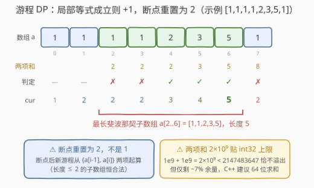
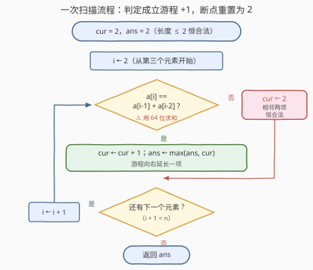

# 最长斐波那契子数组

- **题目名称**：最长斐波那契子数组
- **链接**：[3708. Longest Fibonacci Subarray](https://leetcode.cn/problems/longest-fibonacci-subarray/)
- **难度**：中等
- **标签**：数组、动态规划

## 1. 题目概述

**斐波那契数组**：一个**连续**序列，其中**第三项及其后**的每一项都等于它前面两项之和（前两项任意）。题目保证：长度为 1 或 2 的子数组**总是**斐波那契的。

给定一个由**正整数**组成的数组 `nums`，返回其中**最长斐波那契子数组**的长度。**子数组**是数组中**非空**的**连续**元素序列。

**示例 1**：

```text
输入：nums = [1,1,1,1,2,3,5,1]
输出：5
解释：最长斐波那契子数组是 nums[2..6] = [1,1,2,3,5]：
1 + 1 = 2，1 + 2 = 3，2 + 3 = 5。
```

**示例 2**：

```text
输入：nums = [5,2,7,9,16]
输出：5
解释：整个数组 [5,2,7,9,16] 都是斐波那契的：5 + 2 = 7，2 + 7 = 9，7 + 9 = 16。
```

**示例 3**：

```text
输入：nums = [1000000000,1000000000,1000000000]
输出：2
解释：1e9 ≠ 1e9 + 1e9 = 2e9，第三项接不上；任意长度为 2 的子数组都合法，答案为 2。
```

**约束条件**：

- $3 \le \text{nums.length} \le 10^5$
- $1 \le \text{nums}[i] \le 10^9$

> 💡 **审题关键**：① **子数组 = 连续**——与著名的 873「最长的斐波那契**子序列**」仅一词之差，解法却天差地别（见第 5 节）；② 长度 $\le 2$ 恒合法，且 $n \ge 3$，故**答案至少为 2**，全程不会返回 0 或 1；③ 断点处「重置」的目标值是 **2** 而不是 1；④ 两项之和最大 $2 \times 10^9$，**贴着 int32 上限 2147483647（余量仅 ~7%）**——本题恰好不溢出，但防御性地用 64 位求和是更稳的写法。

---

## 2. 解题思路

### 2.1 暴力思路：枚举子数组 + 逐个验证

枚举所有 $O(n^2)$ 个子数组 $[l, r]$，再花 $O(r-l)$ 验证「从第三项起每项等于前两项之和」：

```python
ans = 2
for l in range(n):
    for r in range(l + 2, n):
        if all(nums[k] == nums[k - 1] + nums[k - 2] for k in range(l + 2, r + 1)):
            ans = max(ans, r - l + 1)
```

时间复杂度 $O(n^3)$，$n = 10^5$ 时约 $10^{15}$ 次运算，完全不可行。瓶颈在于**重复验证**：$[l, r]$ 与 $[l, r+1]$ 的合法性检查几乎完全重叠。

> 💡 突破口在**判定的局部性**：「第 $i$ 项能否接上」只取决于**最后两项**，与更早的历史无关——这正是游程（run）类问题的标志。

### 2.2 核心观察：以 i 结尾的游程 DP



**观察一：判定是局部的。** 位置 $i$ 能否接在某个斐波那契子数组后面，只看一个等式：

$$\text{nums}[i] \stackrel{?}{=} \text{nums}[i-1] + \text{nums}[i-2]$$

**观察二：所有以 i−1 结尾的合法子数组共享同一个「尾巴」。** 若某斐波那契子数组以 $i-1$ 结尾且长度 $\ge 2$，它必然包含 $\text{nums}[i-2]$——这些子数组的**最后两项完全相同**。于是「以 $i-1$ 结尾的最长长度 `cur`」是**充分统计量**：

- 等式成立：任何以 $i-1$ 结尾、长度 $\ge 2$ 的子数组都能延长到 $i$，取最长的那个 ⇒ `cur ← cur + 1`；
- 等式不成立：没有任何长度 $\ge 3$ 的斐波那契子数组能以 $i$ 结尾；但 $\{\text{nums}[i-1], \text{nums}[i]\}$ 这**一对**本身恒合法 ⇒ `cur ← 2`（**不是 1**）。

**状态与答案**：

$$dp[i] = \begin{cases} dp[i-1] + 1, & \text{nums}[i] = \text{nums}[i-1] + \text{nums}[i-2] \\ 2, & \text{否则} \end{cases}, \qquad \text{ans} = \max_i dp[i]$$

基态 $dp[1] = 2$（前两个元素构成的子数组恒合法）。$dp[i]$ 只依赖 $dp[i-1]$，用一个滚动变量 `cur` 即可——整趟退化为**一次线性扫描**。

> 💡 一句话：**局部等式成立则游程 +1，断点处游程重置为 2，全程维护最大值。** 这是「最长连续 X」类问题（485 最大连续 1、674 最长连续递增、978 最长湍流子数组）的统一模板。

### 2.3 算法流程图



**逻辑执行步骤**：

| 步骤 | 操作 | 说明 |
|------|------|------|
| ① 初始化 | `cur = 2`，`ans = 2` | 前两个元素恒构成合法子数组；$n \ge 3$ 保证答案 $\ge 2$ |
| ② 判定 | 比较 `nums[i]` 与 `nums[i-1] + nums[i-2]` | 求和先提升到 64 位更稳（两项之和最大 $2 \times 10^9$，距 int32 上限仅 ~7%） |
| ③ 增长 | 相等：`cur++`，`ans = max(ans, cur)` | 游程向右延长一项 |
| ④ 重置 | 不等：`cur = 2` | 新游程从「上一项 + 当前项」重新起算 |
| ⑤ 推进 | `i++`，回到 ② | 直至扫完全数组 |
| ⑥ 返回 | 输出 `ans` | 无需额外后处理 |

> ⚠️ 两个高频手滑点：一是断点处重置成 `1` 或 `0`（正确是 **2**，任意相邻两项都合法）；二是 C++ 中 `nums[i-1] + nums[i-2]` 用 `int` 裸加——本值域下恰好不溢出，但只差 7% 余量，值域稍宽就会静默判错，养成先转 `long long` 的习惯。

### 2.4 示例演算

**示例 1：nums = [1,1,1,1,2,3,5,1]**

| i | nums[i] | nums[i-1]+nums[i-2] | 判定 | cur | ans |
|---|---------|---------------------|------|-----|-----|
| 1 | 1 | —（长度 2 恒合法） | — | 2 | 2 |
| 2 | 1 | 1+1 = 2 | ✗ | 2 | 2 |
| 3 | 1 | 1+1 = 2 | ✗ | 2 | 2 |
| 4 | 2 | 1+1 = 2 | ✓ | 3 | 3 |
| 5 | 3 | 1+2 = 3 | ✓ | 4 | 4 |
| 6 | 5 | 2+3 = 5 | ✓ | 5 | **5** |
| 7 | 1 | 3+5 = 8 | ✗ | 2 | 5 |

最长游程为 nums[2..6] = [1,1,2,3,5]，答案 **5** ✓。

**示例 2**：[5,2,7,9,16] 每步都 ✓（5+2=7、2+7=9、7+9=16），cur 一路 2→3→4→5，答案 **5** ✓。

**示例 3**：[1e9, 1e9, 1e9] 第三项 $10^9 \ne 2 \times 10^9$，cur 重置为 2，答案 **2** ✓。

---

## 3. 参考代码

### C++

```cpp
class Solution {
public:
    int longestFibonacciSubarray(vector<int>& nums) {
        int n = nums.size();
        if (n <= 2) return n;          // 防御式写法；本题约束 n >= 3
        int cur = 2, ans = 2;
        for (int i = 2; i < n; ++i) {
            if ((long long)nums[i - 1] + nums[i - 2] == nums[i]) {
                ++cur;
                ans = max(ans, cur);
            } else {
                cur = 2;               // 任意相邻两项都构成合法子数组
            }
        }
        return ans;
    }
};
```

> 💡 **写法要点**：
> - `(long long)nums[i - 1] + nums[i - 2]`：先提升类型再求和。本值域下 `int` 恰好不溢出（$2 \times 10^9 < 2^{31}-1$），但余量仅 ~7%，64 位写法一劳永逸。
> - `ans` 只在游程增长时更新：重置后的 `cur = 2` 不可能超过历史最大值（初值已是 2）。
> - 滚动变量 `cur` 代替整个 `dp` 数组，空间 $O(1)$。

### Python

```python
class Solution:
    def longestFibonacciSubarray(self, nums: List[int]) -> int:
        n = len(nums)
        if n <= 2:
            return n
        cur = ans = 2
        for i in range(2, n):
            if nums[i] == nums[i - 1] + nums[i - 2]:
                cur += 1
                ans = max(ans, cur)
            else:
                cur = 2   # 任意相邻两项都构成合法子数组
        return ans
```

> 💡 **写法要点**：
> - Python 整数任意精度，无溢出之忧，判定式直译题意。
> - `cur = ans = 2` 一行完成双初始化；防御式处理 $n \le 2$（虽被约束排除，面试白板题常被追问）。

---

## 4. 复杂度分析

| 维度 | 复杂度 | 说明 |
|------|--------|------|
| **时间复杂度** | $O(n)$ | 每个位置一次比较、一次更新；$n \le 10^5$ 瞬间出解 |
| **空间复杂度** | $O(1)$ | 滚动变量 `cur` + 答案 `ans`，与 $n$ 无关 |

> - 对比暴力 $O(n^3)$：从「每个子数组整体验证」到「每个位置局部转移」，是**利用判定局部性**的典型降维。
> - 若显式开 `dp` 数组则空间 $O(n)$；转移只看上一位，滚动成单变量即可——面试中主动提这点是加分项。

---

## 5. 扩展：一字之差的 873「最长斐波那契子序列」

**子数组（连续）vs 子序列（可不连续）**，一字之差，解法复杂度差一个量级：

| | 3708 子数组（本题） | 873 子序列 |
|---|---|---|
| 判定局部性 | 只看相邻两项，$O(1)$ 转移 | 任意两项都可能成为序列中的相邻项 |
| 状态 | `cur`（以 $i$ 结尾的长度） | 索引对 $(j, k)$：以 $j,k$ 为最后两项的最大长度 |
| 数据结构 | 无 | 哈希表：值 → 索引，反查 $\text{nums}[k] - \text{nums}[j]$ 是否存在且在 $j$ 之前 |
| 复杂度 | $O(n)$ | $O(n^2)$ |

**一个有趣的推论：本题答案上界约为 44。** 正整数斐波那契序列满足 $t_i = t_{i-1} + t_{i-2} \ge F_i$（标准斐波那契数，对 $t_1, t_2 \ge 1$ 归纳即得），而 $F_{45} = 1134903170 > 10^9 \ge \text{nums}[i]$——所以长度 $\ge 45$ 的合法游程在值域约束下**根本不存在**，答案 $\le 44$。若允许零或负数（如全 0 数组整个都是斐波那契的），该上界失效，但一次扫描的解法依然正确——**算法正确性不依赖这个巧合，只有答案的值域依赖它**。

**变体练习**：把「等于前两项之和」换成「前两项之差」「前两项按位异或」——判定依旧局部，游程 DP 模板原封不动；一旦换成「子序列」就是另一套 $(j,k)$ 状态的世界。

---

## 6. 面试要点

**Q1：断点处为什么重置为 2 而不是 1？**

> 长度 $\le 2$ 的子数组**恒**斐波那契（题目明文规定）。等式在 $i$ 处断裂时，以 $i$ 结尾的合法子数组只剩 $\{\text{nums}[i-1], \text{nums}[i]\}$ 这一对（长度 2）。重置成 1 会漏掉「新游程以两项起步」的事实，重置成 0 则连当前项都丢了——两者都会让后续游程长度系统性偏小。

**Q2：为什么一个变量 cur 就够，不需要记录游程起点？**

> 转移只需要「以 $i-1$ 结尾的最长长度」。所有以 $i-1$ 结尾、长度 $\ge 2$ 的斐波那契子数组最后两项都是 $(\text{nums}[i-2], \text{nums}[i-1])$——能否延长到 $i$ 由这一对唯一决定，与游程从哪开始无关。`cur` 是充分统计量，起点信息是冗余的。

**Q3：本题最阴的坑是什么？**

> 一是重置值写成 1；二是求和的类型：两项之和最大 $2 \times 10^9$，距 int32 上限 2147483647 仅剩 ~7% 余量——本题恰好不溢出，但值域稍宽（如 $\text{nums}[i] \le 2 \times 10^9$）就会溢出成负数、判定静默出错。C++ 里 `(long long)a + b` 的防御性写法值得养成肌肉记忆。

**Q4：与 873 最长斐波那契子序列的本质区别？**

> **连续性决定局部性。** 子数组的相邻关系固定（物理相邻），判定只涉及 $O(1)$ 个邻居 ⇒ 线性游程 DP；子序列的相邻关系任意（逻辑相邻），须枚举 $(j, k)$ 索引对并用哈希表反查第三项 ⇒ $O(n^2)$。面试中先问清「子数组还是子序列」再动手，是基本功。

**Q5：为什么答案不可能很大？**

> 正整数斐波那契序列逐项至少按标准斐波那契数增长：$t_i \ge F_i$，而 $F_{45} \approx 1.13 \times 10^9 > 10^9$，故任何合法游程长度 $\le 44$——上界由**值域**决定，与 $n$ 无关。算法无需利用它，$O(n)$ 扫描天然覆盖一切情况。

> 💡 **一句话总结**：3708 = 局部判定（等式只看相邻两项）+ 游程 DP（成立 +1、断点重置 2）+ 全程维护最大值。带走的三个关键：重置值是 2、`cur` 是充分统计量、子数组/子序列一字之差定解法。

---

## 7. 同类练习题

- [873. 最长的斐波那契子序列的长度](https://leetcode.cn/problems/length-of-longest-fibonacci-subsequence/)：一字之差的姊妹题，子序列可不连续 → 索引对 DP + 哈希表，$O(n^2)$
- [978. 最长湍流子数组](https://leetcode.cn/problems/longest-turbulent-subarray/)：同款「以 $i$ 结尾」的游程 DP，转移条件换成相邻两数比较符号的翻转
- [845. 数组中的最长山脉](https://leetcode.cn/problems/longest-mountain-in-array/)：游程思想进阶——先上坡后下坡的双向游程拼接
- [674. 最长连续递增序列](https://leetcode.cn/problems/longest-continuous-increasing-subsequence/)：最朴素的连续游程扫描，适合作为模板入门
- [485. 最大连续 1 的个数](https://leetcode.cn/problems/max-consecutive-ones/)：单条件游程计数，体会「断点重置」的最简形态
