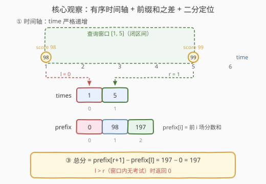
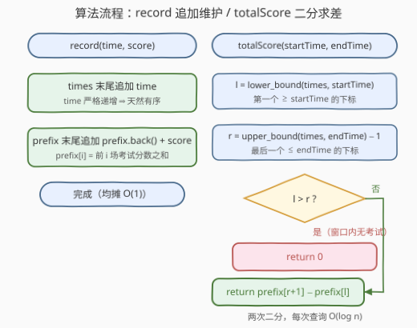

# LeetCode 设计考试分数记录器 题解

## 1. 题目概述

- **标题 / 题号**：设计考试分数记录器（#3709，medium）
- **链接**：https://leetcode.cn/problems/design-exam-scores-tracker/
- **难度**：中等
- **标签**：设计、数组、二分查找、前缀和

**题意**：Alice 经常参加考试，希望跟踪自己的分数，并计算特定时间段内的总分数。请实现 `ExamTracker` 类：

- `ExamTracker()`：初始化 `ExamTracker` 对象。
- `void record(int time, int score)`：Alice 在时间 `time` 参加了一次新考试，获得分数 `score`。
- `long long totalScore(int startTime, int endTime)`：返回 Alice 在 `[startTime, endTime]`（**两端均包含**）之间参加的所有考试的**总分数**；若该时间段内没有参加任何考试，返回 0。

函数调用按时间顺序进行：

- 对 `record()` 的调用按 `time` **严格递增**进行；
- 查询不需要未来信息：若最近一次 `record()` 的时间为 $t$，则 `totalScore()` 恒满足 $startTime \le endTime \le t$。

**示例 1**：

```text
输入：
["ExamTracker", "record", "totalScore", "record", "totalScore", "totalScore", "totalScore", "totalScore"]
[[], [1, 98], [1, 1], [5, 99], [1, 3], [1, 5], [3, 4], [2, 5]]

输出：
[null, null, 98, null, 98, 197, 0, 99]

解释：
ExamTracker examTracker = new ExamTracker();
examTracker.record(1, 98);     // 时间 1 参加考试，得 98 分
examTracker.totalScore(1, 1);  // [1,1] 内只有时间 1 这一场 → 98
examTracker.record(5, 99);     // 时间 5 参加考试，得 99 分
examTracker.totalScore(1, 3);  // [1,3] 内只有时间 1 这一场 → 98
examTracker.totalScore(1, 5);  // [1,5] 内有时间 1、5 两场 → 98 + 99 = 197
examTracker.totalScore(3, 4);  // [3,4] 内没有任何考试 → 0
examTracker.totalScore(2, 5);  // [2,5] 内只有时间 5 这一场 → 99
```

**约束**：

- $1 \le time \le 10^9$
- $1 \le score \le 10^9$
- $1 \le startTime \le endTime \le t$，其中 $t$ 是最近一次 `record()` 的 `time` 值
- `record()` 的调用将以严格递增的 `time` 进行
- `record()` 与 `totalScore()` 的总调用次数最多 $10^5$ 次

> 💡 **审题关键**：① `record` 的 `time` **严格递增**——考试记录天然按时间有序，这是全题最值钱的性质；② 查询是**闭区间**，两端都包含；③ 总分上界 $10^5 \times 10^9 = 10^{14}$，远超 32 位整型上限（约 $2.1 \times 10^9$），必须 64 位（题目返回类型已给 `long long`）；④ `time` 值域高达 $10^9$，开桶数组不现实——但「有序 + 只需定位边界」恰好是**二分查找**的主场。

## 2. 解题思路

### 2.1 暴力思路：每次查询线性扫描

把每对 `(time, score)` 存进列表，`record` 尾接即可；每次 `totalScore` 从头扫到尾，累加落在 `[startTime, endTime]` 内的分数：

```python
ans = sum(score for t, score in records if startTime <= t <= endTime)
```

单次查询 $O(n)$。最坏情形 `record` 与 `totalScore` 各约 $5 \times 10^4$ 次，总比较量约 $5 \times 10^4 \times 5 \times 10^4 = 2.5 \times 10^9$——C++ 勉强贴线、Python 必然超时。瓶颈有两处：**区间和被反复重算**，以及**完全没利用「时间轴天然有序」**。出路：把区间和拆成**两个前缀和之差**，再借助有序性 $O(\log n)$ 定位边界。

### 2.2 核心观察：有序追加 + 前缀和 + 二分定位



**观察一：`times` 数组天然有序，追加零成本。** `record` 的 `time` 严格递增 ⇒ 只要把 `time` 尾接进数组，有序性自动维持——既不需要排序，也不需要平衡树 / 跳表。「输入自带有序」时，**有序数组就是最简数据结构**。

**观察二：区间和 = 前缀和之差。** 维护 `prefix[]`，其中 $prefix[i]$ = 前 $i$ 场考试的分数之和（$prefix[0] = 0$）。对查询 $[startTime, endTime]$，定义：

- $l$：第一个满足 $times[i] \ge startTime$ 的下标（`lower_bound`）；
- $r$：最后一个满足 $times[i] \le endTime$ 的下标（`upper_bound(endTime)` 减 1）。

则闭区间内的考试恰为下标 $l \sim r$ 这一段，总分为

$$prefix[r+1] - prefix[l]$$

若 $l > r$，说明窗口内一场考试都没有，直接返回 0。

**观察三：溢出防线。** 总分上界 $10^{14}$，C++ 的 `prefix` 数组与累加中间量必须用 `long long`；Python 整数任意精度天然安全。

> 💡 **一句话总结**：「有序数组 + 前缀和 + 两次二分」——`record` 均摊 $O(1)$，`totalScore` $O(\log n)$，总计 $10^5 \times \log(10^5) \approx 1.7 \times 10^6$ 次运算，瞬间出解。

### 2.3 算法流程图



**逻辑执行步骤**：

| 步骤 | 操作 | 说明 |
|------|------|------|
| ① record | `times` 尾接 `time`，`prefix` 尾接 `prefix.back() + score` | time 严格递增 ⇒ 有序性自动维持，均摊 $O(1)$ |
| ② 定左界 | $l = lower\_bound(times, startTime)$ | 第一个 $times[i] \ge startTime$ 的下标 |
| ③ 定右界 | $r = upper\_bound(times, endTime) - 1$ | 最后一个 $times[i] \le endTime$ 的下标 |
| ④ 判空 | 若 $l > r$ 返回 0 | 窗口落在两场考试之间 / 首场之前 |
| ⑤ 求差 | 返回 $prefix[r+1] - prefix[l]$ | 闭区间 $[l, r]$ 内全部考试分数之和 |

> ⚠️ 右端必须用 `upper_bound`（第一个**大于** `endTime` 的位置）再减一，而不是 `lower_bound(endTime)`：后者会把 $time = endTime$ 的那一场**漏掉**。本题 `time` 严格递增无重复，两者数值上恰好等价，但按闭区间语义写才是可迁移的通用模板。

### 2.4 示例演算

以示例 1 全流程走一遍（`prefix[i]` = 前 $i$ 场分数之和）：

| 操作 | times | prefix | l / r | 返回 |
|------|-------|--------|-------|------|
| `record(1, 98)` | `[1]` | `[0, 98]` | — | — |
| `totalScore(1, 1)` | | | l=0, r=0 | $prefix[1]-prefix[0]=98$ |
| `record(5, 99)` | `[1, 5]` | `[0, 98, 197]` | — | — |
| `totalScore(1, 3)` | | | l=0, r=0（`upper_bound(3)`=1） | $98$ |
| `totalScore(1, 5)` | | | l=0, r=1 | $prefix[2]-prefix[0]=197$ |
| `totalScore(3, 4)` | | | l=1, r=0 → **l>r** | $0$ |
| `totalScore(2, 5)` | | | l=1, r=1 | $prefix[2]-prefix[1]=99$ |

两处值得细看：

- `totalScore(3, 4)`：`lower_bound(3)` 指向下标 1（`times[1]=5 ≥ 3`），而 `upper_bound(4)` 也是 1（第一个 `> 4` 的位置），故 $r = 0 < l$——窗口完整落在时间 1 与 5 之间，返回 0；
- `totalScore(2, 5)`：`lower_bound(2)` 跳过了 `times[0]=1 < 2`，$l = 1$；答案只含时间 5 那一场，$197 - 98 = 99$。

与期望输出 `[null, null, 98, null, 98, 197, 0, 99]` 逐项一致 ✓。

## 3. 参考代码

### C++

```cpp
class ExamTracker {
    vector<int> times;
    vector<long long> prefix{0};  // prefix[i] = 前 i 场考试的分数之和
public:
    void record(int time, int score) {
        times.push_back(time);
        prefix.push_back(prefix.back() + score);
    }

    long long totalScore(int startTime, int endTime) {
        int l = lower_bound(times.begin(), times.end(), startTime) - times.begin();
        int r = int(upper_bound(times.begin(), times.end(), endTime) - times.begin()) - 1;
        if (l > r) return 0;
        return prefix[r + 1] - prefix[l];
    }
};
```

> 💡 **写法要点**：
> - `prefix{0}` 预置「空前缀」，统一边界，查询时无需分类讨论；
> - 右端 `upper_bound(...) - 1` 严格对应闭区间语义（见 2.3 的 ⚠️）；
> - 判空 `l > r` 放在下标访问之前，空窗口直接短路返回。

### Python

```python
from bisect import bisect_left, bisect_right

class ExamTracker:
    def __init__(self):
        self.times = []
        self.prefix = [0]  # prefix[i] = 前 i 场考试的分数之和

    def record(self, time: int, score: int) -> None:
        self.times.append(time)
        self.prefix.append(self.prefix[-1] + score)

    def totalScore(self, startTime: int, endTime: int) -> int:
        l = bisect_left(self.times, startTime)
        r = bisect_right(self.times, endTime) - 1
        if l > r:
            return 0
        return self.prefix[r + 1] - self.prefix[l]
```

> 💡 **写法要点**：
> - `bisect_left` / `bisect_right` 即 C++ 的 `lower_bound` / `upper_bound`，语义一一对应；
> - Python 整数无宽度限制，$10^{14}$ 的总和无需特殊处理；
> - 两份代码均已用示例 + 随机对拍（暴力核对 300 轮）验证通过。

## 4. 复杂度分析

| 维度 | 复杂度 | 说明 |
|------|--------|------|
| `record` 时间 | $O(1)$ 均摊 | 两个数组尾接，偶发扩容被均摊 |
| `totalScore` 时间 | $O(\log n)$ | $n$ 为已记录考试数，两次二分 |
| 空间 | $O(n)$ | `times` 与 `prefix` 各 $n$（+1）个元素 |

> - 总时间 $O(q \log n)$（$q$ 为操作总数），$10^5$ 次操作约 $1.7 \times 10^6$ 次基本运算；
> - 对比暴力：最坏 $2.5 \times 10^9$ 次比较，慢三个数量级——差距全部来自「前缀和免重算 + 二分免扫描」。

## 5. 扩展：如果保证被打破？

**time 允许乱序 / 重复。** `times` 不再天然有序，「尾接 + 二分」失效。出路有二：① 平衡树按 `time` 聚合并维护**子树分数和**（C++ 需手写增强 `std::map` 的顺序统计树，Python 可用 `sortedcontainers.SortedList` 但区间和退化为 $O(k)$）；② 若可离线（先拿全所有 `time` 再回答查询），离散化到 $[1, n]$ 后用**树状数组**：点更新 $O(\log n)$、前缀和查询 $O(\log n)$。本题的「只追加」正是树状数组退化成前缀和的情形。

**允许修改已记录的分数。** 前缀和一经写入不可更新，需换**树状数组 / 线段树**（点改 $O(\log n)$ + 前缀查 $O(\log n)$）；若再叠加区间最值查询，则线段树是唯一选择。设计题的通用心法：**按「修改模式 × 查询模式」选数据结构**——只追加 → 前缀和；点改 → BIT；区间改 → 线段树/差分。

**查询引用未来时间（`endTime > t`）。** 本题解法天然不受影响：数组里只有已发生的考试，`upper_bound` 最多指到末尾，答案依然正确。这条约束真正服务的是别的思路（如离线批处理），对在线前缀和解法没有约束力——识别「哪些约束是给自己的、哪些是给别人思路的」，能避免过度设计。

## 6. 面试要点

**Q1：为什么不用 `std::map` / `TreeMap` 或排序？**

> `record` 的 `time` 严格递增是题目白送的有序性：数组尾接即有序，均摊 $O(1)$。平衡树插入 $O(\log n)$ 且常数更大、代码更长。**识别「输入天然有序」并据此降级数据结构**，是设计题的常见得分点——同款套路见 981（时间戳严格递增 → 有序数组二分）。

**Q2：`lower_bound` 与 `upper_bound` 各管哪一端？右端为什么减一？**

> 闭区间 $[startTime, endTime]$：左端取第一个 $\ge startTime$ 的下标（`lower_bound`）；右端取最后一个 $\le endTime$ 的下标——即第一个 $> endTime$ 的下标减一（`upper_bound` − 1）。若右端误用 `lower_bound(endTime)`，当存在 $time = endTime$ 的考试时会把它**漏掉**。本题 time 无重复故两者数值巧合等价，但语义正确才能迁移到有重复的场景。

**Q3：`l > r` 什么时候出现？不判空会怎样？**

> 典型情形：窗口完整落在两场考试之间（如示例 `totalScore(3, 4)`）或首场考试之前。有趣的是，由于 $startTime \le endTime$ 恒有 $l \le r+1$，`l > r` 时必为 $l = r+1$，此时公式 $prefix[r+1] - prefix[l] = prefix[l] - prefix[l] = 0$——**碰巧也给出正确答案**。但显式判空仍不可省：它把「空区间」语义写在明面上，且当 `startTime > endTime` 的非法查询混入时（$l$ 可能超过 $r+1$），公式才真正出错。

**Q4：哪些地方会整型溢出？**

> 总分上界 $10^5 \times 10^9 = 10^{14}$，超 `int32`（约 $2.1 \times 10^9$）四个数量级：C++ 中 `prefix` 数组、累加变量、返回值全链路都必须 `long long`；Python 整数任意精度天然安全。「操作数 × 单值上界」的量级估算应在写代码前完成，而不是提交报 WA 之后。

**Q5：本题与 303（区域和检索 - 数组不可变）的本质区别是什么？**

> 相同点：答案都是**前缀和之差**。不同点：303 的数组一次性给全、下标即位置；本题数据**在线到达**、键是 $10^9$ 量级的时间值——靠「严格递增」把在线流钉成有序数组，再用二分把「值域区间」翻译成「下标区间」。**加一层二分定位，是前缀和从静态走向在线的关键一步**，也是 981、2080 一族题目的共同骨架。

> 💡 **一句话总结**：3709 = 天然有序的追加流 + 前缀和之差 + 两次二分 + 判空与 64 位两道防线。带走的三个关键：识别输入有序性降级数据结构、`upper_bound − 1` 对应闭区间右端、操作数 × 单值上界的溢出预判。

## 同类练习题

| # | 题目 | 与本题的关联 |
|---|------|-------------|
| 303 | [区域和检索 - 数组不可变](https://leetcode.cn/problems/range-sum-query-immutable/) | 前缀和之差的原型题，无二分——体会本题比它多的「在线 + 值域定位」两层 |
| 981 | [基于时间的键值存储](https://leetcode.cn/problems/time-based-key-value-store/) | 同样「时间戳严格递增 → 有序数组 + 二分」，把前缀和换成快照值查找 |
| 1146 | [快照数组](https://leetcode.cn/problems/snapshot-array/) | 设计 + 每个格子维护版本化有序数组 + 二分定位版本 |
| 2080 | [区间内查询数字的频率](https://leetcode.cn/problems/range-frequency-queries/) | 哈希分桶存有序下标 + 二分计数，与本题「值域区间 → 下标区间」同型 |
| 729 | [我的日程安排表 I](https://leetcode.cn/problems/my-calendar-i/) | 有序结构维护时间区间集合，设计题进阶（需要判断重叠而非求和） |
