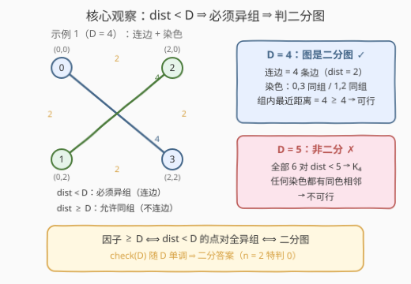
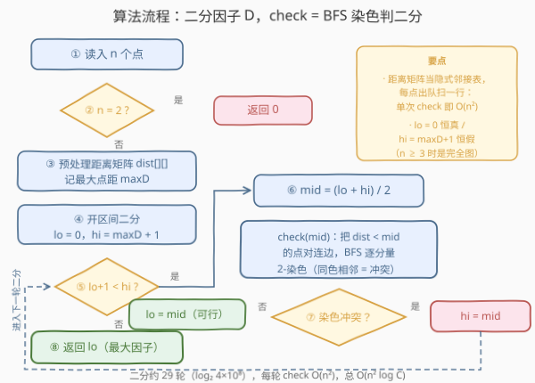

# 最大划分因子

- **题目名称**：最大划分因子
- **链接**：[3710. Maximum Partition Factor](https://leetcode.cn/problems/maximum-partition-factor/)
- **难度**：困难
- **标签**：二分查找、图、广度优先搜索、并查集

## 1. 题目概述

给定二维整数数组 `points`，`points[i] = [x_i, y_i]` 表示平面上第 $i$ 个点。两点间的**曼哈顿距离**为 $|x_i - x_j| + |y_i - y_j|$。

将 $n$ 个点分成**恰好两个非空组**。一个划分的**划分因子**是位于同一组内的所有无序点对之间**最小**的曼哈顿距离。返回所有合法划分中**最大**可能的划分因子。

> 大小为 1 的组不存在组内点对；当 $n = 2$ 时两个组大小都为 1，没有组内点对，划分因子为 0。

**示例 1**：

```text
输入：points = [[0,0],[0,2],[2,0],[2,2]]
输出：4
解释：分成 {[0,0], [2,2]} 和 {[0,2], [2,0]}，
两组内唯一点对的距离均为 4，划分因子 = min(4, 4) = 4。
```

**示例 2**：

```text
输入：points = [[0,0],[0,1],[10,0]]
输出：11
解释：分成 {[0,1], [10,0]} 和 {[0,0]}，
第一组内点对距离为 11，第二组是单元素组无点对，划分因子 = 11。
```

**约束条件**：

- $2 \le points.length \le 500$
- $-10^8 \le x_i, y_i \le 10^8$

> 💡 **审题关键**：① 「最大化最小值」——因子取组内距离的 **min**，我们要 **max** 它，这是**二分答案**的招牌信号；② $n = 2$ 被题面点名：两组各 1 点、无组内点对，答案恒为 0，直接特判；③ 坐标 $\pm 10^8$ ⇒ 曼哈顿距离上界 $4 \times 10^8 < 2^{31}$，`int` 不溢出；④ $n \le 500$ ⇒ 点对至多 $\binom{500}{2} = 124750$ 个，$O(n^2)$ 级的图结构完全建得动。

---

## 2. 解题思路

### 2.1 暴力思路：枚举所有划分

固定点 0 在 A 组（去掉两组对称性），其余 $n-1$ 个点各有 A/B 两个去向，枚举全部 $2^{n-1} - 1$ 种非空划分，每种划分花 $O(n^2)$ 求组内最小距离——总量 $O(2^n \cdot n^2)$，$n = 500$ 时是天文数字。

但暴力暴露了答案的结构：**最优因子必是 0 或某个点对的距离**（因子的取值来自组内点对，或退化为无点对的 0）。候选值天生有序、可行性又关于 $D$ 单调（见下），这正是二分答案的地形。

### 2.2 核心观察：二分答案 + 二分图判定



**观察一：把「因子 ≥ D」翻译成点对约束。** 划分因子 $\ge D$，当且仅当**不存在**距离 $< D$ 的同组点对，即：**所有 $\text{dist} < D$ 的点对必须落在不同组**（逆否命题）。

**观察二：连边建图，「存在合法划分」=「图是二分图」。** 把所有 $\text{dist} < D$ 的点对连成边：

- **正向**：一个合法划分就是一种 2-染色——每条边（距离 $< D$）都跨组；
- **反向**：二分图的染色中，同色点对都不是边，即距离 $\ge D$；若图完全无边（$D$ 不超过最小点距），$n \ge 3$ 时任取一点为 A 组、其余 $\ge 2$ 点为 B 组，无边保证 B 内任意两点距离 $\ge D$。

关键细节：$n \ge 3$ 时「两组非空」自动满足——图有边则染色两色必有节点；图无边则孤立点可自由分配（鸽笼：某组必有 $\ge 2$ 点，其两两距离 $\ge D$）。唯一例外是 $n = 2$：两组各 1 点、无组内点对、因子恒 0，特判返回。

**观察三：check 关于 D 单调 ⇒ 二分。** $D$ 增大时「$\text{dist} < D$」的边集单调扩大、约束单调收紧，可行性单调不增。而 $\text{check}(0)$ 恒真（无边），$\text{check}(\text{maxD} + 1)$ 恒假（$n \ge 3$ 时所有点对都连边成完全图 $K_n$，含三角形非二分）——「保 lo 真、hi 假」的开区间二分框架成立。

> 💡 一句话：**二分因子 $D$；check(D) = 把距离 $< D$ 的点对连边后判二分图（BFS 染色）。二分图 ⟺ 存在因子 $\ge D$ 的划分，$n = 2$ 特判 0。**

### 2.3 算法流程图



**逻辑执行步骤**：

| 步骤 | 操作 | 说明 |
|------|------|------|
| ① 特判 | $n = 2$ 直接返回 0 | 两组各 1 点，无组内点对 |
| ② 预处理 | 距离矩阵 `dist[i][j]`，记录最大点距 `maxD` | 供每轮 check 复用，免得反复算绝对值 |
| ③ 二分框架 | `lo = 0`（必可行），`hi = maxD + 1`（必不可行） | 开区间，循环条件 `lo + 1 < hi` |
| ④ 取中点 | `mid = (lo + hi) / 2` | |
| ⑤ check | 把 `dist < mid` 的点对视作边，BFS 逐连通分量 2-染色 | 距离矩阵当**隐式邻接表**：出队时扫一行 |
| ⑥ 判定 | 染色冲突（同色相邻 = 奇环）？ | 冲突 ⇒ 不可行，`hi = mid`；否则 `lo = mid` |
| ⑦ 收敛 | `lo + 1 = hi` 时退出 | `lo` 是最大可行 $D$，即答案 |

> ⚠️ check 里不要显式建邻接表再 BFS——那每轮要多花一趟 $O(n^2)$ 建表；直接拿距离矩阵当隐式邻接表，出队一个点扫它那一行即可，单个 check 就是 $O(n^2)$。

### 2.4 示例演算

**示例 1：正方形四点，答案 4。** 六个点对距离：四条边为 2，两条对角线为 4。

- **check(4)**：连边 `dist < 4` 的点对，恰是正方形四条边（距离 2）。BFS 从点 0 出发染色：$0 \to A$，其邻居 $1, 2 \to B$，再由边 $1\text{-}3$、$2\text{-}3$ 推出 $3 \to A$。无冲突，二分图 ✓。对应划分 $\{0, 3\}, \{1, 2\}$——正是两条对角线，组内距离均为 $4 \ge 4$ ⇒ 答案 $\ge 4$。
- **check(5)**：全部 6 对距离 $\le 4 < 5$，连成完全图 $K_4$，任何 2-染色都有同色相邻 ⇒ 非二分 ✗ ⇒ 答案 $< 5$。

结论：答案 $= 4$ ✓。

**示例 2：三点，答案 11。** check(11)：连边 `dist < 11` 的点对只有 $(0,0)$-$(0,1)$（距离 1），两点异组即可，第三个点 $(10,0)$ 自由落位——与 $(0,1)$ 同组，组内距离恰 $11 \ge 11$ ✓；check(12)：三对全连边成三角形，非二分 ✗。答案 $= 11$ ✓。

---

## 3. 参考代码

### C++

```cpp
class Solution {
public:
    int maxPartitionFactor(vector<vector<int>>& points) {
        int n = points.size();
        if (n == 2) return 0;          // 两组各一点：无组内点对，因子恒 0

        vector<vector<int>> dist(n, vector<int>(n));
        int maxD = 0;
        for (int i = 0; i < n; ++i)
            for (int j = i + 1; j < n; ++j) {
                int d = abs(points[i][0] - points[j][0]) + abs(points[i][1] - points[j][1]);
                dist[i][j] = dist[j][i] = d;
                maxD = max(maxD, d);
            }

        // check(D)：把 dist < D 的点对连边，BFS 染色判二分图
        auto check = [&](int D) {
            vector<int> color(n, -1);
            queue<int> q;
            for (int s = 0; s < n; ++s) {
                if (color[s] != -1) continue;
                color[s] = 0;
                q.push(s);
                while (!q.empty()) {
                    int u = q.front(); q.pop();
                    for (int v = 0; v < n; ++v) {
                        if (v == u || dist[u][v] >= D) continue;      // 非邻居
                        if (color[v] == -1) {
                            color[v] = color[u] ^ 1;
                            q.push(v);
                        } else if (color[v] == color[u]) {
                            return false;                             // 奇环
                        }
                    }
                }
            }
            return true;
        };

        int lo = 0, hi = maxD + 1;     // check(lo) 恒真；check(hi) 恒假（n>=3 完全图）
        while (lo + 1 < hi) {
            int mid = lo + (hi - lo) / 2;
            if (check(mid)) lo = mid;  // mid 可行，答案 >= mid
            else hi = mid;             // mid 不可行，答案 < mid
        }
        return lo;
    }
};
```

> 💡 **写法要点**：
> - `dist[u][v] >= D` 一行同时完成「跳过自己 + 跳过非邻居」——距离矩阵就是隐式邻接表。
> - 每次 check $O(n^2)$：每个点至多出队一次，出队时扫整行 $n$ 个候选邻居。
> - 二分上界取 `maxD + 1` 而非写死 $4 \times 10^8 + 1$：保证 `check(hi)` 恒假的同时少几次迭代；全重点合时 `maxD = 0`，区间 `[0, 1)` 直接返回 0，天然处理该边界。

### Python

```python
class Solution:
    def maxPartitionFactor(self, points: List[List[int]]) -> int:
        n = len(points)
        if n == 2:
            return 0

        dist = [[0] * n for _ in range(n)]
        max_d = 0
        for i in range(n):
            xi, yi = points[i]
            for j in range(i + 1, n):
                d = abs(xi - points[j][0]) + abs(yi - points[j][1])
                dist[i][j] = dist[j][i] = d
                if d > max_d:
                    max_d = d

        def check(D: int) -> bool:
            color = [-1] * n
            for s in range(n):
                if color[s] != -1:
                    continue
                color[s] = 0
                q = deque([s])
                while q:
                    u = q.popleft()
                    cu = color[u]
                    du = dist[u]
                    for v in range(n):
                        if v == u or du[v] >= D:
                            continue
                        if color[v] == -1:
                            color[v] = cu ^ 1
                            q.append(v)
                        elif color[v] == cu:
                            return False
            return True

        lo, hi = 0, max_d + 1
        while lo + 1 < hi:
            mid = (lo + hi) // 2
            if check(mid):
                lo = mid
            else:
                hi = mid
        return lo
```

> 💡 **写法要点**：
> - `du = dist[u]` 把内层取行提到循环外，Python 里省掉每步一次的双下标解引用，内层快约三成。
> - 预处理里 `xi, yi` 也同样解包一次；`deque` 做 BFS 队列，避免 `list.pop(0)` 的 $O(n)$ 头删。

---

## 4. 复杂度分析

| 维度 | 复杂度 | 说明 |
|------|--------|------|
| **时间复杂度** | $O(n^2 \log C)$ | $C = \text{maxD} + 1 \le 4 \times 10^8 + 1$，$\log_2 C \approx 29$ 轮二分；每轮 check $O(n^2)$（每点出队一次、扫一行 $n$）。$n = 500$ 时约 $29 \times 2.5 \times 10^5 \approx 7 \times 10^6$ 次基本操作 |
| **空间复杂度** | $O(n^2)$ | 距离矩阵 $500^2$ 个 `int` 约 1MB；队列与颜色数组 $O(n)$ |

> - 二分轮数只与**距离值域**有关（$\approx 29$），check 成本只与**点数**有关——两者相乘就是全部开销，$n \le 500$ 时毫秒级。
> - 若不预存距离矩阵、check 时现算绝对值，时间不变（省内存但多算 $\log C$ 遍绝对值），空间降到 $O(n)$。

---

## 5. 扩展：两种免二分的变体

**变体一：对距离值二分。** 最优因子必是 0 或某个点对的距离，把 $\binom{n}{2}$ 个距离排序去重后，在**这个数组**上二分（比较的是「下标位置的距离是否可行」），迭代次数从 $\log_2(4 \times 10^8) \approx 29$ 降到 $\log_2 \binom{500}{2} \approx 17$，check 逻辑不变。

**变体二：边按距离升序逐条并入 + 带奇偶性的并查集。** 把全部点对按距离升序排序，用扩展域并查集（点 $i$ 拆成 $i$ 与 $i'$ 两个域，边 $(u, v)$ 表示「$u,v$ 必须异组」，即合并 $u \leftrightarrow v'$、$u' \leftrightarrow v$）逐条加边。**第一条触发冲突（$u$ 与 $v$ 已同色）的边，其距离就是答案**：

- 冲突前的边集（距离 $\le d^*$ 的一部分）二分，故 $\text{check}(d^*)$ 真；加入冲突边后非二分，故 $\text{check}(d^* + 1)$ 假——答案恰为 $d^*$；
- $n \ge 3$ 时全部边并入是 $K_n$，冲突必然发生，无需兜底；$n = 2$ 仍特判 0。

复杂度 $O(n^2 \log n)$（排序主导）一趟出解，与二分版同数量级；换来的是「无值域依赖」，距离改成实数（欧氏距离）也照样工作——那时数值二分失效，这版反而成了唯一解。

---

## 6. 面试要点

**Q1：「划分因子 ≥ D」如何翻译成图约束？**

> 逆否命题。因子 $\ge D$ ⟺ 组内每对距离 $\ge D$ ⟺ 距离 $< D$ 的点对绝不落在同组 ⟺ 它们必须跨组。把「必须跨组」的点对连边，合法划分就是一组 proper 2-染色，存在性等于图的二分性。

**Q2：为什么 $n \ge 3$ 时不用担心「两组非空」？$n = 2$ 为什么要特判？**

> 图有边 ⇒ 任意 proper 染色两色都有节点，两组天然非空；图无边（$D$ 不超过最小点距）⇒ 染色可全同色，此时把任意一点单独放 A 组、其余 $n - 1 \ge 2$ 点放 B 组，无边保证 B 内两两距离 $\ge D$。$n = 2$ 是唯一例外——两组各一点，**没有组内点对，因子恒为 0**（题面明示），此时 check 会因无边而误报「任意 D 可行」，必须前置特判。

**Q3：check 的单调性怎么保证二分正确？**

> $D$ 增大 ⇒ 「$\text{dist} < D$」边集单调扩大 ⇒ 约束更紧、可行划分集合单调收缩。端点钉死：check(0) 恒真（无边），check(maxD+1) 恒假（$n \ge 3$ 时全点对连边成 $K_n$，含三角形非二分）。标准「lo 真 hi 假」开区间二分，退出时 lo 即最大可行值。

**Q4：单次 check 为什么是 $O(n^2)$ 而不是 $O(n^3)$？**

> 不显式建邻接表，用距离矩阵做**隐式邻接**：BFS 中每个点至多出队一次，出队时扫它那一行 $O(n)$ 个候选，总出队 $n$ 次 ⇒ $O(n^2)$。若对每个连通分量重复扫全图、或每个队首元素重新遍历所有点对判邻接，就会退化到 $O(n^2)$ 每分量甚至 $O(n^3)$。

**Q5：坐标 $\pm 10^8$，距离运算会溢出 int 吗？**

> 曼哈顿距离 $\le 2 \times (2 \times 10^8) = 4 \times 10^8 < 2^{31} - 1 \approx 2.1 \times 10^9$，`int` 安全。但换成**欧氏距离的平方**则是 $(2 \times 10^8)^2 \times 2 = 8 \times 10^{16}$，必须 `long long`——面试改条件时的高频陷阱。

> 💡 **一句话总结**：3710 = 「最大化最小值」二分答案 + 距离阈值建图 + BFS 判二分。带走的三个关键：因子阈值翻译成「必须异组」的边、$n \ge 3$ 两组非空免费成立（$n=2$ 特判 0）、距离矩阵当隐式邻接表让 check 落在 $O(n^2)$。

---

## 7. 同类练习题

- [785. 判断二分图](https://leetcode.cn/problems/is-graph-bipartite/)：BFS 染色判二分的裸模板，本题 check 函数的直接原料
- [886. 可能的二分法](https://leetcode.cn/problems/possible-bipartition/)：「dislikes 边两端必须异组」与本题「dist < D 必须异组」完全同构
- [1631. 最小体力消耗路径](https://leetcode.cn/problems/path-with-minimum-effort/)：二分答案 + BFS 可行性检查的姊妹题（那里查连通性，这里查二分性）
- [1552. 两球之间的磁力](https://leetcode.cn/problems/magnetic-force-between-two-balls/)：二分「最大化最小间距」，check 从二分性换成贪心放置
- [2064. 分配给商店的最多商品的最小值](https://leetcode.cn/problems/minimized-maximum-of-products-distributed-to-any-store/)：对偶方向「最小化最大值」的二分答案练习
