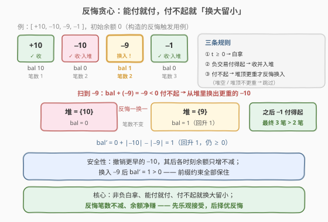
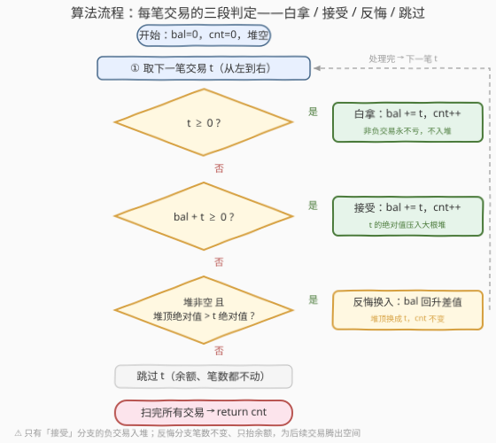

# LeetCode 不出现负余额的最大交易额 题解

## 1. 题目概述

- **标题 / 题号**：不出现负余额的最大交易额（#3711，medium）
- **链接**：https://leetcode.cn/problems/maximum-transactions-without-negative-balance/
- **难度**：中等
- **标签**：贪心、数组、堆（优先队列）

> ⚠️ 本题为 LeetCode 付费题，题意描述根据官方示例用例与 hints 重建，可能与官方题面有出入。

**题意**（依官方 hints 重建）：给定一个整数数组 `transactions`，其中 `transactions[i]` 表示第 $i$ 笔交易的金额。账户**初始余额为 0**，交易**从左到右**依次到来，每笔交易都可以选择「**执行**」或「**跳过**」：

- 执行金额为 $t$ 的交易后，余额变为 $\text{bal} + t$；
- 任意时刻余额都必须非负——即每执行一笔交易后都要满足 $\text{bal} \ge 0$；
- 求最多能执行多少笔交易，返回最大笔数。

**示例 1**（输出按重建题意推得）：

```text
输入：transactions = [2,-5,3,-1,-2]
输出：4
解释：跳过 -5，执行 2 → 3 → -1 → -2，余额依次为 2 → 5 → 4 → 2，全程非负。
      全部执行不可行：2 + (-5) = -3 < 0。
```

**示例 2**（输出按重建题意推得）：

```text
输入：transactions = [-1,-2,-3]
输出：0
解释：初始余额为 0，任何负交易都付不起，一笔也执行不了。
```

**示例 3**（输出按重建题意推得）：

```text
输入：transactions = [3,-2,3,-2,1,-1]
输出：6
解释：全部执行，余额依次为 3 → 1 → 4 → 2 → 3 → 2，全程非负。
```

**约束条件**（付费题面未给出，按同类题惯例推断）：$n \sim 10^5$，$|transactions[i]| \le 10^9$——需要 $O(n \log n)$ 级算法；余额累加可达 $10^{14}$，C++ 须用 64 位整数。

> 💡 **审题关键**：① 「最大交易」指执行**笔数**最大化，而非金额总和——若求总和，跳过所有负交易即是平凡最优，题目将失去意义；② 交易**顺序固定**（从左到右），不可重排，唯一的决策是「执行 / 跳过」；③ 余额约束是**前缀型约束**：所执行子序列的每个前缀和都要非负；④ 官方相似题 2599「使前缀和数组非负」是本题的**镜像**——那里把「跳过」换成「挪到末尾」，把「最大化保留笔数」换成「最小化操作次数」，堆贪心骨架完全一致。

## 2. 解题思路

### 2.1 暴力思路：枚举子集

每笔交易「执行 / 跳过」二选一，共有 $2^n$ 种方案，逐一验证前缀和非负是 $O(2^n \cdot n)$，$n \sim 10^5$ 下不可行。

暴力同时暴露出问题的结构：

1. **正交易白拿**：接受 $t \ge 0$ 让余额与笔数同时不减，接受它永远不亏；
2. **难点全在负交易**：当下付得起的负交易，接受了会压低余额、可能挡住后面的交易；跳过它又立损一笔。**局部信息不足以做出不后悔的决策**——这是「**反悔贪心**」登场的信号（与 630 课程表 III、871 最低加油次数同族）。

### 2.2 核心观察：反悔贪心 + 大根堆



维护运行余额 $\text{bal}$、已执行笔数 $\text{cnt}$，以及一个**大根堆**——堆里存放**已执行的负交易的绝对值**。对每笔交易 $t$ 按三条规则处理：

**规则一（非负白拿）**：$t \ge 0$ 无条件执行，$\text{bal} \mathrel{+}= t$、$\text{cnt} \mathrel{+}= 1$。余额与笔数双增，拒绝它不会让任何方案变得更好。

**规则二（能付就付）**：若 $t < 0$ 且 $\text{bal} + t \ge 0$，先**乐观执行**，并把 $|t|$ 压入堆。哪怕日后证明这次接受「太重」，规则三随时允许反悔。

**规则三（换大留小）**：若 $t < 0$ 且 $\text{bal} + t < 0$（付不起），看堆顶——**已执行的最重负交易** $v$：

- 若 $|v| > |t|$：撤销 $v$、改执行 $t$（**一换一**）。笔数不变，余额净回升

  $$\text{bal}' = \text{bal} + |v| - |t| > \text{bal} \ge 0$$

  为后续交易腾出空间；
- 否则（堆空或 $|v| \le |t|$）：跳过 $t$——换入一笔不更轻的负交易只会让余额更差，笔数却不增。

> 💡 **一句话**：正交易白拿；负交易能付就付、付不起就**换掉堆里最重的那笔**——换出的必须更重，笔数不亏、余额净赚。

**为什么一换一是安全的（合法性）**：被撤销的 $v$ 位于**更早**的位置，撤销它只会让其**后所有时刻**的余额**更高**，不可能破坏任何前缀约束；换入 $t$ 后当前余额 $\text{bal}' > \text{bal} \ge 0$。反悔后的执行集依然合法。

**为什么反悔是划算的（最优性直觉）**：处理完任意前缀后，贪心维持不变量——「笔数已达最大，且在相同笔数的所有合法方案中，当前余额最大」。笔数相同比余额，余额越大后面装得下越多。交换论证见第 5 节。

### 2.3 算法流程图



**文字版步骤**：

| 分支 | 条件 | 动作 | 堆操作 |
|------|------|------|--------|
| 白拿 | $t \ge 0$ | 执行：bal、cnt 双增 | 不入堆 |
| 接受 | $t < 0$ 且付得起 | 执行：bal、cnt 双增 | $t$ 的绝对值入堆 |
| 反悔 | 付不起且堆顶更重 | 撤堆顶、执行 $t$：bal 回升「堆顶绝对值减 $t$ 绝对值」，cnt 不变 | 弹出堆顶、压入 $t$ 的绝对值 |
| 跳过 | 付不起且堆顶不更重 | 不执行，什么都不动 | 无 |

### 2.4 示例演算

**官方示例 1** `transactions = [2,-5,3,-1,-2]`：

| $i$ | $t$ | 判定 | 动作 | bal | 堆 | 笔数 |
|-----|-----|------|------|-----|-----|------|
| 0 | $2$ | $2 \ge 0$ | 白拿 | 2 | $\emptyset$ | 1 |
| 1 | $-5$ | $2-5=-3<0$，堆空 | 跳过 | 2 | $\emptyset$ | 1 |
| 2 | $3$ | $3 \ge 0$ | 白拿 | 5 | $\emptyset$ | 2 |
| 3 | $-1$ | $5-1=4 \ge 0$ | 接受入堆 | 4 | $\{1\}$ | 3 |
| 4 | $-2$ | $4-2=2 \ge 0$ | 接受入堆 | 2 | $\{1,2\}$ | 4 |

答案 $4$（跳过 $-5$，其余全执行）。

**反悔触发用例** `[10,-10,-9,-1]`（自构造）：

| $i$ | $t$ | 判定 | 动作 | bal | 堆 | 笔数 |
|-----|-----|------|------|-----|-----|------|
| 0 | $10$ | $\ge 0$ | 白拿 | 10 | $\emptyset$ | 1 |
| 1 | $-10$ | $10-10=0 \ge 0$ | 接受入堆 | 0 | $\{10\}$ | 2 |
| 2 | $-9$ | $0-9=-9<0$，堆顶 $10>9$ | **反悔换入** | $0+10-9=1$ | $\{9\}$ | 2 |
| 3 | $-1$ | $1-1=0 \ge 0$ | 接受入堆 | 0 | $\{9,1\}$ | 3 |

> 💡 第二张表正显反悔的价值：若第 2 步不反悔（直接跳过 $-9$），余额停在 0，第 3 步 $-1$ 付不起（即使那时再反悔、用 $-1$ 换掉 $-10$，笔数仍是 2）；反悔后余额回升到 1，$-1$ 顺利执行，最终 **3 笔 > 2 笔**。

## 3. 参考代码

### C++

```cpp
class Solution {
public:
    int maxTransactions(vector<int>& transactions) {
        priority_queue<int> pq;   // 大根堆：已执行负交易的绝对值
        long long bal = 0;        // 余额可达 1e14，必须 long long
        int cnt = 0;
        for (int t : transactions) {
            if (t >= 0) {                                // 规则一：白拿
                bal += t;
                ++cnt;
            } else if (bal + t >= 0) {                   // 规则二：能付就付
                bal += t;
                ++cnt;
                pq.push(-t);
            } else if (!pq.empty() && pq.top() > -t) {   // 规则三：换大留小
                bal += (long long)pq.top() + t;          // bal + |v| - |t|
                pq.pop();
                pq.push(-t);
            }                                            // 规则四：否则跳过
        }
        return cnt;
    }
};
```

> 💡 **写法要点**：
> - 函数名 `maxTransactions` 按英文题名驼峰惯例推断（付费题取不到代码模板），以实际提交页为准；
> - 三个 `else if` 分支互斥，依次对应「白拿 / 接受 / 反悔 / 跳过」，与 2.3 流程图一一对应；
> - 反悔分支笔数不变、`cnt` 不动——反悔的收益全部体现在余额上，服务于未来的笔数。

### Python

```python
class Solution:
    def maxTransactions(self, transactions: List[int]) -> int:
        heap = []      # 小根堆存负值原值：heap[0] 即绝对值最大的已执行负交易
        bal = cnt = 0
        for t in transactions:
            if t >= 0:                      # 白拿
                bal += t
                cnt += 1
            elif bal + t >= 0:              # 能付就付
                bal += t
                cnt += 1
                heappush(heap, t)
            elif heap and heap[0] < t:      # 付不起且堆顶更重 → 反悔换入
                bal += -heap[0] + t         # bal + |堆顶| - |t|
                heapreplace(heap, t)
        return cnt
```

> 💡 **写法要点**：
> - Python 的 `heapq` 是小根堆，直接存负交易**原值**（负数），堆顶即**绝对值最大**者，省去取负翻转；
> - 判据 `heap[0] < t` 即「堆顶比当前更负（绝对值更大）」，与 C++ 版 `pq.top() > -t` 语义一致；
> - `heapreplace` 一次完成「弹堆顶 + 压新值」，比先 `heappop` 再 `heappush` 少一次堆调整。

## 4. 复杂度分析

| 维度 | 复杂度 | 说明 |
|------|--------|------|
| **时间复杂度** | $O(n \log n)$ | 每笔负交易至多入堆一次；反悔时一弹一压，堆操作各 $O(\log n)$ |
| **空间复杂度** | $O(n)$ | 堆中至多存 $n$ 个负交易的绝对值 |

> - 交易必须顺序读入才能决策，$O(n)$ 是时间下界，加上堆的 $O(\log n)$ 调整即为本解法。反悔贪心把「要不要接受」的决策**延迟**到真正付不起时才做，避免了 DP 的 $O(n^2)$ 状态设计。
> - ⚠️ 余额上界 $10^5 \times 10^9 = 10^{14}$ 超出 `int`：C++ 用 `long long`，Python 天然大整数无此问题。

## 5. 扩展：正确性证明与对偶写法

**对偶写法：「先拿后撤」**。无条件执行每笔交易（负交易同时入堆），一旦 $\text{bal} < 0$ 就弹出堆顶最重的负交易并撤销（余额加回、笔数减一）。可证明**至多撤一笔**即可恢复非负：缺口 $= |t| - \text{bal} < |t| \le |\text{堆顶}|$。撤的若恰是 $t$ 本身即「跳过」，否则即「反悔换入」——与正文的「换大留小」逐事件等价，也正是 2599 的官方套路（那边习惯写成 `while`，实际至多循环一次）。

**交换论证**（对前缀长度归纳）。记 $B_i(k)$ 为前 $i$ 笔交易中、合法执行 $k$ 笔方案的最大余额；$c$ 为贪心笔数，$h_1 \ge h_2 \ge \cdots$ 为堆中各绝对值从大到小排列（不足 $j$ 个时取全部）。归纳证明贪心维持**不变量链**：

$$B_i(c) = \text{bal}, \qquad B_i(c-j) \le \text{bal} + h_1 + h_2 + \cdots + h_j$$

$j = 0$ 一项即「笔数最大（不存在 $c+1$ 笔合法方案）、同笔数下余额最大」。

归纳关键步（$t < 0$ 且付不起，即 $\text{bal} < |t|$）：

1. **笔数不能更大**：反设前 $i+1$ 笔存在 $c+1$ 笔合法方案 $S$。若 $t \notin S$，$S$ 已是前 $i$ 笔的 $c+1$ 笔方案，与归纳矛盾；若 $t \in S$，由合法性（末前缀非负）知 $S \setminus \{t\}$ 的余额 $\ge |t|$，但它是前 $i$ 笔的 $c$ 笔方案，余额 $\le \text{bal} < |t|$，矛盾。
2. **反悔恰好顶到新上界**：换入后新余额 $\text{bal} + h_1 - |t|$。对任何 $c$ 笔合法方案 $S' \subseteq [i+1]$：若 $t \notin S'$，余额 $\le \text{bal} < \text{bal} + h_1 - |t|$；若 $t \in S'$，则 $S' \setminus \{t\}$ 是前 $i$ 笔的 $c-1$ 笔方案，由不变量链（$j=1$）余额 $\le \text{bal} + h_1$，故其余额 $\le \text{bal} + h_1 - |t|$。贪心自身取到该值，链头保持。（跳过分支即 $h_1 \le |t|$ 的退化情形，上界退回 $\text{bal}$，同样成立。）

「白拿」「能付就付」两情形更简单：任何同笔数方案去掉 $t$ 后套归纳假设再加回 $t$ 即得上界。$j \ge 2$ 的链条维护同法展开，限于篇幅从略。归纳完成即得 $c = C(n)$，贪心最优。

**与 2599 的镜像关系**：2599 允许把元素「挪到末尾」并求最小操作次数。挪到末尾对**靠前的前缀和**等价于移出（仅末尾拼回一处需额外论证，见该题题解第 5 节），故「保留在原位」的集合恰须满足前缀和非负——正是本题的合法执行集；「最小化挪动次数」⟺「最大化保留笔数」。两题共享同一套堆贪心，只是目标一个取 min、一个取 max。

## 6. 面试要点

**Q1：为什么非负交易无条件执行？**

> 执行 $t \ge 0$ 后余额与笔数同时不减，任何拒绝它的方案都能补上它而不变差。注意 $t = 0$ 也算非负——白拿一笔笔数。

**Q2：反悔（换大留小）为什么不会破坏「余额非负」约束？**

> 被撤销的负交易在更早位置，撤销只让其后的余额更高；换入后 $\text{bal}' = \text{bal} + |v| - |t| > \text{bal} \ge 0$。两个方向都不引入负前缀，反悔后的执行集依然合法。

**Q3：为什么必须换「更重」的堆顶？换入等重或更轻的行不行？**

> 等重：余额不变、笔数不变，白忙一场；更轻：余额反而下降、笔数却不增。只有 $|v| > |t|$ 时一换一才净赚余额。堆空或堆顶不更重时，唯一正确的动作是跳过。

**Q4：贪心为什么最优？一句话说清证明骨架。**

> 归纳不变量「笔数最大、同笔数余额最大（完整版：从堆顶起逐个反悔可得每个笔数档位的最大余额）」。付不起时的核心论证：任何想再多装一笔 $t$ 的方案，去掉 $t$ 后的 $c$ 笔前缀方案余额须 $\ge |t|$，但该档位最大余额 $\text{bal} < |t|$，矛盾——所以笔数上不去。

**Q5：这题和 630 / 871 / 1642 那些「反悔贪心」题的共同结构是什么？**

> 都是「先乐观全拿 + 堆里留后悔药 + 违约时换出最贵的」：630 换出最长课程、871 补回最大油量、1642 把最高墙从梯子降级为砖块、本题换出最重负交易。识别信号：局部决策互相耦合、单步看不全局，但「已选集合」可以用一个堆维护可反悔的代价。

## 同类练习题

| # | 题目 | 与本题的关联 |
|---|------|-------------|
| 2599 | [使前缀和数组非负](https://leetcode.cn/problems/make-the-prefix-sum-non-negative/)（[题解](../2501-2600/2599_使前缀和数组非负.md)） | 本题镜像——「跳过」变「挪到末尾」、最大化保留变最小化挪动，同一套堆贪心 |
| 630 | [课程表 III](https://leetcode.cn/problems/course-schedule-iii/)（[题解](../0601-0700/630_课程表III.md)） | 反悔贪心标杆——先全选、超时则退换最长课程，交换论证与本题同源 |
| 871 | [最低加油次数](https://leetcode.cn/problems/minimum-number-of-refueling-stops/)（[题解](../0801-0900/871_最低加油次数.md)） | 先记账后反悔取最大油量，与本题「先接受、付不起换出最重」完全同构 |
| 1642 | [可以到达的最远建筑](https://leetcode.cn/problems/furthest-building-you-can-reach/)（[题解](../1601-1700/1642_可以到达的最远建筑.md)） | 梯子优先、不够时反悔换砖块，延迟决策的又一变体 |
| 2813 | [子序列最大优雅度](https://leetcode.cn/problems/maximum-elegance-of-a-k-length-subsequence/)（[题解](../2801-2900/2813_子序列最大优雅度.md)） | 反悔栈换出最小利润重复项，同族不同目标函数 |
