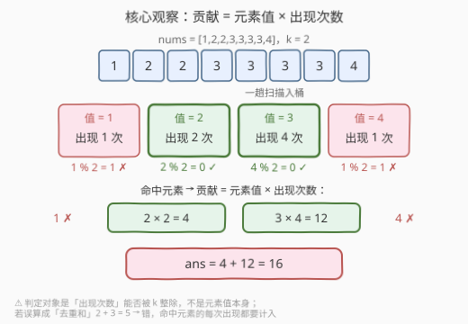
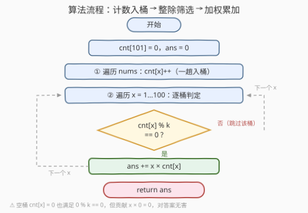

# LeetCode 出现次数能被 K 整除的元素总和 题解

## 1. 题目概述

- **标题 / 题号**：出现次数能被 K 整除的元素总和（#3712，easy）
- **链接**：https://leetcode.cn/problems/sum-of-elements-with-frequency-divisible-by-k/
- **难度**：简单
- **标签**：数组、哈希表、计数

**题意**：给你一个整数数组 `nums` 和一个整数 `k`。请返回一个整数，表示 `nums` 中所有**出现次数能被 `k` 整除**的元素的**总和**；如果没有这样的元素，则返回 `0`。

- 元素 `x` 的**出现次数**指它在数组中出现的次数；
- 若某个元素在数组中的总出现次数能被 `k` 整除，则它在求和中会被计算**恰好与其出现次数相同的次数**——即贡献为 $x \times \text{cnt}(x)$，而不是只加一次。

**示例 1**：

```text
输入：nums = [1,2,2,3,3,3,3,4], k = 2
输出：16
解释：1 出现 1 次（奇数次）、2 出现 2 次（偶数次）、3 出现 4 次（偶数次）、4 出现 1 次（奇数次）。
     因此总和为 2 + 2 + 3 + 3 + 3 + 3 = 16。
```

**示例 2**：

```text
输入：nums = [1,2,3,4,5], k = 2
输出：0
解释：没有元素出现偶数次，因此总和为 0。
```

**示例 3**：

```text
输入：nums = [4,4,4,1,2,3], k = 3
输出：12
解释：4 出现 3 次（3 能被 3 整除），贡献 4 + 4 + 4 = 12；其余元素各出现 1 次，不计入。
```

**约束**：

- $1 \le \text{nums.length} \le 100$
- $1 \le \text{nums}[i] \le 100$
- $1 \le k \le 100$

> 💡 **审题关键**：① 判定对象是**某个元素的「总出现次数」能否被 `k` 整除**，与元素值本身能否被 `k` 整除无关（示例 3 中元素值 4 不能被 3 整除，照样入选）；② 命中元素的贡献是 $x \times \text{cnt}(x)$——示例 1 若错算成「去重和」$2 + 3 = 5$ 就与正确答案 16 背道而驰；③ $k = 1$ 时任何次数都能被 1 整除，答案退化为**整个数组元素之和**。

## 2. 解题思路

### 2.1 暴力思路：对每个元素重新数一遍

最直接的写法是双重循环：外层枚举数组中每个元素 `x`，内层重新扫一遍 `nums` 统计它的出现次数 `c`，若 $c \bmod k = 0$ 则累加 $x \times c$（需用「首次出现才判定」或去重集合避免重复计入）。

正确性没问题，但每个元素的次数被**重复数了它自己的次数遍**，时间 $O(n^2)$；先排序再数连续段可降到 $O(n \log n)$，但仍不及一趟哈希计数来得干净。

### 2.2 核心观察：定长计数桶 + 贡献式求和



**观察一：值域 1~100，定长数组就是哈希表。** 约束里 $1 \le \text{nums}[i] \le 100$ 是稠密小值域，开一个 `cnt[101]`，一趟扫描 `cnt[x]++` 即完成全部统计——零散列开销、零扩容，比通用哈希表更轻。

**观察二：判定看次数，求和要「乘回」次数。** 计数完成后，对每个桶判定 $\text{cnt}(x) \bmod k = 0$；命中者贡献 $x \times \text{cnt}(x)$。哈希表里存的就是次数，乘回来是零成本操作——**「判定」与「加权」用的是同一份数据**，这是所有频率统计题的通用骨架：统计 → 过滤 → 按频次加权。

**观察三：空桶天然无害，但别依赖。** 遍历全值域时，未出现的元素满足 $0 \bmod k = 0$（0 能被任何正整数整除），看似会被误判「入选」，但其贡献是 $x \times 0 = 0$，对答案毫无影响——本题恰好宽容。若题目改成「统计满足条件的**元素种类数**」，全值域遍历就会把没出现的元素也数进去而翻车（见第 5 节）。

> 💡 一句话：本题 = 「一趟入桶」+「`cnt % k == 0` 则累加 $x \cdot \text{cnt}(x)$」。两段线性扫描，值域定长桶兜底。

### 2.3 算法流程图



**逻辑执行步骤**：

| 步骤 | 操作 | 说明 |
|------|------|------|
| ① 初始化 | `cnt[101] = 0`，`ans = 0` | 定长计数桶清零，答案累加器置 0 |
| ② 入桶循环 | 遍历每个 `x ∈ nums`，`cnt[x]++` | 一趟完成全部频率统计 |
| ③ 扫描循环 | `x` 从 1 到 100 逐桶检查 | 值域顺序扫描，覆盖所有可能的键 |
| ④ 整除判定 | `cnt[x] % k == 0` ? | 是 → ⑤；否 → 跳过该桶回 ③ |
| ⑤ 加权累加 | `ans += x * cnt[x]` | 贡献 = 元素值 × 出现次数 |
| ⑥ 返回 | `return ans` | 无命中元素时 `ans` 恒为 0，天然满足「返回 0」 |

> ⚠️ ⑤ 的乘法**不可省**——这是本题唯一容易翻车的审题点：加的是「元素逐次计入」的总和，不是「去重后的元素值」。

### 2.4 示例演算

**示例 1：nums = [1,2,2,3,3,3,3,4]，k = 2（答案 16）**：

| 元素 x | cnt[x] | cnt % k | 判定 | 贡献 |
|--------|--------|---------|------|------|
| 1 | 1 | 1 | ✗ | 0 |
| 2 | 2 | 0 | ✓ | $2 \times 2 = 4$ |
| 3 | 4 | 0 | ✓ | $3 \times 4 = 12$ |
| 4 | 1 | 1 | ✗ | 0 |

累加 $4 + 12 = \textbf{16}$。

**示例 3：nums = [4,4,4,1,2,3]，k = 3（答案 12）**：只有 4 的次数 3 满足 $3 \bmod 3 = 0$，贡献 $4 \times 3 = \textbf{12}$——注意 4 这个**值**并不能被 3 整除，判定对象始终是**次数**。

**边界情形**：$k = 1$ 时全部桶命中（任何正整数都能被 1 整除），答案 = 数组总和；所有元素都只出现一次且 $k \ge 2$ 时（示例 2），无桶命中，答案为 0。

## 3. 参考代码

### C++

```cpp
class Solution {
public:
    int sumDivisibleByK(vector<int>& nums, int k) {
        int cnt[101] = {0};
        for (int x : nums) cnt[x]++;
        int ans = 0;
        for (int x = 1; x <= 100; ++x)
            if (cnt[x] % k == 0)
                ans += x * cnt[x];
        return ans;
    }
};
```

> 💡 **写法要点**：
> - `int cnt[101] = {0}` 聚合初始化一句清零，值域 1~100 稠密定长，数组即最优哈希表；
> - `cnt[x] % k == 0` 对空桶（`cnt[x] == 0`）也为真，但乘积 $x \times 0 = 0$，无需特判（见 2.2 观察三）；
> - $n \le 100$、值 $\le 100$，最大和 $10^4$，`int` 毫无溢出压力。

### Python

```python
class Solution:
    def sumDivisibleByK(self, nums: List[int], k: int) -> int:
        cnt = [0] * 101
        for x in nums:
            cnt[x] += 1
        return sum(x * cnt[x] for x in range(1, 101) if cnt[x] % k == 0)
```

> 💡 **写法要点**：
> - 生成器表达式里「过滤条件 `cnt[x] % k == 0`」与「加权项 `x * cnt[x]`」一一对应，正是 2.2 观察二的代码化；
> - 值域大时可换成 `collections.Counter`，遍历 `cnt.items()` 天然只含出现过的键，空桶问题彻底消失（见第 5 节）。

## 4. 复杂度分析

| 维度 | 复杂度 | 说明 |
|------|--------|------|
| **时间** | $O(n + D)$ | 入桶一趟 $O(n)$ + 扫描值域一趟 $O(D)$，$D = 100$ 为值域宽度 |
| **空间** | $O(D)$ | 定长 101 个计数桶与常数变量，与 $n$ 无关 |
| **对比暴力法** | $O(n^2) \to O(n + D)$ | 暴力对每个元素重数一遍次数；计数桶把「统计」摊销成一趟，之后每次判定都是 $O(1)$ 查表 |

## 5. 扩展：遍历「值域」还是遍历「出现过的键」？

「空桶 $0 \bmod k = 0$ 命中但贡献为 0」是本题的巧合式安全。更稳健的姿势是**只遍历出现过的键**——用通用哈希表（`Counter` / `unordered_map`），键集天然等于出现过的元素集：

```python
from collections import Counter

class Solution:
    def sumDivisibleByK(self, nums: List[int], k: int) -> int:
        return sum(x * c for x, c in Counter(nums).items() if c % k == 0)
```

两种遍历方式的取舍：

| 方式 | 前提 | 空桶风险 | 复杂度 |
|------|------|----------|--------|
| **遍历值域** `1..100` | 值域小且稠密、已知 | 有（本题无害，变体题可能翻车） | $O(n + D)$ |
| **遍历哈希键集** | 任意值域（含负数、大数、字符串） | 无 | $O(n)$ |

**判别法则**：答案若与「元素值」线性相关（求和、求积），空桶贡献常为 0，全值域遍历侥幸安全；答案若与「计数本身」相关（种类数、满足条件的桶个数），空桶 $0$ 会假阳性命中，必须绕开——把这一问想清楚，「频率过滤」一族题目的坑就全踩完了。

## 6. 面试要点

**Q1：「计算恰好与其出现次数相同的次数」如何落实到代码？**

> 命中元素贡献 $x \times \text{cnt}(x)$。示例 1 中 2 贡献 $2 \times 2 = 4$、3 贡献 $3 \times 4 = 12$，合计 16；若错写成去重和 $2 + 3 = 5$，是最典型的审题翻车点。

**Q2：为什么用数组而不是哈希表？什么时候必须换？**

> 值域 $1 \le \text{nums}[i] \le 100$ 小而稠密，定长数组下标直达、零哈希开销。值域大而稀疏（如 $10^9$）、含负数或键为字符串时，数组开不下，必须换 `Counter` / `unordered_map`，并改为遍历键集。

**Q3：空桶满足 `0 % k == 0`，会被误计入吗？**

> 本题不会：误命中的贡献是 $x \times 0 = 0$，对和式无影响。但这只是「求和题」的巧合——若题目改为统计满足条件的**元素种类数**，全值域遍历就会把未出现元素全数进去。稳健写法是只遍历出现过的键（哈希表 `items()`）。

**Q4：k = 1 时程序行为是什么？**

> 任何出现次数（正整数）都能被 1 整除，所有出现过的桶全部命中，答案就是**数组元素总和**。这是一个免费的自测用例：手跑一遍 `sum(nums)` 对答案即可验证代码没有把判定条件写反。

**Q5：如果把「次数被 k 整除」改成「值被 k 整除」要改哪里？**

> 判定条件从 `cnt[x] % k == 0` 换成 `x % k == 0`，加权项 `x * cnt[x]` 不变（题意若同时要求只计入一次则去掉乘法）。说明「过滤条件」与「加权方式」在本框架里是两个正交旋钮——这正是「统计 → 过滤 → 加权」骨架的可复用之处。

> 💡 **一句话总结**：3712 = 一趟入桶 + `cnt % k == 0` 筛选 + $x \cdot \text{cnt}(x)$ 加权。三个要点带走：判定对象是次数不是值、贡献要乘回次数、空桶只在求和题里无害。

## 同类练习题

| # | 题目 | 与本题的关联 |
|---|------|-------------|
| 1512 | [好数对的数目](https://leetcode.cn/problems/number-of-good-pairs/)（[题解](../1501-1600/1512_好数对的数目.md)） | 同一套频率计数，加权项换成组合数 $\binom{c}{2}$ |
| 3164 | [优质数对的总数 II](https://leetcode.cn/problems/find-the-number-of-good-pairs-ii/)（[题解](../3101-3200/3164_优质数对的总数II.md)） | 频率统计与整除判定组合，规模升级到需要按余数分桶 |
| 1941 | [检查是否所有字符出现次数相同](https://leetcode.cn/problems/check-if-all-characters-have-equal-number-of-occurrences/)（[题解](../1901-2000/1941_检查是否所有字符出现次数相同.md)） | 定长 26 桶频率校验，与 `cnt[101]` 桶思想同源 |
| 645 | [错误的集合](https://leetcode.cn/problems/set-mismatch/)（[题解](../0601-0700/645_错误的集合.md)） | 计数桶找「多一次 / 少一次」的异常键，统计后的桶上做判定 |
| 2716 | [最小化字符串长度](https://leetcode.cn/problems/minimize-string-length/)（[题解](../2701-2800/2716_最小化字符串长度.md)） | 频率决定元素去留，与本题「频率决定计入与否」同构 |
