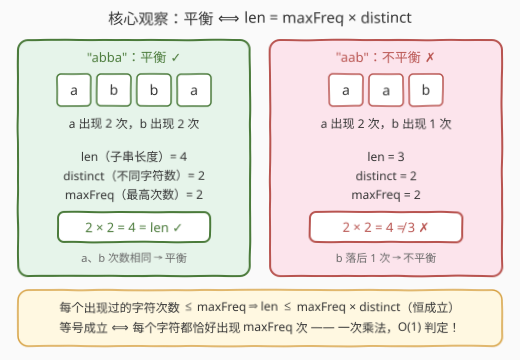
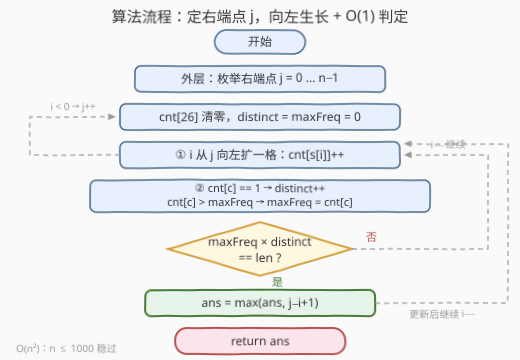

# 最长的平衡子串 I

- **题目名称**：最长的平衡子串 I
- **链接**：[3713. 最长的平衡子串 I](https://leetcode.cn/problems/longest-balanced-substring-i/)
- **难度**：中等
- **标签**：哈希表、字符串、计数、枚举

## 1. 题目概述

给你一个仅由小写英文字母组成的字符串 `s`。如果一个**子串**中所有**不同**字符出现的次数都**相同**，则称该子串为**平衡**子串。请返回 `s` 的**最长平衡子串**的**长度**。

子串是字符串中连续的、非空的字符序列。

**示例 1**：

```text
输入：s = "abbac"
输出：4
解释：最长的平衡子串是 "abba"，不同字符 'a' 和 'b' 都恰好出现了 2 次。
```

**示例 2**：

```text
输入：s = "zzabccy"
输出：4
解释：最长的平衡子串是 "zabc"，不同字符 'z'、'a'、'b'、'c' 都恰好出现了 1 次。
```

**示例 3**：

```text
输入：s = "aba"
输出：2
解释：最长的平衡子串之一是 "ab"（'a'、'b' 各 1 次），另一个是 "ba"。
```

**约束条件**：

- $1 \le \text{s.length} \le 1000$
- `s` 仅由小写英文字母组成

> 💡 **审题关键**：① 平衡看的是「**不同字符的次数彼此相等**」，与字符种类多少无关——`"aaaa"`（1 种字符 4 次）和 `"aabb"`（2 种字符各 2 次）都平衡；② 子串连续且非空，单个字符的出现次数恒为 1，因此**答案至少为 1**；③ $n \le 1000$ 是明确的复杂度暗示：$O(n^2)$ 约 $10^6$ 量级可过（姊妹篇 3714 把 $n$ 抬到 $10^5$ 但字母表砍到只剩 `a`/`b`/`c`，是典型的「数据范围换算法」分家，见第 5 节）。

---

## 2. 解题思路

### 2.1 暴力思路：枚举所有子串，逐个重新计数

最直接的写法是双重循环枚举所有 $O(n^2)$ 个子串，每个子串再花 $O(n)$ 重新统计字符次数并检查是否全部相等——总计 $O(n^3) \approx 10^9$，超时。

退一步的半暴力：枚举子串时**增量维护** 26 个计数桶（右端每扩一格只更新一个桶），但「判定平衡」仍要扫完整个字母表确认所有非零桶相等——$O(26 \cdot n^2) \approx 2.6 \times 10^7$，能过但不够优雅。

两种暴力共同暴露的瓶颈是**判定太贵**：每换一个子串都要重新核对大量计数。另外注意这题**不能**套经典双指针或二分——平衡性对窗口长度没有单调性，例如 `s = "aabb"` 中长度 2 的 `"ab"` 平衡、长度 3 的 `"aab"` 不平衡、长度 4 的 `"aabb"` 又平衡了，长短与平衡与否交替出现，滑动窗口的单调性前提不成立。既然只能枚举，目标就明确为：**把每个子串的判定降到 $O(1)$**。

### 2.2 核心观察：$\text{len} = \text{maxFreq} \times \text{distinct}$



记子串长度为 $\text{len}$、出现过的**不同**字符数为 $\text{distinct}$、**最高**出现次数为 $\text{maxFreq}$，则：

> **子串平衡 $\iff \text{len} = \text{maxFreq} \times \text{distinct}$**

双向论证：

- **必要性**：若平衡，设 $\text{distinct} = d$ 种字符各出现 $k$ 次，则 $\text{len} = kd$、$\text{maxFreq} = k$，于是 $\text{maxFreq} \times \text{distinct} = k \times d = \text{len}$；
- **充分性**：每个出现过的字符次数都在 $[1, \text{maxFreq}]$ 之间，$d$ 种字符求和至多为 $d \times \text{maxFreq}$。若 $\text{len} = d \times \text{maxFreq}$ 取到上界，则**每一项都必须顶到 $\text{maxFreq}$**——所有字符次数全部相等，即平衡。

这个等式把「扫一遍计数桶」压缩成「一次乘法比较」，但还差一步：$\text{distinct}$ 和 $\text{maxFreq}$ 也得 $O(1)$ 维护才行。技巧在于**枚举的方向**——

> **固定右端点 $j$，让左端点 $i$ 从 $j$ 向左单向扩展。**

这样窗口只会**生长**不会收缩：每扩一格执行 `cnt[c]++`，`cnt[c]` 从 0 变 1 时 `distinct++`；`maxFreq = max(maxFreq, cnt[c])`——计数只增不减，**maxFreq 天然单调不降，永远不需要回退重算**。每步严格 $O(1)$。

> 💡 一句话：判定 = $\text{maxFreq} \times \text{distinct} == \text{len}$；维护 = 只加不减的「单向生长」枚举。两者合体，$O(n^2)$ 步、每步 $O(1)$。

### 2.3 算法流程图



**逻辑执行步骤**：

| 步骤 | 操作 | 说明 |
|------|------|------|
| ① 外层循环 | 枚举右端点 $j = 0 \dots n-1$ | 每轮重置计数状态 |
| ② 状态初始化 | `cnt[26]` 清零，`distinct = maxFreq = 0` | 换新右端点，从空窗口重新生长 |
| ③ 内层循环 | $i$ 从 $j$ 向左移动，`cnt[s[i]]++` | 窗口 $s[i..j]$ 单向生长 |
| ④ O(1) 维护 | `cnt[c]==1 → distinct++`；`cnt[c] 更大 → maxFreq=cnt[c]` | 计数只增不减，maxFreq 无需回退 |
| ⑤ 平衡判定 | $\text{maxFreq} \times \text{distinct} == j-i+1$ ? | 是 → ⑥；否 → $i$ 左移继续 |
| ⑥ 更新答案 | `ans = max(ans, j-i+1)` | 随后同样回到内层继续 |
| ⑦ 内层走完 | $i < 0$ → $j{+}{+}$ 进入下一轮 | 全部右端点处理完返回 `ans` |

> ⚠️ ④ 是整套流程的命脉：若把窗口改成「可收缩」的双指针，`maxFreq` 就需要能回退（得用「频次的频次」结构辅助），复杂度分析也会随之变化。本题靠「一端固定、另一端单向移动」规避了这一切。

### 2.4 示例演算

**示例 1：`s = "abbac"`，右端点 $j = 3$（对应子串右端 `'a'`）**：

| $i$ | 新入字符 | 子串 $s[i..3]$ | distinct | maxFreq | maxFreq × distinct | len | 平衡？ | ans |
|-----|---------|----------------|----------|---------|--------------------|-----|--------|-----|
| 3 | `a` | `"a"` | 1 | 1 | 1 | 1 | ✓ | 1 |
| 2 | `b` | `"ba"` | 2 | 1 | 2 | 2 | ✓ | 2 |
| 1 | `b` | `"bba"` | 2 | 2 | 4 | 3 | ✗ | 2 |
| 0 | `a` | `"abba"` | 2 | 2 | 4 | 4 | ✓ | **4** |

**$j = 4$ 一轮快速核对**：`"c"` ✓（len 1）、`"ac"` ✓（len 2）、`"bac"` ✓（len 3，$1 \times 3 = 3$）、`"bbac"` ✗（$2 \times 3 = 6 \ne 4$）、`"abbac"` ✗（$2 \times 3 = 6 \ne 5$）——`ans` 停在 **4**。

**边界情形**：`s` 整串平衡时（如 `"aaaa"`），$j = n-1$、$i = 0$ 一轮即取到满长 $n$（$4 = 4 \times 1$）；所有字符互不相同时整串平衡（$\text{maxFreq} = 1$）。

---

## 3. 参考代码

### C++

```cpp
class Solution {
public:
    int longestBalanced(string s) {
        int n = s.size(), ans = 1;
        for (int j = 0; j < n; ++j) {
            int cnt[26] = {0};
            int distinct = 0, maxFreq = 0;
            for (int i = j; i >= 0; --i) {
                int c = s[i] - 'a';
                if (++cnt[c] == 1) ++distinct;
                maxFreq = max(maxFreq, cnt[c]);
                int len = j - i + 1;
                if (maxFreq * distinct == len) ans = max(ans, len);
            }
        }
        return ans;
    }
};
```

> 💡 **写法要点**：
> - 内层 `for (int i = j; i >= 0; --i)` 从右端点向左生长，`++cnt[c] == 1` 一行同时完成自增与新字符判别；
> - `maxFreq` 只在新计数超过历史最大时抬升，无需任何回退逻辑——单向生长的红利；
> - `ans` 初始化为 `1`：$n \ge 1$ 时单字符子串必平衡（次数恒为 1），答案下界就是 1；
> - $\text{maxFreq} \times \text{distinct} \le 26 \times 1000$，`int` 毫无溢出压力。

### Python

```python
class Solution:
    def longestBalanced(self, s: str) -> int:
        n, ans = len(s), 1
        for j in range(n):
            cnt = [0] * 26
            distinct = max_freq = 0
            for i in range(j, -1, -1):
                c = ord(s[i]) - 97
                cnt[c] += 1
                if cnt[c] == 1:
                    distinct += 1
                max_freq = max(max_freq, cnt[c])
                if max_freq * distinct == j - i + 1:
                    ans = max(ans, j - i + 1)
        return ans
```

> 💡 **写法要点**：
> - `cnt` 每轮外层重建，`[0] * 26` 开销可忽略（外层仅 $n$ 轮）；
> - 固定左端点向右扩展同样正确——关键是保持「一端固定、另一端单向移动」，让计数只增不减。

---

## 4. 复杂度分析

| 维度 | 复杂度 | 说明 |
|------|--------|------|
| **时间** | $O(n^2)$ | 内层总步数 $\frac{n(n+1)}{2} \approx 5 \times 10^5$（$n = 1000$），每步严格 $O(1)$ |
| **空间** | $O(|\Sigma|) = O(26)$ | 计数数组与常数变量，与 $n$ 无关 |
| **对比暴力** | $O(n^3) \to O(n^2)$ | 判定从「重数一遍」/$O(26)$ 扫桶降为一次乘法比较；维护靠单向生长免去重算 |

---

## 5. 扩展：当 $n$ 抬到 $10^5$ 怎么办（3714. 最长的平衡子串 II）

本题的 $O(n^2)$ 在 $n \le 1000$ 下绰绰有余，但姊妹篇 **3714** 把 $n$ 升到 $10^5$——同时把字母表砍到只剩 `'a'`、`'b'`、`'c'`。这是出题人留下的活路：**字母表只有 3 个字符时，「计数相等」可以翻译成「前缀计数差相等」，再用哈希表找最远匹配**。

以「子串里只出现 `a` 和 `b` 且两者次数相等」为例：记 $P_a[i]$ 为前 $i$ 个字符中 `a` 的个数（其余同理），子串 $(l, r]$ 平衡 $\iff$

$$P_a[r] - P_a[l] = P_b[r] - P_b[l] \quad \text{且} \quad P_c[r] = P_c[l]$$

移项后发现两式合起来正是「下标 $l$ 与 $r$ 处的**键** $\left(P_a - P_b,\ P_c\right)$ 取值相同」。于是从左到右扫描，哈希表记录每个键**首次**出现的下标，再遇同键即得一个候选子串，取最远匹配即可——$O(n)$ 一趟。三种规模全覆盖：

| 场景 | 套路 | 复杂度 |
|------|------|--------|
| 字母表任意、$n \lesssim 5000$ | 定右端点向左生长 + $\text{maxFreq} \times \text{distinct}$ 判定（本题） | $O(n^2)$ |
| 字母表只有 2~3 个字符、$n \le 10^5$ | 前缀计数差 + 哈希记首次出现（3714）：$m=1$ 取最长同字符段；$m=2$ 对 3 种字符组合各跑一趟键匹配；$m=3$ 用键 $(P_a - P_b,\ P_a - P_c)$ | $O(n)$ 每趟 |
| 字母表 26 个、$n \le 10^5$ 且附加「相邻字符差 ≤ 2」约束 | 枚举字符种数 $m$ + 定长窗口 + 「频次的频次」$O(1)$ 判定（[2953](https://leetcode.cn/problems/count-complete-substrings/) 的经典套路） | 均摊线性量级 |

> 💡 同一个「平衡」定义，字母表大小和数据范围轮流松紧，逼出三套完全不同的算法——面试中遇到字符串计数题，先看 $n$ 与 $|\Sigma|$ 的量级再定套路，是比任何模板都重要的元判断。

---

## 6. 面试要点

**Q1：为什么 $\text{len} = \text{maxFreq} \times \text{distinct}$ 就等价于平衡？**

> 必要性：平衡时 $d$ 种字符各 $k$ 次，$\text{len} = kd = \text{maxFreq} \times \text{distinct}$。充分性：每种出现过的字符次数 $\le \text{maxFreq}$，总和取到上界 $d \times \text{maxFreq}$ 的唯一方式是每项都等于 $\text{maxFreq}$。一个不等式夹逼完成双向证明。

**Q2：`maxFreq` 为什么能 $O(1)$ 维护？什么时候不行？**

> 本题枚举是「一端固定、另一端单向移动」，窗口只生长不收缩，计数只增不减，`maxFreq = max(maxFreq, cnt[c])` 永不回退。若改成可收缩的双指针，删除字符时 `maxFreq` 可能需要下降，单变量维护失效，得引入「频次的频次」（每种频率对应多少字符）结构才能 $O(1)$ 查询当前最大频率。

**Q3：这题能用二分答案或双指针吗？**

> 不能。平衡性关于子串长度**不单调**：`"aabb"` 中长度 2（`"ab"`）平衡、长度 3（`"aab"`）不平衡、长度 4（`"aabb"`）又平衡——长短候选交替成败，二分的判定条件与双指针的收缩依据都不成立，只能老老实实枚举（并借助 $O(1)$ 判定把枚举压到 $O(n^2)$）。

**Q4：`ans` 为什么初始化为 1 而不是 0？**

> $n \ge 1$ 保证至少存在一个非空子串，而单个字符的出现次数恒为 1（平凡平衡），答案下界是 1。初始化成 0 在本题数据下也能碰巧通过（内层第一轮 $i = j$ 时 $1 \times 1 = 1$ 必命中），但显式置 1 能表达「下界已被锁定」的语义，也更抗变种（比如改成允许空串的定义）。

**Q5：本题和 3714 / 2953 的演进关系说明了什么？**

> 同一「每字符次数相等」的定义：3713（$n \le 1000$、26 字母）用 $O(n^2)$ 枚举；3714（$n \le 10^5$、3 字母）换前缀计数差 + 哈希首现线性解；2953（$10^5$、26 字母但加相邻差约束）用枚举种数 + 定长窗口。**先读 $n$ 与 $|\Sigma|$ 再选算法**——数据范围本身就是出题人写在脸上的提示。

> 💡 **一句话总结**：3713 = 定右端点向左生长的 $O(n^2)$ 枚举 + $\text{len} = \text{maxFreq} \times \text{distinct}$ 的 $O(1)$ 判定。三个要点带走：等式判定有夹逼证明、单向生长免回退、平衡性无单调性所以枚举是必然。

---

## 7. 同类练习题

- [3714. 最长的平衡子串 II](https://leetcode.cn/problems/longest-balanced-substring-ii/)：同题面约束升级（$n \le 10^5$、仅 `abc`），逼出前缀计数差 + 哈希首现的线性解
- [2953. 统计完全子字符串](https://leetcode.cn/problems/count-complete-substrings/)（[题解](../2901-3000/2953_统计完全子字符串.md)）：同样「每个字符次数相同」，叠加相邻字符差 ≤ 2 约束，枚举字符种数 + 定长滑窗
- [1941. 检查是否所有字符出现次数相同](https://leetcode.cn/problems/check-if-all-characters-have-equal-number-of-occurrences/)（[题解](../1901-2000/1941_检查是否所有字符出现次数相同.md)）：整串版平衡判定，本题在子串长度为 $n$ 时的特例
- [424. 替换后的最长重复字符](https://leetcode.cn/problems/longest-repeating-character-replacement/)（[题解](../0401-0500/424_替换后的最长重复字符.md)）：滑窗内维护 `maxFreq` 的经典题，对照体会本题 maxFreq 免回退的前提条件
- [1763. 最长的美好子字符串](https://leetcode.cn/problems/longest-nice-substring/)（[题解](../1701-1800/1763_最长的美好子字符串.md)）：另一类「子串字符集性质」问题，$n$ 小时枚举/分治即最优
