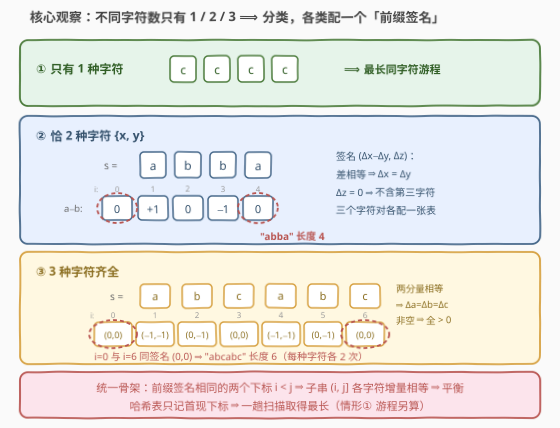
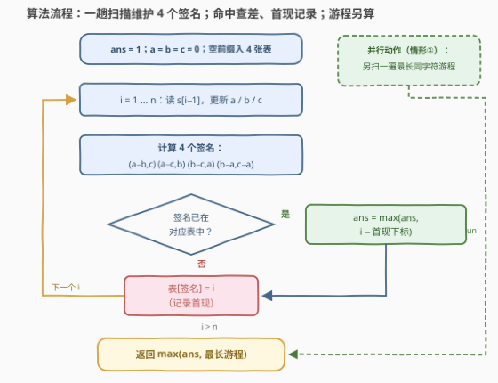

# LeetCode 最长的平衡子串 II 题解

## 1. 题目概述

- **标题 / 题号**：最长的平衡子串 II（#3714，medium）
- **链接**：https://leetcode.cn/problems/longest-balanced-substring-ii/
- **难度**：中等
- **标签**：哈希表、字符串、前缀和

**题意**：给定一个只包含字符 `a`、`b`、`c` 的字符串 $s$。如果一个**子串**中所有**不同**字符出现的次数都**相同**，则称该子串为**平衡子串**。返回 $s$ 中**最长平衡子串**的长度。

**示例 1**：

```text
输入：s = "abbac"
输出：4
解释：最长平衡子串是 "abba"，不同字符 'a' 和 'b' 都恰好出现 2 次。
```

**示例 2**：

```text
输入：s = "aabcc"
输出：3
解释：最长平衡子串是 "abc"，'a'、'b'、'c' 各恰好出现 1 次。
```

**示例 3**：

```text
输入：s = "aba"
输出：2
解释："ab"（'a'、'b' 各 1 次）是最长平衡子串之一，"ba" 同理。
```

**约束**：

- $1 \le s.length \le 10^5$
- $s$ 仅包含字符 `a`、`b`、`c`

> 💡 **审题关键**：①「所有**不同**字符次数相同」不要求三种字符都出现——整段同字符（如 `"bb"`）也是平衡子串；② 与 [2609. 最长平衡子字符串](https://leetcode.cn/problems/find-the-longest-balanced-substring-of-a-binary-string/)（I 版）不同：I 版是 01 串且要求 `0` 全在 `1` 前，本题 `a`/`b`/`c` **顺序任意**，只看次数；③ 求最长长度而非计数，方向指向「前缀 + 哈希首现」而非枚举/DP。

## 2. 解题思路

### 2.1 暴力思路：枚举所有子串

预处理前缀计数 $\text{cnt}_a[i], \text{cnt}_b[i], \text{cnt}_c[i]$ 后，任意子串 $(i, j]$ 的三种字符增量都能 $O(1)$ 取出，「非零增量全相等」的判定也是 $O(1)$。但子串共 $O(n^2)$ 个，$n = 10^5$ 时约 $5 \times 10^9$ 次判定，必然超时。

> 💡 暴力的浪费在于：把每个子串当独立个体从头检查。而「平衡」本质是**前缀计数的差分性质**——相邻前缀只差一个字符，大量子串共享同一批前缀状态，本可以让**相同状态互相配对**。

### 2.2 核心观察：按「不同字符数」分类 + 前缀签名首现



**观察一：平衡子串的「不同字符数」只有 3 种可能。** 字符集只有 $\{a, b, c\}$，平衡子串中出现的不同字符数 $d \in \{1, 2, 3\}$，对应「全同字符 / 恰两种相等 / 三种相等」三种形态——互斥且完备，分别求最长再取最大。

**观察二（$d=1$）：整段同字符。** 答案就是**最长同字符游程**，一遍扫描即得（如 `"aabcc"` 中 `"aa"`、`"cc"` 长度均为 2）。

**观察三（$d=2$，设出现的两种字符为 $x, y$，第三种为 $z$）：子串内 $\#x = \#y > 0$ 且 $\#z = 0$。** 定义前缀签名

$$sig_{xy}(i) = \big(\text{cnt}_x(i) - \text{cnt}_y(i),\; \text{cnt}_z(i)\big)$$

则子串 $(i, j]$ 是双字符平衡子串 $\iff$ $sig_{xy}(i) = sig_{xy}(j)$ 且 $i < j$：

- 第一分量相等 $\Rightarrow$ 子串内 $\Delta x = \Delta y$；
- 第二分量相等 $\Rightarrow$ 子串内 $\Delta z = 0$（不含第三种字符）；
- 子串非空 $\Rightarrow$ $\Delta x = \Delta y > 0$（若两者皆为 0 则长度为 0，矛盾），恰是两种字符各出现同样多次。

**观察四（$d=3$）：$\#a = \#b = \#c > 0$。** 同理定义 $sig_{abc}(i) = (\text{cnt}_b(i) - \text{cnt}_a(i),\; \text{cnt}_c(i) - \text{cnt}_a(i))$，两前缀签名相等 $\iff$ 中间子串 $\Delta a = \Delta b = \Delta c$，非空保证三者同正。

**观察五：想最长，哈希表只存「首现下标」。** 同一签名可能在前缀序列中出现多次；固定右端点 $j$，左端点 $i$ 越小长度 $j - i$ 越大。因此每张哈希表只记录每个签名**第一次**出现的下标，后续出现只用来当右端点结算。这正是 [525. 连续数组](../0501-0600/525_连续数组.md)「前缀差 + 首现」的骨架，从 2 种字符推广到 3 种。

字符对共 $\{a,b\}, \{a,c\}, \{b,c\}$ 三对，加上三元组共 **4 张签名表**，与最长游程一起，一趟扫描全部维护。

> ⚠️ **签名为什么带两个分量？** 只看 $\text{cnt}_x - \text{cnt}_y$ 差相等，挡不住第三种字符混进中间。反例 $s = $ `"acbc"`：前缀 0 与前缀 4 的 $a-b$ 都是 0，若只看差会误报整段长 4；但整段 $\#a=1, \#b=1, \#c=2$ 并不平衡——第二分量 $\text{cnt}_c$（0 对 2）不等，恰好把它挡住。[525](../0501-0600/525_连续数组.md) 的字符集只有两种、天然无第三字符，所以一个差值分量就够；本题必须补上。

### 2.3 算法流程图



**文字版步骤**：

| 步骤 | 操作 | 说明 |
|------|------|------|
| ① 预置 | 空前缀（$i=0$，计数全 0）的 4 个签名入表，首现均为 0 | 所有子串右端点从 1 开始 |
| ② 递推 | $i$ 从 1 到 $n$：读 $s[i-1]$，更新前缀计数 $a/b/c$ | 增量维护，$O(1)$ |
| ③ 查表 | 依次算 4 个签名查各自哈希表 | 已在表中 → $ans = \max(ans,\; i - \text{首现})$；不在 → 记首现 $= i$ |
| ④ 游程 | 另扫一遍最长同字符游程（情形①） | 与签名扫描相互独立 |
| ⑤ 收尾 | 返回 $\max(ans, \text{最长游程})$ | 两类结果合并 |

### 2.4 示例演算

以示例 1 $s = $ `"abbac"` 为例（4 张表中 $\{a,b\}$ 对与三元组各有命中；$\{a,c\}$ 最好命中 2（`"ac"`），$\{b,c\}$ 无命中，均不影响答案）：

| 前缀 $i$ | 读入 | a | b | c | $sig_{ab} = (a{-}b,\, c)$ | $sig_{abc} = (b{-}a,\, c{-}a)$ | 命中结算 |
|-----------|------|---|---|---|--------------------------|-------------------------------|----------|
| 0 | — | 0 | 0 | 0 | (0, 0) 首现 | (0, 0) 首现 | 空前缀打底 |
| 1 | a | 1 | 0 | 0 | (1, 0) 首现 | (−1, −1) 首现 | — |
| 2 | b | 1 | 1 | 0 | (0, 0) 命中 $i{=}0$ → 长度 2 | (0, −1) 首现 | `"ab"` |
| 3 | b | 1 | 2 | 0 | (−1, 0) 首现 | (1, −1) 首现 | — |
| 4 | a | 2 | 2 | 0 | (0, 0) 命中 $i{=}0$ → **长度 4** | (0, −2) 首现 | **`"abba"`** |
| 5 | c | 2 | 2 | 1 | (0, 1) 首现 | (0, −1) 命中 $i{=}2$ → 长度 3 | `"bac"`（三元平衡） |

最长游程为 2（`"bb"`）；最终答案 $\max(2,\, 2,\, 4,\, 3) = 4$ ✓。注意 $i=5$ 这一步：**同一个前缀**在两张表里分别结算——$sig_{ab}$ 因 $c$ 分量变化而未命中，$sig_{abc}$ 命中（`"bac"` 恰是 $d=3$ 平衡段），互不干扰。

## 3. 参考代码

### C++

```cpp
class Solution {
  public:
    int longestBalanced(string s) {
        int n = s.size();
        int ans = 1;

        // 情形一：只有 1 种字符 —— 最长同字符游程
        int run = 1;
        for (int i = 1; i < n; ++i) {
            run = (s[i] == s[i - 1]) ? run + 1 : 1;
            ans = max(ans, run);
        }

        // 情形二/三：4 张「前缀签名 → 首现下标」哈希表
        const long long M = 2LL * n + 1;
        auto encode = [&](long long x, long long y) {   // (x,y) ∈ [-n,n]² → 整数键
            return (x + n) * M + (y + n);
        };
        unordered_map<long long, int> first[4];
        auto touch = [&](int k, long long key, int i) {
            auto it = first[k].find(key);
            if (it != first[k].end()) {
                ans = max(ans, i - it->second);         // 再次出现：当右端点结算
            } else {
                first[k].emplace(key, i);               // 首次出现：只记下标
            }
        };

        long long a = 0, b = 0, c = 0;
        touch(0, encode(a - b, c), 0);      // 字符对 {a, b}
        touch(1, encode(a - c, b), 0);      // 字符对 {a, c}
        touch(2, encode(b - c, a), 0);      // 字符对 {b, c}
        touch(3, encode(b - a, c - a), 0);  // 三字符 {a, b, c}
        for (int i = 1; i <= n; ++i) {
            char ch = s[i - 1];
            if (ch == 'a') ++a;
            else if (ch == 'b') ++b;
            else ++c;
            touch(0, encode(a - b, c), i);
            touch(1, encode(a - c, b), i);
            touch(2, encode(b - c, a), i);
            touch(3, encode(b - a, c - a), i);
        }
        return ans;
    }
};
```

### Python

```python
class Solution:
    def longestBalanced(self, s: str) -> int:
        n = len(s)
        ans = run = 1
        for i in range(1, n):                       # 情形一：最长同字符游程
            run = run + 1 if s[i] == s[i - 1] else 1
            ans = max(ans, run)

        first_ab = {(0, 0): 0}   # 字符对 {a, b}：签名 → 首现下标
        first_ac = {(0, 0): 0}   # 字符对 {a, c}
        first_bc = {(0, 0): 0}   # 字符对 {b, c}
        first_abc = {(0, 0): 0}  # 三字符 {a, b, c}
        a = b = c = 0
        for i, ch in enumerate(s, 1):
            if ch == 'a':
                a += 1
            elif ch == 'b':
                b += 1
            else:
                c += 1
            for tbl, key in ((first_ab, (a - b, c)),        # 情形二 ×3
                             (first_ac, (a - c, b)),
                             (first_bc, (b - c, a)),
                             (first_abc, (b - a, c - a))):  # 情形三
                j = tbl.get(key)
                if j is not None:                  # 再次出现：当右端点结算
                    ans = max(ans, i - j)
                else:                              # 首次出现：只记下标
                    tbl[key] = i
        return ans
```

> 💡 **写法要点**：
> - 空前缀（计数全 0）必须先入表——最优左端点可能是「从串首开始」（如 `"abba"` 命中 $i=0$）。
> - C++ 中 `pair` 无默认哈希，把 $(x, y)$ 编码成 `(x+n)*(2n+1)+(y+n)` 的 `long long` 键（与 [3694. 删除子字符串后不同的终点](../3601-3700/3694_删除子字符串后不同的终点.md) 同技巧）；Python 直接用元组作键。
> - 4 张表地位完全对称，若只建 $\{a,b\}$ 与三元组两张表会漏掉 `"acac"` 这类最优解落在 $\{a,c\}$ 对上的串。

## 4. 复杂度分析

| 维度 | 复杂度 | 说明 |
|------|--------|------|
| **时间复杂度** | $O(n)$ | 一趟扫描；每个前缀做 4 次哈希查询/插入，均摊 $O(1)$ |
| **空间复杂度** | $O(n)$ | 4 张哈希表合计至多 $4(n+1)$ 个签名条目 |

> ⚠️ 哈希单次为期望 $O(1)$；签名值域 $[-n, n]^2$ 太大（$4 \times 10^{10}$）开不下数组，只能哈希**出现过的**状态——这恰好是前缀状态哈希类题目的通用取舍（对比 [1371](../1301-1400/1371_每个元音包含偶数次的最长子字符串.md) 的掩码状态空间只有 $2^5$，可以开数组）。

## 5. 扩展：「前缀状态 + 首现哈希」家族

本题与一批经典题共用同一骨架：把「子串性质」改写成「前缀状态的函数」，相同状态配对，首现求最长（或计数）：

- **状态是差值**：[525. 连续数组](../0501-0600/525_连续数组.md)（0/1 计数相等，一维差）、本题 $d=2$ 情形（一维差 + 第三字符计数）、$d=3$ 情形（二维差）。值域随 $n$ 增长，状态空间 $O(n^2)$，只能哈希出现过的状态。
- **状态是奇偶掩码**：[1371. 每个元音包含偶数次的最长子串](../1301-1400/1371_每个元音包含偶数次的最长子字符串.md)（5 个元音压 5 位）、[1542. 找出最长的超赞子字符串](../1501-1600/1542_找出最长的超赞子字符串.md)（10 个数字压 10 位，且允许一次翻转——枚举 10 个邻居状态）。状态空间 $O(2^k)$ 与 $n$ 无关，是「奇偶性足够刻画性质」时的极致压缩。
- **状态是同余类**：[974. 和可被K整除的子数组](../0901-1000/974_和可被K整除的子数组.md)（前缀和 mod $K$，同余配对——计数而非求最长）。

**一般化到字符集大小 $k$**：平衡子串可用「出现的字符子集 $S$」描述，$|S|=d$ 的签名需 $d-1$ 个差值分量 + $k-d$ 个外部字符计数分量，共 $\sum_{d=1}^{k}\binom{k}{d}$ 张表。$k=3$ 时 $d=1$ 退化为游程，实际 4 张表；$k$ 稍大即组合爆炸。若把「次数相等」放宽为「次数同奇偶」，则回到 1542 的位掩码世界——这也解释了本题签名必须携带**计数值差**：相等性无法只靠奇偶性判定。

## 6. 面试要点

**Q1：为什么按「不同字符数」分 1/2/3 类是完备的？**

> 字符集只有 $\{a, b, c\}$，任何子串的不同字符数 $d \in \{1,2,3\}$，对应「全同字符 / 恰两种相等 / 三种相等」，互斥且穷尽所有平衡形态。分类后每类都能转成统一的前缀签名问题，互不干扰、分别取最大。

**Q2：签名相同为什么 $\iff$ 中间子串平衡？**

> 前缀计数满足可加性：$\text{cnt}(j) - \text{cnt}(i)$ 恰为子串 $(i, j]$ 的字符增量。签名各分量相等 $\iff$ 相应增量相等（$d=2$ 还含「第三字符增量为 0」）；又因子串非空，全零增量被排除，等量计数严格为正——恰好 $d$ 种字符各出现同样多次。

**Q3：为什么哈希表只存首现下标？存最近一次会怎样？**

> 固定右端点 $j$，候选长度 $j - i$ 随左端点减小而增大，取最早出现最优。反例：`"abbac"` 的 $sig_{ab}$ 在 $i=0, 2, 4$ 三处均为 $(0,0)$——若 $i=4$ 时配最近一次 $i=2$ 只得长度 2，漏掉与首现 $i=0$ 配对的长度 4。

**Q4：$d=2$ 的签名为什么要带第三字符计数这个分量？**

> 只看 $\text{cnt}_x - \text{cnt}_y$ 相等无法排除第三字符混入。反例 $s=$ `"acbc"`：前缀 0 与前缀 4 的 $a-b$ 都是 0，但整段 $\#a=1, \#b=1, \#c=2$ 不平衡；第二分量 $\text{cnt}_c$（0 对 2）不等，恰好把它挡住。[525](https://leetcode.cn/problems/contiguous-array/) 字符集只有两种才可省略此分量。

**Q5：本题与 1371/1542 的「状态」有何本质区别？**

> 1371/1542 刻画**奇偶性**——状态可压成固定大小位掩码（$2^k$ 种，与 $n$ 无关，甚至能开数组）；本题刻画**次数相等**——必须携带计数值差（范围 $[-n, n]$），状态空间 $O(n^2)$，只能哈希出现过的状态。骨架（前缀状态 + 首现配对）相同，状态设计随性质而变——这是这类题目的真正考点。

## 同类练习题

| # | 题目 | 与本题的关联 |
|---|------|-------------|
| 525 | [连续数组](https://leetcode.cn/problems/contiguous-array/)（[题解](../0501-0600/525_连续数组.md)） | 01 串各半的最长子数组——本题 $d=2$ 情形在「字符集只有两种」下的特例，一维前缀差 + 首现 |
| 2609 | [最长平衡子字符串](https://leetcode.cn/problems/find-the-longest-balanced-substring-of-a-binary-string/)（[题解](../2601-2700/2609_最长平衡子字符串.md)） | 同名 I 版——01 串且 0 须全在 1 前，按游程配对 $O(n)$；与本题「任意顺序只看次数」对照审题 |
| 1371 | [每个元音包含偶数次的最长子串](https://leetcode.cn/problems/find-the-longest-substring-containing-vowels-in-even-counts/)（[题解](../1301-1400/1371_每个元音包含偶数次的最长子字符串.md)） | 前缀状态是奇偶掩码 + 首现哈希，状态空间与 $n$ 无关 |
| 1542 | [找出最长的超赞子字符串](https://leetcode.cn/problems/find-longest-awesome-substring/)（[题解](../1501-1600/1542_找出最长的超赞子字符串.md)） | 位掩码状态 + 允许一次翻转（枚举邻居状态），「次数同奇偶」版的近亲 |
| 974 | [和可被K整除的子数组](https://leetcode.cn/problems/subarray-sums-divisible-by-k/)（[题解](../0901-1000/974_和可被K整除的子数组.md)） | 前缀和同余配对，计数而非求最长——同骨架换口径 |
