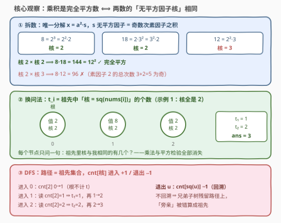
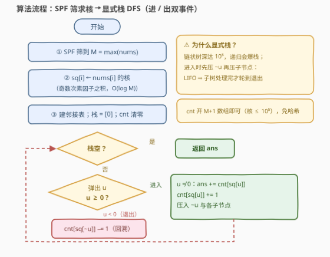

# LeetCode 完全平方数的祖先个数总和 题解

## 1. 题目概述

- **标题 / 题号**：完全平方数的祖先个数总和（#3715，hard）
- **链接**：https://leetcode.cn/problems/sum-of-perfect-square-ancestors/
- **难度**：困难
- **标签**：树、深度优先搜索、数组、哈希表、数学、数论

**题意**：给定一棵以节点 0 为根、含 $n$ 个节点的无向树（由 $n-1$ 条边 `edges` 描述），以及数组 $nums$（$nums[i]$ 为节点 $i$ 上的正整数）。定义 $t_i$ 为节点 $i$ 的**祖先**中满足 $nums[i] \times nums[ancestor]$ 为**完全平方数**的祖先个数。返回 $\sum_{i=1}^{n-1} t_i$。祖先指从 $i$ 到根的路径上除 $i$ 自身之外的所有节点。

**示例 1**：

```text
输入：n = 3, edges = [[0,1],[1,2]], nums = [2,8,2]
输出：3
解释：t₁ = 1（8×2=16 ✓），t₂ = 2（2×8=16 ✓，2×2=4 ✓），总和 3。
```

**示例 2**：

```text
输入：n = 3, edges = [[0,1],[0,2]], nums = [1,2,4]
输出：1
解释：t₁ = 0（2×1=2 ✗），t₂ = 1（4×1=4 ✓），总和 1。
```

**示例 3**：

```text
输入：n = 4, edges = [[0,1],[0,2],[1,3]], nums = [1,2,9,4]
输出：2
解释：t₁ = 0，t₂ = 1（9×1=9 ✓），t₃ = 1（4×1=4 ✓，4×2=8 ✗），总和 2。
```

**约束**：

- $1 \le n \le 10^5$
- $1 \le nums[i] \le 10^5$
- 输入保证 `edges` 构成一棵有效的树

> 💡 **审题关键**：① 祖先**不含自身**，根 0 无祖先、也不计入求和；② 判定对象是**乘积**是否为完全平方数，不是单个数；③ $n$ 与 $nums[i]$ 均达 $10^5$，「逐节点向上逐祖先判定」在链状树下是 $O(n^2)$——必须先把判定条件**代数化**再计数。

## 2. 解题思路

### 2.1 暴力思路：逐节点上溯判定

建树求出父指针后，对每个非根节点 $i$ 沿父指针一路走到根，逐祖先用 $O(1)$ 的平方检验（`isqrt`）判定 $nums[i] \times nums[a]$ 是否完全平方。问题在**深度**：树退化为链时每个节点要上溯 $O(n)$ 步，总计 $O(n^2) \approx 10^{10}$，必然超时。

> 💡 暴力的浪费在于：每个节点**独立重复**地与每个祖先做乘法检验。而「乘积是否为完全平方」其实只取决于两数各自的**核**——核相同的祖先可以**一次性数出来**，根本不必逐个相乘。

### 2.2 核心观察：无平方因子核相同 ⟺ 乘积为完全平方数



**观察一（分解范式）**：任何正整数 $x$ 可唯一写成

$$x = a^2 \cdot s, \qquad s \text{ 无平方因子}$$

$s$ 称为 $x$ 的**无平方因子核**（squarefree kernel），等于 $x$ 的素因子分解中**奇数次**素因子之积。例如 $8 = 2^2 \cdot 2$（核 2）、$18 = 3^2 \cdot 2$（核 2）、$12 = 2^2 \cdot 3$（核 3）。

**观察二（核心引理）**：

$$x \cdot y \text{ 是完全平方数} \iff \mathrm{sf}(x) = \mathrm{sf}(y)$$

- 「$\Leftarrow$」：$x = a^2 s,\ y = b^2 s \Rightarrow xy = (abs)^2$，是完全平方数；
- 「$\Rightarrow$」（证逆否）：若 $s \ne t$，两个无平方因子数必有素数 $p$ 恰整除其一（对称差非空），于是 $p$ 在 $xy$ 中的总次数为**奇数**，$xy$ 不可能是完全平方数。

于是 $t_i$ 被改写为**纯计数问题**：祖先中核等于 $\mathrm{sf}(nums[i])$ 的个数——乘法与平方检验全部消失。

**观察三（DFS + 路径频率表）**：从根出发 DFS，任意时刻**当前路径**上的节点恰是正在访问节点的全体祖先。沿路径维护核的频率表 $\text{cnt}[\cdot]$：

- 进入 $u$：先 $\text{ans} \mathrel{+}= \text{cnt}[\mathrm{sf}(u)]$（此即 $t_u$；根跳过），再 $\text{cnt}[\mathrm{sf}(u)] \mathrel{+}= 1$；
- 退出 $u$：$\text{cnt}[\mathrm{sf}(u)] \mathrel{-}= 1$，**回溯**撤销影响——否则兄弟子树的节点会被误当作祖先（见面试要点 Q2）。

**观察四（核的批量计算）**：$nums[i] \le 10^5$，先做一次**最小素因子筛**（SPF）到 $M = \max(nums)$，随后每个值沿 SPF 除链 $O(\log M)$ 步分解出核。又因核不超过 $M$ 本身，频率表直接开长度 $M+1$ 的数组，连哈希表都省了。

### 2.3 算法流程图



**文字版步骤**：

| 步骤 | 操作 | 说明 |
|------|------|------|
| ① 筛 | SPF 筛到 $M = \max(nums)$ | $O(M \log\log M)$，一次成型 |
| ② 求核 | $\mathrm{sf}(i) \leftarrow nums[i]$ 的奇数次素因子之积 | 沿 SPF 除链，每值 $O(\log M)$ |
| ③ 建图 | 邻接表双向连边；栈初始化 $[0]$，$\text{cnt}$ 清零 | 无向树需记父节点防回头 |
| ④ 主循环 | 弹出 $u$：$u \ge 0$ 为**进入**事件，$u < 0$ 为**退出**事件 | $\sim u$（按位取反）作退出标记 |
| ⑤ 进入 | $u \ne 0$ 则 $\text{ans} \mathrel{+}= \text{cnt}[\mathrm{sf}(u)]$；$\text{cnt}[\mathrm{sf}(u)]{+}{+}$；压入 $\sim u$ 与各子节点 | LIFO 保证子树先于退出事件处理完 |
| ⑥ 退出 | $\text{cnt}[\mathrm{sf}(\sim u)]{-}{-}$ | 回溯 |
| ⑦ 收尾 | 栈空返回 $\text{ans}$ | — |

### 2.4 示例演算

以示例 1（链 $0 \to 1 \to 2$，$nums = [2,8,2]$，核全为 2）走一遍主循环：

| 事件 | 当前路径（祖先集） | cnt[2] | 结算 |
|------|--------------------|--------|------|
| 进入 0 | $\{\} \to \{0\}$ | $0 \to 1$ | 根不计 $t$ |
| 进入 1 | $\{0\}$ | 读 $1$：$t_1 = 1$；再 $1 \to 2$ | ans = 1 |
| 进入 2 | $\{0,1\}$ | 读 $2$：$t_2 = 2$；再 $2 \to 3$ | ans = 3 |
| 退出 2 | $\{0,1\} \to \{0\}$ | $3 \to 2$ | 回溯 |
| 退出 1 | $\{0\} \to \{\}$ | $2 \to 1$ | 回溯 |
| 退出 0 | $\{\}$ | $1 \to 0$ | 回溯 |

最终 $\text{ans} = 3$ ✓。再看示例 2：$nums = [1,2,4]$ 的核依次为 $1, 2, 1$——节点 1 查 $\text{cnt}[2] = 0$、节点 2 查 $\text{cnt}[1] = 1$，答案 1。核把「$4 \times 1$ ✓ 而 $2 \times 1$ ✗」自动区分开：同为「与 1 相乘」，平方数 4 的核是 1（与根相同），非平方数 2 的核是 2（与根不同）。

## 3. 参考代码

### C++

```cpp
class Solution {
  public:
    long long sumOfAncestors(int n, vector<vector<int>>& edges, vector<int>& nums) {
        int M = *max_element(nums.begin(), nums.end());

        // 最小素因子筛：spf[v] 为 v 的最小素因子
        vector<int> spf(M + 1);
        iota(spf.begin(), spf.end(), 0);
        for (int i = 2; 1LL * i * i <= M; ++i)
            if (spf[i] == i)
                for (int j = i * i; j <= M; j += i)
                    if (spf[j] == j) spf[j] = i;

        // sq[i] = nums[i] 的无平方因子核：奇数次素因子之积
        vector<int> sq(n);
        for (int i = 0; i < n; ++i) {
            int v = nums[i], s = 1;
            while (v > 1) {
                int p = spf[v], c = 0;
                while (v % p == 0) v /= p, ++c;
                if (c & 1) s *= p;
            }
            sq[i] = s;
        }

        vector<vector<int>> adj(n);
        for (auto& e : edges) {
            adj[e[0]].push_back(e[1]);
            adj[e[1]].push_back(e[0]);
        }

        // 显式栈 DFS：非负 = 进入事件，~u（负数）= 退出事件
        vector<int> cnt(M + 1), par(n, -1), st = {0};
        long long ans = 0;
        while (!st.empty()) {
            int u = st.back();
            st.pop_back();
            if (u >= 0) {                    // 进入：cnt 恰是祖先们的核频率
                if (u != 0) ans += cnt[sq[u]];
                cnt[sq[u]]++;
                st.push_back(~u);            // 预约退出（回溯）事件
                for (int v : adj[u])
                    if (v != par[u]) {
                        par[v] = u;
                        st.push_back(v);
                    }
            } else {                         // 退出：撤销本节点的影响
                cnt[sq[~u]]--;
            }
        }
        return ans;
    }
};
```

### Python

```python
from math import isqrt

class Solution:
    def sumOfAncestors(self, n: int, edges: List[List[int]], nums: List[int]) -> int:
        M = max(nums)

        # 最小素因子筛：spf[v] 为 v 的最小素因子
        spf = list(range(M + 1))
        for i in range(2, isqrt(M) + 1):
            if spf[i] == i:
                for j in range(i * i, M + 1, i):
                    if spf[j] == j:
                        spf[j] = i

        # sq[i] = nums[i] 的无平方因子核：奇数次素因子之积
        sq = [0] * n
        for i, v in enumerate(nums):
            s = 1
            while v > 1:
                p, c = spf[v], 0
                while v % p == 0:
                    v //= p
                    c += 1
                if c & 1:
                    s *= p
            sq[i] = s

        adj = [[] for _ in range(n)]
        for u, v in edges:
            adj[u].append(v)
            adj[v].append(u)

        # 显式栈 DFS：非负 = 进入事件，~u（负数）= 退出事件
        cnt = [0] * (M + 1)
        par = [-1] * n
        st = [0]
        ans = 0
        while st:
            u = st.pop()
            if u >= 0:                       # 进入：cnt 恰是祖先们的核频率
                if u != 0:
                    ans += cnt[sq[u]]
                cnt[sq[u]] += 1
                st.append(~u)                # 预约退出（回溯）事件
                for v in adj[u]:
                    if v != par[u]:
                        par[v] = u
                        st.append(v)
            else:                            # 退出：撤销本节点的影响
                cnt[sq[~u]] -= 1
        return ans
```

> 💡 **写法要点**：
> - 答案上限为 $\binom{n}{2} \approx 5 \times 10^9$，**必须 64 位**（C++ `long long`；Python 天然安全）。
> - 退出标记用 $\sim u$（按位取反）：$u \ge 0 \iff \sim u < 0$，不用额外维护第二个栈或状态位。
> - `cnt` 的查询必须发生在**自增之前**——自己不是自己的祖先。
> - 若值大量重复，可先对 `nums` 去重、按值缓存核，分解次数更少。

## 4. 复杂度分析

| 维度 | 复杂度 | 说明 |
|------|--------|------|
| **时间复杂度** | $O(M \log\log M + n \log M)$ | SPF 筛 $O(M\log\log M)$；每值沿除链分解 $O(\log M)$（素因子个数上界）；DFS 每节点进出各一次 |
| **空间复杂度** | $O(M + n)$ | `spf` 与 `cnt` 各 $O(M)$；邻接表、父数组与栈 $O(n)$ |

其中 $M = \max(nums) \le 10^5$，总体近似线性。

## 5. 扩展：「规范形计数」家族与变体

- **值域放大**：若 $nums[i] \le 10^9$，SPF 筛开不下——改为对**去重后**的值逐个试除到 $\sqrt{v}$（单值 $O(\sqrt v)$，去重后规模通常可控），频率表退化为哈希表；再大就需要 Pollard-Rho。
- **规范形思想**：本题把「$xy$ 是完全平方数」压缩成「核相等」，与 [1814](../1801-1900/1814_统计一个数组中好对子的数目.md)（规范形 $x - \mathrm{rev}(x)$）、[2001](../2001-2100/2001_可互换矩形的数对.md)（最简分数）、[2183](../2101-2200/2183_统计可以被K整除的下标对数目.md)（$\gcd$ 类）一脉相承——**把配对条件化成等值类，再用计数器统计**。
- **变体**：若改问「乘积**不是**完全平方数的祖先对数」，答案为 $\sum_i \mathrm{depth}(i) - t_i$（祖先总数减命中数），主体流程不变。

## 6. 面试要点

**Q1：为什么「乘积是完全平方数」等价于「无平方因子核相同」？**

> 写 $x = a^2 s$、$y = b^2 t$（$s, t$ 无平方因子）。若 $s = t$，则 $xy = (abs)^2$ 是完全平方数；反之若 $s \ne t$，因 $s, t$ 均无平方因子，必有素数 $p$ 恰整除其一，于是 $p$ 在 $xy$ 中的总次数为奇数，$xy$ 不是完全平方数。

**Q2：退出时不做 $\text{cnt}{-}{-}$ 回溯，会错在哪？**

> 反例：`edges = [[0,1],[0,2]]`，`nums = [1,8,2]`，正确答案 0（$1 \times 8$、$1 \times 2$ 都不是完全平方数）。不回溯时，处理完子树 $\{1\}$ 后 $\text{cnt}[2]$ 仍残留 1，访问兄弟节点 2 时 $t_2$ 被错算成 1——把**兄弟**当成了**祖先**（且 $8 \times 2 = 16$ 恰是完全平方数，错误更隐蔽）。

**Q3：为什么用显式栈而不用递归？**

> $n \le 10^5$，树退化成链时递归深度达 $10^5$，Python 默认递归上限（1000）直接爆栈，C++ 也可能栈溢出。「进/出双事件」（进入时压 $\sim u$ 作退出标记、再压子节点）是手写回溯的标准姿势——LIFO 保证整棵子树处理完才轮到退出事件。

**Q4：求核为什么用 SPF 筛，而不是对每个值试除到 $\sqrt v$？**

> 逐值试除每次 $O(\sqrt v) \approx 316$，$10^5$ 个值最坏 $3 \times 10^7$ 次除法，Python 下偏慢；SPF 筛 $O(M \log \log M)$ 一次成型，之后每个值沿最小素因子除链只需 $O(\log v)$ 步。配合按值去重缓存，实际更快。

**Q5：频率表为什么能用数组而不用哈希表？**

> 核是 $nums[i]$ 的素因子之积，不超过 $nums[i] \le 10^5$，值域可控——开长度 $M+1$ 的数组即 $O(M)$，查询 $O(1)$ 且无哈希开销。若值域升到 $10^9$（见第 5 节），就得换哈希表。

## 同类练习题

| # | 题目 | 与本题的关联 |
|---|------|-------------|
| 1026 | [节点与其祖先之间的最大差值](https://leetcode.cn/problems/maximum-difference-between-node-and-ancestor/)（[题解](../1001-1100/1026_节点与其祖先之间的最大差值.md)） | DFS 沿路径携带祖先状态（min/max）并回溯——把「祖先集合」变成 $O(1)$ 可查询状态的同款套路，本题携带的是核频率表 |
| 1814 | [统计一个数组中好对子的数目](https://leetcode.cn/problems/count-nice-pairs-in-an-array/)（[题解](../1801-1900/1814_统计一个数组中好对子的数目.md)） | 先化规范形（$x - \mathrm{rev}(x)$）再哈希计数——「配对条件 ⟺ 规范形相同」的数组版 |
| 2001 | [可互换矩形的数对](https://leetcode.cn/problems/number-of-pairs-of-interchangeable-rectangles/)（[题解](../2001-2100/2001_可互换矩形的数对.md)） | 宽高比约分成最简分数后计数配对——分数版规范形 |
| 2183 | [统计可以被 K 整除的下标对数目](https://leetcode.cn/problems/count-array-pairs-divisible-by-k/)（[题解](../2101-2200/2183_统计可以被K整除的下标对数目.md)） | 按 $\gcd$ 规范形计数 + 枚举补因子——数论计数近亲 |
| 367 | [有效的完全平方数](https://leetcode.cn/problems/valid-perfect-square/)（[题解](../0301-0400/367_有效的完全平方数.md)） | 单个完全平方数的判定——本题判定条件的基础件 |
