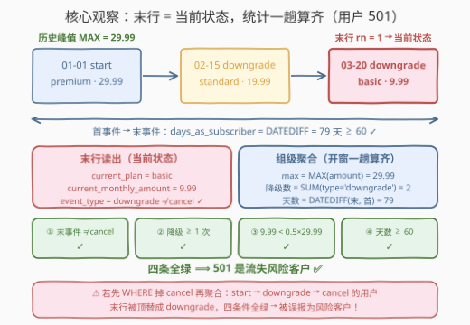
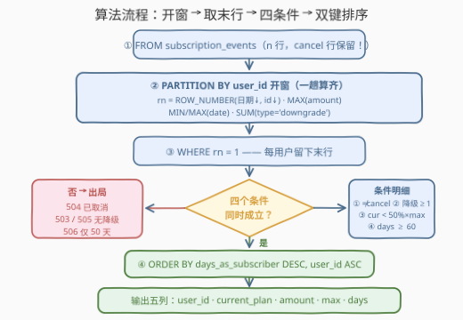

# LeetCode 寻找流失风险客户 题解

## 1. 题目概述

- **标题 / 题号**：寻找流失风险客户（#3716，medium）
- **链接**：https://leetcode.cn/problems/find-churn-risk-customers/
- **难度**：中等
- **标签**：数据库、SQL、窗口函数、组内末行（`ROW_NUMBER`）、条件聚合、`DATEDIFF` 日期差

**表结构**：`subscription_events`

| 列名 | 类型 |
|------|------|
| event_id | int |
| user_id | int |
| event_date | date |
| event_type | varchar |
| plan_name | varchar |
| monthly_amount | decimal |

- `event_id` 是这张表的主键。
- `event_type` 取值为 `start`、`upgrade`、`downgrade` 或 `cancel`。
- `plan_name` 取值为 `basic`、`standard`、`premium`，或 **NULL**（当 `event_type` 为 `cancel` 时）。
- `monthly_amount` 表示**此次事件后**的月度订阅费用；`cancel` 事件的 `monthly_amount` 为 0。

**目标**：找出**流失风险客户**——同时满足以下**全部四个条件**的用户：

1. 订阅**当前有效**（最后一件事件**不是** `cancel`）；
2. 历史中**至少有过一次** `downgrade`；
3. **当前订阅费用低于历史最高订阅费用的 50%**（严格小于）；
4. 已订阅**至少 60 天**（按首个事件日期到最后事件日期计算）。

**输出**五列 `user_id, current_plan, current_monthly_amount, max_historical_amount, days_as_subscriber`，按 `days_as_subscriber` **降序**、再按 `user_id` **升序**排序。

**示例**：

```text
输入：subscription_events 表
+----------+---------+------------+------------+-----------+----------------+
| event_id | user_id | event_date | event_type | plan_name | monthly_amount |
+----------+---------+------------+------------+-----------+----------------+
| 1        | 501     | 2024-01-01 | start      | premium   | 29.99          |
| 2        | 501     | 2024-02-15 | downgrade  | standard  | 19.99          |
| 3        | 501     | 2024-03-20 | downgrade  | basic     | 9.99           |
| 4        | 502     | 2024-01-05 | start      | standard  | 19.99          |
| 5        | 502     | 2024-02-10 | upgrade    | premium   | 29.99          |
| 6        | 502     | 2024-03-15 | downgrade  | basic     | 9.99           |
| 7        | 503     | 2024-01-10 | start      | basic     | 9.99           |
| 8        | 503     | 2024-02-20 | upgrade    | standard  | 19.99          |
| 9        | 503     | 2024-03-25 | upgrade    | premium   | 29.99          |
| 10       | 504     | 2024-01-15 | start      | premium   | 29.99          |
| 11       | 504     | 2024-03-01 | downgrade  | standard  | 19.99          |
| 12       | 504     | 2024-03-30 | cancel     | NULL      | 0.00           |
| 13       | 505     | 2024-02-01 | start      | basic     | 9.99           |
| 14       | 505     | 2024-02-28 | upgrade    | standard  | 19.99          |
| 15       | 506     | 2024-01-20 | start      | premium   | 29.99          |
| 16       | 506     | 2024-03-10 | downgrade  | basic     | 9.99           |
+----------+---------+------------+------------+-----------+----------------+

输出：
+---------+--------------+------------------------+-----------------------+--------------------+
| user_id | current_plan | current_monthly_amount | max_historical_amount | days_as_subscriber |
+---------+--------------+------------------------+-----------------------+--------------------+
| 501     | basic        | 9.99                   | 29.99                 | 79                 |
| 502     | basic        | 9.99                   | 29.99                 | 70                 |
+---------+--------------+------------------------+-----------------------+--------------------+
```

> 💡 **审题关键**：
> ① 「当前状态」＝按 `event_date` 排序的**组内最后一行**——`current_plan`、`current_monthly_amount`、「是否 cancel」三个量全部从这一行读出；
> ② 「历史峰值」＝组内 `MAX(monthly_amount)`——`cancel` 行的 0 永远当不了峰值，天然不干扰；
> ③ `days_as_subscriber` ＝ `DATEDIFF(末事件日期, 首事件日期)`，「至少 60 天」即 `≥ 60`；
> ④ 「低于 50%」是**严格小于**：`current < 0.5 × max`（示例中 9.99 < 14.995 成立）；
> ⑤ 同一用户**同日多事件**时，须用 `event_id` 决出真正的「最后一行」，否则末行不唯一。

## 2. 解题思路

### 2.1 暴力思路：逐条件各写一个子查询？

最直接的写法是每个条件各配一个子查询：相关子查询 `ORDER BY event_date DESC LIMIT 1` 取末行、`GROUP BY` 算降级次数、再来一个 `GROUP BY` 算峰值、第四个算首末日期差——同一张表反反复复扫四遍，相关子查询更是退化到 $O(n^2)$。正确性能保证，但四个条件的**载体其实是同一批用户级统计量**，天然共享一次分组。

另一个直觉歧途是**先过滤再聚合**：`WHERE event_type <> 'cancel'` 先把取消行踢掉再分组——这会直接破坏「末行判定」：一个 `start premium → downgrade basic → cancel` 的用户，踢掉 cancel 行后末行变成 `downgrade basic 9.99`，四个条件全部绿灯，**被误报为流失风险客户**。教训：`cancel` 行不是垃圾行，它是「末事件」判定的参与方；**过滤发生在用户级、且必须排在末行判定之后**。

### 2.2 核心观察：组内末行 + 一趟窗口聚合



**观察一：五个输出量与四个条件，全部由「组级聚合 + 组内末行」两部分构成。**

| 类别 | 量 | 来源 |
|------|-----|------|
| 组级聚合 | `max_historical_amount` | `MAX(monthly_amount)` |
| 组级聚合 | `days_as_subscriber` | `DATEDIFF(MAX(event_date), MIN(event_date))` |
| 组级聚合 | 降级次数 | `SUM(event_type = 'downgrade')` |
| 组内末行 | `current_plan` / `current_monthly_amount` | 末行的 `plan_name` / `monthly_amount` |
| 组内末行 | 「是否 cancel」 | 末行的 `event_type` |

**观察二：「组内末行」是经典模式，`ROW_NUMBER` 一行搞定。**

```sql
ROW_NUMBER() OVER (PARTITION BY user_id
                   ORDER BY event_date DESC, event_id DESC) AS rn
```

排序键写成 `(event_date, event_id)` 的**双键倒序**，保证同日多事件时也能决出唯一的末行（`rn = 1`）。这正是「每组第 k 行」模式的 k=1 特例——与 1369「组内第 2 新」是同一招。

**观察三：窗口函数不塌缩行，恰好让「组级统计」与「末行序号」同层产出。**

`GROUP BY` 会把每组折叠成一行，末行的 `plan_name` 便无处安放，只能再 `JOIN` 回原表；而窗口函数（`MAX(...) OVER w` 等）**保留全部行**，把组级统计广播到每行上，再与 `ROW_NUMBER` 并肩计算。于是 `rn = 1` 落在哪一行，哪一行就同时携带「当前状态 + 该用户的完整统计」——一次扫描，全部信息就位。

> 💡 一句话：**`PARTITION BY user_id` 开窗 → `ROW_NUMBER` 定末行 + `MAX/MIN/SUM` 出统计 → `rn = 1` 后套四个条件 → 双键排序收尾。**

### 2.3 算法流程图



**逻辑执行步骤**：

| 步骤 | 操作 | 说明 |
|------|------|------|
| ① FROM | 读入 `subscription_events` 全部 n 行 | **cancel 行保留**——末行判定需要它 |
| ② 开窗 | `PARTITION BY user_id` 计算 4 个窗口量 | `ROW_NUMBER`（双键倒序）+ `MAX(amount)` + `MIN/MAX(date)` + `SUM(=downgrade)` |
| ③ 取末行 | `WHERE rn = 1` | 每用户恰剩一行，同时携带组级统计 |
| ④ 用户级过滤 | 四条件 `AND` | 末事件 ≠ cancel ∧ 降级 ≥ 1 ∧ current < 0.5×max ∧ days ≥ 60 |
| ⑤ ORDER BY | `days_as_subscriber DESC, user_id ASC` | 双键混合方向，第二键防并列乱序 |

> ⚠️ 条件 ④ 必须在派生表**外层**做：`rn`、`days_as_subscriber` 都是 SELECT 清单里的表达式，标准 SQL 的 `WHERE` 无法引用同层别名；要么包一层派生表（本篇做法），要么全部搬进 `HAVING` 原样重写。

### 2.4 示例演算

对示例中 6 个用户逐一执行「末行 → 四条件」：

| user | 末事件 | ≠cancel | 降级数 | current / max | < 50%×max | days | 判定 |
|------|--------|:--:|:--:|------|:--:|:--:|------|
| 501 | 03-20 downgrade basic 9.99 | ✓ | 2 | 9.99 / 29.99 | 9.99 < 14.995 ✓ | 79 ✓ | ✅ 风险 |
| 502 | 03-15 downgrade basic 9.99 | ✓ | 1 | 9.99 / 29.99 | ✓ | 70 ✓ | ✅ 风险 |
| 503 | 03-25 upgrade premium 29.99 | ✓ | **0** | — | — | — | ❌ 无降级 |
| 504 | 03-30 cancel | **✗** | — | — | — | — | ❌ 已取消 |
| 505 | 02-28 upgrade standard 19.99 | ✓ | **0** | — | — | — | ❌ 无降级 |
| 506 | 03-10 downgrade basic 9.99 | ✓ | 1 | 9.99 / 29.99 | ✓ | **50 < 60** | ❌ 时长不足 |

天数核算（2024 为闰年，二月 29 天）：501 从 01-01 到 03-20 为 $30 + 29 + 20 = 79$ 天；502 从 01-05 到 03-15 为 $26 + 29 + 15 = 70$ 天；506 从 01-20 到 03-10 仅 $11 + 29 + 10 = 50$ 天，倒在最后一关。

两个合格用户按 `days` 降序：79 > 70 → 输出 `501, 502`，与官方一致 ✓。注意 503/505（无降级）与 506（时长不足）告负的原因**各不相同**——四个条件彼此独立、缺一不可；506 前三关全过，恰恰说明「看起来马上要流失」的用户仍可能因订阅太短而不计。

## 3. 参考代码

### MySQL（解法 A：窗口函数一趟算齐，推荐）

```sql
# Write your MySQL query statement below
SELECT user_id,
       current_plan,
       current_monthly_amount,
       max_historical_amount,
       days_as_subscriber
FROM (
    SELECT user_id,
           plan_name                  AS current_plan,
           monthly_amount             AS current_monthly_amount,
           event_type,
           MAX(monthly_amount) OVER w AS max_historical_amount,
           DATEDIFF(MAX(event_date) OVER w, MIN(event_date) OVER w)
                                      AS days_as_subscriber,
           SUM(event_type = 'downgrade') OVER w AS downgrade_cnt,
           ROW_NUMBER() OVER (PARTITION BY user_id
                              ORDER BY event_date DESC, event_id DESC) AS rn
    FROM subscription_events
    WINDOW w AS (PARTITION BY user_id)
) t
WHERE rn = 1
  AND event_type <> 'cancel'
  AND downgrade_cnt >= 1
  AND current_monthly_amount < 0.5 * max_historical_amount
  AND days_as_subscriber >= 60
ORDER BY days_as_subscriber DESC, user_id;
```

> 💡 **写法要点**：
> - `WINDOW w AS (PARTITION BY user_id)` 给共享分区命名，四个窗口函数不必各自重复 `PARTITION BY`；
> - `ROW_NUMBER` 的排序键是 `(event_date, event_id)` 双键倒序——同日多事件时末行依然唯一（见 5 节讨论）；
> - `SUM(event_type = 'downgrade')` 是 MySQL 的布尔求和（条件聚合），跨库请换 `SUM(CASE WHEN ... THEN 1 ELSE 0 END)`；
> - 外层 `WHERE` 里的 `event_type` 是 `rn = 1` 那行（末行）的类型，条件 ① 的判定由此而来；
> - 50% 用严格 `<`：9.99 < 0.5 × 29.99 = 14.995 ✓。

### MySQL（解法 B：`GROUP BY` + 反连接取末行，兼容无窗口函数的老版本）

```sql
# Write your MySQL query statement below
SELECT cur.user_id,
       cur.plan_name      AS current_plan,
       cur.monthly_amount AS current_monthly_amount,
       st.max_historical_amount,
       DATEDIFF(st.last_date, st.first_date) AS days_as_subscriber
FROM (
    SELECT user_id,
           MAX(monthly_amount)           AS max_historical_amount,
           MIN(event_date)               AS first_date,
           MAX(event_date)               AS last_date,
           SUM(event_type = 'downgrade') AS downgrade_cnt
    FROM subscription_events
    GROUP BY user_id
) st
JOIN subscription_events cur
  ON cur.user_id = st.user_id
 AND NOT EXISTS (
        SELECT 1
        FROM subscription_events e2
        WHERE e2.user_id = cur.user_id
          AND (e2.event_date > cur.event_date
               OR (e2.event_date = cur.event_date
                   AND e2.event_id > cur.event_id))
     )
WHERE cur.event_type <> 'cancel'
  AND st.downgrade_cnt >= 1
  AND cur.monthly_amount < 0.5 * st.max_historical_amount
  AND DATEDIFF(st.last_date, st.first_date) >= 60
ORDER BY days_as_subscriber DESC, cur.user_id;
```

> 💡 **A vs B**：B 的灵魂是 `NOT EXISTS` **反连接**取末行——「不存在同组中 `(date, id)` 更大的行」⟺「该行就是组内末行」。可读、可移植（MySQL 5.x 也能跑），但表要访问多遍；A 把统计与序号在一次开窗中算齐，代码量与扫描次数双减，是首选。

### Pandas

```python
import pandas as pd

def find_churn_risk_customers(subscription_events: pd.DataFrame) -> pd.DataFrame:
    df = subscription_events.copy()
    df['event_date'] = pd.to_datetime(df['event_date'])
    df = df.sort_values(['user_id', 'event_date', 'event_id'])

    cur = df.groupby('user_id', as_index=False).tail(1).rename(
        columns={'event_type': 'cur_type',
                 'plan_name': 'current_plan',
                 'monthly_amount': 'current_monthly_amount'})

    df['is_downgrade'] = df['event_type'] == 'downgrade'
    st = df.groupby('user_id', as_index=False).agg(
        max_historical_amount=('monthly_amount', 'max'),
        first_date=('event_date', 'min'),
        last_date=('event_date', 'max'),
        downgrade_cnt=('is_downgrade', 'sum'))
    st['days_as_subscriber'] = (st['last_date'] - st['first_date']).dt.days

    m = cur.merge(st, on='user_id')
    mask = ((m['cur_type'] != 'cancel')
            & (m['downgrade_cnt'] >= 1)
            & (m['current_monthly_amount'] < 0.5 * m['max_historical_amount'])
            & (m['days_as_subscriber'] >= 60))

    ans = m.loc[mask, ['user_id', 'current_plan', 'current_monthly_amount',
                       'max_historical_amount', 'days_as_subscriber']]
    return ans.sort_values(['days_as_subscriber', 'user_id'],
                           ascending=[False, True]).reset_index(drop=True)
```

> 💡 **写法要点**：
> - 取末行用 `groupby(...).tail(1)` 而不是 `.last()`——`last()` 会**跳过 NaN**：cancel 行的 `plan_name` 为 NULL 时会静默取到前一行的计划，语义漂移；`tail(1)` 只认位置；
> - 排序键 `['user_id', 'event_date', 'event_id']` 与 SQL 版的双键破平规则对齐；
> - `(last - first).dt.days` 与 MySQL `DATEDIFF` 同义（只差天数，2024-01-01 → 2024-03-20 = 79）；
> - 布尔列 `is_downgrade` 先落地再 `'sum'`，与 `SUM(条件)` 条件聚合一一对应。

## 4. 复杂度分析

| 维度 | 复杂度 | 说明 |
|------|--------|------|
| **时间复杂度** | $O(n \log n)$ | 解法 A 由分区排序主导（每用户事件数小时近似 $O(n \log m)$，m 为用户数）；解法 B 的 `GROUP BY` 为 $O(n)$，反连接视索引实现为 $O(n \log n)$ |
| **空间复杂度** | $O(n)$ | 解法 A 派生表物化全部 n 行（窗口统计广播在行上）；解法 B 仅物化 m 行统计 + 每用户一行末行 |

> - 最终 `ORDER BY` 只对**通过过滤的少量行**排序，$O(k \log k)$，k 为风险客户数；
> - 对比暴力「四条件四子查询」：表扫描次数 ×4 之外，相关子查询还可能退化到 $O(n^2)$——本题的核心收益不在复杂度阶，而在**一次开窗把全部信息算齐**的组织方式。

## 5. 扩展：组内「第 k 行」的四种武器与边界口径

**取组内第 k 行（本题 k=1，按时间倒序）的四种写法：**

| 写法 | 版本要求 | 一句话点评 |
|------|---------|-----------|
| `ROW_NUMBER() OVER (...) = k` | MySQL 8+ / PG / SQL Server | 通用首选；双键排序保证唯一 |
| `NOT EXISTS` 反连接 | 全版本 | 老库救命稻草；写法见解法 B |
| `GROUP_CONCAT + SUBSTRING_INDEX` | MySQL 5.x 方言 | `SUBSTRING_INDEX(GROUP_CONCAT(plan_name ORDER BY event_date DESC, event_id DESC), ',', 1)` 取「字典序最大」的列值，只能取列、不能取整行 |
| 相关子查询 `LIMIT 1` | 全版本 | 书写最直白、性能最差，$O(n^2)$ |

**两个边界口径：**

- **同日多事件**：本题排序键 `(event_date, event_id)` 中的 `event_id` 是主键、天然互异，保证末行唯一。若不写第二键，同日多行会**全部**满足 `rn` 判定吗？`ROW_NUMBER` 依然只给一行标 1，但标给谁取决于引擎的排序稳定性——结果不可复现，属于隐性 bug；反连接版则会让同日多行**全部幸存**，错误立现。
- **50% 的边界**：题面「低于 50%」译为严格 `<`。若某用例恰好 `current = 0.5 × max`（如 19.99 vs 峰值 39.98），本题口径应判出局；若判题器口径相反（`≤`），把 `<` 换成 `<=` 即可，只差一个字符。写成 `current < 0.5 * max` 比 `2 * current < max` 更贴题面，两者在 decimal 运算下等价且都无精度问题。

**`DATEDIFF` 跨库对照：**

| 数据库 | 写法 | 注意 |
|--------|------|------|
| MySQL | `DATEDIFF(a, b)` | a − b 的天数，参数顺序「后 − 前」 |
| PostgreSQL | `a - b` | 日期相减直接得 `interval`，取 `.days` 或 `<integer>` |
| SQL Server | `DATEDIFF(day, b, a)` | 参数顺序相反：先单位、再「前, 后」 |

## 6. 面试要点

**Q1：为什么不能先 `WHERE event_type <> 'cancel'` 再聚合？**

> 「最后事件是否 cancel」是**末行**的属性，过滤发生在末行判定之前会直接改变末行。反例：`start premium 29.99 → downgrade basic 9.99 → cancel` 的用户，预滤后末行变成 `downgrade basic 9.99`——四条件全绿，被**误报**为流失风险客户。正确顺序是：先定末行（`rn = 1`），再读末行的 `event_type` 做用户级过滤。

**Q2：取「每组最后一行」，`ROW_NUMBER`、`RANK`、`DENSE_RANK` 选哪个？**

> 要「每组恰好一行」就选 `ROW_NUMBER`——`RANK`/`DENSE_RANK` 在排序键并列时会输出多行同秩。本题排序键是 `(event_date DESC, event_id DESC)`，`event_id` 是主键、互异，任何情况下末行唯一；但若只按 `event_date` 排序，同日多事件时 `ROW_NUMBER` 标 1 给谁是引擎实现细节（不稳定排序），结果不可复现——第二排序键是**必须**的。

**Q3：窗口函数与 `GROUP BY` 的本质区别是什么？本题为什么窗口更顺手？**

> `GROUP BY` **塌缩**：每组输出一行，无法再携带「组内某一行」的明细列（如末行的 `plan_name`），要取就得 `JOIN` 回原表；窗口函数**保留行数**：把组级统计（`MAX/MIN/SUM ... OVER`）广播到每行上。本题恰好同时需要「组级统计 + 末行明细」，`ROW_NUMBER` 与聚合窗口并肩一次算齐，是窗口函数的教科书场景（解法 B 则展示了 `GROUP BY + 反连接`的等价拼装）。

**Q4：`NOT EXISTS` 反连接为什么能取到组内末行？**

> 末行的定义是「同组中不存在 `(event_date, event_id)` 字典序更大的行」。反连接把「存在更晚行」的行全部排除，幸存者恰好是每组字典序最大的一行。它等价于 `LEFT JOIN ... ON 更晚的行 WHERE 右表 IS NULL`。注意连接条件里**日期相等时必须再比 `event_id`**——只比日期的话，同日多行会全部幸存。

**Q5：`cancel` 行的 `monthly_amount = 0` 与 `plan_name = NULL`，对聚合有什么影响？**

> 几乎没有，但要知道为什么：`MAX` 不忽略 0 但 0 永远当不了峰值（用户必有正金额的 `start`），`NULL` 会被 `SUM/MAX/AVG` 跳过但本题从不对 cancel 行做需要 `plan_name` 的聚合——末行是 cancel 的用户在条件 ① 就出局了。真正要警惕的是 Pandas 的 `.last()`：它跳过 NaN，cancel 行的 `plan_name` 为 NULL 时会取到前一行的计划——这就是参考代码用 `tail(1)` 的原因。

> 💡 **一句话总结**：3716 = 组内末行模式 + 用户级多条件过滤。带走三件事：末行判定先于 cancel 过滤、`ROW_NUMBER` 双键排序保唯一、窗口函数让「组级统计」与「末行明细」一趟算齐。

## 同类练习题

| # | 题目 | 与本题的关联 |
|---|------|-------------|
| 1890 | [2020年最后一次登录](https://leetcode.cn/problems/the-latest-login-in-2020/)（[题解](../1801-1900/1890_2020年最后一次登录.md)） | 组内最新事件的入门版——只要 `MAX(time_in)`，不涉及末行其他列，感受「末行仅需日期」与「末行携带明细」的差距 |
| 1369 | [获取最近第二次的活动 🔒](https://leetcode.cn/problems/get-the-second-most-recent-activity/)（[题解](../1301-1400/1369_获取最近第二次的活动.md)） | `ROW_NUMBER` 取组内**第 k 新**的直接进阶——本题末行是它的 k=1 特例，且同样要处理「行数不足」的用户 |
| 511 | [游戏玩法分析 I](https://leetcode.cn/problems/game-play-analysis-i/)（[题解](../0501-0600/511_游戏玩法分析I.md)） | 组内**首**行 + 附带设备列——与本题的末行互为镜像，`MIN(event_date)` + 关联取明细 |
| 550 | [游戏玩法分析 IV](https://leetcode.cn/problems/game-play-analysis-iv/)（[题解](../0501-0600/550_游戏玩法分析IV.md)） | 日期差条件的祖师爷——`DATEDIFF = 1` 的次日留存，本题 `≥ 60` 天的同款考点 |
| 1174 | [即时食物配送 II](https://leetcode.cn/problems/immediate-food-delivery-ii/)（[题解](../1101-1200/1174_即时食物配送II.md)） | 组内首行日期 + 用户级比率统计的组合拳——「首次」与「立即」两个口径的拆分方式可平移到任何事件流分析 |
