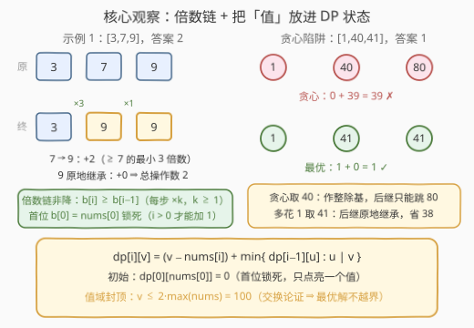
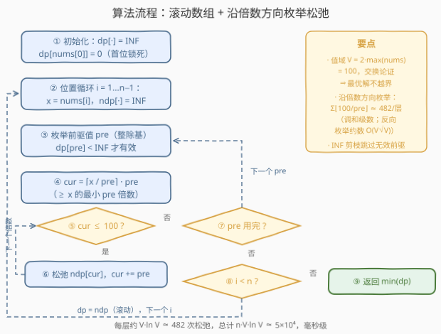

# LeetCode 使数组变美的最小操作次数 题解

## 1. 题目概述

- **标题 / 题号**：使数组变美的最小操作次数（#3717，medium）
- **链接**：https://leetcode.cn/problems/minimum-operations-to-make-the-array-beautiful/
- **难度**：中等
- **标签**：数组、动态规划

> ⚠️ 本题为 LeetCode 付费题，题意描述根据官方示例用例与 hints 重建，可能与官方题面有出入。

**题意**：给定一个整数数组 `nums`。

如果对于每个索引 $i > 0$，`nums[i]` 的值都能被 `nums[i-1]` **整除**，则该数组称为**美丽**数组。

在一次操作中，你可以给任何元素 `nums[i]`（其中 $i > 0$）**增加** $1$。

返回使数组变美的**最小操作数**。

**示例 1**：

```text
输入：nums = [3,7,9]
输出：2
解释：在 nums[1] 上进行两次操作使数组变美：[3,9,9]
（9 能被 3 整除，9 能被 9 整除）
```

**示例 2**：

```text
输入：nums = [1,1,1]
输出：0
解释：给定数组已经是美丽的。
```

**示例 3**：

```text
输入：nums = [4]
输出：0
解释：这个数组只有一个元素，没有 i > 0，天然美丽。
```

**约束**：

- $1 \le nums.length \le 100$
- $1 \le nums[i] \le 50$

> 💡 **审题关键**：① 操作只能打在 $i > 0$ 上 ⇒ 终态首位 $b[0] = nums[0]$ **锁死**，它是整条整除链的「根」；② 「能被整除」翻译过来就是：$b[i]$ 必须是 $b[i-1]$ 的**正整数倍** ⇒ 合法终态是一条**倍数链**，且倍数 $\ge 1$ 意味着链**非降**；③ $n \le 100$、$nums[i] \le 50$，值域小得可爱 ⇒ 允许把「值」直接放进 DP 状态维度，$O(n \cdot V^2)$ 级别的做法稳过。

## 2. 解题思路

### 2.1 暴力思路：贪心为什么翻车

最直观的尝试是**逐位贪心**：从左到右，每个位置取「$\ge nums[i]$ 的、前一个值的**最小**倍数」。每步成本最低，看似最优——直到撞上这个反例：

```text
nums = [1, 40, 41]
贪心：b = [1, 40, 80]   →  80 是 40 的倍数，成本 0 + 39 = 39
最优：b = [1, 41, 41]   →  41 是 1 的倍数、41 是 41 的倍数，成本 1 + 0 = 1
```

贪心在第 1 位省了 $1$，却让「整除基」从 41 的温床滑到 40 的悬崖——第 2 位被迫从 41 直接跳到 $80$。**值的身份是双重的**：它既承载当前成本（$v - nums[i]$），又是后续所有位置的**除数基**。整除结构把前后位置全局耦合，局部最优 ≠ 全局最优，必须 DP。

至于纯暴力：每个位置的候选值无上界，组合空间无穷大。DP 化之前必须先回答两个问题——**值域多大才够**（2.2 观察二）、**状态怎么设计**（2.2 观察三）。

### 2.2 核心观察：倍数链 + 把「值」放进状态



**观察一：合法终态是一条从锁死首位出发的倍数链。** $b[i] \bmod b[i-1] = 0$ ⟺ $b[i] = k \cdot b[i-1]$（$k \ge 1$）。每一步要么「原地继承」（$k=1$），要么「翻上倍」（$k \ge 2$）。由此立刻得到一个重要副产品：**链非降**，$b[i] \ge b[i-1]$。

**观察二：值域上界 $100 = 2 \times \max(nums)$。** 候选值看似无上界，其实可证最优解的每个值都不必超过 $2 \times \max(nums)$：

> 反证。设最优解 $b$ 中存在超过 $100$ 的值，取**第一个**越界的下标 $i$（$b[i] \ge 101$，而 $b[i-1] \le 100$，注意 $b[0] \le 50$ 保证 $i \ge 1$）。构造新解 $c$：$c[j] = b[j]$（$j < i$）；$c[j] = w$（$j \ge i$），其中 $w$ 是 $b[i-1]$ 的、$\ge 51$ 的最小倍数。则 $w \le 100$：若 $b[i-1] \ge 51$ 则 $w = b[i-1]$；若 $b[i-1] \le 50$ 则 $w \le 51 + b[i-1] - 1 \le 100$。合法性：$b[i-1] \mid w$ 且后面全是 $w$（1 倍）；$w \ge 51 > 50 \ge nums[j]$。成本：$j \ge i$ 处 $c$ 的成本 $\le 100 - nums[j]$，而 $b$ 的成本 $\ge b[i] - nums[j] \ge 101 - nums[j]$——每个后缀位置都严格更省，与 $b$ 最优矛盾。∎

于是候选值只需在 $[nums[i],\ 100]$ 里考虑。$V = 100$ 是个小常数，DP 变得可行。（实验侧证：把上界放宽到 $4000$ 重跑随机对拍，答案与 $V=100$ 完全一致。）

**观察三：状态必须记「精确值」。** 定义

$$dp[i][v] = \text{让位置 } i \text{ 恰好等于 } v \text{ 且前 } i+1 \text{ 位构成合法倍数链的最小总增量}$$

- **初始**：$dp[0][nums[0]] = 0$——首元素锁死，只有这一个值被点亮；
- **转移**：对 $v \in [nums[i],\ 100]$，

$$dp[i][v] = (v - nums[i]) + \min\left\{ dp[i-1][u] : u \mid v \right\}$$

  即前驱值 $u$ 必须整除 $v$（沿着倍数链「生成方向」枚举，见 2.3）；
- **答案**：$\min_v dp[n-1][v]$。

这正是官方 hints 的口径：`dp[i][val]` 是让位置 $i$ 等于 `val` 的最小增量数，再「小心地」把第 $i$ 位与第 $i-1$ 位的状态合并——所谓小心，就是合并时**必须检查整除关系** $u \mid v$，不能像普通序列 DP 那样取个全局最小完事。

> 💡 一句话：**合法终态 = 首位锁死的非降倍数链；值域封顶 $2\max = 100$；状态记精确值 $dp[i][v]$，转移沿「$u$ 的倍数」枚举。**

### 2.3 算法流程图



**逻辑执行步骤**：

| 步骤 | 操作 | 说明 |
|------|------|------|
| ① 初始化 | `dp[·] = INF`，`dp[nums[0]] = 0` | 首元素锁死，只点亮一个值 |
| ② 位置循环 | $i = 1 \dots n-1$，记 $x = nums[i]$，`ndp[·] = INF` | 滚动数组，`ndp` 承接下一层 |
| ③ 枚举前驱值 | 遍历 `pre`，`dp[pre] < INF` 才有效 | 无效值直接跳过 |
| ④ 枚举倍数 | `cur` 从 $\lceil x / pre \rceil \cdot pre$ 开始、步长 `pre`，到 $\le 100$ 为止 | 只碰既是 `pre` 倍数又 $\ge x$ 的候选 |
| ⑤ 松弛 | `ndp[cur] = min(ndp[cur], dp[pre] + cur - x)` | `cur - x` 是本位增量 |
| ⑥ 滚动 | `dp = move(ndp)` | 进入下一位置 |
| ⑦ 收答案 | $\min_{v \ge 1} dp[v]$ | $n = 1$ 时循环不执行，直接返回 0 |

> ⚠️ 转移要**顺着生成方向枚举**：从 `pre` 出发步进 `pre` 枚举倍数，一层的工作量是调和级数 $\sum_{pre=1}^{100} \lfloor 100/pre \rfloor \approx 482$；若反过来对每个 `cur` 枚举它的约数，一层就是 $O(V\sqrt{V})$ 甚至 $O(V^2)$，白白多一个数量级。「枚举倍数」是整除类转移的标配手法（与素数筛同源）。

### 2.4 示例演算

**示例 1：`[3,7,9]`，答案 2。**（值域只展示有用部分）

| 阶段 | 有效的 $dp$ 状态（值 : 成本） | 说明 |
|------|------------------------------|------|
| $i=0$ | $\{3 : 0\}$ | 首位锁死为 3 |
| $i=1,\ x=7$ | $\{9:2,\ 12:5,\ 15:8,\ \dots\}$ | 从 $pre=3$ 出发，候选是 $\ge 7$ 的 3 的倍数：$9,12,15,\dots$ |
| $i=2,\ x=9$ | $\{9:2,\ 12:5+3,\ 15:8+6,\ 18:2+9,\ \dots\}$ | 从 $pre=9$（成本 2）出发候选 $9,18,\dots$；其余前驱更贵 |

最小值 $2$，终态 $[3,9,9]$：第 1 位 $7 \to 9$ 花 2，第 2 位 $9 \ge 9$ 原地继承花 0 ✓。

**贪心陷阱复演：`[1,40,41]`，答案 1。**

| 阶段 | 有效的 $dp$ 状态（摘录） | 说明 |
|------|--------------------------|------|
| $i=0$ | $\{1 : 0\}$ | 首位锁死为 1，万物皆 1 的倍数 |
| $i=1,\ x=40$ | $\{40:0,\ 41:1,\ 42:2,\ \dots\}$ | 值域 $[40,100]$ 全部点亮，成本即 $v - 40$ |
| $i=2,\ x=41$ | $pre=41 \to 41$：$1 + 0 = 1$；$pre=40 \to 80$：$0 + 39 = 39$；…… | **关键一行**：多花 1 把基换成 41，后面原地继承 |

DP 自动比较了两条路线，取 $\min = 1$（终态 $[1,41,41]$）；贪心只会盯着 $pre=40$ 的眼前 0 成本，最终付出 39。

## 3. 参考代码

### C++

```cpp
class Solution {
public:
    int minOperations(vector<int>& nums) {
        const int V = 100, INF = 1e9;
        vector<int> dp(V + 1, INF);
        dp[nums[0]] = 0;                              // 首元素锁死：整除链的根
        for (int i = 1; i < (int)nums.size(); ++i) {
            int x = nums[i];
            vector<int> ndp(V + 1, INF);
            for (int pre = 1; pre <= V; ++pre) {
                if (dp[pre] == INF) continue;         // 无效前驱值，跳过
                // cur 从 >= x 的最小倍数出发，沿 pre 步进到 100
                for (int cur = (x + pre - 1) / pre * pre; cur <= V; cur += pre)
                    ndp[cur] = min(ndp[cur], dp[pre] + cur - x);
            }
            dp = move(ndp);
        }
        return *min_element(dp.begin() + 1, dp.end());
    }
};
```

> 💡 **写法要点**：
> - `(x + pre - 1) / pre * pre` 是「向上取整到 `pre` 的倍数」的惯用式，保证第一个候选就 $\ge x$，不用从 1 开始白扫。
> - `dp[pre] == INF` 的剪枝不可省：前驱值通常稀疏（首层只有 1 个），跳过无效值让实际工作量远低于理论上界。
> - 用定长数组代替哈希表：值域 $[1,100]$ 密集，数组寻址快且好写；`n = 1` 时循环体不执行，`min_element` 直接扫出 `dp[nums[0]] = 0`。

### Python

```python
class Solution:
    def minOperations(self, nums: List[int]) -> int:
        V, INF = 100, float('inf')
        dp = [INF] * (V + 1)
        dp[nums[0]] = 0                      # 首元素锁死：整除链的根
        for x in nums[1:]:
            ndp = [INF] * (V + 1)
            for pre in range(1, V + 1):
                if dp[pre] == INF:           # 无效前驱值，跳过
                    continue
                cur = (x + pre - 1) // pre * pre     # >= x 的最小倍数
                while cur <= V:
                    if dp[pre] + cur - x < ndp[cur]:
                        ndp[cur] = dp[pre] + cur - x
                    cur += pre
            dp = ndp
        return min(dp[1:])
```

> 💡 **写法要点**：
> - 内层把 `dp[pre]` 提到 `while` 外读一次；松弛写法 `if ... < ...` 比调用 `min()` 赋值略快。
> - 也可以按 doocs 风格用字典存稀疏状态 `{值: 成本}`，逻辑等价；值域只有 100，数组版更直白。

## 4. 复杂度分析

| 维度 | 复杂度 | 说明 |
|------|--------|------|
| **时间复杂度** | $O(n \cdot V \log V)$，$V = 100$ | 每层转移是调和级数 $\sum_{pre=1}^{V} \lfloor V/pre \rfloor \approx V \ln V \approx 482$；保守记 $O(n V^2) = 10^6$。实际有 `INF` 剪枝，$n = 100$ 时约几万次松弛，毫秒级 |
| **空间复杂度** | $O(V)$ | 滚动数组只保留当前层的 101 个值 |

> - 复杂度对 $n$ 线性、对值域近乎线性乘对数——把「值」塞进状态没有付出 $V^2$ 的代价，靠的就是**沿倍数方向枚举**。
> - 若值域放大到 $10^9$，$V = 2 \times 10^9$ 的数组 DP 直接爆炸，需要转向候选值离散化或整除格上的最短路（见第 5 节）。

## 5. 扩展：值域放大与姊妹题对照

**值域放大时怎么办？** 上界引理（观察二）并不依赖 $nums[i] \le 50$，它给出的一般结论是：最优解的值不超过 $2\max(nums)$。当 $\max(nums) = 10^9$ 时，朴素值域数组失效，但结构仍有抓手——每个候选值都是「某个前驱候选的最小倍数」，候选集合可以在转移时**惰性生成**并放入哈希表；最坏情况候选数依然可能爆炸（倍数链指数增长），此时问题本质上接近「整除偏序格上的带权最短路」，已超出面试范围。本题把 $nums[i]$ 压到 50，正是为了让「值域即状态」的 clean DP 成立。

**与姊妹题 2919 对照。** 同名的 [2919. 使数组变美的最小增量运算数](https://leetcode.cn/problems/minimum-increment-operations-to-make-array-beautiful/) 条件是「每个长度 $\ge 3$ 的子数组最大值 $\ge k$」——那里只需要知道「最近的抬升位置」，状态退化为长度 3 的滚动窗口；本题条件是**相邻整除**，状态必须携带精确值。两题共用「只加 1 的最小总增量」外壳，状态设计的颗粒度完全不同，正好构成一组教学对照。

**若允许任意赋值。** 操作从「+1」换成「改成任意值」并带上界约束，就滑向 [2866. 美丽塔 II](https://leetcode.cn/problems/beautiful-towers-ii/) 一类「山峰形」问题，主角换成单调栈。约束的形状（整除链 vs 山脉）决定算法（值域 DP vs 单调栈），这是「美丽数组」家族的统一观。

## 6. 面试要点

**Q1：逐位贪心「取 ≥ nums[i] 的最小倍数」为什么错？**

> 反例 $[1,40,41]$：贪心得 $[1,40,80]$ 成本 39，最优是 $[1,41,41]$ 成本 1。贪心只看当前成本最低，但值同时是后续位置的**整除基**——基选 40 后面只能跳 80，基选 41 后面原地继承。整除结构把全部位置耦合在一起，必须用 DP 全局权衡。

**Q2：值域上界为什么取 $100 = 2 \times \max(nums)$？**

> 倍数链非降 + 交换论证：若最优解第一个越界值在位置 $i$（$\ge 101$，$b[i-1] \le 100$），把 $i$ 起的后缀全部换成「$b[i-1]$ 的 $\ge 51$ 的最小倍数 $w$」（可证 $w \le 100$ 且 $w > 50 \ge$ 一切原值）：合法性不变，且每个后缀位置的成本从 $\ge 101 - nums[j]$ 降到 $\le 100 - nums[j]$，严格更省——与最优性矛盾。所以存在全部值 $\le 2\max$ 的最优解。

**Q3：状态为什么必须记「精确值」，不能像普通序列 DP 只留一个标量？**

> 因为值有双重身份：既是成本载体（$v - nums[i]$），又是后续转移的**除数基**（要求 $u \mid v$）。两个成本几乎相同的值（40 与 41）作除数时未来天差地别。把值塌缩掉就丢掉了转移结构——这正是官方 hint `dp[i][val]` 的含义。

**Q4：转移为什么沿「pre 的倍数」枚举，而不是对每个 cur 枚举约数？**

> 枚举方向决定复杂度：从 `pre` 出发步进 `pre`，一层是调和级数 $\sum \lfloor 100/pre \rfloor \approx 482$；反向枚举约数一层要 $O(V\sqrt V)$。沿「生成方向」枚举是整除类转移的通用技巧，与埃氏筛枚举倍数同源。

**Q5：首元素不可操作（$i > 0$）在实现里怎么体现？漏看会怎样？**

> 初始化只点亮 `dp[nums[0]] = 0`，其余全 INF——首位是倍数链的根。若误以为首位也能加，把 `dp[0][v] = v - nums[0]` 全点亮，答案会偏小：如 $[8,9]$ 正确答案是 7（$8 \to$ 后继必须是 8 的倍数，$9$ 抬到 16），错误版本会算出 1（把首位也抬到 9 变 $[9,9]$）。审题时「操作对象的下标范围」和数值约束同样重要。

> 💡 **一句话总结**：3717 = 首位锁死的非降倍数链 + 值域封顶 $2\max$ + 状态记精确值 $dp[i][v]$、沿倍数方向枚举转移。带走的三个关键：贪心被整除结构击溃的反例、$2\max$ 上界的交换论证、「枚举倍数」的调和级数技巧。

## 同类练习题

| # | 题目 | 与本题的关联 |
|---|------|-------------|
| 2919 | [使数组变美的最小增量运算数](https://leetcode.cn/problems/minimum-increment-operations-to-make-array-beautiful/) | 同名姊妹题，「美丽」换成子数组最大值条件，状态从精确值退化为 3 窗口滚动，对照理解状态颗粒度 |
| 945 | [使数组唯一的最小增量](https://leetcode.cn/problems/minimum-increment-to-make-array-unique/) | 同为「只加 1 的最小总增量」，但条件是全局互异，排序后贪心即可，无需值域 DP |
| 1827 | [最少操作使数组递增](https://leetcode.cn/problems/minimum-operations-to-make-the-array-increasing/) | 相邻约束（严格递增）的贪心版，对照体会「整除」约束为何逼出带值状态 |
| 2866 | [美丽塔 II](https://leetcode.cn/problems/beautiful-towers-ii/) | 另一种「美丽」定义（山脉形 + 上限），赋值操作下的单调栈解法 |
| 2601 | [素数减法操作](https://leetcode.cn/problems/prime-subtraction-operation/) | 「微调数组值满足约束」的另一形态，素数筛 + 贪心/二分 |
