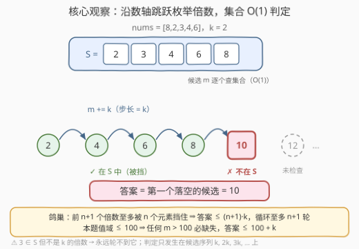
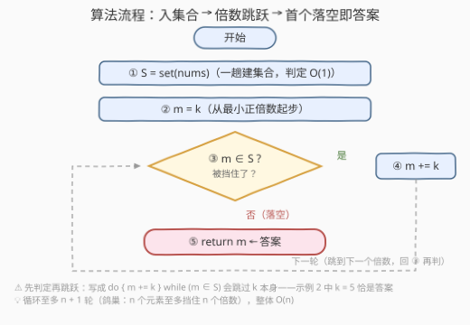

# 缺失的最小倍数

- **题目名称**：缺失的最小倍数
- **链接**：[3718. 缺失的最小倍数](https://leetcode.cn/problems/smallest-missing-multiple-of-k/)
- **难度**：简单
- **标签**：数组、哈希表

## 1. 题目概述

给你一个整数数组 `nums` 和一个整数 `k`，请返回从 `nums` 中**缺失的**、**最小的正整数** `k` 的**倍数**。

- **倍数**指能被 `k` 整除的任意正整数，即候选序列为 $k, 2k, 3k, \dots$；
- 要找的就是该序列中**第一个没有出现在 `nums` 里**的数。

**示例 1**：

```text
输入：nums = [8,2,3,4,6], k = 2
输出：10
解释：k = 2 的倍数为 2、4、6、8、10、12……，其中在 nums 中缺失的最小倍数是 10。
```

**示例 2**：

```text
输入：nums = [1,4,7,10,15], k = 5
输出：5
解释：k = 5 的倍数为 5、10、15、20……，其中 5 不在 nums 中，答案即 5。
```

**约束条件**：

- $1 \le \text{nums.length} \le 100$
- $1 \le \text{nums}[i] \le 100$
- $1 \le k \le 100$

> 💡 **审题关键**：① 枚举对象是「`k` 的正倍数序列」，不是从 1 开始的每个正整数——与 `k` 无关的数（如示例 1 中的 3）纵然在 `nums` 里也不参与判定；②「缺失」只看出现在不在 `nums` 中，与数值本身无关；③ 倍数序列无限长而 `nums` 有限，所以**答案必然存在**（终止性论证见 2.2 观察二）。

---

## 2. 解题思路

### 2.1 暴力思路：逐个倍数线性查数组

最直接的写法：让 $m$ 从 $k$ 起步、每次加 $k$，对每个候选 $m$ 从头到尾扫一遍 `nums` 判断是否出现过，第一个没找到的就是答案。

正确性没有问题，但每个候选都要付出一趟 $O(n)$ 的扫描，总时间 $O(\frac{A}{k} \cdot n)$（$A$ 为答案）。本题规模小无伤大雅，可瓶颈不在「枚举」而在「**判定是否在数组中**」这一步——值域一旦放大（如 $k=1$、答案达 $10^5$），线性查找立刻拖垮整个算法。

### 2.2 核心观察：哈希集合 + 倍数跳跃枚举



**观察一：把「判定」降到 O(1)。** 先花 $O(n)$ 把 `nums` 全部倒进**哈希集合**，之后每个候选倍数 $m$ 的存在性判定都是 $O(1)$ 查表。「枚举沿着候选序列、判定落在集合里」——这是所有「找第一个缺失」题目的标准分工。

**观察二：鸽巢原理保证循环至多 $n+1$ 轮。** `nums` 只有 $n$ 个元素，至多挡住 $n$ 个倍数；而前 $n+1$ 个倍数 $k, 2k, \dots, (n+1)k$ 互不相同，其中**至少有一个**不在 `nums` 中——于是答案 $\le (n+1) \cdot k$，跳跃循环至多 $n+1$ 轮必命中出口。这一步把「无限序列上的搜索」收敛成「有限步扫描」，整个算法的时间复杂度是干净的 $O(n)$。

**观察三（本题特有的更紧上界）：值域封锁在 100 以内。** $1 \le \text{nums}[i] \le 100$ 意味着任何 $m > 100$ 必然缺失——能挡住倍数的「墙」最高只砌到 100，故答案 $\le 100 + k$。更妙的是，既然只有 $1 \sim 100$ 的值需要判存在性，开一个 `bool seen[101]` 定长数组就能代替哈希表，连哈希常数都省了（见第 5 节）。

> 💡 一句话：本题 = 「`nums` 入集合」+「$m$ 从 $k$ 起步、步长 $k$ 跳跃枚举，跳到第一个不在集合里的 $m$ 即答案」。鸽巢原理兜底，至多 $n+1$ 轮。

### 2.3 算法流程图



**逻辑执行步骤**：

| 步骤 | 操作 | 说明 |
|------|------|------|
| ① 建集合 | `S = set(nums)` | 一趟扫描，此后每次判定 O(1) |
| ② 初始化 | `m = k` | 从最小正倍数起步 |
| ③ 成员判定 | `m ∈ S` ? | 是 → ④；否 → ⑤ |
| ④ 跳跃 | `m += k` | 被挡住就跳到下一个倍数，回到 ③ |
| ⑤ 返回 | `return m` | 第一个不在集合中的倍数即答案 |

> ⚠️ ③④ 的顺序不可颠倒成「先跳跃再判定」：若写成 `do { m += k; } while (m ∈ S)` 从 $m = k$ 出发，会**跳过对 $k$ 本身的检查**——示例 2 中 $k = 5$ 恰是答案，写反了会错答成 10。

### 2.4 示例演算

**示例 1：nums = [8,2,3,4,6]，k = 2（答案 10）**：

| 候选倍数 $m$ | 2 | 4 | 6 | 8 | 10 |
|--------------|---|---|---|---|----|
| $m \in S$ ? | ✓ | ✓ | ✓ | ✓ | ✗ |

集合 $S = \{2,3,4,6,8\}$：前四个候选全部被挡，第五个候选 $10$ 落空——注意 3 虽在 `nums` 中，却根本不在候选序列上，对判定毫无影响。

**示例 2：nums = [1,4,7,10,15]，k = 5（答案 5）**：第一个候选 $m = 5$ 就不在 $S = \{1,4,7,10,15\}$ 中（15 在集合里，但 5 不在），直接返回 5——倍数序列里「后面的在、前面的缺」完全可能发生，**判定只看候选序列的先后**，与 `nums` 的顺序无关。

**边界情形**：$k = 1$ 时题目退化为「`nums` 中缺失的最小正整数」；若 `nums` 恰好包含 $\le 100$ 的全部 `k` 倍数（如 $k=2$、`nums` 含 2~100 共 50 个偶数），答案会**越过 100**（上例答案为 102）——这正是 2.2 观察三中「答案 $\le 100 + k$」取等号的时刻。

---

## 3. 参考代码

### C++

```cpp
class Solution {
public:
    int missingMultiple(vector<int>& nums, int k) {
        unordered_set<int> s(nums.begin(), nums.end());
        int m = k;
        while (s.count(m)) m += k;
        return m;
    }
};
```

> 💡 **写法要点**：
> - `unordered_set` 用迭代器区间构造，建集合一行搞定；
> - `while (s.count(m)) m += k;` 是「跳跃枚举」的极简形态：被挡就跳，落空即出；
> - 循环轮数由鸽巢封顶在 $n+1$，配合 $O(1)$ 判定，整体 $O(n)$；$m$ 最大不超过 $(n+1) \cdot k \le 10100$，`int` 毫无压力。

### Python

```python
class Solution:
    def missingMultiple(self, nums: List[int], k: int) -> int:
        s = set(nums)
        m = k
        while m in s:
            m += k
        return m
```

> 💡 **写法要点**：
> - `set(nums)` 一趟去重建集合，`m in s` 均摊 $O(1)$；
> - 值域放大、键类型变复杂（字符串、元组）时该写法原样成立——这正是哈希集合版比定长数组版（第 5 节）更通用的地方。

---

## 4. 复杂度分析

| 维度 | 复杂度 | 说明 |
|------|--------|------|
| **时间** | $O(n)$ | 建集合 $O(n)$；跳跃循环至多 $n+1$ 轮（鸽巢封顶），每轮 $O(1)$ 查集合 |
| **空间** | $O(n)$ | 哈希集合至多存 $n$ 个元素（本题值域 $\le 100$，亦可视为 $O(1)$） |
| **对比暴力法** | $O(\frac{A}{k} \cdot n) \to O(n)$ | 暴力每个候选线性扫数组；哈希集合把单次判定降到 $O(1)$，枚举轮数又被鸽巢封顶 |

---

## 5. 扩展：值域定长数组代替哈希表

2.2 观察三指出：只有 $1 \sim 100$ 的值影响判定，$m > 100$ 必然缺失。据此可用 `bool seen[101]` 代替哈希集合，判定走数组下标直达：

```cpp
class Solution {
public:
    int missingMultiple(vector<int>& nums, int k) {
        bool seen[101] = {false};
        for (int x : nums) seen[x] = true;
        int m = k;
        while (m <= 100 && seen[m]) m += k;
        return m;
    }
};
```

（`while` 的出口二选一：$m > 100$——超值域必缺失；或 `seen[m]` 为假——不在数组中。两者都直接落到 `return m`。）

两种实现的取舍：

| 方式 | 前提 | 判定开销 | 空间 |
|------|------|----------|------|
| 哈希集合 | 任意值域、任意键类型 | 哈希常数 | $O(n)$ |
| 定长 `bool` 数组 | 值域小且已知（本题 $\le 100$） | 下标直达，零哈希 | $O(1)$ |

再往前一步：若 $k = 1$，本题就是「缺失的第一个正整数」的缩小版（LeetCode 41）。41 题值域无界且要求 $O(1)$ 空间，只能上**原地哈希**（把值 $v$ 归位到下标 $v-1$ 再扫一遍）——同一句「找第一个缺失」，值域约束的松紧直接决定数据结构的选择，这正是面试官爱追问的递进链。

---

## 6. 面试要点

**Q1：为什么循环一定会终止？至多循环多少轮？**

> 鸽巢原理：`nums` 只有 $n$ 个元素，至多挡住 $n$ 个倍数；前 $n+1$ 个倍数互不相同，其中至少一个缺失，故答案 $\le (n+1) \cdot k$，循环至多 $n+1$ 轮。能把「无限枚举为何收敛」讲清楚的候选人，才算真正理解了这道题。

**Q2：暴力法慢在枚举还是慢在判定？**

> 慢在判定。枚举每轮只是加法，暴力却对每个候选线性扫 `nums`（$O(n)$）；哈希集合把判定降到 $O(1)$，总复杂度从 $O(\frac{A}{k} \cdot n)$ 降到 $O(n)$。认清瓶颈在「查存在性」而非「产生候选」，是「找缺失」一族题目的第一直觉。

**Q3：`nums` 里的 3、7 这类与 `k` 无关的数影响答案吗？**

> 不影响。判定只发生在候选序列 $k, 2k, 3k, \dots$ 上，非倍数值进了集合也只是「占位不挡路」。若值域巨大且只关心 `k` 的倍数，甚至可以只把满足 `x % k == 0` 的元素入集合——本题规模没有必要。

**Q4：答案可能超过 100 吗？上界是多少？**

> 可能。`nums` 可以装下 $\le 100$ 的全部 `k` 倍数（如 $k=2$ 时的 50 个偶数），此时答案是第一个 $> 100$ 的倍数（102）。两个上界：鸽巢界 $(n+1) \cdot k$（通用），值域界 $100 + k$（本题特有且通常更紧）。

**Q5：把候选序列换成「`k` 的幂」或「质数序列」还成立吗？**

> 框架照旧：只要候选序列严格递增、无限，判定可 $O(1)$ 查集合，且能论证被挡候选个数有限（如 $\le n$），「跳跃枚举 + 集合判定 + 鸽巢封顶」三件套就继续成立。变的只是候选生成器，不变的是算法骨架。

> 💡 **一句话总结**：3718 = `set(nums)` + 从 $k$ 起步、步长 $k$ 跳到第一个不在集合里的数。三个要点带走：判定进集合、枚举沿倍数、鸽巢封轮数。

---

## 7. 同类练习题

- [41. 缺失的第一个正整数](https://leetcode.cn/problems/first-missing-positive/)（[题解](../0001-0100/41_缺失的第一个正数.md)）：本题 $k=1$ 的无界值域版，原地哈希做到 O(n)/O(1)
- [1539. 第 k 个缺失的正整数](https://leetcode.cn/problems/kth-missing-positive-number/)（[题解](../1501-1600/1539_第k个缺失的正整数.md)）：从「第一个缺失」升级为「第 k 个缺失」，有序数组上可二分加速
- [2195. 向数组中追加 K 个整数](https://leetcode.cn/problems/append-k-integers-with-minimal-sum/)（[题解](../2101-2200/2195_向数组中追加K个整数.md)）：缺失正整数序列的前 k 个 + 等差数列求和
- [268. 丢失的数字](https://leetcode.cn/problems/missing-number/)（[题解](../0201-0300/268_丢失的数字.md)）：值域 $[0, n]$ 恰缺一个，异或/求和闭式直接算出
- [645. 错误的集合](https://leetcode.cn/problems/set-mismatch/)（[题解](../0601-0700/645_错误的集合.md)）：定长计数桶同时揪出「缺失 + 重复」，判存在性数组化的又一应用
